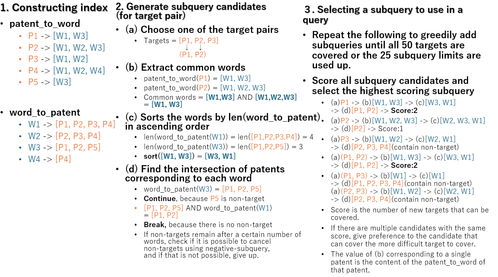

# USPTO - Explainable AI for Patent Professionals

> 主题：nlp ｜ 子类：— ｜ 领域：专利检索 ｜ 类别：Featured
> 截止：2023-XX-XX ｜ 队伍数：1000+ ｜ 机制：代码赛 ｜ 指标：检索召回/精确（含查询长度约束）
> 数据来源：`intel/uspto-explainable-ai/`（80 条主题索引 + 6 篇 write-up 正文）

## 1. 任务与数据

- 预测目标：为给定的专利检索需求**构造布尔检索式**（例如用 AND/OR 组合关键词），使其命中"正例"文档同时尽量少命中"负例"，且**受查询 token 数约束**。
- 数据形态：文档集合 + 正负例标注；输出是查询字符串。
- 构造陷阱：
  - **输出是结构化查询**（不是分类/回归），要满足语法与长度约束；
  - 精确率与召回率需权衡（误命中代价高）；
  - 组合爆炸（候选关键词组合极多）。

## 2. 方案谱系

| 方案 | 名次 | 关键点 |
| --- | --- | --- |
| 生成大量低误报候选 + **求解器选择最多 25 个** + OR 连接 | 5th | 先用"最小误报"原则造候选，再用求解器挑子集，最后用 OR 拼接；并指出**AND 查询的 token 数可压缩到 1 个 token** |
| 其他方案 | 见讨论区 | |

## 3. 关键技巧

- **"生成候选 → 组合优化选择"**的两段式：把查询构造转化为**子集选择问题**（可用求解器）。
- **利用查询语义压缩 token**（AND 表达式的等价简化）。
- **可复现的验证集**（社区公开的 validation index 被广泛采用）。
- **指标约束驱动设计**：长度限制直接决定选择策略。

## 4. 可迁移性评估

- **可直接迁移**：
  - **把"生成结构化输出"转化为"候选生成 + 组合优化"**（SQL/正则/查询/提示词构造通用）；
  - 用求解器处理带约束的子集选择；
  - 等价改写以压缩输出长度。
- 需要前提：能枚举候选并快速评估其命中效果。
- 不建议照搬：直接让模型端到端生成查询（可控性差、难满足约束）。

## 5. 对新手的关键启示

1. **输出是"结构化对象"时，用生成+搜索而不是端到端生成**。
2. **约束（长度/语法）应成为算法的一部分**，而非事后裁剪。
3. 与 LLM Prompt Recovery 对照：都是"逆向构造文本"，但本场用组合优化而非对抗技巧。

## 6. 轻读结论（2026-10 补）

**一句话**：本场是"规则套利决定名次"的极端案例——**"Magic"（计数用空格、Whoosh 解析把 `~` 当空白）让一个标题只花 1 token**，把分数从 0.90 抬到 0.998；同时指标期望值分析证明"零非目标的精确检索"远优于高召回+排序。

- 2nd（522258）：Magic 双版本 → CV 0.99934 / priv 0.99872；不用 Magic 仅 0.90427；查询 `(sub…) NOT (neg…)`；自研 C++ 检索器快 5×/省内存 3×。
- 7th"Magic"帖：机制披露 + 25 个精确标题≈LB 0.8；cuDF 1 分钟版。
- 1st（522233）：模拟退火 + `-` 省略 AND + cpc 末尾；**cuPy intersect1d 提速 2–3× → 最后一天用满全字段，3rd→1st**。
- 4th（522200）：带 Magic 0.98 / 无 Magic 0.91；预处理工程（bz2+leveldb+哈希分库+断点 flag）。
- 6th（522202）：自研 C++ 检索器 + 替代指标；**score1(25,0)=0.842 vs score1(50,50)=0.500** 证明"零非目标"是目标函数。

**裁决**：代码赛先审计"计分代码 vs 执行引擎"的不一致；发现 Magic 立即重排策略；检索赛要自研高速检索器把全量数据用起来；官方指标有缺陷时自建近似指标。

**悬案**：host 是否知晓/修补 Magic 无结论；1st 的逐项消融缺失；3rd/5th/11th 未细读。

## 7. 图表证据

**图 1**（topic 522258）：建索引 → 生成候选子查询（公共词升序求交、剩非目标则弃）→ 贪心选子查询；图为打分示例。

## 8. 出处

- 讨论区索引：`intel/uspto-explainable-ai/topics.md`（80 条）
- 已收录 write-up（6 篇）：
  - 1st（39 票）：https://www.kaggle.com/competitions/uspto-explainable-ai/discussion/522233
  - 2nd（29 票）：https://www.kaggle.com/competitions/uspto-explainable-ai/discussion/522258
  - 4th（44 票）：https://www.kaggle.com/competitions/uspto-explainable-ai/discussion/522200
  - 6th（24 票）：https://www.kaggle.com/competitions/uspto-explainable-ai/discussion/522202
  - 7th "Magic" 机制披露：https://www.kaggle.com/competitions/uspto-explainable-ai/discussion/522199
- 轻读全本：`analysis/deep/uspto-explainable-ai.md`（Tier B 轻读：对照矩阵/裁决/证据分级/悬案 + 1 图证）
