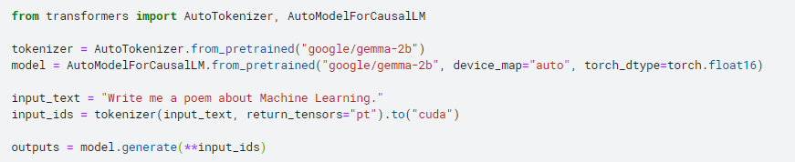
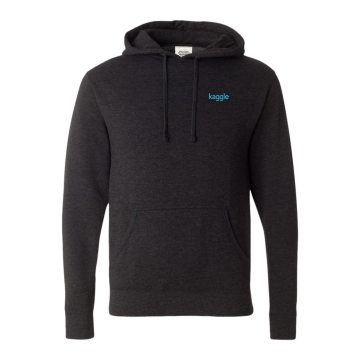

# Google - AI Assistants for Data Tasks with Gemma（精简）

> 主题：other ｜ 子类：hackathon ｜ 类别：Community ｜ 截止：2025-XX-XX ｜ 队伍数：— ｜ 指标：评审制 + 中期 notebook 奖
> 出处：`intel/data-assistants-with-gemma/`（80 条主题索引 + 6 篇正文）

## 任务

用 Gemma 构建**辅助 Kaggle 开发者的数据任务工具**（如"总结 Kaggle 解法 write-up"），评审制，并设中期公开 notebook 奖。已归入 `other/hackathon`。

## 关键要点

- 赛制设计值得注意：**除最终评审外，还设"中期公开 notebook 奖"**——用奖励机制鼓励早期公开分享（与 Kaggle 的分享文化相合）。
- 主题示例"总结 Kaggle 解法 write-up"直接把社区资产当作输入。

## 可迁移要点

- **阶段性奖励设计**（如中期奖）会显著改变参赛者的分享行为——自己做项目时也可用类似机制激励迭代。
- 工具类比赛的产出（数据助手）可直接复用到自己的工作流。

## 轻读结论（2026-10 补）

- **中期奖配方（官方评语）**：① Transformers gemma-2b-it + LangChain（Stuffing/MapReduce/Refine）+ 自训 LoRA 摘要；② Keras 实现 + 追问讲解；③ 从零手写 RAG + Wikipedia API 造数 + **GemmaCPP** 无 GPU 运行；④ Keras + LangChain 按比赛输出"总览+对比表+单篇摘要"；⑤ Magicoder 上训 LoRA 的 Python 助手，用 CODAL-Bench 检验可执行性并对比 GPT-4-Turbo/3.5（487380）。
- **赛制激励**：中期公开 notebook 奖 + **25 份 swag** 换 Gemma 模型变体上传——过程激励的样本（487380）。
- **技术路线**：Gemma 2B 在 Transformers/Keras/GemmaCPP 三实现下都可跑通；RAG 与 LoRA 互补（479199 / 492621）；公开平台资产（Kaggle write-up、Wikipedia）是最低成本的输入（479190）。
- **风险**：公开 notebook 复用边界（原创 vs 抄，20 票）与抄袭帖；最终大奖名单未归档（499090）。

## 图表证据

**图**（topic 478606）：`google/gemma-2b` 的 Transformers 最小加载/生成示例。

**图**（topic 487380）：中期奖公告中的 Kaggle 连帽衫（实物激励）。

## 出处

- 讨论区索引：`intel/data-assistants-with-gemma/topics.md`
- 中期奖公告：https://www.kaggle.com/competitions/data-assistants-with-gemma/discussion/487380
- Gemma 发布与集成：https://www.kaggle.com/competitions/data-assistants-with-gemma/discussion/478606
- 原创 vs 抄 notebook：https://www.kaggle.com/competitions/data-assistants-with-gemma/discussion/478616
- Gemma 2B RAG 讨论：https://www.kaggle.com/competitions/data-assistants-with-gemma/discussion/479199
- 最终奖公告（正文未归档）：https://www.kaggle.com/competitions/data-assistants-with-gemma/discussion/499090
