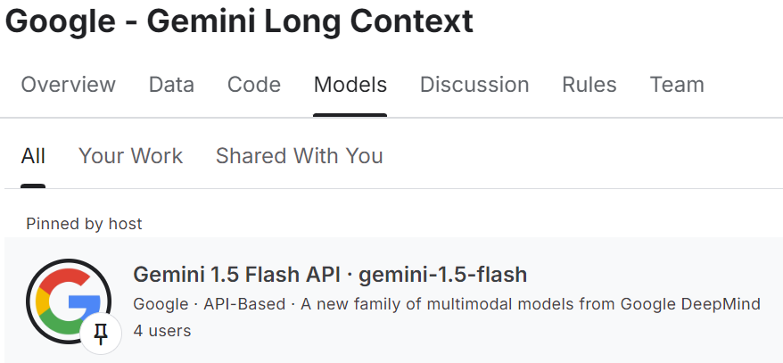

# Gemini Long Context Competition（精简）

> 主题：other ｜ 子类：hackathon ｜ 类别：Community ｜ 截止：2024-XX-XX ｜ 队伍数：— ｜ 指标：评审制
> 出处：`intel/gemini-long-context/`（80 条主题索引 + 6 篇正文）

## 任务

展示 **Gemini 长上下文窗口**（百万级 token）的创新用例，由 Google/Kaggle 评审。已从 nlp 归入 `other/hackathon`。

## 关键要点

- 与 Gemma 系列活动（Gemma 4、MedGemma、Tunix、Data Assistants）同属"**模型方通过 Kaggle 推广能力边界**"的活动族。
- 评审强调"创造力与技术技能"，提交物是应用/notebook 演示。
- 这类比赛的价值在于**探索新能力的产品化路径**（长上下文能做什么），而非指标优化。

## 可迁移要点

- **新模型能力型比赛**：先摸清该能力的边界（能装多少、保真度如何），再设计用例。
- 评审制比赛：演示的可复现性与叙事清晰度与技术水平同等重要。

## 轻读结论（2026-10 补）

- **赢家全部是长视频/多模态**：4 个最终获奖 = FrameCut（自然语言视频剪辑）、体育转播广告品牌曝光分析（F1/NBA/FIFA，屏幕时间结构化）、KeepTrack（家庭视频 → 物品清单 CSV）、视频流程文档生成；8 个 HM 也以视频/YouTube/代码库为主（552419）。
- **挂载坑（硬教训）**：必须 "Save & Run All" commit 才会把 Gemini 1.5 Flash 挂到 notebook；截至 2024-10-19 全站只有 **4 个用户**挂上（541420）。
- **配额/限流是第一工程约束**：429 ResourceExhausted、503/504 600s 超时、Vertex 视频 502/503/429、context caching 403、免费额度与 quota 提升问题贯穿赛程（541324 / 541462 / 542423 / 546075）。
- **安全过滤误伤**：恋爱歌词被判危险内容，BLOCK_ONLY_HIGH 仍拦截（541463）→ 关键流程避免绑敏感内容。
- 争议：投票操纵指控（550941）与非确定性 notebook 评分（548186）无官方结论。

## 图表证据

**图**（topic 541420）：Models 页显示 Gemini 1.5 Flash API 只有 **4 users**——"必须 Save & Run All"的现场证据。

## 出处

- 讨论区索引：`intel/gemini-long-context/topics.md`
- 获奖公告：https://www.kaggle.com/competitions/gemini-long-context/discussion/552419
- 挂载提醒：https://www.kaggle.com/competitions/gemini-long-context/discussion/541420
- 安全过滤误伤：https://www.kaggle.com/competitions/gemini-long-context/discussion/541463
- 免费额度讨论：https://www.kaggle.com/competitions/gemini-long-context/discussion/541324
- 429 配额错误：https://www.kaggle.com/competitions/gemini-long-context/discussion/541462
