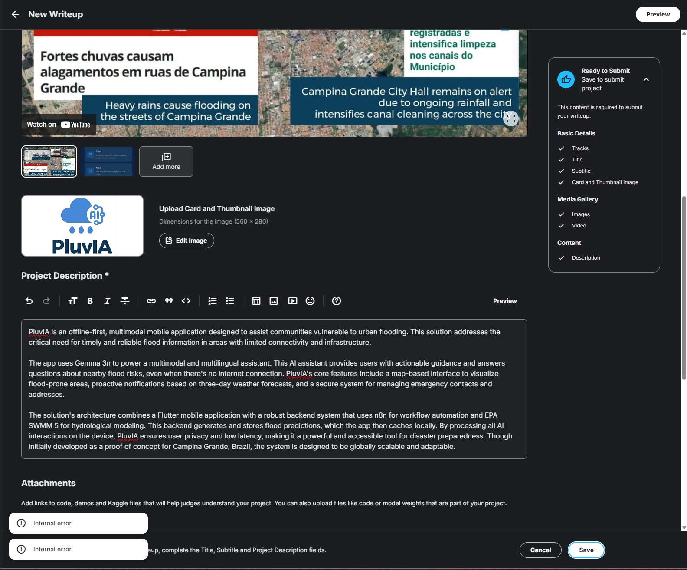

# Google Gemma 3n Hackathon（精简）

> 主题：other ｜ 子类：hackathon ｜ 类别：Featured ｜ 截止：2025-08-06 ｜ 队伍数：599 ｜ 指标：评审制
> 出处：`intel/google-gemma-3n-hackathon/`（80 条主题索引 + 6 篇正文）

## 任务

基于 Gemma 3n 构建应用的黑客松（评审制），非预测类比赛。

## 关键要点

- 讨论区最热话题是**提交系统故障**（"Internal Error" 导致无法提交，参赛者公开申诉）——**平台的提交可靠性本身会影响比赛公平性**。
- 这是同类黑客松（Gemini 3、Gemma 4、MedGemma、OpenAI to Z）的又一场：Kaggle 的"应用型/评审型"赛事已成规模。

## 可迁移要点

- **提前验证提交流程**，不要把时间压在截止前的最后一步（异常时保留截图与时间戳作为申诉证据）。
- 评审制赛事的评审口径通常在讨论区公开，先读再动手。

## 轻读结论（2026-10 补）

**一句话**：本届是**评审制作品赛**（~600 份提交、无排行榜），归档材料的主线是赛事机制而非模型技术——提交系统 "Internal Error"、迟到 1 秒/时区换算等事故密集出现；官方 8/6 承诺"数周内"出结果，实际 11 月底（感恩节后）才公布获奖者。

- 官方收尾帖（597690，51 票 / 99 评论）：~600 份提交、8/6 关闭、进入评审；结果时间线（635977）与获奖名单（657756）显示评审约 3.5 个月。
- 提交事故：597689（"Internal Error" 申诉，附截图）、597695（草稿未提交）、597675/597674（迟到 1 秒/1 分钟）、597682（时区换算错误）；延期请求 591519（21 票 / 19 评论）、596963。
- 技术路线：端侧 app 线（PluvIA：Flutter + n8n + EPA SWMM 5 + 本地 Gemma 3n）；微调线（Unsloth 帖 587725，20 票；官方 audio/vision notebook 593950）；部署工具线（MediaPipe starter 590636、LiteRT/Ollama/iOS 问答）。
- 规则：公开 write-up 许可从 CC0 事后更正为 CC BY 4.0（589997）。

**裁决**：评审制 hackathon 的优化对象是"影响叙事 + 可运行 demo"；提交要在截止前数小时完成并留证据；结果周期不可控，按无确定回报计成本。

**悬案**：获奖作品与评审标准未细读；Unsloth 微调帖正文未收录；无量化指标可比；图证仅 1 张（报错截图）。

## 图表证据

**图 1**（topic 597689）：PluvIA 提交时遭遇 "Internal Error" 的界面截图——本届提交系统故障的代表性证据。

## 出处

- 讨论区索引：`intel/google-gemma-3n-hackathon/topics.md`
- 收尾公告（51 票）：https://www.kaggle.com/competitions/google-gemma-3n-hackathon/discussion/597690
- 提交故障与申诉（12 票）：https://www.kaggle.com/competitions/google-gemma-3n-hackathon/discussion/597689
- 获奖者时间线（36 票）：https://www.kaggle.com/competitions/google-gemma-3n-hackathon/discussion/635977
- Unsloth 微调（20 票）：https://www.kaggle.com/competitions/google-gemma-3n-hackathon/discussion/587725
