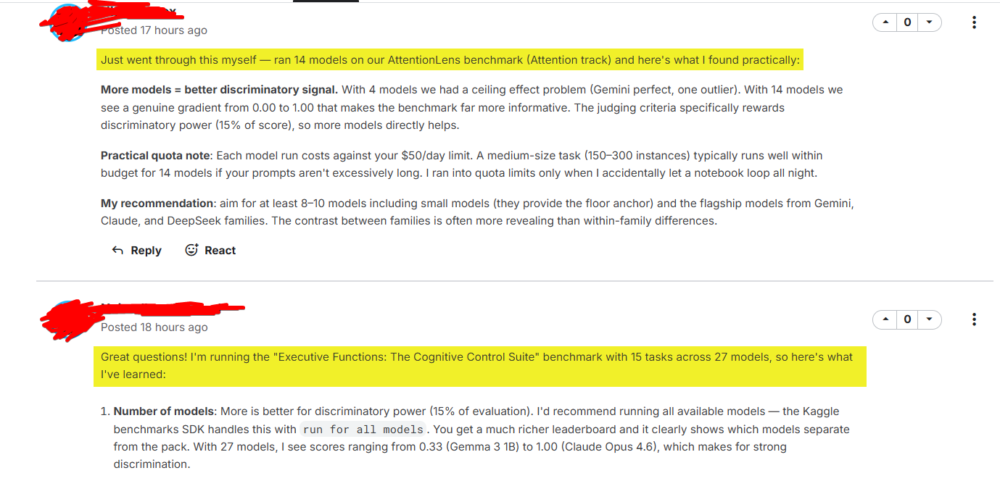

# Measuring Progress Toward AGI - Cognitive Abilities（精简）

> 主题：other ｜ 子类：hackathon ｜ 类别：Featured ｜ 截止：2026-04-16 ｜ 队伍数：1063 ｜ 指标：人工评审
> 出处：`intel/kaggle-measuring-agi/`（80 条主题索引 + 6 篇 write-up 正文）

## 任务

**设计 AI 能力评测基准**（而非参赛做题）：围绕 5 个认知维度提交 benchmark，由评审团按"是否超越记忆、真正衡量推理/行动/判断"的标准评选。属于黑客松性质，非预测类比赛。

## 关键要点

- 参赛量超 1000 队、5 条认知赛道；主办方在讨论区公布了评审标准与获奖名单。
- 评审标准的关键词是"**beyond recall**"——即反对记忆型评测，强调推理/行动/判断。
- 与 `gemini-3`、`gemma-4-good-hackathon` 同属"人工评审 + 非预测"类别。

## 可迁移要点

- **评测设计本身是一门技能**：本场的评审口径（超越记忆 → 推理与判断）可直接用于审视 Kaggle 比赛的指标设计（与 ICR、Home Credit 的"指标理解"一脉相承）。
- 人工评审类比赛：先读评审标准，再决定投入方向。
- 对建模能力训练价值有限，但能训练"如何定义好问题"。

## 轻读结论（2026-10 补）

- **规模与奖池**：1063 队、5 条认知赛道（Executive Functions / Learning / Metacognition / Social Cognition / Attention）、>1000 份提交；**Grand $25k ×4 + Track $10k ×10 = $200k**（724918）。
- **冠军设计范式**：MEDLEY-BENCH（社会压力下的元认知信念更新）、LearningBench（会话内学新系统）、GAUGE（监测 vs 控制，某前沿模型 270 题零弃权）、Metaproteus（对自身输出分布的认知）；EphLangBench 用程序生成的"临时语言"把通过率拉到 7%–89%（724918）。
- **争议**：rubric 里 **Community upvotes 占 15%**（28 票质疑 upvote farming，683674）；另有一次 rubric 变更公告（684184）。
- **硬门槛**：数据集必须公开（"Action needed if your dataset is private" 66 评论，702378）；提交系统有 bug 与错过窗口案例（692560 / 692776）。
- **节奏**：4 月收官 → 6 月评审 → 再延 1–2 周 → 最终公布（692562 / 716405 / 724918）。

## 图表证据

**图**（topic 683674）：质疑帖截图——"跑 14/27 个模型""判别力占分""$50/天预算"等社区回复，反映讨论区推广与互助的边界。

## 出处

- 讨论区索引：`intel/kaggle-measuring-agi/topics.md`
- 获奖公布：https://www.kaggle.com/competitions/kaggle-measuring-agi/discussion/724918
- 收官说明：https://www.kaggle.com/competitions/kaggle-measuring-agi/discussion/692562
- 社区投票质疑：https://www.kaggle.com/competitions/kaggle-measuring-agi/discussion/683674
- rubric 变更：https://www.kaggle.com/competitions/kaggle-measuring-agi/discussion/684184
- 数据集公开要求：https://www.kaggle.com/competitions/kaggle-measuring-agi/discussion/702378
