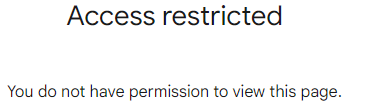

# LLM Prompting with MakerSuite（精简）

> 主题：other ｜ 子类：hackathon ｜ 类别：Community ｜ 截止：2023-11-06 ｜ 队伍数：0 ｜ 指标：评审制（提示词设计）
> 出处：`intel/llm-prompting-with-makersuite/`（38 条主题索引 + 6 篇正文）

## 任务

Google 与 Kaggle 合办的**提示词工程设计赛**：用 MakerSuite（后并入 Google AI Studio）为 LLM 设计文本/数据/对话 prompt。按 7 个类别评审（开发工具、数据科学工具、教育与交互导师、日常实用、推理阐述、讲故事与互动游戏、其他），200+ 份提交，无排行榜。

## 关键要点

- 获奖 prompt 的通用结构：**system prompt 定角色 + 多个 input/output 少样本示例**——开发工具类获奖方案正是靠若干"乱格式输入 → 规范 YAML 输出"的示例把行为稳定下来。
- 面向可评估的输出设计：教育类获奖方案要求模型输出 JSON（题目 + 答案矩阵 + 示例答案），让生成结果可自动判分、便于替换输入复用。
- 类别化评审 = 选题占比重大：同一套写法套进"答疑导师 / 通话摘要 / 头脑风暴评估 / 跑团剧本生成"等不同壳里，各自都能出奖。
- 现实约束成为讨论区主线：MakerSuite 地区/年龄限制（巴西、欧洲等不可用）劝退部分参赛者；官方承诺赛后把获奖 prompt 收入 Prompt Gallery 公开。
- 资源生态：MakerSuite Prompt Gallery、DeepLearning.AI 提示工程短课、OpenAI Prompt Engineering Guide 等——**提示词竞赛拼的是模板库与文献的调用速度**。

## 可迁移要点

- "system prompt + few-shot 示例对"是可控输出的最小可靠范式，适用于任何 LLM 结构化改写任务。
- 要求 JSON/可机读输出并附带评估标准，能让评审与复现都更容易——写工具类 prompt 时可照搬。
- 评审制 LLM 赛的选题策略：找真实小痛点（YAML 修复、通话摘要），把 prompt 打磨到"多次测试都稳定"。
- 对新手：这类比赛几乎零算力门槛，适合作为首赛；但要先确认服务地区等硬性参赛条件。

## 轻读结论（2026-10 补）

- **评审口径**：官方评估 **200+ 份提交**，7 个类别各选 1 名冠军；获奖 prompt 承诺收入 MakerSuite Prompt Gallery（457016）。
- **最小可靠范式**：开发工具类冠军（@ajaysadhu）用 system prompt + 多组"乱格式输入→规范 YAML 输出"示例并多次测试稳定性；教育类冠军（@hoangpham51）输出 JSON（题目 + answer matrix + 示例答案），换输入即可批量出新题——**可机读输出 = 评审友好 + 可复用**。
- **可及性是第一门槛**：MakerSuite 地区限制（巴西、欧洲不可用）与 18+ 要求是讨论区最热话题（446465 / 446473），截图即证据。
- **评审透明度有限**：无排行榜、无个人评分答复（447125 / 455618）；参赛交付应按"作品会被公开引用"的标准写。

## 图表证据

**图**（topic 446465）：Brazil 选手访问 MakerSuite 得到 "Access restricted"——地区限制是本届最热的非技术讨论。

（451608_img/01.jpg 为梗图，无分析价值，未内嵌。）

## 出处

- 获奖名单与评语（7 个类别）：https://www.kaggle.com/competitions/llm-prompting-with-makersuite/discussion/457016
- 资源合集（Prompt Gallery / 课程 / 指南）：https://www.kaggle.com/competitions/llm-prompting-with-makersuite/discussion/447223
- 地区限制讨论：https://www.kaggle.com/competitions/llm-prompting-with-makersuite/discussion/446465
- 长帖：Kaggle 历届游戏/模拟赛巡礼：https://www.kaggle.com/competitions/llm-prompting-with-makersuite/discussion/451608
- 欧洲不可用：https://www.kaggle.com/competitions/llm-prompting-with-makersuite/discussion/446473
- 置顶 Q&A：https://www.kaggle.com/competitions/llm-prompting-with-makersuite/discussion/446450
