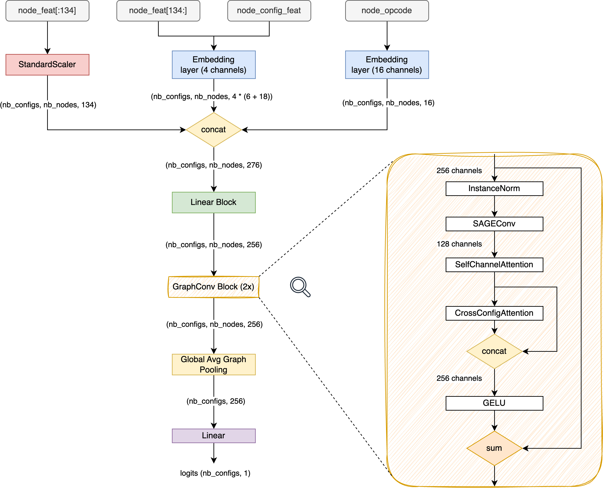

# Google - Fast or Slow? Predict AI Model Runtime（精简 + 深读回写）

> 主题：other ｜ 子类：systems ｜ 领域：编译器/系统性能 ｜ 类别：Research ｜ 截止：2023-11-17 ｜ 队伍数：616 ｜ 指标：`58266_TpuGraphsEval`（tile top-5 slowdown + layout Kendall tau）
> 出处：`intel/predict-ai-model-runtime/`（80 条主题索引 + 6 篇 write-up 正文）

## 任务

给 **TPU 编译器（XLA）挑配置**：tile 子任务为融合子图选 tile 尺寸（按 top-5 slowdown 排序），layout 子任务为张量选内存排布（按 Kendall tau 排序）——本质是**大图 × 海量候选配置的排序学习**，服务编译期自动调优。

## 关键要点

- 1st：图剪枝（只留可配置节点及其邻居）+ 去重 + base-7 压缩 → 显存 ÷4、训练快 5×；SAGEConv + 通道注意力 + **跨配置注意力**；pairwise Hinge；推理时 10 次置换 TTA。
- 10th：**中级融合** + 线性注意力图 Transformer（12 块，消费级 GPU 可跑）+ ListMLE（每批 ~1000 配置）；自述评测不稳定、当抽奖打。
- 11th：**纯 LightGBM + 手工图特征**，pairwise 二分类后 1000² 全配对排序，公榜 0.728 甚至高于 1st 单模；说明"图模型非必需"。

## 可迁移要点

- **排序目标配排序损失**：评价只看相对名次时，pairwise/ListMLE 优于 pointwise 回归（11th 同管线对照 +0.013~0.021）。
- **注意力放在噪声处**：边注意力无效（图的连接都是真的），通道/跨配置注意力才有效——先定位不确定性来源再选归纳偏置。
- **工程先行**：大图+多配置场景，剪枝/压缩/分块加载/JIT 决定上限，模型结构是第二步。

## 7. 轻读结论（2026-10 补）

**一句话**：ML for Systems 的排序赛——**内存工程（剪枝/压缩/分块）+ 排序损失 + 跨配置注意力**是三大支点；评测集小导致榜面噪声极大，需多配置混合对冲。

- 1st（68 票）：剪枝去重压缩 + SAGEConv/双注意力 + 10 次置换 TTA；单模 0.748 pub / 0.714 priv，最佳集成 0.757/0.736（未选）。
- 10th（25 票）：中级融合 + 线性注意力图 Transformer + ListMLE；最终 sub 0.721/0.703，自述"lottery"，同设置换种子差异不显著。
- 6th（28 票）：5 跳邻域子图 + GraphNorm + 梯度累积（layout SAGE / tile GAT）。
- 11th（27 票）：LightGBM 手工特征（节点类型计数/拷贝/填充/配置出现率），pairwise 版 0.728 pub / 0.701 priv；无更好 CV 是洗牌主因。

**裁决**：先解决"装得下、跑得动"，再用排序损失对齐指标；GNN 与表格模型在同分带内可互换，金牌级解法仍靠图模型 + 多模型平均。

**悬案**：2nd/3rd/5th 等 write-up 未入库；测试采样泄漏帖（456090）影响未量化；合并指标细则未展开。

## 8. 图表证据

**图 1**（topic 456343）：特征三路输入（StandardScaler / 共享嵌入 / opcode 嵌入）→ 2×[InstanceNorm→SAGEConv→SelfChannelAttention→CrossConfigAttention→残差→GELU]→全局池化。

## 9. 出处

- 讨论区索引：`intel/predict-ai-model-runtime/topics.md`
- 1st（68 票）：https://www.kaggle.com/competitions/predict-ai-model-runtime/discussion/456343
- 10th 图 Transformer（25 票）：https://www.kaggle.com/competitions/predict-ai-model-runtime/discussion/456129
- 11th LightGBM（27 票）：https://www.kaggle.com/competitions/predict-ai-model-runtime/discussion/456092
- 6th 5 跳子图（28 票）：https://www.kaggle.com/competitions/predict-ai-model-runtime/discussion/456084
- 轻读全本：`analysis/deep/predict-ai-model-runtime.md`（Tier B 轻读：对照矩阵/裁决/证据分级/悬案 + 2 图证）
