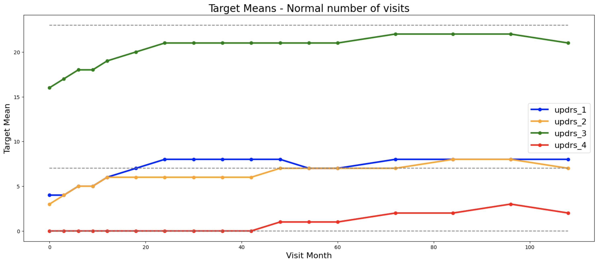

# AMP-Parkinson's Disease Progression Prediction

> 主题：science（医疗表格）｜ 子类：— ｜ 领域：医疗 ｜ 类别：Featured
> 截止：2023-06-30 ｜ 队伍数：1700+ ｜ 机制：代码赛 ｜ 指标：SMAPE（多目标多时间点）
> 数据来源：`intel/amp-parkinsons-disease-progression-prediction/`（80 条主题索引 + 6 篇 write-up 正文）

## 1. 任务与数据

- 预测目标：由临床与生物标志物数据预测帕金森病患者未来多个时间点的 UPDRS 评分。
- 数据形态：每位患者多次随访；提供 **227 个蛋白 NXP 特征 + 968 个肽段特征**（合计 1195 维），多目标多预测月。
- 构造陷阱（本场最典型）：
  - **真正可靠的信号只有"就诊时间（visit dates）"**。4th place 明确指出：榜单呈现明显的双峰分布——**前 18 名 SMAPE ≤ 62.5，其余 ≥ 68.4**，差异几乎完全来自"是否使用了就诊时间信号"。
  - 数据分两组：真实患者与对照组，需要用"最小就诊间隔"识别（8th 的技巧）。
  - SMAPE 是百分比指标，0.1 的差距相当于 0.001 的真实差异——**极小的差距决定名次**。

## 2. 验证方案

| 方案 | 使用者 | 说明 |
| --- | --- | --- |
| 按患者分组 CV | 多数 | 避免同一患者多次随访跨折 |
| 分目标/分预测月评估 | 1st | 多目标分别统计 |
| 评分更新与榜单对照 | 社区 | 主办方多次更新评测，需观察稳定性 |

## 3. 方案谱系

| 方案 | 名次 | 关键点 |
| --- | --- | --- |
| LGB + NN 的简单平均（同一套特征） | 1st | 特征以**就诊月、预测视野、目标预测月、是否抽血**等时间结构为主 |
| 单模型 RAPIDS cuML SVR | 4th | 单模型即金牌；作者强调"只有一处可靠信号" |
| 识别患者/对照组 + 就诊间隔特征 | 8th | "一个技巧拿金牌"：按患者计算就诊间隔的最小值即可区分两组 |
| 多模型方案 | 9th | 见讨论区 |

## 4. 关键技巧

- **优先挖掘结构性/元数据信号**：就诊时间、随访间隔、是否抽血，这些"元信息"比 1195 维生物标志物更有判别力。
- **用统计量识别隐藏分组**（最小就诊间隔 → 患者 vs 对照组）。
- **多目标按视野（forecast horizon）分别建模**。
- **简单模型足够**：1st 用 LGB+NN 平均，4th 用单个 SVR。
- **注意指标的相对性**：SMAPE 下 0.1 的差距决定名次，需要精细化处理而非大幅改进模型。

## 5. 可迁移性评估

- **可直接迁移**：
  - **先找元数据信号**（时间戳、采集流程、随访计划），再建模高维特征。
  - 用组内统计量（间隔最小值等）识别隐藏分组。
  - 多目标多视野任务分别建模。
- **需要前提**：
  - 需要理解临床随访协议（为什么就诊间隔能反映分组/进展）。
- **不建议照搬**：
  - 直接在高维生物标志物上堆模型（本场证明那不是有效信号来源）。

## 6. 对新手的关键启示

1. **最强信号常常藏在最不起眼的列里**（本场是就诊日期）。
2. **榜单出现双峰分布时，说明存在单一决定性信号**，应优先去找它。
3. **找到信号后，模型越简单越好**（单 SVR 即可夺金）。

## 7. 轻读结论（2026-10 补）

**一句话**：248 名患者的小样本医疗时序——**唯一可靠信号是就诊日期结构**（6/18 月就诊指示、visit_month 间隔分组），1195 维血检特征在随机列基线面前无法证明有信号；顶端 18 名与其余队伍的分界线正是"有没有用日期信号"。

- 1st（99 票）：8 特征 + LGB（87 类分类，按 SMAPE+1 搜索最优整数）+ NN（SMAPE+1 直训、末层 leaky ReLU）简单平均；**完全弃用血检**；CV = 逐患者留一；最强特征 = 6 月就诊指示；用公榜系数调血检软缩放 = 明显过拟合（公榜第 2、私榜更差）。
- 4th（150 票）：单 cuML SVR；**1000 列随机数实验**证明"前向选择增益可由噪声复现"；榜面断层（Top18 ≤62.5 vs 其余 ≥68.4）反推魔法信号分界。
- 8th（28 票）：visit_month 最小间隔 → **6=真患者、12=对照组**；分段趋势函数分别优化。
- 13th：按跨度×目标分别建模（visit_month、num_visits 为核心）。
- Top89：非泄漏方案 = visit_month + 200 肽段 + **Bagging(SVR)** 稳定方差；加入魔法特征后模型被带偏、反而不如基线。

**裁决**：小样本赛先做"信号普查"（哪列能把榜面分层）；特征选择必须与随机列基线对照；非光滑指标走"分布→决策"；魔法特征要留一份对照提交。

**悬案**：2nd/3rd/5th–7th 方案缺失；"真患者/对照组"划分无官方确认；血检无信号仅两支队独立佐证。

## 8. 图表证据

**图 1**（topic 411398）：四个 UPDRS 目标的均值随就诊月变化（阶梯/平台结构明显），说明就诊月本身携带强结构信号。

## 9. 出处

- 讨论区索引：`intel/amp-parkinsons-disease-progression-prediction/topics.md`（80 条）
- 已收录 write-up（6 篇）：
  - 1st（99 票）：https://www.kaggle.com/competitions/amp-parkinsons-disease-progression-prediction/discussion/411505
  - 4th（150 票）：https://www.kaggle.com/competitions/amp-parkinsons-disease-progression-prediction/discussion/411398
  - 8th（28 票）：https://www.kaggle.com/competitions/amp-parkinsons-disease-progression-prediction/discussion/411395
  - 9th（39 票）：https://www.kaggle.com/competitions/amp-parkinsons-disease-progression-prediction/discussion/411380
  - 评测更新公告（47 票）：https://www.kaggle.com/competitions/amp-parkinsons-disease-progression-prediction/discussion/394534
  - Top89 非泄漏方案：https://www.kaggle.com/competitions/amp-parkinsons-disease-progression-prediction/discussion/411561
  - 13th：https://www.kaggle.com/competitions/amp-parkinsons-disease-progression-prediction/discussion/411436
  - 找对照组（76 票）：https://www.kaggle.com/competitions/amp-parkinsons-disease-progression-prediction/discussion/411388
- 轻读全本：`analysis/deep/amp-parkinsons-disease-progression-prediction.md`（Tier B 轻读：对照矩阵/裁决/证据分级/悬案 + 1 图证）
