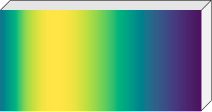
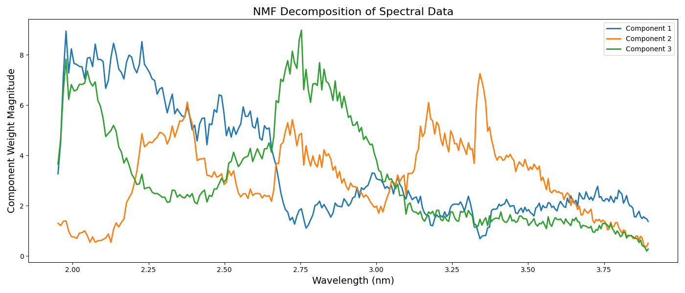
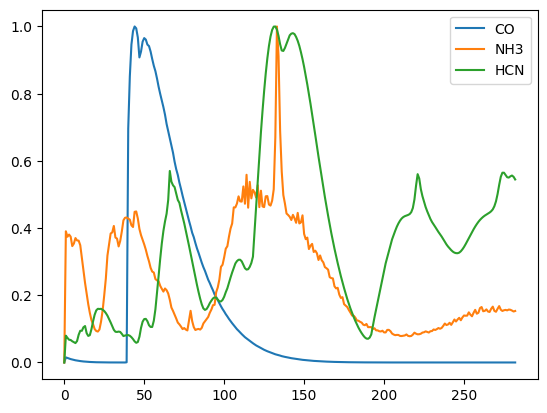
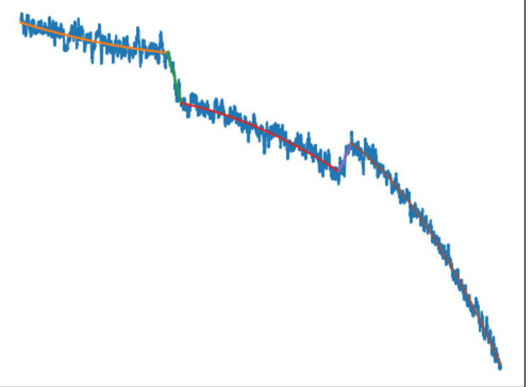
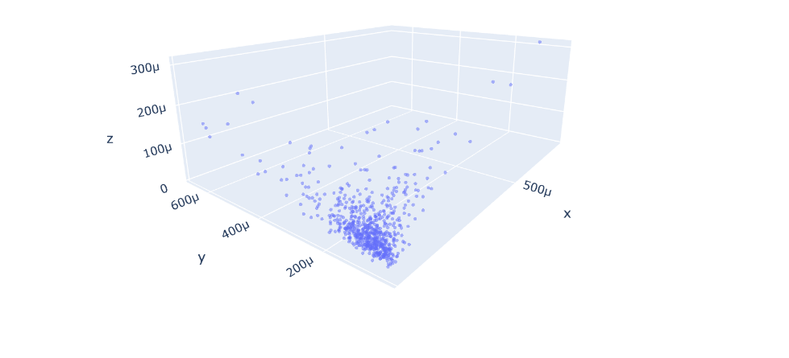

# ARIEL Data Challenge 2024

> 主题：science（天文/系外行星）｜ 子类：— ｜ 领域：凌星光谱反演 ｜ 类别：Featured
> 截止：2024-10-31 ｜ 队伍数：1151 ｜ 机制：代码赛 ｜ 指标：Ariel Gaussian Log Likelihood（光谱均值+不确定度联合评分）
> 数据来源：`intel/ariel-data-challenge-2024/`（80 条主题索引 + 6 篇 write-up 正文；深读升级 2026-10-03，Tier A #41）

## 1. 任务与数据

- 预测目标：由 Ariel 模拟原始光谱信号（AIRS-CH0 光谱仪 + FGS1 制导）反演**每个波长的凌星深度 + 置信区间（sigma）**。
- 数据形态：模拟生成（ExoSim2 + TauREx3）；信号噪声极低 SNR；**测试分布被组织者故意做不同**（训练含 H2O/CO2/CH4，测试有新分子）。
- 构造陷阱：
  - 信号乘性结构 `Raw = Noise + Star×Drift×Transit`，drift = f(t)·g(λ) 可分离；
  - 模拟加入波长相关**前景（foreground）**→ 大量队伍靠"×1.006~1.008"盲补偿；
  - 端到端深度学习与"拟合训练分子"在 LB 失效（本地 +0.1、LB 不动）；
  - 指标含 sigma：不确定度 ≈ 分数的一半。

## 2. 验证方案

| 方案 | 使用者 | 说明 |
| --- | --- | --- |
| 按恒星分组划分 | 5th | 与公榜相关好；但本地仍是"训练分布代理" |
| 合成增强后的 LB 验证 | 5th | 本地降、LB 升——分布迁移下本地不可靠 |
| 消融式后验（late submissions） | 1st | 逐组件提交，量化 GP/AE/NMF/hot pixel/前景贡献 |
| 训练集拟合交叉验证 | 4th | 用于选拟合阶数/权重；最终以 LB 为准 |
| 测试集内自洽（PCA/两步） | 2nd | 在测试集上做粗拟合→PCA→再拟合（不依赖训练标签分布） |

## 3. 方案谱系

| 方案 | 名次 | 关键点与数字 |
| --- | --- | --- |
| 信号处理 + GP/AE/NMF 集成 | 1st（51 票） | 读 ExoSim2 源码；只用 CH0；**关闭 hot pixel 处理**；前景 [0:8]/[24:32]→扣除 [8:24]；drift=(1+f(t)g(λ)) 5+5 参数；两阶段拟合；bootstrap；GP+AE+NMF=6:2:2；最终 **0.7330/0.7421** |
| 纯贝叶斯 + GP | 2nd（125 票） | 先验元素表（DoF 11 万+→KISS-GP 800）；7 次迭代线性化；测试集 PCA 形状；fudge ×1.0064（后知漏背景）；星谱共享测试 0.110；全程第一被最后反超 |
| 多项式拟合 + TF 优化回归 | 4th（27 票） | ingress/egress 两段二次+连线；1.9:1 加权；sigma 阈值→线性→2D；TF 2D 多项式 256 行星并行；最终 0.703/0.715 |
| 特征工程 + 线性/小网络 | 5th（36 票） | drift 多项式去除 0.546/0.578；5 高斯约束；sigma=std(pred) **+0.030**；TauREx 9 新分子增强 LB **+0.020** |
| 启发式 + 双头 CNN | 6th（57 票） | 频率轴高斯去离群 +0.002；1−A/B 特征+遗传算法选区；CNk window=21；0.681/0.692 |
| 组织者资源帖 | 社区（74 票） | 校准 notebooks + "测试分布故意不同"的明确告知 |

## 4. 关键技巧

- **物理乘性结构**：显式写出 `Raw = Noise + Star×Drift×Transit`；drift 用**可分离形式 f(t)·g(λ)**（读生成器代码确认），而非一般二维多项式。
- **前景处理**：用 [0:8]/[24:32] 区域估计波长相关前景，从中央 [8:24] 扣除——比盲乘 ×1.006~1.008 多值 ~0.01。
- **hot pixel 处理要慎用**：1st 关闭它直接大涨（sigma clip 损失了中央像素信息）。
- **两阶段拟合 + 解析消元**：I(λ) 与 dip 在固定其他参数时有解析最优 → 减少优化变量；迭代线性化处理非线性先验（2nd 7 次迭代）。
- **不确定度工程**：sigma 由预测谱离散度 std(pred)、ingress/egress 预测差、GP 后验不确定度回归（4th 阈值→线性→2D；5th +0.030）。
- **抗分布迁移**：只建模不变量（漂移形式/转捩几何/波长相关）；**主动扩充测试侧多样性**（TauREx3 生成 9 种新分子谱，LB +0.020）。
- **仿真赛纪律**：读生成器源码、读泄漏清单；警惕"本地大涨而 LB 不动"。

## 5. 可迁移性评估

- 可直接迁移：乘性信号分解与可分离性检验；前景/背景的显式估计与扣除；不确定度回归（log-likelihood 类指标）；仿真代码逆向；抗迁移的"不变量+多样性扩充"策略。
- 需要前提：能读到仿真器/生成器（本场 ExoSim2 开源）；领域基础（凌星几何/光谱）；贝叶斯工具（GP/概率编程）。
- 不建议照搬：端到端 DL 直接回归光谱；用训练分子谱做先验；星谱跨行星共享；MCMC（运行时不可行）。

## 6. 对新手的关键启示

1. 仿真数据赛先读生成器代码——1st 的胜利主要来自 ExoSim2 里的 drift 形式与前景。
2. log-likelihood 型指标里，sigma 和均值同样重要；先做均值，再用预测离散度做 sigma。
3. 当测试分布被故意做不同时，本地分数是"训练拟合度"而非泛化；要敢于采用"本地降、LB 升"的改动。
4. 常数乘子能修一阶偏差，但结构性修正（估波形再扣）才能拿到满分。
5. 顶端的胜负由最后一个正确机制决定（2nd 全程第一、1st 最后两天反超）。

## 7. 深读结论（2026-10 补）

**一句话**：这是一场"理解生成器的人赢"的比赛——前四名几乎没有端到端深度学习。

**跨方案裁决**：

- 物理形式正确性 > 推断方法（1st 的 f(t)·g(λ)+前景修正 vs 2nd 的通用先验 vs 4th 的多项式优化）。
- 训练/测试有意分布迁移 → 分子拟合类方法失效；只建模不变量 + 扩充测试多样性有效（5th +0.020）。
- sigma 是半壁江山（4th/5th 量化 +0.03 级）。
- ×1.006 系数 = 前景缺失的一阶补偿；结构性扣前景更优（1st 消融 −0.0105）。
- 贝叶斯、多项式、集成三条路线都能到 0.70+，差距在物理形式而非求解器。

**数字账精选**：1st 0.7330/0.7421；消融：hot pixel −0.0309、无前景 −0.0105、仅 NMF −0.0312；2nd ×1.0064（critical）、星谱共享 0.110；4th 0.524→0.703；5th sigma +0.030、增强 +0.020；6th 0.692。

**失败学**：TauREx 拟合已知气体（1st/6th）；网络预测吸收/线性组合谱/按绝对吸收缩放 sigma（5th）；星谱共享（2nd）；保留 hot pixel 处理（1st）；ML 去噪输入、1D DL 精修（1st/4th）；MCMC（5th）；训练分子模型（多人）。

**悬案**：7th 与 "Typical leaks in synthetic data competition"(523708) 未收录；前 7 名差异拼图缺角；1st 的"最后两天"专帖未收录。

## 8. 图表证据

> 路径相对本文件（`notes/science/`）：`../../intel/ariel-data-challenge-2024/bodies/<topic>_img/NN.png`

**图 1：Raw = Noise + Star×Drift×Transit（topic 543853）**

- 二维时-波结构：Drift 平滑（±4e-4）、Transit 在时间窗压低特定波长；
- 全场的物理坐标系，所有头部方案都是它的变体。

**图 2：前景信号（topic 544317）**

- 模拟加入的波长相关前景；1st 从 [0:8]/[24:32] 估计、从 [8:24] 扣除；
- 解释"×1.006~1.008"盲补偿的来源（消融：不处理 −0.0105/−0.0123）。

**图 3：NMF 三成分（topic 544317）**

- 对应 CO₂/CH₄/H₂O 吸收形状（无监督）；
- 可用于去噪/结构，但不可当强先验（直接分子反演 LB 失败）。

**图 4：TauREx3 新分子谱（topic 543760）**

- 为 CO/NH₃/HCN 等 9 种测试新分子生成吸收谱增强训练；
- LB +0.020（本地略降）——"覆盖测试多样性"型增强。

**图 5：ingress/egress 拟合（topic 544471）**

- 两侧二次多项式 + 连线定位转捩边界并解析 dip；
- 4th 从 0.524 到 0.703 的整条链都基于此。

**图 6：sigma 2D 拟合（topic 544471）**

- x=std(pred)、y=ingress/egress 距离、z=sigma，正趋势；
- sigma 可由预测自身离散度回归（5th 同源 +0.030）。

## 9. 出处

- 讨论区索引：`intel/ariel-data-challenge-2024/topics.md`（80 条）
- 已收录 write-up（6 篇）：
  - 2nd（125 票）：https://www.kaggle.com/competitions/ariel-data-challenge-2024/discussion/543853
  - 组织者资源帖（74 票）：https://www.kaggle.com/competitions/ariel-data-challenge-2024/discussion/524287
  - 6th（57 票）：https://www.kaggle.com/competitions/ariel-data-challenge-2024/discussion/543666
  - 1st（51 票）：https://www.kaggle.com/competitions/ariel-data-challenge-2024/discussion/544317
  - 5th（36 票）：https://www.kaggle.com/competitions/ariel-data-challenge-2024/discussion/543760
  - 4th（27 票）：https://www.kaggle.com/competitions/ariel-data-challenge-2024/discussion/544471
- 深读全本：`analysis/deep/ariel-data-challenge-2024.md`（11 组件 + 6 图证）
- 缺口登记：543679、523708、523664、529533、528247、528114、528066、540248 未收录正文
