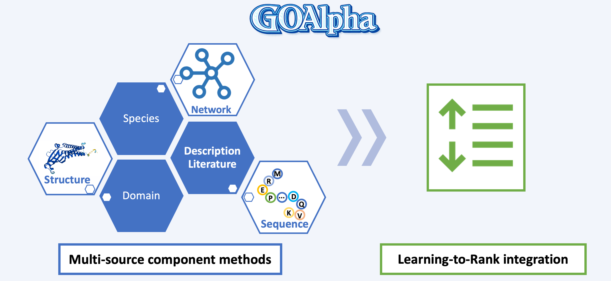

# CAFA 6 - Protein Function Prediction

> 主题：science ｜ 子类：— ｜ 领域：生物信息 ｜ 类别：Research
> 截止：2026-06-01 ｜ 队伍数：2259 ｜ 机制：标准赛 ｜ 指标：蛋白质功能（GO 术语）多标签 F 值
> 数据来源：`intel/cafa-6-protein-function-prediction/`（80 条主题索引 + 6 篇 write-up 正文）

## 1. 任务与数据

- 预测目标：预测蛋白质的**功能注释**（Gene Ontology 术语，多标签、层级结构）。
- 数据形态：氨基酸序列 + 已有注释；GO 术语有**本体层级**（父子关系），类别极多且极不平衡。
- 构造陷阱：
  - 标签空间巨大且长尾；
  - 评估分 BP/MF/CC 三个本体，指标各不同；
  - 序列相似性是最强的传统信号（BLAST/同源迁移）。

## 2. 方案谱系

| 方案 | 名次 | 关键点 |
| --- | --- | --- |
| 1st 方案 | 1st | 见讨论区 |
| **py-boost（梯度提升）+ GCN（图卷积）+ 人工规则** | 2nd | 三类方法混合：树模型处理特征、图网络利用 GO 层级/蛋白互作、规则兜底 |
| 序列模型方案 | 3rd | 本地验证分 BP 0.398 / MF 0.712 / CC 0.610（分本体报告） |

## 3. 关键技巧

- **分层多标签**：GO 本体结构可作先验（父节点预测可传播给子节点）。
- **多方法混合**：GBDT + 图网络 + 规则（与 Leash-BELKA、Polymer 的多表示融合同源）。
- **分本体验证**（BP/MF/CC 分别报告）。
- **序列同源信息**是强基线（传统生物信息方法不可忽视）。

## 4. 可迁移性评估

- **可直接迁移**：
  - **层级多标签的父子传播**（商品类目、代码标签体系通用）；
  - 图结构利用（本体、互作网络）；
  - 按子任务（本体）分别验证。
- 需要前提：生物信息工具链（序列比对、GO 本体）。
- 不建议照搬：忽略层级结构的平铺多标签。

## 5. 对新手的关键启示

1. **标签有层级时，把层级当特征**（父→子传播）。
2. **传统方法（序列同源）常常是强基线**，不要一上来就上大模型。
3. 与 CAFA 系列往届、Leash-BELKA 对照：**蛋白质/分子类比赛的主流是"多表示 + 多方法混合"**。

## 6. 轻读结论（2026-10 补）

**一句话**：CAFA6 的解法高度"世袭"——1st 是 CAFA5 冠军团队的下一代 **GOAlpha**（七组件 + Learning-to-Rank），2nd 是 CAFA5 亚军升级版（新增**文章 TF-IDF**），**3rd 直接复现 CAFA5 亚军开源代码**；考点转向"增量 + 公榜/私榜成分差异"。

- 1st（709383，私榜 0.52430）：BLAST-KNN / Net-KNN / FoldSeek-KNN / SVM-ESM2 / LR-InterPro / GOXML / GORetriever + GO 词频 + 21 维物种编码 → XGBoost LTR；验证=按测试物种分布采样 1000 蛋白；**序列类单点最强、结构互补、文献类公榜强私榜掉** → 不选单点最优；强调证据的时间一致性。
- 2nd（711635）：**CAFA6≈CAFA5 的最新标注子集** → 构造 "Old train"（CAFA5 中不在 CAFA6 的蛋白 + UniProt 最新标注）对照；T5/esm2-small（微调无益）；**TF-IDF 文章嵌入 5000 维**（UniProt PMID → PubMed 标题/摘要）是最大新增量。
- 3rd（709281）：复现 U900 队 CAFA5-2nd；ESM2-t33+ProtT5；合并 CAFA5+CAFA6（145,382 蛋白）；**`propagate`（GO 层级标签传播）参数影响巨大**；标签矩阵 1/0/NaN。
- 社区：GAF 基线 ~0.269（22 票 / 31 评论）、分类学（28 票）、时间平移验证（16 票）、官方 CAFA-evaluator（21 票）。

**裁决**：系列赛先复用上一届公开方案再找增量（本场=文献 TF-IDF）；GO 层级处理（传播/掩码）是隐藏主变量；验证基准按测试分布采样；证据要满足时间一致性。

**悬案**：4th–10th 方案缺失；1st 的 LTR 权重未展开；2nd 的 Old train 变体收益未结论。

## 7. 图表证据

**图 1**（topic 709383）：多源组件（结构/物种/网络/域/文献/序列）→ Learning-to-Rank 融合。

## 8. 出处

- 讨论区索引：`intel/cafa-6-protein-function-prediction/topics.md`（80 条）
- 已收录 write-up（6 篇）：
  - 1st（20 票）：https://www.kaggle.com/competitions/cafa-6-protein-function-prediction/discussion/709383
  - 2nd py-boost + GCN（17 票）：https://www.kaggle.com/competitions/cafa-6-protein-function-prediction/discussion/711635
  - 3rd（15 票）：https://www.kaggle.com/competitions/cafa-6-protein-function-prediction/discussion/709281
  - GAF 基线（22 票）：https://www.kaggle.com/competitions/cafa-6-protein-function-prediction/discussion/613138
  - 时间平移验证（16 票）：https://www.kaggle.com/competitions/cafa-6-protein-function-prediction/discussion/614668
  - CAFA-evaluator（21 票）：https://www.kaggle.com/competitions/cafa-6-protein-function-prediction/discussion/612097
- 轻读全本：`analysis/deep/cafa-6-protein-function-prediction.md`（Tier B 轻读：对照矩阵/裁决/证据分级/悬案 + 1 图证）
