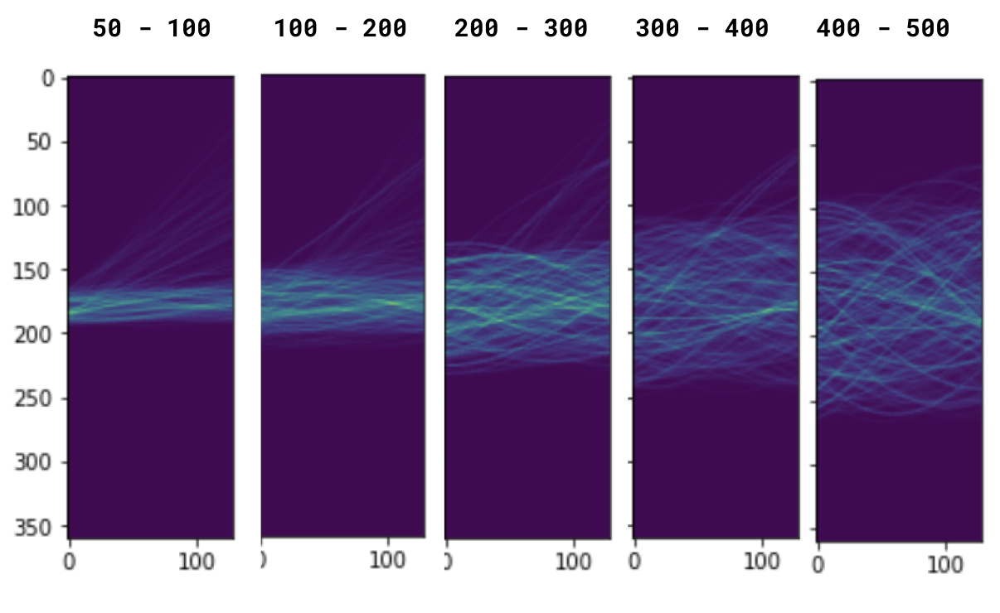
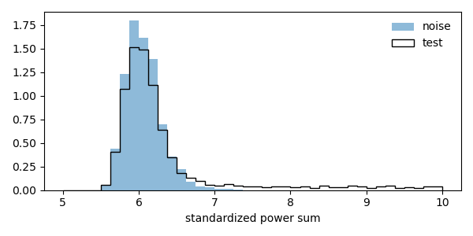
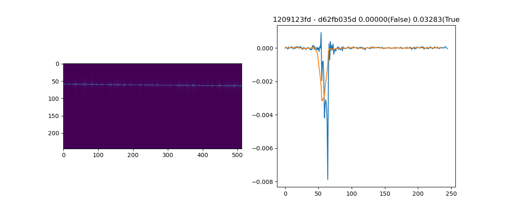
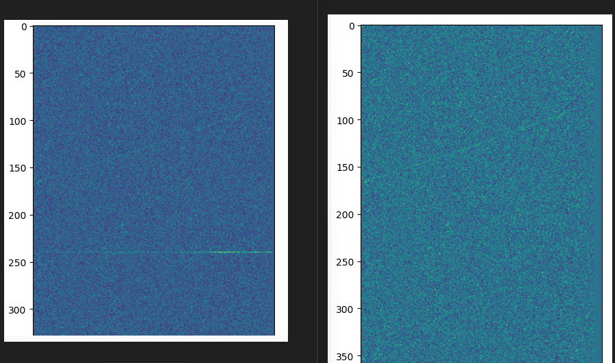
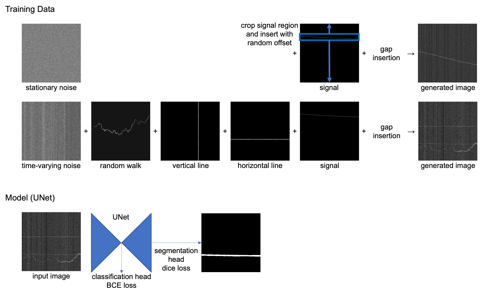
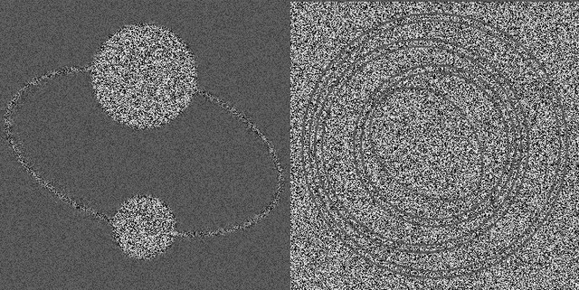

# G2Net - Detecting Continuous Gravitational Waves

> 主题：science（引力波信号检测）｜ 子类：— ｜ 领域：天体物理 ｜ 类别：Research
> 截止：2023-01-03 ｜ 队伍数：936 ｜ 机制：标准赛 ｜ 指标：AUC（信号存在与否二分类）
> 数据来源：`intel/g2net-detecting-continuous-gravitational-waves/`（80 条主题索引 + 6 篇 write-up 正文；深读升级 2026-10-03，Tier A #43）

## 1. 任务与数据

- 预测目标：由 L1/H1 两台 LIGO 探测器的 STFT 频谱图（360 频率 × 时间）判断**连续引力波信号**是否存在。
- 数据形态：HDF5（L1/H1 SFT 矩阵、timestamps、frequency）；连续波=近单频正弦 + 地球自转导致的缓慢多普勒漂移；目标 0/1。
- 构造陷阱：
  - **训练=模拟平稳高斯噪声，测试=真实噪声**（线噪声、非平稳、时间 gap）→ 域适应是第一难题；
  - 信号形态随频带变化（低频直线、高频扇形展开）→ 模板必须频率匹配；
  - 相位未知 → 相干叠加困难，功率型统计量更稳；
  - **生成痕迹**：非平稳测试样本可跨样本匹配去噪（灰区）；
  - 3 个 `-1` 标签是彩蛋图像（数据异常要先审计）。

## 2. 验证方案

| 方案 | 使用者 | 说明 |
| --- | --- | --- |
| 与测试一一对应的合成验证 | 3rd | 用测试图统计生成噪声 + 同频注入信号；正例 0.66，深度 25–50；与公榜相关好 |
| 无 CV，公榜调权 | 6th | 放弃 CV，按公榜权重平均；真实噪声 rank/1.1 修正 |
| 统计量分布 + 公榜 | 1st | 无 ML，无 CV；靠功率和分布与公榜 |
| 在线生成验证 | 9th | 时变噪声 + 线 + gap 复现 |

## 3. 方案谱系

| 方案 | 名次 | 关键点与数字 |
| --- | --- | --- |
| 纯物理：功率求和（无 ML） | 1st（101 票） | 4000 信号模板（多普勒）；按幅度加权；360 频率 × 241 斜率线积分取 max；实噪声归一化；sinc 核 0.825→**0.848**；5 天 RTX3090 |
| DL 集成 + 生成痕迹去噪 | 3rd（40 票） | infinite training（32k–128k 模板）；两探测器时间同步；sqrt 列归一化；层级 stacking + 贝叶斯权重平均；去噪 ~1100 样本：**0.784/0.801 → 0.807/0.826**（无去噪≈第 5） |
| 纯 SA 拟合正弦 | 6th（41 票） | 平方幅度、横线噪声去除 +0.005、竖条纹归一、gap 填充；SA 参数搜索 + k 分位；LB 0.79+ |
| 简单 UNet + 在线生成 | 9th（48 票） | 分类头 BCE + 分割头 Dice；时变噪声/random walk/横竖线/gap 在线生成 |
| 数据理解 | 社区（134 票） | HDF5 结构、LIGO、连续波物理、STFT |
| -1 标签彩蛋 | 社区（125 票） | 黑洞卡通/Arecibo 信息/诺奖得主 |

## 4. 关键技巧

- **物理统计量优先**：未知相位时用功率型广义似然比——多普勒模板 × 幅度加权 × 频率-斜率线积分取最大；sinc 核按 STFT 窗函数形状收集信号。
- **实噪声归一化**：按时间 rms 归一 + 单频强噪声 mask + 频率依赖 rms 归一。
- **域适应生成**：用测试图统计在线生成噪声（时变方差 + 横/竖线 + random walk + gap），DL 必须在此分布上训练。
- **频率匹配**：训练信号/模板与样本频带一致（3rd 按频率注入；1st 模板覆盖多普勒）。
- **检测+分割双头**：UNet 分类为主、分割信号位置为辅助（Dice）监督。
- **经典方法对照**：SA 正弦拟合（6th）也能进金区——先建经典基线再上 DL。
- **生成痕迹审计**：跨样本重复频率 bin → abs1−abs2 去噪（灰区；先报告再决定）。
- **标签审计**：-1 标签=彩蛋图像，而不是噪声标签。

## 5. 可迁移性评估

- 可直接迁移：匹配滤波/功率统计量基线；测试统计驱动的噪声域适应；频率依赖模板；检测+分割双头；数据/标签审计（含彩蛋）。
- 需要前提：信号族可模拟（物理模型已知）；测试噪声可采样或可统计；对生成过程的逆向能力。
- 不建议照搬：直接用官方平稳噪声训练；相干叠加（相位不可得）；默认使用测试生成痕迹（合规风险）。

## 6. 对新手的关键启示

1. 已知信号族的检测任务，先写物理/匹配滤波基线，再决定是否需要深度学习。
2. 训练与测试分布不同时，第一投入是"造出测试分布的噪声"，而不是换模型。
3. 相位不可知时用功率型统计量；频率轨迹随频带变化，模板要频率匹配。
4. 数据里的异常（重复模式、-1 标签、下溢）先审计再做建模决策。
5. 利用测试集生成痕迹是灰区：先报告、评估合规，再决定是否使用（本场 3rd 自嘲 "denoising (or leak 😉?)"）。

## 7. 深读结论（2026-10 补）

**一句话**：这是一场"物理最优统计量 vs 深度学习"的比赛——冠军是纯物理（功率求和），DL 上限被域差异与相位信息卡住。

**跨方案裁决**：

- 域差异是第一难题（全员自造噪声）；DL 无去噪红利≈第 5，纯物理 0.848 第一。
- 相位敏感"加波形"失败，相位不敏感"加功率"成功（1st 一个月实验对照）。
- 信号频率依赖必须显式处理（3rd 图证）。
- 生成痕迹去噪把 3rd 从 ≈第 5 推到第 3（+0.02 私榜），但属灰区，无官方定性。
- -1 标签是彩蛋——标签审计的经典案例。

**数字账精选**：1st 0.825→0.848（sinc 核）；4000 模板/360×241/5 天；3rd 0.801→0.826、~1100 样本去噪；6th 横线去除 +0.005；9th 在线生成 + UNet 双头。

**失败学**：相干加波（1st，一个月）；noise-to-noise/noise-to-void 去噪、扩散模型（3rd）；放弃 CV 靠公榜（6th 的高风险选择）；直接用官方噪声训练（通用）。

**悬案**：3rd 去噪是否违规未收录；alt accounts（375369）未收录；5th stack-sliding/差分进化（376022）未收录；数据生成教程（347052）与 Low SNR（370202）未收录。

## 8. 图表证据

> 路径相对本文件（`notes/science/`）：`../../intel/g2net-detecting-continuous-gravitational-waves/bodies/<topic>_img/NN.png`

**图 1：频率依赖（topic 376233）**

- 50–100 频带近直线、400–500 频带强扇形展开；
- 模板/训练信号必须与样本频率匹配。

**图 2：功率和分布（topic 375910）**

- 噪声集中在 ~6、测试右尾到 ~10；
- 纯统计量即可分离信号；sinc 核把公榜 0.825→0.848。

**图 3：去噪与来源判别（topic 376233）**

- 左=去噪后频谱图（水平亮线=信号）；右=正/负面积曲线判来源；
- abs1−abs2 去噪 ~1100 样本，私榜 +0.025（灰区）。

**图 4：线噪声去除（topic 375923）**

- 左图第 ~250 行水平亮线；右图被列均值替换；
- 单项 +0.005。

**图 5：域适应工程（topic 375897）**

- 训练数据 = 平稳/时变噪声 + random walk + 竖线 + 横线 + 信号 + gap；
- UNet + 分类头（BCE）+ 分割头（Dice）。

**图 6：彩蛋（topic 363734）**

- -1 文件实为黑洞碰撞卡通与引力波图案；
- 标签异常先审计。

## 9. 出处

- 讨论区索引：`intel/g2net-detecting-continuous-gravitational-waves/topics.md`（80 条）
- 已收录 write-up（6 篇）：
  - 数据理解（134 票）：https://www.kaggle.com/competitions/g2net-detecting-continuous-gravitational-waves/discussion/358444
  - -1 标签彩蛋（125 票）：https://www.kaggle.com/competitions/g2net-detecting-continuous-gravitational-waves/discussion/363734
  - 1st（101 票）：https://www.kaggle.com/competitions/g2net-detecting-continuous-gravitational-waves/discussion/375910
  - 9th（48 票）：https://www.kaggle.com/competitions/g2net-detecting-continuous-gravitational-waves/discussion/375897
  - 6th（41 票）：https://www.kaggle.com/competitions/g2net-detecting-continuous-gravitational-waves/discussion/375923
  - 3rd（40 票）：https://www.kaggle.com/competitions/g2net-detecting-continuous-gravitational-waves/discussion/376233
- 深读全本：`analysis/deep/g2net-detecting-continuous-gravitational-waves.md`（11 组件 + 6 图证）
- 缺口登记：347052、370202、376022、373973、375369、361312、363280 未收录正文
