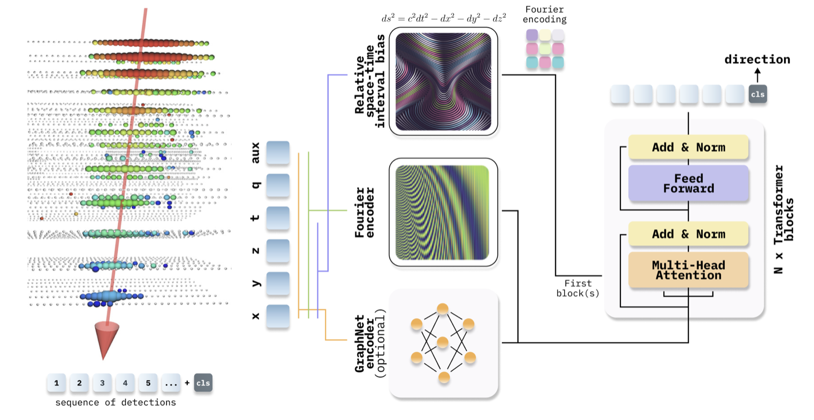

# IceCube - Neutrinos in Deep Ice

> 主题：science ｜ 子类：— ｜ 领域：粒子物理 ｜ 类别：Research
> 截止：2023-04-19 ｜ 队伍数：812 ｜ 机制：代码赛 ｜ 指标：方向重建误差（角度）
> 数据来源：`intel/icecube-neutrinos-in-deep-ice/`（80 条主题索引 + 6 篇 write-up 正文）

## 1. 任务与数据

- 预测目标：由冰下探测器（IceCube）记录的光子命中重建中微子入射方向（球面方向回归）。
- 数据形态：稀疏的事件点云（脉冲时间 + 传感器位置/电荷）；每个事件的传感器数不等。
- 构造陷阱：
  - 数据是稀疏不规则点云（不是规则张量）；
  - 方向是球面量，需要球面损失与角度指标；
  - 数据量大、读取成本高（需分块与缓存）。

## 2. 方案谱系

| 方案 | 名次 | 关键点 |
| --- | --- | --- |
| Transformer + 傅里叶编码 + 相对时空偏置 | 2nd | 用 von Mises-Fisher 损失（球面分布）配合官方角度指标；分块加载 + 缓存 + 长度对齐；傅里叶特征编码连续坐标 |

## 3. 关键技巧

- 球面方向用球面损失（vMF）而非 L2。
- 相对时空偏置：把几何关系编码进注意力。
- 傅里叶特征处理连续坐标（与 NeRF 类做法同源）。
- 数据管线工程（分块、缓存、长度对齐）——本场数据规模使工程成为必需。

## 4. 可迁移性评估

- 可直接迁移：球面/流形目标的专用损失（方向、朝向、角度回归通用）；傅里叶位置编码处理连续坐标；稀疏点云的注意力建模。
- 需要前提：点云/几何深度学习与大数据管线能力。
- 不建议照搬：用普通回归损失处理球面量。

## 5. 对新手的关键启示

1. 先看输出空间的几何结构（球面 → 球面损失；周期 → 周期编码）。
2. 数据管线的工程能力常决定能否跑起来（本场尤其明显）。
3. 与 Waveform Inversion、ARIEL 对照：科学反演任务的通用配方 = 物理编码 + 专用损失 + 工程管线。

## 6. 轻读结论（2026-10 补）

**一句话**：中微子方向回归 = **点云注意力（几何/物理先验注入）+ 长度分桶效率工程 + 角度专用损失**；GNN 与纯 Transformer 两条路线同登顶。

- 1st（77 票）：EdgeConv+Transformer（静态 kNN 边）；自定义损失 −θ−κcosθ+C（+0.005 over VMF）；序列分桶；6M 参数/4 层；训练 200–500、推理 6000；MLP stacking +0.003；私 0.9633。
- 2nd（103 票）：Fourier 编码（128→4096 乘数 +20 bps）+ **相对时空间隔偏置 ds²（+40 bps）** + **指标当损失（+55 bps）**；T/S/B（7.6M–116M）；训练 192/推理 768（+25 bps）；图 1。
- 3rd（56 票）：NanoGPT 式 self-attention；128 bin 角度分类+平滑标签；**Bitter Lesson**（手工特征被规模冲掉）；长度分组 batch 1.5–3.5×；18 层/512 维。

**裁决**：长度打包是效率第一杠杆；VMF 是起点而非终点；ds² 类物理相对偏置值得注入；规模与先验可兼得。

**悬案**：9th–11th 未细读；FP16 不稳定原因未解。

## 7. 图表证据

**图 1**（topic 402882）：命中序列 → Fourier 编码 + ds² 相对偏置（+GraphNet 可选）→ 带偏置 Transformer → CLS → 方向。

## 8. 出处

- 讨论区索引：`intel/icecube-neutrinos-in-deep-ice/topics.md`（80 条）
- 已收录 write-up（6 篇）：
  - 2nd Transformer + vMF（103 票）：https://www.kaggle.com/competitions/icecube-neutrinos-in-deep-ice/discussion/402882
  - 1st（77 票）：https://www.kaggle.com/competitions/icecube-neutrinos-in-deep-ice/discussion/402976
  - 3rd Attention + XGBoost（56 票）：https://www.kaggle.com/competitions/icecube-neutrinos-in-deep-ice/discussion/402888
- 轻读全本：`analysis/deep/icecube-neutrinos-in-deep-ice.md`（Tier B 轻读：对照矩阵/裁决/证据分级/悬案 + 1 图证）
