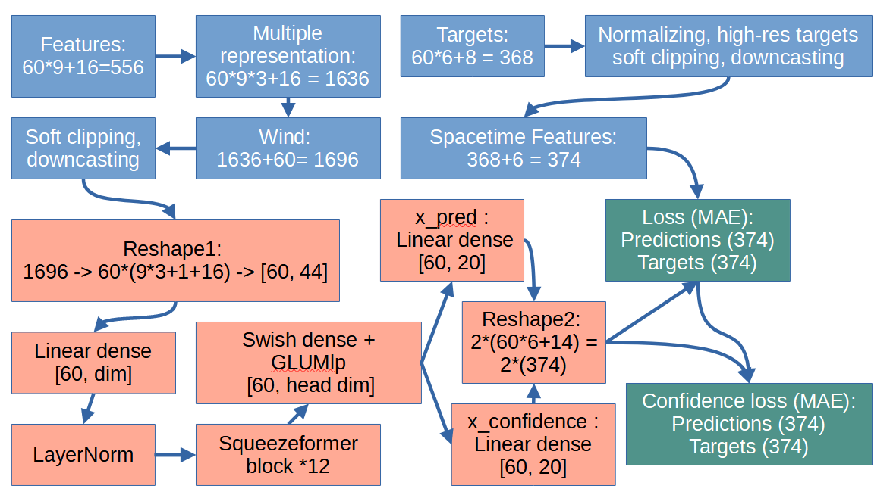
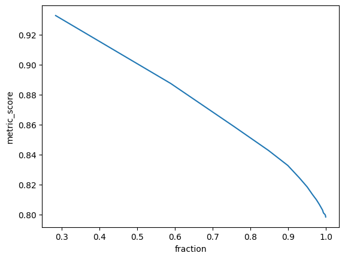
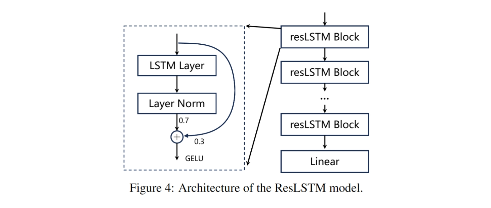
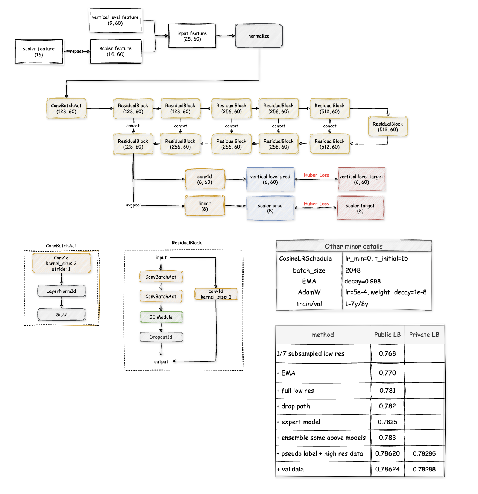
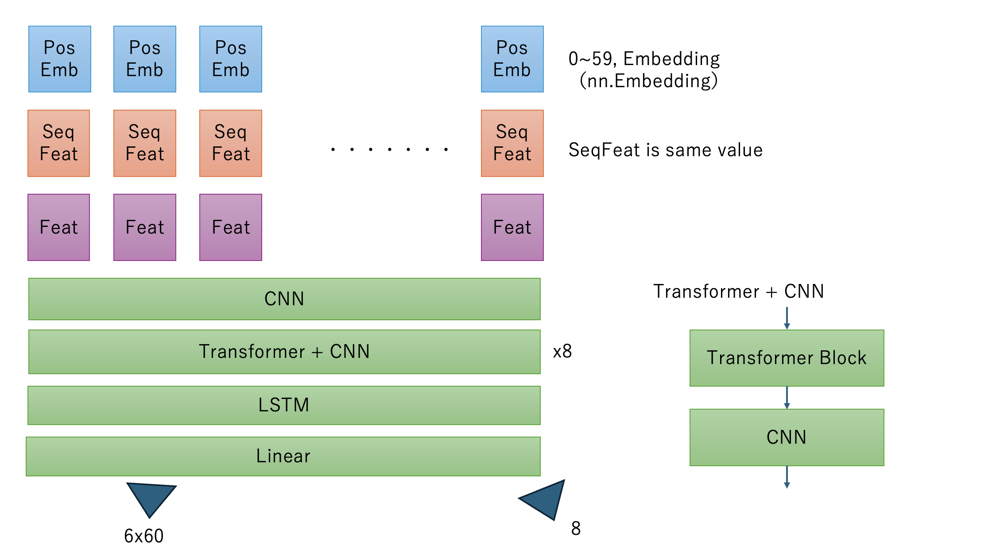

# LEAP - Atmospheric Physics AI / ClimSim

> 主题：science（大气物理仿真回归）｜ 子类：— ｜ 领域：气候科学 ｜ 类别：Research
> 截止：2024-07-15 ｜ 队伍数：693 ｜ 机制：标准赛 ｜ 指标：R²（368 个目标：6×60 序列 + 8 标量，越高越好）
> 数据来源：`intel/leap-atmospheric-physics-ai-climsim/`（80 条主题索引 + 6 篇 write-up 正文；深读升级 2026-10-03，Tier A #42）

## 1. 任务与数据

- 预测目标：1D→1D 回归——由 60 层大气柱状态预测 368 个目标（ptend 加热倾向 6×60 + 8 标量）。
- 数据形态：E3SM 模拟数据；Kaggle 子集来自 HF 低分辨率数据集（~70M 行）；另有高分辨率（HR）数据可混训。
- 构造陷阱：
  - **年际变暖漂移**（1–9 年模拟）→ 需要气候不变量或显式时间特征；
  - 目标/特征动态范围跨数量级（极端值"2523σ"级）→ 数值保真与 soft clipping 关键；
  - **泄漏**：`pbuf_ozone_2` 可反推测试时间/位置 → 2D→1D 或未来数据利用（违反 1D 任务设定）；
  - float32 下溢风险（必须保持 float64 精度管道）。

## 2. 验证方案

| 方案 | 使用者 | 说明 |
| --- | --- | --- |
| 4 套验证（LR×2/HR/训练子集） | 1st | 小数据时与 LB 相关，全量后脱钩 → 最终按公榜控制过拟合 |
| 8y 下半年 + 9y 1 月 hold-out | 2nd | 与 LB 完美相关（~75M 训练样本，stride=7） |
| 1−MSE（std 归一化，eps 极小） | 10th | 主办更换测试集后 R² 失去相关；1−MSE 仍可用 |
| 1/6 子采样 8y | 4th | 各成员按资源不同 |

## 3. 方案谱系

| 方案 | 名次 | 关键点与数字 |
| --- | --- | --- |
| Squeezeformer + MAE + confidence head | 1st（82 票） | 12 块（256/384/512）；特征 1696 维=9×60×3+60+16；MAE>MSE；aux 时空损失；confidence head（0.79159/0.78869 vs 无头 0.78945/0.78631）；HR:LR=1:2；13 模型 **0.79410/0.79123**；低置信筛选 10% → R² ~0.83 |
| 5 人团队：ResLSTM/SmoothL1/group fine-tune | 2nd（47 票） | 全量 LR +~0.01；SmoothL1 + aux diff + cosine（3/9 epoch 衰减）；368 目标分 7 组微调 +0.0005~0.0015；LSTM>CNN/MHSA/GRU；LSTM+Mamba 多样性；hill-climb 16 权重；**0.7955 CV/0.79211/0.78856** |
| 三人三路：ConvNeXt/UNet/LSTM | 4th（34 票） | Kurupical 1D ConvNeXt/Transformer（CV 0.788）；Kami 1D UNet 354M + Adan/EMA；Takoi LSTM×12 + HF；ptend 后处理；**自认 batch 384 是 lat/lon 泄漏遗留** |
| Updraft 4 人 23 模型 + 气候不变特征 | 10th（33 票） | 消融链 1/7→0.768、全量→0.781、+伪标/HR→0.78620/0.78285；气候不变特征（RH/浮力/热通量）+1%；confidence-aware MSE；难样本 doping 14%；PixelShuffle 堆叠 UNet；tanh normalization |
| Two tips | 社区（109 票） | 不转 float32（下溢）；架构决定一切（CV 0.72 首 epoch、LB 0.766） |
| 泄漏治理请求 | 社区（51 票） | pbuf_ozone_2 → 测试时间/位置可恢复；请求取消利用泄漏的方案 |

## 4. 关键技巧

- **数据规模第一**：LR 全量 + HR（2:1）+ 伪标；10th 的消融链（0.768→0.786）是最清晰证据。
- **鲁棒损失**：MAE（1st 的"秘密"）/ SmoothL1（2nd，beta 调参）/ Huber（10th）> MSE；aux diff 损失（相邻层差分）辅助。
- **置信度/方差头**：预测目标误差或方差（1st confidence head、10th confidence-aware MSE）→ 正则 + 样本筛选（丢 10% → 0.83）。
- **1D 序列结构**：层位置显式编码（位置嵌入/reshape [60,44]）；LSTM 家族（ResLSTM 0.7/0.3 残差）单模型最强。
- **气候不变特征**：RH、羽流浮力、归一化热通量——对抗年际变暖漂移（10th 子样本 +1%）。
- **组微调**：368 目标分 7 组（6 序列组 + 1 标量组），全量训练后每组 1 epoch（2nd，+0.0005~0.0015）。
- **数值保真**：FP64 编码 → FP32 训练 → 升 FP64 反归一化；两级 soft clipping（特征）+ 目标 soft clipping；tanh normalization 防梯度爆炸。
- **ptend 后处理**：ptend_q0002_(12..28) ← state_q0002/(−1200)（社区技巧，全员使用）。
- **集成**：13–23 模型；hill-climb/stacking（per target×model）；但私榜最优权重常更简单（10th late submission）。
- **合规**：识别泄漏、主动不用、公开可复现自证（1st 的 >100 notebooks）。

## 5. 可迁移性评估

- 可直接迁移：鲁棒损失优先；不确定度头；数据规模与漂移不变特征；数值保真管道；组微调；泄漏治理三件套。
- 需要前提：大规模仿真数据（或外部数据可获取）；物理特征工程能力；TPU/多卡算力。
- 不建议照搬：MSE 默认损失；盲目 float32；在公榜上精细搜索集成权重；利用数据划分泄漏。

## 6. 对新手的关键启示

1. 回归赛先看误差分布：有极端 outlier 时用 MAE/SmoothL1/Huber，而不是照着 R² 用 MSE。
2. 数据是否用满，往往比模型结构值钱（本场 +0.01 级）。
3. 让模型同时预测"误差/方差"：既当正则，又能筛样本、做主动学习。
4. 数值管道（精度、soft clip、反归一化顺序）是 0 分与高分的分界线。
5. 发现泄漏：识别 → 不用 → 公开可复现自证；这是可信度策略，也是长期竞争力。

## 7. 深读结论（2026-10 补）

**一句话**：这是一场"规模 + 损失 + 数值"的回归赛，模型架构的边际收益远小于前两者；治理层面是"泄漏识别—自证—裁决"的完整样本。

**跨方案裁决**：

- 数据规模第一（三队独立量化）；HR 数据有效但需 soft clipping。
- R² 指标下用 MAE/SmoothL1/Huber；MSE 被极端样本主导。
- 60 层必须作为序列维度显式建模；LSTM/Squeezeformer/UNet 都能到 0.788+，架构主要贡献多样性。
- 置信度头/方差预测 = 正则 + 样本路由（1st 丢 10% → 0.83）。
- 数值管道与泄漏治理是两个容易被忽视的胜负手。

**数字账精选**：1st 0.79410/0.79123（13 模型）；2nd 0.79211/0.78856；10th 链 0.768→0.78624/0.78288；confidence 0.79159 vs 0.78945；特征 1696 维；全量数据 +0.01。

**失败学**：纯 Transformer/其他组合/UNet、深层不稳定、Mixup、EMA（部分成员）、MSE、log 归一化、加权损失（1st/10th）；HR 预训练未收敛（10th）；泄漏遗留（4th 的 batch size）。

**悬案**：泄漏最终裁决未收录；511911/501829/506490/519184 未收录；"低置信样本送回模拟器"闭环未验证。

## 8. 图表证据

> 路径相对本文件（`notes/science/`）：`../../intel/leap-atmospheric-physics-ai-climsim/bodies/<topic>_img/NN.png`

**图 1：1st 数据流（topic 523063）**

- 556→1636（多表示）→+Wind 1696→reshape [60,44]→Squeezeformer×12→双头（374 目标 + 374 置信度）；
- 主损失与 confidence 损失均为 MAE；目标含时空辅助特征。

**图 2：置信度筛选（topic 523063）**

- 丢弃最低置信 10% → R² ~0.83；丢 30% → ~0.93；
- 置信度头用于样本筛选/路由（低置信回模拟器）。

**图 3：ResLSTM（topic 523055）**

- LSTM→LayerNorm→0.7 新值 + 0.3 残差→GELU，堆叠 + Linear；
- 单模型私榜最强——"架构不是主差异"的注脚。

**图 4：算力-收益消融链（topic 523041）**

- 1/7 子样本 0.768 → 全量 0.781 → 伪标+HR 0.78620/0.78285；
- PixelShuffle UNet + SE + 双头 Huber；单变量递增。

**图 5：Tereka 架构（topic 523041）**

- 层位置嵌入 + 序列/标量特征 → CNN → 8×（Transformer+CNN）→ LSTM → Linear；
- 输出 6×60 + 8，层级显式编码。

## 9. 出处

- 讨论区索引：`intel/leap-atmospheric-physics-ai-climsim/topics.md`（80 条）
- 已收录 write-up（6 篇）：
  - 4th（34 票）：https://www.kaggle.com/competitions/leap-atmospheric-physics-ai-climsim/discussion/523042
  - 1st（82 票）：https://www.kaggle.com/competitions/leap-atmospheric-physics-ai-climsim/discussion/523063
  - 2nd（47 票）：https://www.kaggle.com/competitions/leap-atmospheric-physics-ai-climsim/discussion/523055
  - 10th（33 票）：https://www.kaggle.com/competitions/leap-atmospheric-physics-ai-climsim/discussion/523041
  - Two tips（109 票）：https://www.kaggle.com/competitions/leap-atmospheric-physics-ai-climsim/discussion/506984
  - 泄漏治理请求（51 票）：https://www.kaggle.com/competitions/leap-atmospheric-physics-ai-climsim/discussion/519249
- 深读全本：`analysis/deep/leap-atmospheric-physics-ai-climsim.md`（11 组件 + 5 图证）
- 缺口登记：511911、508630、501829、506490、519184、494968 未收录正文
