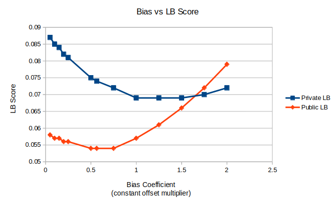
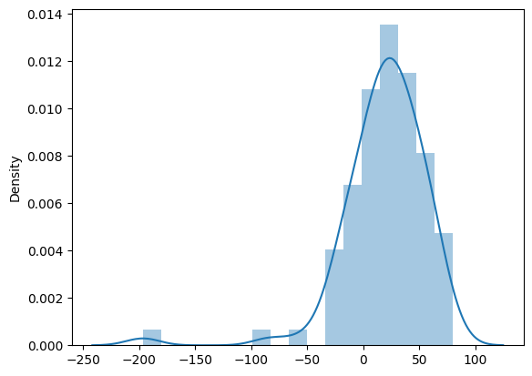
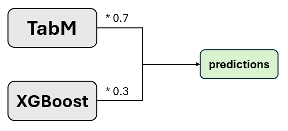

# NeurIPS - Open Polymer Prediction 2025

> 主题：science（材料/化学）｜ 子类：— ｜ 领域：聚合物信息学 ｜ 类别：Featured
> 截止：2025-09-15 ｜ 队伍数：2240 ｜ 机制：代码赛 ｜ 指标：open_polymer_2025（5 性质 wMAE，越低越好）
> 数据来源：`intel/neurips-open-polymer-prediction-2025/`（120 条主题索引 + 6 篇 write-up 正文；深读升级 2026-10-03，Tier A #38）

## 1. 任务与数据

- 预测目标：由聚合物 SMILES 预测 5 个性质（Tg / FFV / Tc / Density / Rg），指标 wMAE 越低越好。
- 数据形态：SMILES 字符串 + 多目标回归；允许使用外部数据（**规则模糊**：组织者对询问长期沉默）。
- 构造陷阱（本场核心）：
  - **Tg 测试标签系统性偏移**：公榜/私榜均受损、私榜更严重；名次被这一个性质支配；
  - 外部数据全都有各自的脏法（常数偏置/非线性/离群）→ 不校正式训练被污染；
  - 公榜只占测试 8%（20th）→ 洗牌预期；
  - 外部数据许可灰色（No license ≠ 免费使用；PI1M 学术用途）。

## 2. 验证方案

| 方案 | 使用者 | 说明 |
| --- | --- | --- |
| 外数据全量 + 主办数据 80/20 | 1st | 只用主办数据做测试折（防止外部样本影响 CV） |
| Butina 聚类 + Tanimoto>0.9 禁入 | 8th | 极端保守的防泄漏切分 |
| Stratified 5 折（等频分箱） | 20th | 与公榜相关性最好的方案；CV 0.0436 |
| 5 折 + OOF 线性校准 | 3rd | OOF 显示系统性斜率偏差 → 校准 +5.47% |
| dedup + Tanimoto>0.99 过滤 | 1st | canonical SMILES 去重；防训练-测试近重复（承认过度谨慎） |

## 3. 方案谱系

| 方案 | 名次 | 关键点与数字 |
| --- | --- | --- |
| BERT + AutoGluon + Uni-Mol 集成 | 1st（116 票） | ModernBERT/CodeBERT/AutoGluon/Uni-Mol 逐性质建模；**PI1M 50k 伪标排名预训练**（+0.004 LB/+0.01 CV）；随机 SMILES ×10 + TTA 50 中位（+0.01 LB）；**Tg 偏移探针 0.5644×std**；外部数据五策略；1116 组 MD 模拟；集成 PP 前 0.058/**0.089** → PP 后 0.054/**0.075** |
| 黑盒公榜集成 + 偏移搜索 | 2nd | +273.15→+300→+30→+40（赛中）；赛后 **(9/5)x+32 → 私榜 0.068**（优于 1st）、(9/5)x+45 → 0.066；ExtraTrees+变换即可打平；"名次由单性质偏移决定" |
| GATv2 + Morgan Top-50 | 3rd（23 票） | 8 头/384 维/6 层 + 逐目标 F-regression Top-50 bits；链延伸增强（优于同分异构体增强）；wMAE 自定义损失；两阶段训练+refit；**线性校准 +5.47%**；赛后 RemoveHs 单模型 ~0.083 |
| TabM + XGBoost，拒绝 Tg 后处理 | 8th（36 票） | **No Tg Post Processing**；POINT2 Tg **+20**（91 重叠 SMILES）、Density **−0.118**；Mordred+指纹；Butina+0.9；TabM×0.7+XGB×0.3 |
| 特征工程 + 逐目标自动权重 | 20th（32 票） | 1072 特征；6 类模型逐目标加权；Tg mean matching / FFV mean+std matching；CV 0.0436 / pub 0.065 / priv 0.085 |
| Jump-start 材料帖 | 社区（106 票） | 材料信息学背景与起步资料 |

## 4. 关键技巧

- **数据事故应对**：逐目标审计预测-标签关系（±0.1σ 扫描 → V 形曲线拟合偏移；OOF 线性校准；mean/std matching）；**保留 raw 提交对冲**。
- **外部数据三步**：重叠 SMILES 差值分析（8th 的 91 样本 → Tg +20、Density −0.118）→ 尺度/口径校正 → isotonic 重标/误差过滤/样本加权（1st 五策略）。
- **通用预训练模型 > 化学专用**：ModernBERT-base 0.0584 / CodeBERT 并列最佳 / ChemBERTa 0.0634 / polyBERT 0.592；ModernBERT-large（0.0587）反而更差。
- **伪标签排名预训练**：PI1M 50k 假想聚合物 → 多任务成对排序（忽略相近对）→ 微调；5 个基础模型全部受益，部分学生超过教师。
- **SMILES 增强**：随机非规范 SMILES ×10（±30% 最优）；TTA 50 次取中位（+0.01 LB）；Kukulized/去立体化学无效。
- **表格线**：AutoGluon best preset（2h/性质）约 1/20 算力打败手工 XGB+LGBM+TabM ~2%；MD 仿真特征（41×XGB stacking）仅 +0.0005 wMAE。
- **GNN 线**：GATv2 + Morgan top-50（互补的高低层信息）；RDKit descriptors 伤害 GATv2 但帮助 NNConv；链延伸增强 > 同分异构体增强；batch 64 最优。
- **治理**：外部数据许可先查（No license ≠ 免费）；组织者沉默不等于允许；探针利用存在伦理争议（608250）。

## 5. 可迁移性评估

- 可直接迁移：重叠样本差值校正；逐目标预测-标签审计；V 形偏移拟合 + 对冲提交；伪标签排名预训练；随机 SMILES 增强 + TTA；AutoGluon 基线优先。
- 需要前提：分子工具链（RDKit/Mordred/Uni-Mol）；MD 仿真（本场 1st 自跑 1116 组，成本高）；外部数据许可确认。
- 不建议照搬：化学专用基础模型默认优先；大模型/大 batch；外部数据不校正；激进偏移利用（合规/私榜风险）。

## 6. 对新手的关键启示

1. 多目标比赛的第一个动作是**逐目标画预测-标签关系**——一个被污染的列可以吞掉其余四列的优势。
2. 外部数据先做重叠样本差值分析，再谈混训；来源与许可要留痕。
3. 化学任务先试通用预训练模型（ModernBERT/CodeBERT），领域专用并非默认更优。
4. 表格特征确定后先跑 AutoGluon 建立基线，把精力留给数据与表示。

## 7. 深读结论（2026-10 补）

**一句话**：这是一场"数据事故 + 探针套利"的比赛——建模水平的分差被一个性质的标签 bug 淹没。

**跨方案裁决**：

- Tg 偏移 5/5 独立确认；处理方式（激进拟合/常规校准/保守拒绝）成为排名主变量；**对冲 + 保守校准**是更稳姿态，赛后 (9/5)x+32 提示偏移可能是单位类结构性错误（比常数拟合更接近真解）。
- 外部数据必须先做重叠差值校正（+20 / −0.118）与清洗（五策略）。
- 通用预训练模型全面优于化学专用（同流程大差距）；更大模型无益。
- 后处理分布校准是低成本确定收益（+5.47% / mean matching）。
- 模型差异被事故稀释：简单模型 + 保守后处理也能进前 10（8th）。

**数字账精选**：0.0584（ModernBERT）vs 0.592（polyBERT）；+0.004 LB/+0.01 CV（伪标预训练）；TTA +0.01；0.089→0.075（PP）；+20/−0.118（外部校正）；0.068/0.066（赛后变换）；+5.47%（校准）；8% 公榜占比；1072 特征。

**失败学**：化学专用基础模型、更大模型、D-MPNN、GMM 增强、Isomer generation、大 batch、RDKit descriptors 喂 GATv2、外部数据不校正、CatBoost/LGBM 高折间方差、不查许可。

**悬案**：官方事故说明与是否重赛（585884/588643/607784/607778/607769）未收录；伦理争议（608250）结论未知；587318（74 票）方法未收录；外部数据许可界定缺失。

## 8. 图表证据

> 路径相对本文件（`notes/science/`）：`../../intel/neurips-open-polymer-prediction-2025/bodies/<topic>_img/NN.ext`

**图 1：偏置-分数曲线（topic 607947）**

- 横轴=常数偏移系数（×预测 std），纵轴=LB 分数（越低越好）；
- 公榜（橙）最优 ≈0.55–0.6（0.054）；私榜（蓝）在 1.0–1.5 平台 ~0.069、2.0 才回升——**私榜偏移更严重**；
- 1st 的 0.5644 是公榜最优、私榜次优的折中。

**图 2：外部数据差值分析（topic 608069）**

- 91 个重叠 SMILES 的 Tg 差值峰值 +20~+40、带 ±100 离群；
- 据此做 Tg +20 校正（Density −0.118）——**外部数据校正的标准动作**。

**图 3：TabM×0.7 + XGBoost×0.3（topic 608069）**

- 极简加权集成，无复杂后处理；
- 在标签事故环境下仍拿到第 8——"简单模型 + 保守后处理"的有效性。

## 9. 出处

- 讨论区索引：`intel/neurips-open-polymer-prediction-2025/topics.md`（120 条）
- 已收录 write-up（6 篇）：
  - 1st（116 票）：https://www.kaggle.com/competitions/neurips-open-polymer-prediction-2025/discussion/607947
  - Jump-start（106 票）：https://www.kaggle.com/competitions/neurips-open-polymer-prediction-2025/discussion/585022
  - 8th（36 票）：https://www.kaggle.com/competitions/neurips-open-polymer-prediction-2025/discussion/608069
  - 2nd：https://www.kaggle.com/competitions/neurips-open-polymer-prediction-2025/discussion/608984
  - 20th（32 票）：https://www.kaggle.com/competitions/neurips-open-polymer-prediction-2025/discussion/607803
  - 3rd：https://www.kaggle.com/competitions/neurips-open-polymer-prediction-2025/discussion/607991
- 深读全本：`analysis/deep/neurips-open-polymer-prediction-2025.md`（11 组件 + 3 图证）
- 缺口登记：587318、607784、585884、588643、607769、608250、593755、607778 未收录正文
