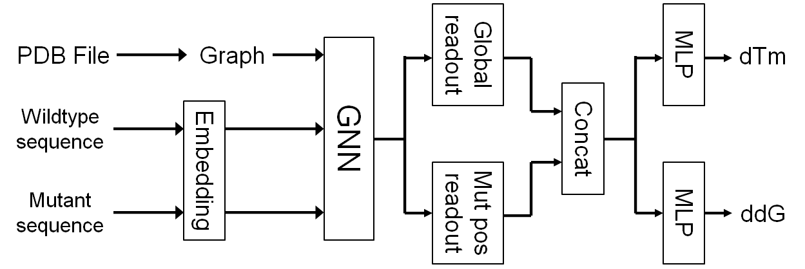

# Novozymes - Enzyme Stability Prediction

> 主题：science ｜ 子类：— ｜ 领域：蛋白质工程 ｜ 类别：Featured
> 截止：2023-01-03 ｜ 队伍数：2482 ｜ 机制：标准赛 ｜ 指标：Spearman 相关系数
> 数据来源：`intel/novozymes-enzyme-stability-prediction/`（120 条主题索引 + 8 篇 write-up 正文）

## 1. 任务与数据

- **预测目标**：预测单点突变对酶热稳定性 ΔTm 的影响，按 Spearman 排序相关评分。
- **数据形态（本场最大陷阱）**：
  - 训练集 31390 行，**来自许多不同蛋白质**；
  - 测试集 2413 行，**全部来自同一个野生型蛋白**的单点突变。
  - 也就是说：训练与测试的"蛋白质分布"完全不同，**必须按"单蛋白内排序"来设计验证**。
- 另有 3D 结构信息可用于特征工程。

## 2. 验证方案

| 方案 | 使用者 | 说明 |
| --- | --- | --- |
| 用公开测试集做验证 | 1st（公开第 1） | 因测试只有一种蛋白，直接用公开测试集当验证最贴近真实场景 |
| 分组 CV | 多数 | 但无法反映"单蛋白"结构，容易高估 |
| 公开榜探针 | 1st | 通过数学优化**反推公开测试标签**，再用它训练第二层模型 |

**结果警示**：公开第 1 名的方案在私榜掉到 **967 名**——探针拟合公开集的做法在私榜完全失效。

## 3. 方案谱系

| 方案 | 名次 | 关键点 |
| --- | --- | --- |
| 多模型特征 + 探针标签二次训练 + 爬山法融合 | 公开 1 / 私榜 967 | 作者自述另有一个未选提交本可夺冠；核心教训是**探针策略不可迁移** |
| 蛋白质作为图（Protein as a Graph） | 获奖 | 把残基建模为图节点 |
| 3D 结构特征工程 | 3rd | 取突变位点最近的 21 个氨基酸，计算相对距离与夹角 |
| 外部数据集 D1/D2/D3 组合训练 | 多队 | 合理利用公开的蛋白质稳定性数据库 |
| "幸运的第 6 名" | 6th | 作者自述运气成分大 |

## 4. 关键技巧

- **认清测试集结构**：本场的测试集是"单一蛋白的突变谱"，因此模型需要在同一蛋白内部**正确排序**，而不是跨蛋白泛化。
- **结构特征**：突变位点周围的局部几何（距离、夹角）是有效信号。
- **外部数据库**：蛋白质稳定性公开数据集（D1/D2/D3）是合理且必要的补充。
- **融合方式**：爬山法 + 正/负权重搜索。
- **探针的诱惑与代价**：探针能显著提升公开分，但本场给出了惨痛反例。

## 5. 可迁移性评估

- **可直接迁移**：
  - **先弄清测试集的构造方式**（同分布？单实体？时间外推？），再设计验证。
  - 用局部结构/邻域特征表达"点突变"这类局部扰动。
  - 合理使用公开科学数据库扩充训练。
- **需要前提**：
  - 需要 3D 结构数据与生物信息学工具链。
  - 探针策略依赖规则允许且榜单可探测。
- **不建议照搬**：
  - 用公开榜标签训练第二层模型（本场已证伪）。
  - 常规随机 CV（无法反映单蛋白测试结构）。

## 6. 对新手的关键启示

1. **先看测试集长什么样**——本场的全部难点都源于"测试集只有一个蛋白"。
2. **公开榜第一 ≠ 私榜第一**：探针拟合是最危险的技术路线之一。
3. **领域知识值钱**：局部几何特征是把生物学先验转成模型输入的好例子。
4. 面对"训练/测试不同分布"，**验证方案本身就是解题**。

## 7. 轻读结论（2026-10 补）

**一句话**：本场是**榜单污染 + 极端洗牌**的教科书案例——公榜第 1 掉到私榜 967（用数学优化反推公开测试标签刷到 0.865）；按分数记的"1st" GNN 方案自己承认训练代码有 bug 反而赢；私榜真正最好的是**被放弃的 Random Forest**（0.546/0.558）。

- 376116（169 票）：测试是单一酶、无法建 CV → 用公榜当验证；**2 次提交定位公/私切分**（公开=前 541 行+后段+1169 行；残差 16–123+野生型为公榜、124–221 为私榜）；下载 350 份公开提交，解"相关性=LB 分数"的方程组，每天 5 次最大化信息量的提交、连续 3 个月 → **公榜 0.865**；用伪标签训模型；最终选 HC（公榜 0.609/0.645），**未选的默认 RF 私榜 0.546 = 第 1**，depth=4 版 0.558；**最强单特征 = RSASA（溶剂可及表面积）**（公 0.407/私 0.466）。
- GNN 版 1st（376371）：PDB→残基图 + ESM2-t33 节点嵌入 + 3 层 GIN → 全局/突变位点 readout → MLP 出 dTm/ddG；单模 0.365/0.368；**最终提交有 bug**（同批预测相同、测试喂错输入）。
- 2nd（376134，私榜 0.577）：多方法集成 + **"集成 − ML 集成"的平滑**（把极端预测往中间拉，权重按公榜）。
- 数据侧：训练集含与测试同类的突变（122 票）、13,000 个单点突变（75 票）、AF2 预测（71 票）。

**裁决**：无法建 CV 时至少保留一份"完全不看公榜"的提交；公榜可被反推（赛制漏洞，以私榜为准）；领域单特征（RSASA）值得先做普查；复盘要记录"未选提交"的分数。

**悬案**：3rd/6th/11th 方案缺失；反推方程的细节未展开；官方对反推手法的态度未知。

## 8. 图表证据

**图 1**（topic 376371）：PDB→图 + 野生型/突变嵌入 → GIN → 双 readout 拼接 → dTm/ddG 双头。

## 9. 出处

- 讨论区索引：`intel/novozymes-enzyme-stability-prediction/topics.md`（120 条）
- 已收录 write-up（8 篇）：
  - 公开 1 / 私榜 967（169 票）：https://www.kaggle.com/competitions/novozymes-enzyme-stability-prediction/discussion/376116
  - 1st（68 票）：https://www.kaggle.com/competitions/novozymes-enzyme-stability-prediction/discussion/375920
  - 1st - Protein as a Graph（49 票）：https://www.kaggle.com/competitions/novozymes-enzyme-stability-prediction/discussion/376371
  - 2nd（53 票）：https://www.kaggle.com/competitions/novozymes-enzyme-stability-prediction/discussion/376134
  - 11th（41 票）：https://www.kaggle.com/competitions/novozymes-enzyme-stability-prediction/discussion/376147
