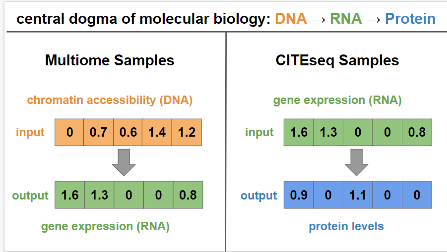
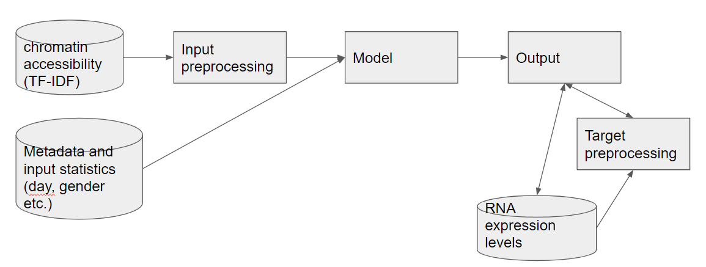
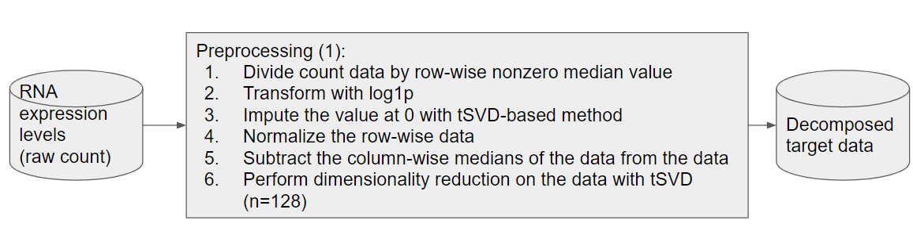
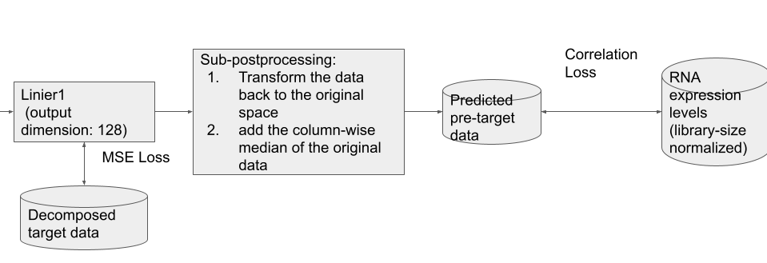
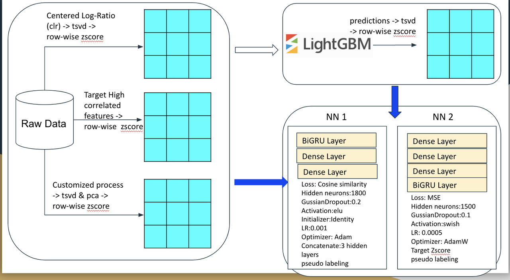
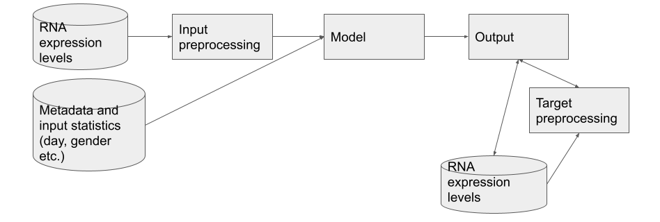

# Open Problems - Multimodal Single-Cell Integration

> 主题：science（单细胞多组学）｜ 子类：— ｜ 领域：生物信息 ｜ 类别：Featured
> 截止：2022-11-15 ｜ 队伍数：1220 ｜ 机制：标准赛 ｜ 指标：Mean Pearson（赛后数据更新/rescore，历史称 MeanPearsonOld）
> 数据来源：`intel/open-problems-multimodal/`（80 条主题索引 + 6 篇 write-up 正文；深读升级 2026-10-03，Tier A #36）

## 1. 任务与数据

- 预测目标：两个逐细胞向量回归——**Multiome**（染色质可及性 DNA → RNA 表达）与 **CITEseq**（RNA → 蛋白水平）。
- 数据形态：高维稀疏计数矩阵（细胞 × 基因/峰）；含 donor/day/gender 等元数据。
- 构造陷阱：
  - 零膨胀与文库大小差异 → 必须先归一化 + 变换 + 低秩表示；
  - 目标高维强相关 → 分解空间训练、原空间（Pearson）评估；
  - **域偏移**：public test = unseen donor，private test = unseen day+donor → 随机 KFold 与公榜相关是假象；
  - **榜单污染**：有组织作弊（保银牌广告）、公榜泄漏帖、数据更新/rescore——公榜只能确认不能选择。

## 2. 验证方案

| 方案 | 使用者 | 说明 |
| --- | --- | --- |
| 5 折 group by donor+day | 1st | 同时隔离个体与时间批次 |
| out-of-day groupkfold | 2nd | 逐特征验证"每一天都有增益"才保留；早期 random kfold 与 LB 匹配是假象 |
| 10% "最接近 PB" 训练数据 | 3rd | 用与 PB 分布最接近的子集做验证 |
| 测试来源二分类 | 3rd | 分类器能轻易区分测试数据来源 → "信任 LB 危险" |
| Optuna 80/20 | 1st | 超参搜索与最终 CV 分离 |

## 3. 方案谱系

| 方案 | 名次 | 关键点与数字 |
| --- | --- | --- |
| 双管线 + tSVD 插补 + 目标分解 | 1st（104 票） | Multiome：TF-IDF 输入 + 元数据；目标：行中位数归一→log1p→tSVD 插补→行归一→去列中位数→tSVD 128→反变换+列中位数；CITE：按 batch 相关性 + Reactome 通路选基因；5 折 donor+day；集成 = seed + batch 子集（男/女/Day4,7）+ 全量预训练 |
| CLR + LGBM meta + 双 NN（BiGRU） | 2nd（95 票） | CLR 为最佳归一化；4 组特征喂 LightGBM（feature_fraction 0.1）→ OOF→tsvd→zscore 作 NN meta；NN1 BiGRU 前置（cosine, 1800, ELU）、NN2 BiGRU 后置（MSE, 1500, Swish）；day-median 批次修正；**公榜全程第 1，私榜被时间域偏移洗掉** |
| BM25/LSI + 多特征 MLP/CatBoost | 3rd（70 票） | BM25 替代 TF-IDF；LSI(muon) 64 维；binary 16 / w2v 16 / leiden 23 簇×16 / 连接矩阵 16 特征；目标 SVD 128；~20 MLP + 3(2) CatBoost；自述无生物背景 |
| 作弊事件 + 领域知识 + 上届冠军 | 社区（147/132/96 票） | 付费保银牌广告与可疑队伍 20–37 名；中心法则与任务定义；NeurIPS 2021 同题冠军录像/源码 |

## 4. 关键技巧

- **计数表示链**：文库归一（CLR / log1p / 行中位数）→ 方差稳定（sqrt/log1p）→ 低秩（SVD / LSI / tSVD）→ 行 z-score。
- **tSVD 零位插补**：低秩重构填充 0 位（区分"未观测"与"不表达"）。
- **目标双空间**：分解空间（SVD 128）用 MSE 训练 → 反变换 + 列中位数还原 → 原空间 correlation loss/Pearson 评估。
- **IR 迁移**：BM25 替代 TF-IDF；muon LSI 替代 SVD；基因序列 w2v（每细胞 top-100 基因）。
- **邻域特征**：leiden 聚类均值（23 簇 × SVD 16）、连接矩阵 SVD 16。
- **批次修正**：day-median 减法（简单低风险）；按 donor/day 分组验证。
- **集成多样性**：seed、batch 子集（男/女/Day4,7）、损失（cosine/MSE/Huber）、结构（BiGRU 前置/后置）、特征组合（4 组 LGBM、~20 MLP）。
- **激活/损失细节**：CITE 目标经 DSB 含负值 → ELU/Swish 优于 ReLU；cosine 训练稳定后换 MSE/Huber 造多样性。
- **榜单审计**：公榜异常名次段（20–37）、账号行为模式、测试来源可分性、"只涨公榜不涨 CV"——四类污染信号。

## 5. 可迁移性评估

- 可直接迁移：稀疏计数表示链 + 零位插补；目标分解训练/原空间评估；donor/day 分组与 out-of-day 验证；测试来源分类器；IR→生信方法迁移（BM25/LSI/w2v）；异质小模型集成。
- 需要前提：对矩阵稀疏性/批次效应的基本理解（无需生物背景，3rd 即为例证）；生物信息工具链（scanpy/muon/scanpy）。
- 不建议照搬：random KFold；直接回归原始 counts；信任公榜做选择；大模型堆容量（低秩表示下收益有限）。

## 6. 对新手的关键启示

1. 稀疏计数数据先做"归一化→变换→低秩→z-score"，模型最后选。
2. 高维输出先降维训练，再回原空间按竞赛指标评估——训练空间与评估空间可以不同。
3. 验证要与测试的域结构对齐（donor/day）；用"测试来源分类器"检验切分是否泄漏。
4. 榜单是外部状态：看到"只涨公榜不涨 CV"的改动，先按作弊/泄漏/域偏移排查。

## 7. 深读结论（2026-10 补）

**一句话**：这是一场"表示工程 + 验证设计"的比赛——模型都是标准件，名次由预处理与"信什么榜"决定；同时是 Kaggle 治理问题的经典样本。

**跨方案裁决**：

- 预处理是主杠杆（3/3 明说）；目标侧分解 + 反变换是通用结构（1st 最完整）。
- 验证必须 donor/day 分组；random KFold 与公榜相关是伪相关（2nd 亲历私榜洗牌）。
- 公榜污染三重来源：有组织作弊（147 票证据帖）+ 公榜泄漏（94 票帖，正文未收录）+ 域偏移——公榜只能确认不能选择。
- BM25 vs TF-IDF：方向可信（稀疏计数场景），但单队无消融，中低置信。
- 集成多样性来自表示/损失/结构三处，小模型足够。

**数字账精选**：目标 tSVD 128；LSI 64；leiden 23 簇×16；NN hidden 1800/1500；LGBM feature_fraction 0.1；5 折 donor+day；10% PB 相似验证。

**失败学**：random KFold（2nd）、信任公榜（2nd 的"全程第一"）、直接回归原始 counts、在低秩表示上堆容量、参与付费代打（治理风险）。

**悬案**：作弊处理与影响名次未收录；泄漏帖（349867）、rescore（350933）、Private 0.773 lessons（366395）、Exploiting column names（349242）、7th/12th 方案未收录。

## 8. 图表证据

> 路径相对本文件（`notes/science/`）：`../../intel/open-problems-multimodal/bodies/<topic>_img/NN.png`

**图 1：中心法则与两个子任务（topic 346888）**

- Multiome = 染色质可及性（DNA）→ RNA；CITEseq = RNA → 蛋白；
- 每行示例展示多分量同时预测——向量到向量回归的领域坐标系。

**图 2：1st 的 Multiome 总管线（topic 366961）**

- TF-IDF 输入 + 元数据（day/gender）→ 预处理 → 模型 → 输出；目标侧独立预处理；
- "输入表示 + 元数据 + 目标变换"三要素结构。

**图 3：1st 的目标预处理链（topic 366961）**

- 行非零中位数归一 → log1p → **tSVD 重构填充 0** → 行归一 → 减列中位数 → tSVD 128；
- "稀疏计数 → 稳定变换 → 零位插补 → 低秩分解"标准链。

**图 4：1st 的双空间训练（topic 366961）**

- Linear(128) 以 MSE 对分解目标训练 → 反变换 + 列中位数 → 原空间 correlation loss；
- 分解空间训练 + 原空间评估的分离结构。

**图 5：2nd 的完整管线（topic 366453）**

- 三路特征（CLR→tSVD→zscore；高相关特征；定制 tsvd&pca）→ LightGBM（预测→tsvd 作 meta）→ 双 NN；
- NN1：BiGRU 前置 + cosine + ELU + 1800；NN2：BiGRU 后置 + MSE + Swish + 1500；均含伪标签。

**图 6：1st 的 CITEseq 总管线（topic 366961）**

- RNA + 元数据 → 输入预处理 → 模型；目标侧 RNA 经预处理参与训练；
- 对应正文的"按 batch 相关性 + Reactome 通路选基因"。

## 9. 出处

- 讨论区索引：`intel/open-problems-multimodal/topics.md`（80 条）
- 已收录 write-up（6 篇）：
  - 有组织作弊（147 票）：https://www.kaggle.com/competitions/open-problems-multimodal/discussion/366313
  - 领域知识（132 票）：https://www.kaggle.com/competitions/open-problems-multimodal/discussion/346888
  - 1st（104 票）：https://www.kaggle.com/competitions/open-problems-multimodal/discussion/366961
  - 上届冠军索引（96 票）：https://www.kaggle.com/competitions/open-problems-multimodal/discussion/348792
  - 2nd（95 票）：https://www.kaggle.com/competitions/open-problems-multimodal/discussion/366453
  - 3rd（70 票）：https://www.kaggle.com/competitions/open-problems-multimodal/discussion/366428
- 深读全本：`analysis/deep/open-problems-multimodal.md`（11 组件 + 6 图证）
- 缺口登记：349867、366395、363052、366471、349242、364408、366455、350933、348311、349559 未收录正文
