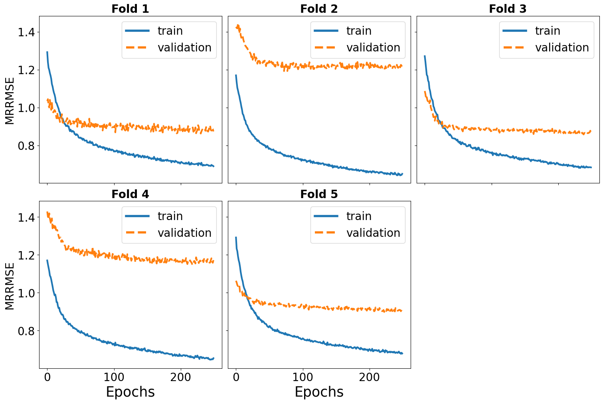
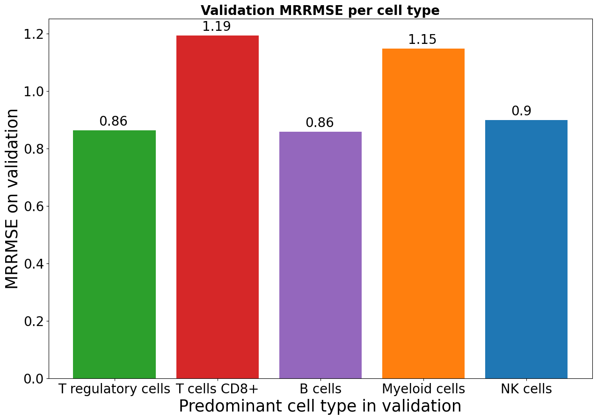
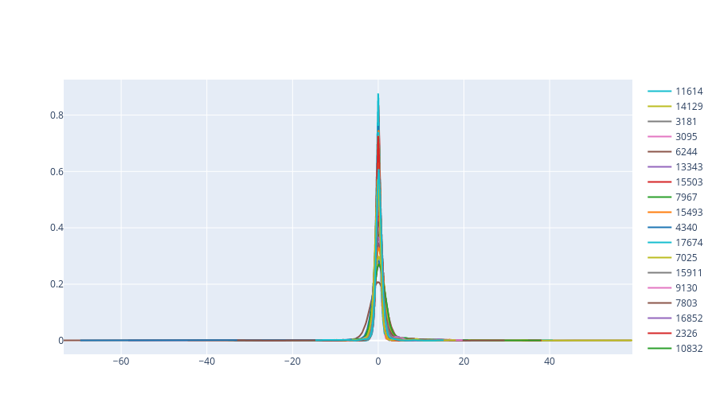
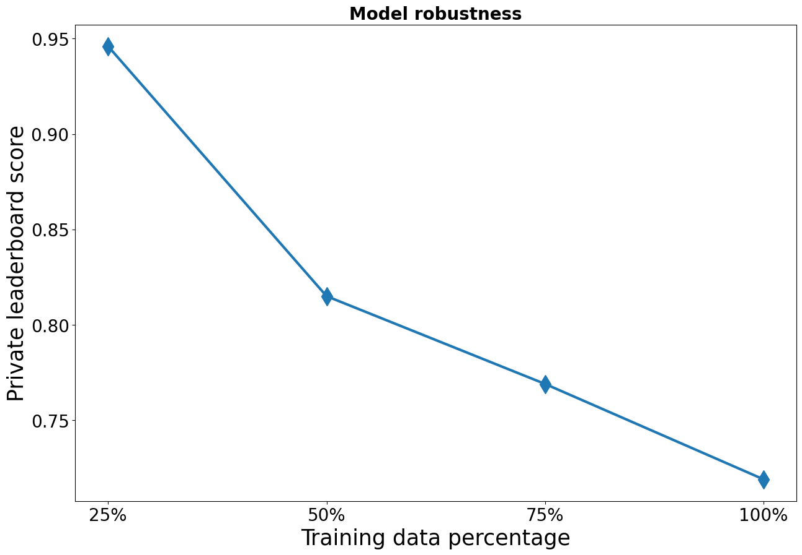
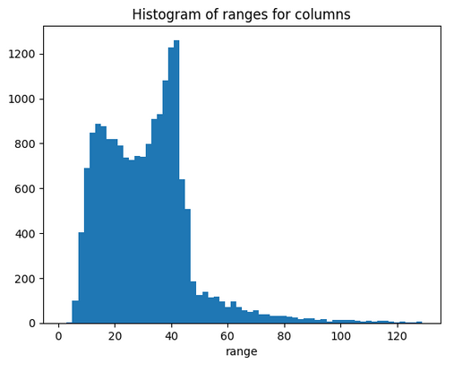
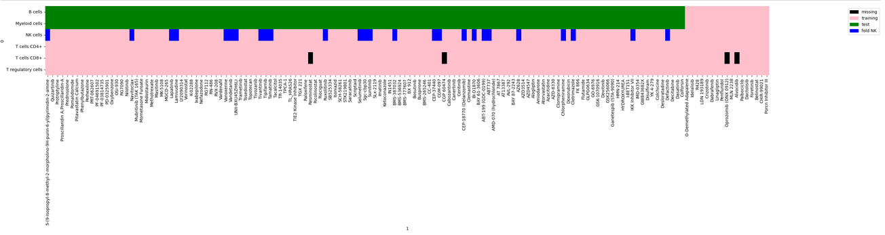

# Open Problems - Single-Cell Perturbations

> 主题：science（单细胞扰动响应预测）｜ 子类：— ｜ 领域：生物信息 ｜ 类别：Featured
> 截止：2023-11-30 ｜ 队伍数：1097 ｜ 机制：标准赛 ｜ 指标：Weighted Rowwise RMSE（MRRMSE，越低越好；public 约 0.55–0.62，private 约 0.72–0.84，刻度不同）
> 数据来源：`intel/open-problems-single-cell-perturbations/`（80 条主题索引 + 6 篇 write-up 正文；深读升级 2026-10-03，Tier A #37）

## 1. 任务与数据

- 预测目标：给定 `(cell_type, sm_name)` 两个短关键词，预测 18211 个基因的差分表达（DE，Limma log-p 预处理）。
- 数据形态：极弱离散输入（两个类别字段）+ 超高维连续输出；样本量小（每 cell×drug 一条向量）。
- 构造陷阱：
  - 输入信息量≈0 → 必须做特征富集（目标编码/预训练表示/统计量）；
  - 18k 目标噪声大 → TSVD 降维反而常涨分（丢的是噪声）；
  - **CV-LB 失配**：local MRRMSE 与 LB 近零相关（row-corr 仅 ~0.5），但 public-private 相关 0.98；
  - 指标对离群值敏感 → 榜单易探、甚至"×1.2"套利（#13 建议重设评测）。

## 2. 验证方案

| 方案 | 使用者 | 说明 |
| --- | --- | --- |
| 5 折（seed 42）+ 折内细胞类型分析 | 1st | 折间 0.86 vs 1.19，揭示细胞类型难度主导 CV |
| 自定义折：每折一种细胞类型 + 仅公/私测 sm_name | 3rd | 让 CV 复现测试组成；最高 CV 对应最高私榜 |
| KMeans 聚类采样划分（val 10%） | 2nd | 目标空间聚类后分层 |
| 多 CV 方案对比 + 多样性控制 | #13 | 50+ 模型统计 CV-LB 关系；random folds 不劣于逻辑切分 |

## 3. 方案谱系

| 方案 | 名次 | 关键点与数字 |
| --- | --- | --- |
| PYBOOST 多目标 boosting + 多族集成 | #13（65 票） | Quantile80 目标编码 0.602→0.586；almost-entire 重训 0.584→0.577；排除 CD8 +0.002；多阶段等权 blend 0.575→0.566→0.559→**0.558**；赛后 solo PyBoost 私榜 0.718（优于原 top1 0.728） |
| ChemBERTa + GRU/1d-CNN/LSTM 融合 | 1st（50 票） | BioWordVec 0.767→ChemBERTa 0.614；Wikipedia 描述 0.656（失败）；GRU 私榜 0.733 / CNN 0.745 / LSTM 0.839；融合 0.723–0.725；全量数据 0.719；四损失加权 0.32/0.24/0.24/0.2 |
| Transformer + 目标编码复合 | 2nd（49 票） | 4 模型复合 0.551/0.559/0.575/0.554（权重 0.5/0.25/0.25/0.3）；d=128；Lion+Huber；20k epoch |
| 两阶段伪标签 + Optuna + 多模型中位 | 3rd（33 票） | 7 模型产 255 条伪标签 → 20 模型重训取中位；TSVD；列 min/max 裁剪；1 小时 CPU 可复现 |
| 综合指南 | 社区（65 票） | 任务挑战与既有方法（Dr.VAE/scGEN/ChemCPA/RF/XGBoost） |

## 4. 关键技巧

- **弱输入富集优先级**：目标编码（均值/方差/分位数）≥ 预训练通用表示（ChemBERTa/SMILES）> 手工生物先验（Wikipedia 描述/通路/PPI 均不敌）。
- **18k 目标的两种处理**：TSVD ~70 维再反变换（boosting/去噪） vs 直接多目标预测（PyBoost/NN）。
- **小样本训练协议**：固定 epoch、**禁用早停** → 在多个"almost entire"子集上重训并平均（CV 与提交解耦）；train duplication（0.600+→0.580+）。
- **多损失加权**：MSE+MAE+LogCosh+BCE；BCE 对近零目标的错误更敏感（0 附近 MSE 0.010 vs BCE 0.694）。
- **CV 要复现测试结构**（细胞类型难度 × 药物覆盖），不是随机分组；细胞类型难度：Treg/B/NK 易（0.86-0.90）、CD8/Myeloid 难（1.15-1.19）。
- **集成多样性**：预测相关 0.8–0.9 的模型加入 blend 稳定 +0.006~0.01；多阶段等权（每步 0.5）避免权重过拟合。
- **伪标签**：3rd 的两阶段（7→255 条→20 模型中位）是关键；#13 的 SMILES-NN 伪标签无显著增益——流程依赖。
- **榜单防御**：MRRMSE+log-p 可被尺度/探针利用；先复算指标、检查缩放不变性。

## 5. 可迁移性评估

- 可直接迁移：目标编码优先的弱输入富集；TSVD 去噪 + 多目标 boosting；almost-entire 重训协议；多损失加权；复现测试结构的 CV 设计；榜单操纵面审计。
- 需要前提：小样本 + 高维输出问题结构；生物信息工具链（scanpy/limma 理解）；多目标 boosting 或大规模 NN 训练能力。
- 不建议照搬：Wikipedia/先验知识硬塞特征；早停 + 小样本组合；用 local MRRMSE 绝对值跨模型选择；榜单探针/套利。

## 6. 对新手的关键启示

1. 输入只有类别字段时，先问"信息缺口有多大"，再用目标编码/预训练表示补足——不要先换模型。
2. 输出维度上万时，先尝试目标降维（TSVD），它可能是去噪而非损失信息。
3. 样本极小时，"CV 定超参 → 满数据重训"往往强于早停；代价是固定训练预算。
4. 指标读完再建模：能识别的操纵面（尺度、探针）决定了竞赛行为与风险。

## 7. 深读结论（2026-10 补）

**一句话**：这是一场"弱输入富集 + 多目标建模 + 验证哲学"的比赛；PYBOOST（多目标 boosting）是最大方法论产出。

**跨方案裁决**：

- 输入富集：目标编码 + 预训练通用表示 > 手工先验（多队独立 + 1st 对照）。
- 目标处理：TSVD 去噪（boosting）与直接 18k（NN）并存且互补。
- 训练协议：固定 epoch + almost-entire 重训是 #13 体系化增益（0.584→0.577、0.580+→0.570+）。
- CV-LB 失配 vs 公私 0.98：CV 必须复现测试组成（3rd），混权只能靠同榜相对排序。
- 评测协议可被利用（探针/×1.2）——指标设计是第一性问题。
- 伪标签收益依赖流程（3rd 有效、#13 无效）。

**数字账精选**：Quantile80 0.602→0.586；almost-entire 0.584→0.577；blend 0.558；solo PyBoost 私榜 0.718；1st 折间 0.86/1.19；数据 25%→100%：0.946→0.719；损失权重 0.32/0.24/0.24/0.2。

**失败学**：Wikipedia 描述、SMILES 增强、通路先验、LSTM/CNN 替代 SMILES 嵌入、one-hot 化合物 NN 不稳定（0.599–0.620）、伪标签（NN）、Huber loss（3rd）、标签归一化/去离群（3rd）、早停（无法全量重训）。

**悬案**：PYBOOST 算法细节（454700/458661）未收录；榜单探针争议帖（457753/456943/445883）未收录；赛后 ×1.2 套利细节待补。

## 8. 图表证据

> 路径相对本文件（`notes/science/`）：`../../intel/open-problems-single-cell-perturbations/bodies/<topic>_img/NN.png`

**图 1：1st 的 5 折训练曲线（topic 459258）**

- Fold1/3/5 验证 ≈0.86–0.90；Fold2/4 ≈1.15–1.19；
- 同模型同数据折间差 0.3+ → 随机折 CV 不可用于选择。

**图 2：细胞类型难度（topic 459258）**

- Treg 0.86 / B 0.86 / NK 0.90（易）；CD8 1.19 / Myeloid 1.15（难）；
- 细胞类型难度是 CV 设计的第一约束，也提示理想训练集要多放难类型。

**图 3：目标分布（topic 459258）**

- 多基因目标高度集中在 0 附近、尾部到 ±60；
- 1st 加入 BCE 的机制：MSE 在 0 附近梯度近零（0.010），BCE 能惩罚（0.694）。

**图 4：数据量鲁棒性（topic 459258）**

- 私榜 25%→0.946、50%→0.815、75%→0.769、100%→0.719，未饱和；
- "更多数据仍是最大杠杆"，佐证 almost-entire 重训的价值。

**图 5：列 range 分布（topic 458750）**

- 多数列 range 在 (4,50)、长尾至 120+；
- MRRMSE 被大 range 列主导 → 3rd 用按列 std 标准化的 MSE 识别难/易基因。

**图 6：3rd 的 CV 切分（topic 458750）**

- 每折一种细胞类型 + 仅公/私测出现的 sm_name；
- 让 CV 复现测试组成——"最高 CV 的提交拿到最高私榜"。

## 9. 出处

- 讨论区索引：`intel/open-problems-single-cell-perturbations/topics.md`（80 条）
- 已收录 write-up（6 篇）：
  - 综合指南（65 票）：https://www.kaggle.com/competitions/open-problems-single-cell-perturbations/discussion/438859
  - #13 U900/PYBOOST（65 票）：https://www.kaggle.com/competitions/open-problems-single-cell-perturbations/discussion/460858
  - 1st（50 票）：https://www.kaggle.com/competitions/open-problems-single-cell-perturbations/discussion/459258
  - 2nd（49 票）：https://www.kaggle.com/competitions/open-problems-single-cell-perturbations/discussion/458738
  - 3rd（33 票）：https://www.kaggle.com/competitions/open-problems-single-cell-perturbations/discussion/458750
  - 评审奖提问：https://www.kaggle.com/competitions/open-problems-single-cell-perturbations/discussion/456239
- 深读全本：`analysis/deep/open-problems-single-cell-perturbations.md`（11 组件 + 6 图证）
- 缺口登记：458661、454700、445883、457753、456943、440177、441550、458916 未收录正文
