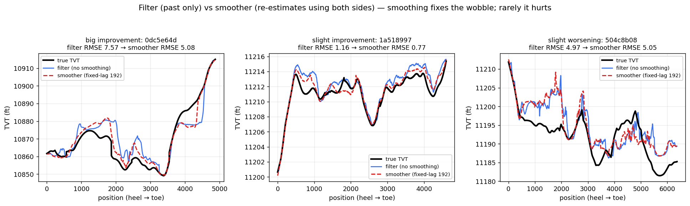
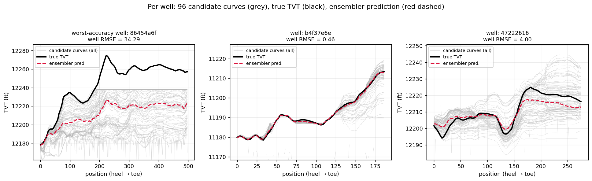
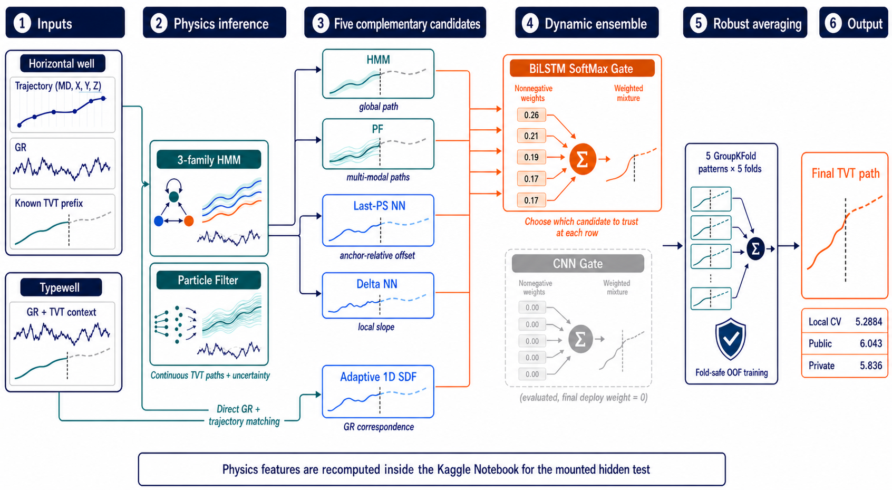
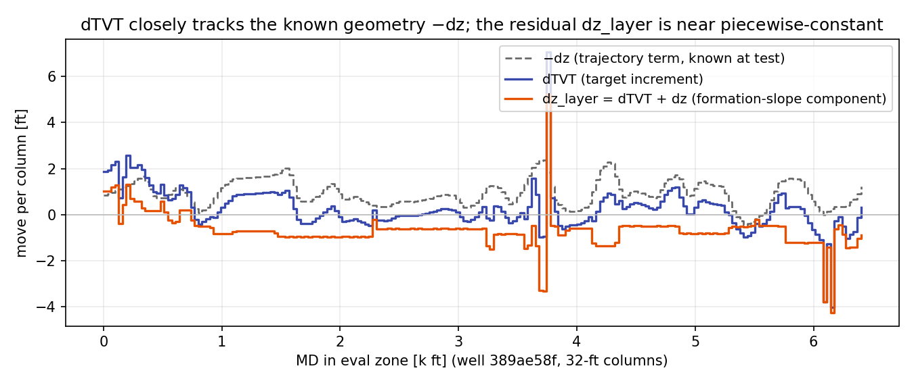
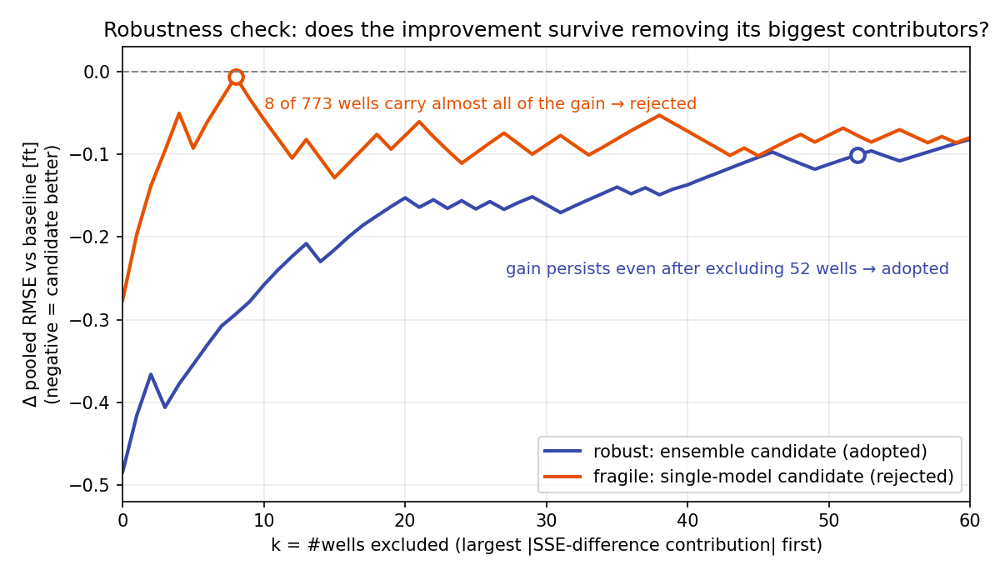
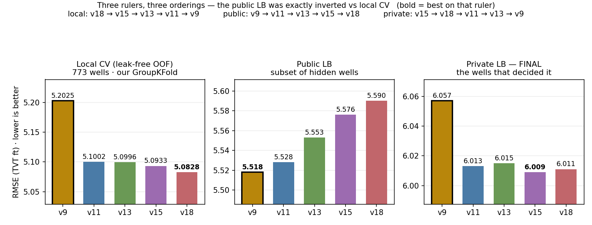

# ROGII - Wellbore Geology Prediction

> 主题：science ｜ 子类：— ｜ 领域：地球科学 ｜ 类别：Featured
> 截止：2026-08-05 ｜ 队伍数：6125 ｜ 机制：代码赛 ｜ 指标：MSE
> 数据来源：`intel/rogii-wellbore-geology-prediction/`（120 条主题索引 + 9 篇正文 = 1st/2nd/3rd/6th/7th/26th/36th + 工作笔记奖 + 问题图示；另有 4th/5th/8th/9th 等约 25 条 write-up 未收录）

## 1. 任务与数据

- **预测目标**：水平井钻井过程中，沿井身的伽马射线（GR）测井曲线与参考井（typewell）比对，预测钻头在岩层柱中的相对高度 **TVT**。
- **数据形态**：一维测井序列 + 地质参考曲线；本质是**序列对齐 / 状态估计**问题，而非普通回归。
- **构造陷阱**：
  - 排行榜在私榜发生大洗牌（6th 自述"公开第 20、私榜第 6"），说明公开榜可被过拟合。
  - 少数"主导井"会对验证分数产生过大影响，验证集设计必须对井的抽样稳健（2nd）。
  - 公开代码/数据包与本地划分不一致会引入**数据泄漏式作弊**（7th 明确记录 agent 犯过这个错）。

## 2. 验证方案

| 方案 | 使用者 | 说明 |
| --- | --- | --- |
| 井级分组 CV + **LCO（留最大贡献井）检验** | 2nd | 把"改进是否押注少数井"形式化为剔除曲线：橙线 −0.28 剔 8 井即消失（拒），蓝线剔 52 井仍在（收） |
| 5 split × 5 fold + 全链路 fold-safe | 3rd | 5 种井分配（ARI≈0）各 5 折 = 25 ckpt/族；基线/门控同折；私榜 −0.067 |
| fold 方差最小化（重抽 split std≈0.015） | 6th | "消除下风比提高均值同样重要"；早期 fold 6–10 波动 → 终版 4–6.7 |
| 五折 CV 对照公开/私榜 | 36th | CV 5.7 / public 6.3 / private 6.9，量级一致 |
| 物理模型 + 神经网络双轨对照 | 3rd、6th | 以物理基线（粒子滤波）为参照判断神经网络收益是否真实 |

## 3. 模型家族

| 方案 | 名次 | 关键点 |
| --- | --- | --- |
| 2D 对齐 + 交叉熵损失（网格化 TVT） | 1st（Ruby） | 井×TVT 网格（345×400）+ ConvNeXt U-Net；集成 CV 4.627 / 私榜 5.639；代码主要由 Codex/GPT-5.5/5.6 编写 |
| AnchorCNN：预测条件转移分布 P(dTVT｜TVT) + DP 精确解码 | 2nd（Bilzard） | **物理恒等式 dTVT=dz_layer−dz**；每 epoch 混 2,048 条层饼合成井；私榜 5.802 |
| 五候选（3 族 HMM/PF/2 NN/1D SDF）+ SoftMax 门控 | 3rd（tereka） | 门控权重近均匀（0.26/0.21/0.19/0.17/0.17）；私榜 5.836；参考 GR 质量 > 模型复杂度 |
| 粒子滤波群（91 条候选）+ 逐行注意力 bagging | 6th（k256.dev） | GPU 化 PF ~200×；**无 GR 物理先验让 CV≈公开≈私榜**；公开 20 → 私榜 6（5.984） |
| HMM + UNet 精修器（人造错误预训练） | 7th（Gaopeng Ren） | 精修器自井 3.20 vs 留出 9.34 的信任校准病理；**三把尺子排序完全反转**；9 小时墙工程存活 |
| 堆叠 UNet：把每口井当作图像（256 深度桶 × MD 列） | 26th（Tucker Arrants） | EffNetV2 L/XL/L2（~1B）；合成预训练"比真实更难"；自回喂 k=3；**退役空间先验=生涯最佳单体（CV 5.027）** |
| 全自动 agent 实验（codex --yolo 两周，2×L4） | 36th（Chris Deotte） | 粗到细：父路径→18 层证据图→2D ResNet→persistent-datum HMM→真实 GR 位移；CV 5.706 |

## 4. 关键技巧

- **物理模型与神经网络的混合**是本题主流：粒子滤波/HMM 提供物理可行的轨迹先验，神经网络做误差互补与融合。
- **问题重构**：1st 把它当作 2D 对齐任务用交叉熵训练；2nd 建模条件转移分布并用动态规划解码；26th 把井转为图像做分割式预测。
- **物理恒等式**（2nd）：`dTVT = dz_layer − dz`，dz 测试时已知——网络只需估近分段常数的结构斜率，是全场最强的问题降维。
- **候选多样性是晚期唯一增量**：残差自相关≈1.0；与现有候选 0.99 相关的新候选无价值；"错误方向不同"（self/neighbor GR、无先验 PF、MD 抽取）才有效。
- **合成数据预训练**：用物理一致的合成井扩充训练（2nd、26th）。
- **合成数据三态**：层饼函数式生成（2nd）；"比真实更难的地质 + 更干净的信号"课程（26th）；失败案例（6th 生成质量差）。1st 认为联合训练优于两阶段。
- **输出解码**：预测分布而非点值，再用期望值/DP 得到路径（2nd、26th）。
- **验证纪律**：LCO 剔除曲线（2nd）、fold 方差最小化（6th）、5×5 split（3rd）；**小公开榜排序不可信，只看其常数偏移**（7th 实证）。
- **精修器信任校准**：第二遍模型的训练输入必须包含真实形态的错误（7th 用 6,000 条"人造错误井"预训练）。
- **AI agent 工程化**：1st、2nd、7th、36th 都明确由编码 agent 承担主要实现工作；7th 总结的教训是"要反复审计 agent 是否引入了数据泄漏"。

## 5. 深读结论（2026-10 补）

- **本质是多模态状态估计**：GR 是 TVT 的多峰函数（重复地层）；逐行回归必坍缩到"不存在的平均路径"。前排方案全员使用概率图/条件分布/候选曲线/HMM 输出——这是本题最重要的框架性结论。
- **物理先验是转移性保险**：6th 证明纯 GR 匹配"公开比 CV 好 0.8 → 私榜崩"，注入无 GR 物理先验后 CV≈公开≈私榜；1st 的 XY 邻井特征 CV +0.3、公开变差，最终私榜证明 CV 正确。
- **最强单体不是最大模型**：26th 的空间先验 UNet 单体 CV 5.027（全场最佳）被退役，截图显示该系私榜 6.110 优于最终 6.60——"不敢信 CV"的代价约 0.5 RMSE。
- **尺子问题**：7th 的 5 个版本在本地 CV / 公开 / 私榜上排序完全反转（公开恰为 CV 的镜像）；私榜最终站 CV 一侧。小公开榜（约 52 井）排序 ≈ 噪声。
- **工程决定存活**：7th 的"更花哨版本"全部撞 9 小时墙得零分，只有 numba（25→12s）+1-flip+流水线加固的 v9 成功提交（~50–65 s/井）。

## 6. 图表证据

**图 1：滤波 vs 平滑（6th）**（topic 733226）——`../../intel/rogii-wellbore-geology-prediction/bodies/733226_img/02.png`

*读图*：0dc5e64d 7.57→5.08；1a518997 1.16→0.77；504c8b08 4.97→5.05（少数变差）。双侧 GR 上下文"修正早期过冲"是平滑器收益的主要来源。

**图 2：多模态墙——96 条候选 vs 真值（6th）**（topic 733226）——`../../intel/rogii-wellbore-geology-prediction/bodies/733226_img/07.png`

*读图*：最差井真值在所有候选之上（RMSE 34.29，全押错分支）；候选包住真值时软平均很准（0.46 / 4.00）。天花板 = 候选多样性覆盖真值。

**图 3：3rd 五候选 + 门控全景**（topic 733319）——`../../intel/rogii-wellbore-geology-prediction/bodies/733319_img/01.png`

*读图*：BiLSTM 门控权重近均匀（≈0.26/0.21/0.19/0.17/0.17）；CNN 门控部署权重全 0；5×5 交叉验证；终值 CV 5.2884 / 公开 6.043 / 私榜 5.836。

**图 4：物理恒等式（2nd）**（topic 733432）——`../../intel/rogii-wellbore-geology-prediction/bodies/733432_img/01.png`

*读图*：dTVT 与 −dz 平行；残差 dz_layer 呈近分段常数台阶（跳变约 10% 列）——"只估结构斜率"的依据。

**图 5：LCO 稳健选模（2nd）**（topic 733432）——`../../intel/rogii-wellbore-geology-prediction/bodies/733432_img/07.png`

*读图*：−0.28 的表面改进剔 8/773 井即消失（拒）；稳健改进剔 52 井仍在（收）。

**图 6：三把尺子反转（7th）**（topic 733154）——`../../intel/rogii-wellbore-geology-prediction/bodies/733154_img/03.png`

*读图*：本地 CV 排序 v18→…→v9，公开完全镜像（v9 最好 5.518），私榜回归 CV 一侧（v9 最差 6.057，但名次不变）。**小公开榜排序是噪声。**

## 7. 可迁移性评估

- **可直接迁移**：
  - **序列对齐类问题**（把回归重构为对齐/状态估计）是通用范式，适用于任何"沿轨迹的隐状态推断"任务。
  - 物理模型 + 神经网络混合：物理模型负责可行域，神经网络负责残差，是科学计算类比赛的标准打法。
  - 合成数据预训练 + 分布输出 + 期望/DP 解码。
  - 验证集要**对少量主导样本稳健**，否则会被个别井带偏。
- **需要前提**：
  - 粒子滤波/ HMM 需要可写出的状态转移与观测模型（本题有明确物理意义）。
  - 长程 agent 自动实验需要 GPU 与工具链支持（36th 用 2×L4 两周）。
- **不建议照搬**：
  - 直接引用公开 bundle 数据（可能造成划分泄漏）。
  - 盲目信任 agent 生成的实验结论，需要人工审计数据划分。

## 8. 对新手的关键启示

1. **先把问题重构对**（回归 → 对齐/状态估计），收益远大于调模型。
2. **有物理模型就用**：它是低成本强基线，也是神经网络的互补项。
3. **验证集要防"个别样本主导"**——尤其在样本数少、样本异质性强的任务里。
4. **AI 编码 agent 已成一线战力**，但必须审计它是否偷偷用了泄漏数据；本场多支队伍踩过这个坑。

## 9. 出处

- 讨论区索引：`intel/rogii-wellbore-geology-prediction/topics.md`（120 条）
- 已收录正文（9 篇 = 7 篇名次 write-up + 工作笔记奖 + 问题图示）：
  - 1st（Ruby，184 票）：https://www.kaggle.com/competitions/rogii-wellbore-geology-prediction/discussion/733220
  - 2nd（Bilzard，44 票）：https://www.kaggle.com/competitions/rogii-wellbore-geology-prediction/discussion/733432
  - 3rd（tereka，40 票）：https://www.kaggle.com/competitions/rogii-wellbore-geology-prediction/discussion/733319
  - 6th（k256.dev，60 票）：https://www.kaggle.com/competitions/rogii-wellbore-geology-prediction/discussion/733226
  - 7th（Gaopeng Ren，40 票）：https://www.kaggle.com/competitions/rogii-wellbore-geology-prediction/discussion/733154
  - 26th（Tucker Arrants，74 票）：https://www.kaggle.com/competitions/rogii-wellbore-geology-prediction/discussion/733136
  - 36th（Chris Deotte，53 票）：https://www.kaggle.com/competitions/rogii-wellbore-geology-prediction/discussion/733181
  - 工作笔记奖（Igor Kuvaev，48 票）：https://www.kaggle.com/competitions/rogii-wellbore-geology-prediction/discussion/727171
  - 问题图示（Zacchaeus，177 票）：https://www.kaggle.com/competitions/rogii-wellbore-geology-prediction/discussion/697418
- 未收录缺口（登记备查）：733480（4th）、733522（5th）、733281（8th）、733150（9th）、733315（10th）、733182（34th）、733307（48→407 复盘）等
- 深读全文：`analysis/deep/rogii-wellbore-geology-prediction.md`
