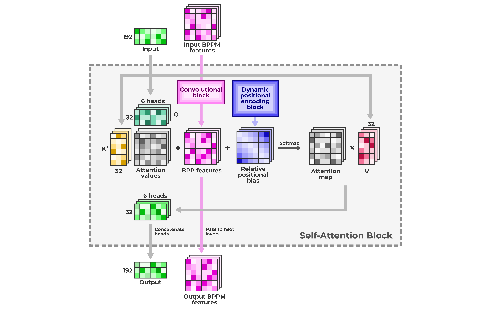
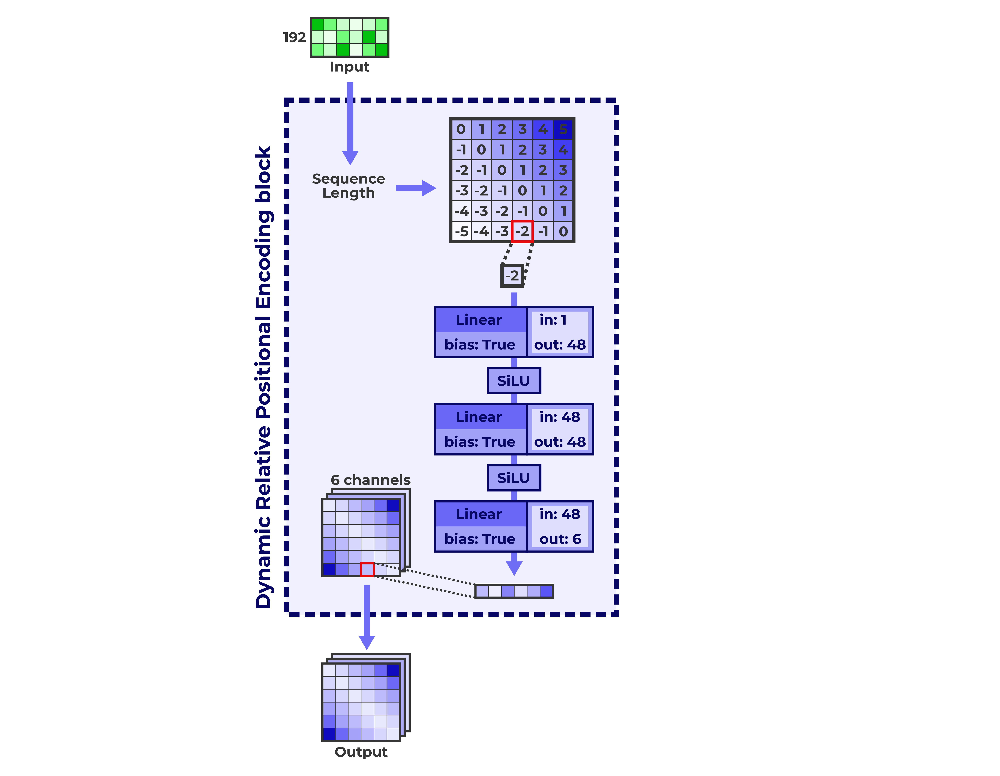
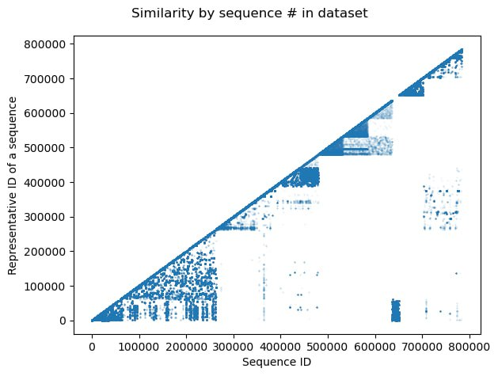
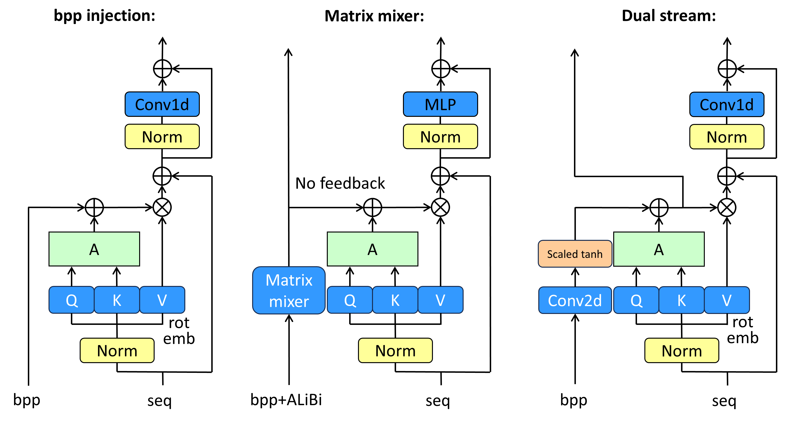
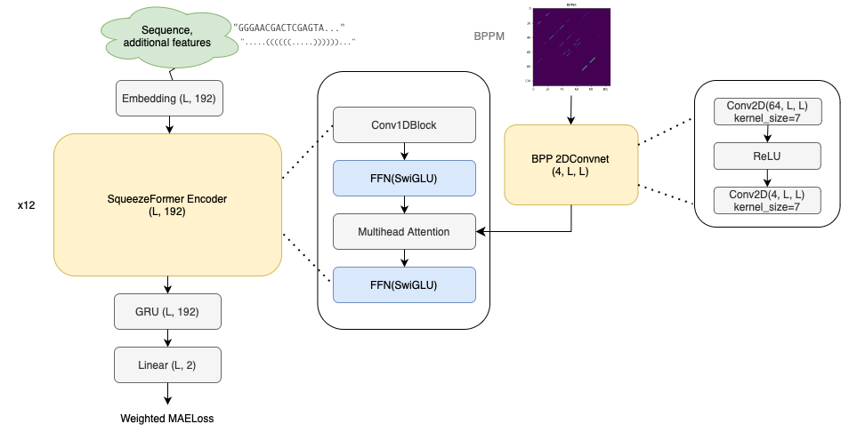
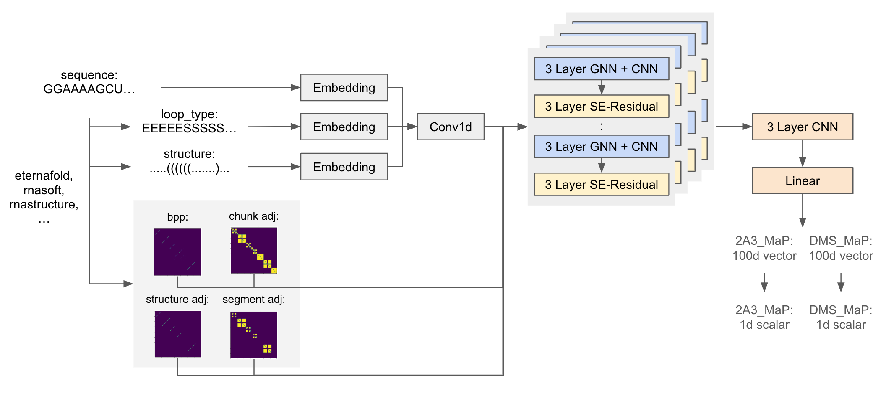

# Stanford Ribonanza - RNA Folding

> 主题：science（RNA 化学位移/折叠）｜ 子类：— ｜ 领域：结构生物学 ｜ 类别：Research
> 截止：2023-12-07 ｜ 队伍数：755 ｜ 机制：标准赛 ｜ 指标：MAE（逐核苷酸反应性 DMS_MaP / 2A3_MaP，越低越好）
> 数据来源：`intel/stanford-ribonanza-rna-folding/`（80 条主题索引 + 6 篇 write-up 正文；深读升级 2026-10-03，Tier A #39）

## 1. 任务与数据

- 预测目标：由 RNA 序列预测每个碱基的化学位移反应性（DMS_MaP / 2A3_MaP 两通道，逐位点回归）。
- 数据形态：序列 + 逐位点实验测量；**测试序列比训练长**（私榜长度分布不同）；公开测试约 13% 序列与训练完全重复。
- 构造陷阱：
  - 长序列外推：绝对位置编码失效，必须用可外推的位置表示；
  - 训练序列高度冗余（RNA 家族）→ 随机 KFold 近邻泄漏、分数虚高；
  - 实验信噪比差异大（SN_filter）→ 硬过滤丢数据，应加权/掩码；
  - 公开测试重复序列 = 可记忆红利（1st 主动清零）。

## 2. 验证方案

| 方案 | 使用者 | 说明 |
| --- | --- | --- |
| 聚类相似性切分（诊断） | 1st / 7th | 1st：汉明距离 DBSCAN（阈值 0.2）→ 结论"绝对分数降、相对排序不变"→ 最终仍用简单 KFold；7th：排除与测试重叠样本（val ~20k） |
| 聚类 GroupKFold（训练用） | 8th | 编辑距离聚类；seqlen=206 样本全放 fold0 以持续评测长序列 |
| 简单 5 折 | 2nd / 4th | 2nd：CV 0.119；4th：exp064–072 对照表 |
| 长度切分测试 | 1st | 短序列训练、206 长度验证（行为噪声更大但相关） |
| 公开重复清零 | 1st | 13% 重复序列预测清零后仍夺冠（诚信与分数兼容） |

## 3. 方案谱系

| 方案 | 名次 | 关键点与数字 |
| --- | --- | --- |
| 12 层 Transformer + BPP 6 头注入 + Dynamic Positional Bias | 1st（147 票） | 6 头×32 维；SE/plain 两种 Conv 块；SN 权重采样 `0.5*clamp_min(log(sn+1.01),0.01)`；270 epoch/1791 batch；27 模型集成（15 SE+10 plain+2 length-split）+ dms→2a3 模型（27/28+1/28）；13% 重复清零 |
| Squeezeformer + BPP 2DConvNet Attention Bias | 2nd（42 票） | dim192/4 头/kernel17/12 层 + GRU head；BPP 直加偏置 −0.0025、2DConv −0.002；ALiBi；加权 MAE `log1p(sn).clip(0,10)`；单模型 CV 0.119、30h/4090 |
| 三系：改进 RNAdegformer / 1D Conv+Residual BPP Attn / Transformer BPP bias | 4th（29 票） | tattaka+monnu；两阶段训练（SN 0.5 300ep → 1.0 15ep）；伪标签带误差预测阈值；CV 0.1198–0.1219 |
| 三种 BPP 注入（injection/matrix mixer/dual stream） | 7th（44 票） | masked Conv1D 替代 MLP；flip+BPP 重算 +10–15bps；MLM +10bps；SN 掩码 +10bps；最终 ~20 模型 0.13604/0.14189 |
| CNN+GNN（LegNet 风格 100d bin 头） | 8th（27 票） | chunk/segment 邻接特征；聚类 GroupKFold；MAE+MSE SNR 加权；单模型 0.14012/0.14299 → +PL 0.13739/0.14186；blend 0.13626/0.14263 |
| 早期基线 | 讨论帖（66 票） | LB 0.14895 / CV 0.12516；警告私榜长度分布 + 序列相似性 shakeup |

## 4. 关键技巧

- **BPP 结构先验四种注入**：注意力 logits 直加（1st/2nd/4th）、2D Conv 学注意力偏置（2nd）、dual stream 注意力提升（7th，scaled tanh 回注）、图邻接 GNN（8th）。**先验数量的增加无增益**（异源 BPP 均无显著改善）。
- **先验要参与可学习回路**：7th 的独立 matrix mixer（无反馈）弱于 dual stream（注意力状态回注）。
- **长度外推 = 学距离函数**：Dynamic Positional Bias（距离→MLP→每头偏置，1st 最佳）；ALiBi（2nd/4th）；rotary（7th）；绝对 PE 禁用。
- **SN 三选一**：采样权重（1st）、损失权重（2nd/7th/8th）、掩码（7th/8th）——均优于硬过滤（7th：掩码 vs 过滤 +10bps）。
- **相似性 CV 的分离原则**：严格聚类切分用于**诊断**（绝对分数下降、相对排序不变），简单 KFold 用于最终训练（1st）或直接用 GroupKFold（8th）。
- **伪标签分层评估**：单模型增益常见（7th/8th/4th），集成增益流程依赖（1st 无增益、7th 有）。
- **训练技巧**：masked Conv1D 替代 MLP（7th）；flip 增强时**按翻转后顺序重算 BPP**（+10–15bps）；MLM 预训练（+10bps）；one-cycle + SGD 二次微调（1st）；两阶段 SN 阈值（4th）。

## 5. 可迁移性评估

- 可直接迁移：结构先验注入注意力/图的四种方案；长度外推的位置编码选择；质量加权三选一；相似性感知 CV 的"水平 vs 排序"分析；泄漏重复样本的主动放弃。
- 需要前提：可计算的结构先验（BPP）；序列有家族冗余的领域知识；长序列推理能力。
- 不建议照搬：绝对位置编码；堆叠异源先验；硬过滤低质量样本；用随机 KFold 的绝对分数做模型选择。

## 6. 对新手的关键启示

1. 序列任务先找"领域结构先验"（RNA=BPP，蛋白=接触图/模板），并把它**注入可学习回路**而不是当静态特征拼接。
2. 测试比训练长时，位置表示必须写成"距离的函数"；否则外推必崩。
3. 实验数据有质量标签（SN）时，用加权/掩码而不是删除；保留上下文、削弱监督。
4. 数据内部有家族冗余时，先做聚类诊断再决定 CV；"分数水平"与"模型排序"要分开看。
5. 遇到公开测试泄漏（重复样本），主动清零是可信度优先的合理选择（本场冠军验证可行）。

## 7. 深读结论（2026-10 补）

**一句话**：这是一场"结构先验 + 外推工程 + 验证纪律"的序列回归赛。

**跨方案裁决**：

- BPP 是硬共识；收益来自注入方式（可学习回路）而非来源数量。
- 长度外推必须用距离函数型位置表示（Dynamic Bias/ALiBi/rotary），绝对 PE 不可用。
- SN 用加权/掩码，硬过滤被淘汰。
- 相似性 CV："诊断用严格切分、训练可用简单切分"（1st 的实证前提是相对排序不变）；8th 直接用聚类 GroupKFold。
- 伪标签：单模型收益常见，集成收益流程依赖（1st vs 7th）。
- 13% 公开重复：1st 清零仍夺冠——诚信处理的正面案例。

**数字账精选**：BPP 偏置 −0.0025、2DConv −0.002；flip+BPP 重算 +10–15bps；MLM +10bps；SN 掩码 +10bps；7th 最终 0.13604/0.14189；8th 单模型 0.14012/0.14299→+PL 0.14186；2nd 单模型 30h/4090；13% 重复。

**失败学**：额外 BPP 来源、capR、3D 数据、绝对 PE、xPos 长序列、滑动窗口、位置级误差掩码、SN 加权损失（1st）、30M 序列 MLM、EMA/AWP、2D U-shape（7th）、大模型 dim>512、SSL、多数增强（2nd）、全卷积 LegNet、UNet 层级（1st/4th）、EX 数据私榜无增益。

**悬案**：3rd（460403 Twin Tower）未收录；长序列泛化检测帖（444653）未收录；私榜长度分布差异未量化；13% 重复无官方确认；0.141 天花板成因未收录。

## 8. 图表证据

> 路径相对本文件（`notes/science/`）：`../../intel/stanford-ribonanza-rna-folding/bodies/<topic>_img/NN.ext`

**图 1：1st 的注意力块（topic 460121）**

- Q(6 头×32)×K^T → 注意力值 + BPP Conv 输出（6 头×32）+ 动态位置偏置 → softmax → ×V；
- BPP 特征跨层传递；**结构先验进注意力 logits** 的最清晰实现。

**图 2：动态位置编码（topic 460121）**

- 由序列长度生成相对距离矩阵 → 距离值经 MLP(1→48→48→6) → 6 通道每头偏置；
- 学"距离→偏置"函数而非位置查表，**可外推到更长序列**。

**图 3：训练集序列聚类（topic 460121）**

- 对角带 + 离对角块 = 成片近重复序列（RNA 家族）；
- 随机 KFold 近邻泄漏的直接证据，也是"聚类诊断 CV"的依据。

**图 4：BPP 注入三方案（topic 460190）**

- injection：bpp→Conv1d→加注意力值；matrix mixer：bpp+ALiBi→独立混合（No feedback）；dual stream：bpp→Conv2d→scaled tanh 回注；
- 对比说明"先验要参与可学习回路"。

**图 5：2nd 的模型（topic 460316）**

- Squeezeformer 12 层 + GRU head；BPP 2DConv(64→4,k7) 输出在所有块共享并加注意力偏置；
- 消融：直加偏置 −0.0025、2DConv 再 −0.002。

**图 6：8th 的 CNN+GNN（topic 460222）**

- bpp/chunk/structure/segment 四类邻接各自独立 GNN+CNN+SE-Residual 块；
- 100d bin 头 → 加权求和；**不用注意力也能表达长程结构**。

## 9. 出处

- 讨论区索引：`intel/stanford-ribonanza-rna-folding/topics.md`（80 条）
- 已收录 write-up（6 篇）：
  - 1st（147 票）：https://www.kaggle.com/competitions/stanford-ribonanza-rna-folding/discussion/460121
  - best single model（66 票）：https://www.kaggle.com/competitions/stanford-ribonanza-rna-folding/discussion/440702
  - 7th（44 票）：https://www.kaggle.com/competitions/stanford-ribonanza-rna-folding/discussion/460190
  - 2nd（42 票）：https://www.kaggle.com/competitions/stanford-ribonanza-rna-folding/discussion/460316
  - 4th（29 票）：https://www.kaggle.com/competitions/stanford-ribonanza-rna-folding/discussion/460203
  - 8th（27 票）：https://www.kaggle.com/competitions/stanford-ribonanza-rna-folding/discussion/460222
- 深读全本：`analysis/deep/stanford-ribonanza-rna-folding.md`（11 组件 + 6 图证）
- 缺口登记：3rd(460403)、444653、460301、460285、451158、451853、454397、458478、460130 未收录正文
