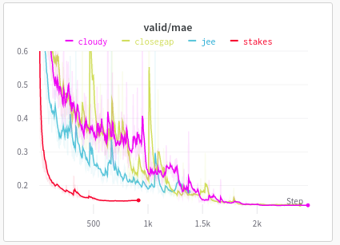
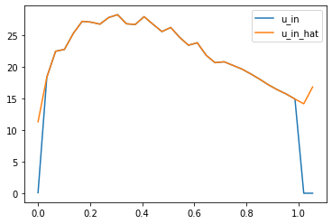
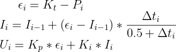
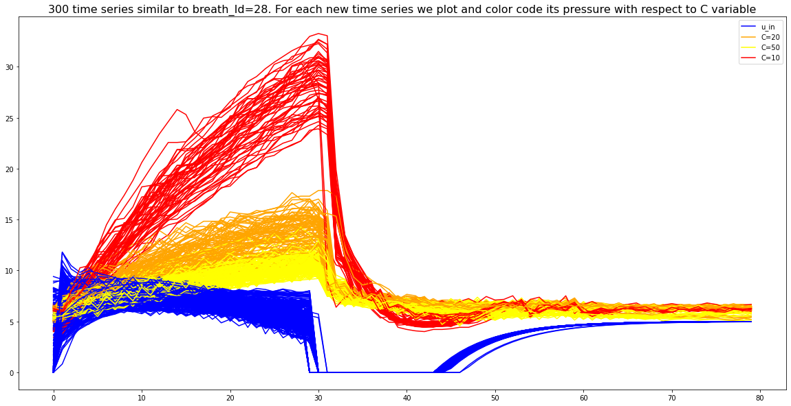
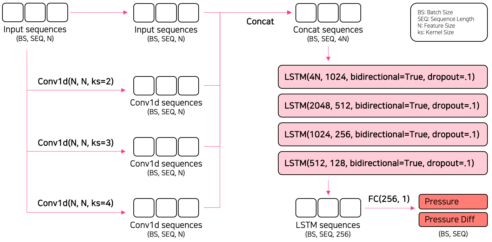
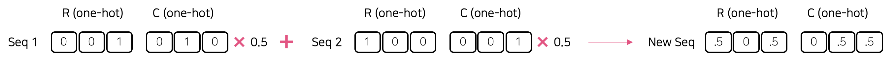
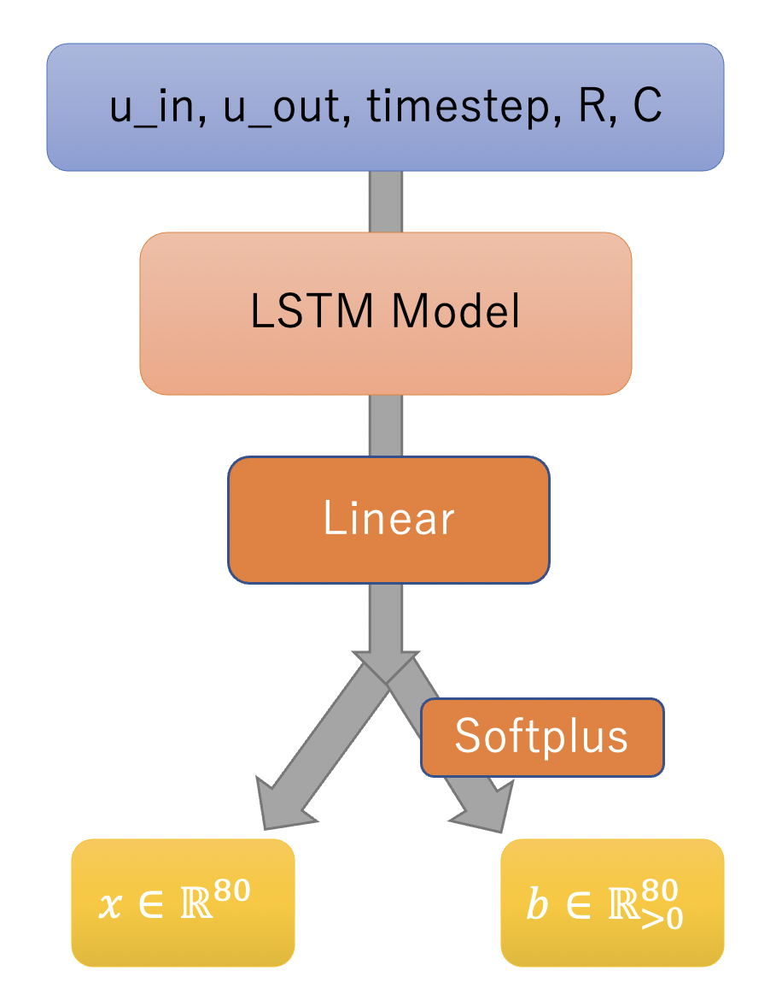
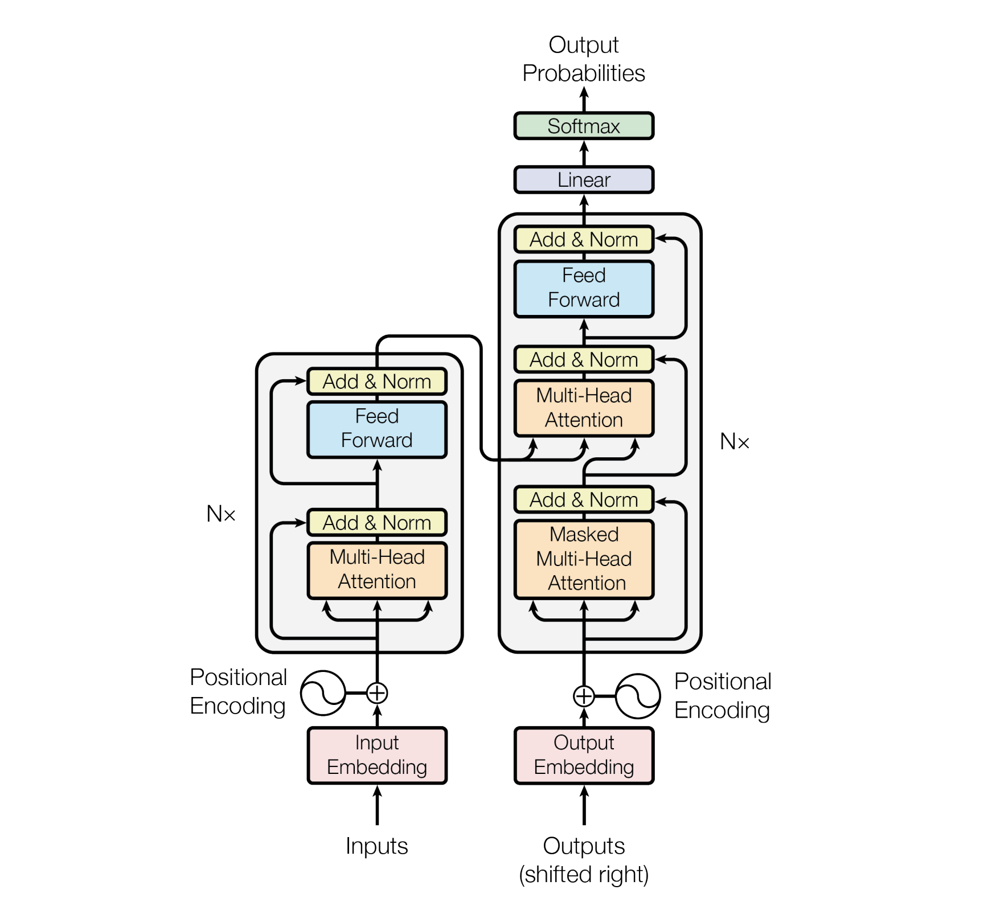

# Google Brain - Ventilator Pressure Prediction

> 主题：science（控制/时序）｜ 子类：— ｜ 领域：医疗 ｜ 类别：Research
> 截止：2021-11-03 ｜ 队伍数：2605 ｜ 机制：标准赛 ｜ 指标：MAE（逐时间步气压）
> 数据来源：`intel/ventilator-pressure-prediction/`（80 条主题索引 + 6 节正文：1st/2nd/3rd/9th + R/C 物理解释 + Transformer 单模；4th/5th/6th 等 12 条未收录）

## 1. 任务与数据

- 预测目标：给定呼吸机的**控制输入序列**（吸气/呼气、流量等），预测气道压力随时间的曲线（模拟环境）。
- 数据形态：多组时间序列（每次呼吸为一个样本）；**部分数据由确定性控制器生成**。
- 构造陷阱（本场最特殊）：**数据中有 2/3 可由物理/控制规则精确还原**——冠军明确说"一个匹配算法能完美预测 66% 的数据"，剩下 34% 才需要深度学习。
- **数据结构**：气压被量化成 **950 个离散值**（min −1.8957/max 64.8210/step 0.0703）；控制器参数有限网格（Kp/Ki 各 20、Kt 6、T=0.5）。
- **因果错觉**：`u_in` 是控制器对过去气压的反馈输出（分批实验）→ 未来滞后特征/双向 LSTM 有效（2nd 的定性模型）。

## 2. 方案谱系

| 方案 | 名次 | 关键点 |
| --- | --- | --- |
| LSTM 混合 + **PID 匹配 66%**（+三角噪声/反向 +5–6pp） | 1st | DL 混合 ≈0.1107（LSTM 0.1209/CNN-Transformer 0.1250）；匹配即 MAE=0；拉伸外推 1000× 加速 |
| **PI 反演 85%** + 7 模型集成 | 2nd | 测试侧逆 PID（T=0.5/q0）；20×20×6×950 搜索；9+ 小时本地推理 |
| Conv1d(k2/3/4)+4×BiLSTM 单模 + 三种增强 + 伪标签 | 3rd | 不用 PID；mixup 0.117→0.1004；median+round 0.0975；两轮 PL → 0.0942/0.0970 |
| 异方差 **Laplace 似然**（学习每时刻尺度 b） | 9th | +0.01；20 模型 0.1095 → 伪标签 0.1068 |
| encoder-only Transformer 单模 | Chris | CV 0.133 / LB 0.112；decoder/OOF 反而更差 |

## 3. 关键技巧

- **先识别确定性成分**：读论文 → 逆问题公式化（参数网格 + 离散气压校验）→ 匹配即 MAE=0。
- **离散化逆问题配方**：整数交点判定 + 2 点线性外推（O(950²)→O(950)）。
- **噪声可识别**：三角扰动段用"斜率相等"检测并解出（+5–6pp）。
- **分层验证**：StratifiedKFold(12) by type_rc。
- **序列增强三件套**：type masking、窗口 shuffling、**one-hot mixup**（类别必须 one-hot 才能混合）。
- **损失设计**：吸气/呼气双回归、pressure_diff 多任务、异方差 Laplace。
- **极长训练**：公共 notebook 早停 0.15 → 继续训练到 0.139。

## 4. 深读结论（2026-10 补）

- **这是一道"逆问题比赛"**：数据由 PID 控制器生成 + 气压量化（950 级）+ 参数有限网格 → 66%（1st）/85%（2nd）的数据可被规则**精确解出**；模型只补残差。
- **读论文值最后的关键半步**：3rd 漏读论文、纯模型也能到公开 0.0942，但仍被"解码派"压过；`u_in` 是反馈输出（因果错觉）解释了双向模型与未来特征的有效性。
- **非解码路线的核心是增强与损失**：one-hot mixup（0.117→0.1004）、diff 多任务（+0.013）、Laplace 异方差（+0.01）。
- **工程细节决定复刻成败**：PyTorch vs TF 初始化差异（遗忘门 bias=1）、本地 9 小时 CPU 反演、提交时限约束。
- **数字可复算**：(64.8210−(−1.8957))/0.0703≈949→950 级 ✓；20×6=120 参数组合 ✓。

## 5. 图表证据

**图 1：极长训练曲线**（1st，topic 285256）——`../../intel/ventilator-pressure-prediction/bodies/285256_img/01.png`

*读图*：红（原始 notebook）~1000 步早停 0.15；紫继续降到 ~0.14。

**图 2：逆 PI 的 u_in 重建**（1st）——`../../intel/ventilator-pressure-prediction/bodies/285256_img/02.png`

*读图*：真实（蓝）与反推（橙）u_in 完全重合（除积分初值未知的最初几点）——匹配即 MAE=0。

**图 3：PID 方程**（1st）——`../../intel/ventilator-pressure-prediction/bodies/285256_img/03.png`

*读图*：ε=Kt−P；I 的更新带 dt/(0.5+dt) 衰减；U=Kp·ε+Ki·I（T=0.5）。

**图 4：R/C 物理图（同 u_in、不同 C）**（Chris，topic 276599）——`../../intel/ventilator-pressure-prediction/bodies/276599_img/02.png`

*读图*：C=10/20/50（红/橙/黄）压力水平依次降低——C 是压力的主控量。

**图 5：3rd 架构**（topic 285330）——`../../intel/ventilator-pressure-prediction/bodies/285330_img/01.png`

*读图*：Conv1d(k2/3/4) 分支 + 4×BiLSTM + 双头（Pressure/Pressure Diff）。

**图 6：one-hot mixup**（3rd）——`../../intel/ventilator-pressure-prediction/bodies/285330_img/04.png`

*读图*：one-hot R/C 的 0.5/0.5 凸混合产生中间类型。

**图 7：异方差 Laplace 头**（9th，topic 285353）——`../../intel/ventilator-pressure-prediction/bodies/285353_img/01.png`

*读图*：Linear → x（均值）与 softplus→b（尺度）双输出。

**图 8：Transformer 结构**（Chris，topic 285277）——`../../intel/ventilator-pressure-prediction/bodies/285277_img/01.png`

*读图*：标准结构图；帖内结论为只用 encoder 层（CV 0.133/LB 0.112）。

## 6. 可迁移性评估

- **可直接迁移**：
  - **"确定性部分用规则、随机部分用模型"的分工**（与 ICR 的物理模型+NN、ARIEL 的贝叶斯+参数化同源）；
  - 分层验证；
  - 分布型损失（拉普拉斯/分位数）处理非正态误差。
- 需要前提：对数据生成机制的逆向理解。
- 不建议照搬：直接端到端学习全部数据（浪费了可解析的 2/3）。

## 7. 对新手的关键启示

1. **先问"数据里有多少是可解析的"**——本场 66% 的分数来自规则匹配。
2. 与前后的科学赛对照：**"物理/规则 + 模型"混合是科学类比赛的稳定范式**。

## 8. 出处

- 讨论区索引：`intel/ventilator-pressure-prediction/topics.md`（80 条）
- 已收录正文（6 节）：
  - Winner（326 票）：https://www.kaggle.com/competitions/ventilator-pressure-prediction/discussion/285256
  - R/C Explained（Chris Deotte，242 票）：https://www.kaggle.com/competitions/ventilator-pressure-prediction/discussion/276599
  - 3rd（Wonho Song/UPSTAGE，221 票）：https://www.kaggle.com/competitions/ventilator-pressure-prediction/discussion/285330
  - Transformer 单模（Chris Deotte，173 票）：https://www.kaggle.com/competitions/ventilator-pressure-prediction/discussion/285277
  - 2nd 逆 PID（166 票）：https://www.kaggle.com/competitions/ventilator-pressure-prediction/discussion/285283
  - 9th Laplace（ryomak，123 票）：https://www.kaggle.com/competitions/ventilator-pressure-prediction/discussion/285353
- 未收录缺口（登记备查）：285278（4th PID hacking）、285402（5th）、285282（6th）、285965（1st code）、285639（复盘）
- 深读全文：`analysis/deep/ventilator-pressure-prediction.md`
