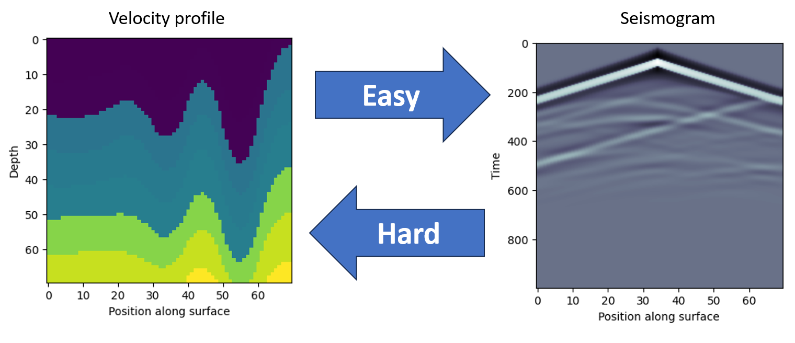
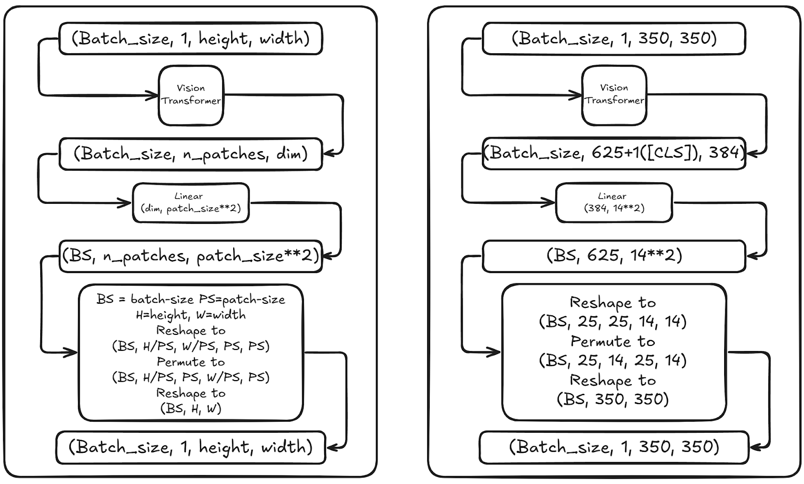
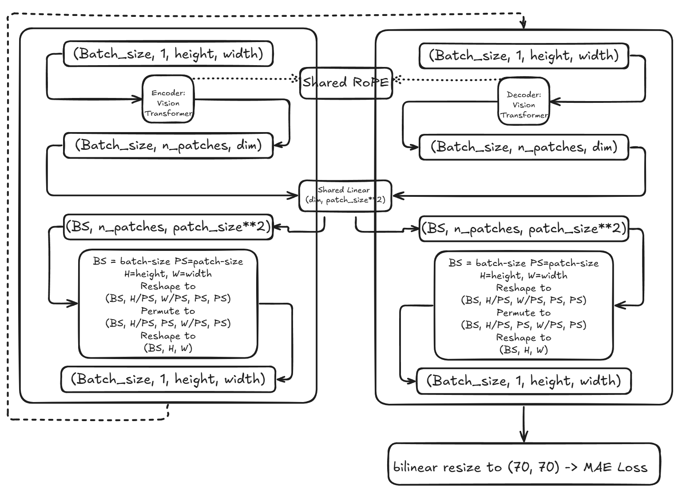
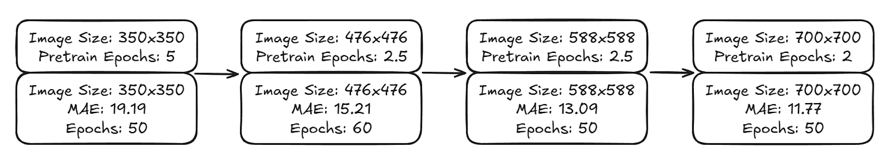
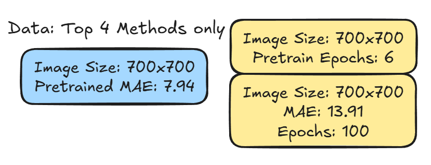
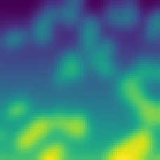

# Waveform Inversion（地震全波形反演）

> 主题：science（地球物理/逆问题）｜ 子类：— ｜ 领域：地震成像 ｜ 类别：Research
> 截止：2025-06-30 ｜ 队伍数：1365 ｜ 机制：标准赛 ｜ 指标：MAE（70×70 速度场，越低越好）
> 数据来源：`intel/waveform-inversion/`（80 条主题索引 + 6 篇 write-up 正文；深读升级 2026-10-03，Tier A #40）

## 1. 任务与数据

- 预测目标：由地震波形（5 源 × 1000 时步 × 70 接收器）反演 70×70 地下速度场（FWI）。
- 数据形态：合成数据（正演模拟生成）；三大家族——Vel（层状）/ Fault（断层）/ Style（随机纹理）× A/B 复杂度；每个 .npy 500 个配对样本；训练约 470k。
- 构造陷阱：
  - **输入与输出不空间对齐**：波形不是图像，UNet 跳连无意义 → 输入重排 + ViT 回归；
  - 多解/病态的反演问题 → 需要先验与物理约束；
  - 家族难度差 2 个数量级（StyleB ~44 vs FlatVel <0.1）→ 数据配比/专业化；
  - 大算力门槛（多卡 × 周级）→ 可复用训练协议与风险管理。

## 2. 验证方案

| 方案 | 使用者 | 说明 |
| --- | --- | --- |
| 440k/30k 固定划分 | 1st | 最终模型；配合分阶段分辨率训练 |
| 按文件 8 折 | 9th | 先只在最难 CurveFault_B 上训练与评测 |
| 20% 验证 | 3rd | 三阶段递减（10→1 epoch），最后阶段直接在全量/验证上 |
| 逐家族分数分析 | 2nd | FlatVel/StyleA/StyleB/其余分开评估与先验 |
| 20 文件小验证 → 脱钩 | 20th | CV 12 后与 LB 脱钩；提示高分段验证失效 |

## 3. 方案谱系

| 方案 | 名次 | 关键点与数字 |
| --- | --- | --- |
| 纯 ViT + 迭代伪标 + 10× 物理增强 | 1st（194 票） | 输入 (5,1000,70)→(1,350,350)：CV 46.9→**32.5**；EVA02→DINOv2 ViT+RoPE <26；10× 增强 4.7M 样本；Iterative Pseudo（每 epoch ~95k 预测→正演→回训）；Top4 专门模型 CV 7.5/LB 7.0；最终 **CV 7.28 / LB 6.9**；15 天 4×5090 |
| DL 先验 + 正则化 FWI 精修 | 2nd（49 票） | 28.8→**7.6**；分家族先验：FlatVel 1D TV <0.1、StyleA GP+SVD 3.4、StyleB 44.4、其余 2D TV 4.9；自定义 CUDA（前向 30ms/反向 70ms V100）；~$700 |
| ViT + 数据生成 + Muon | 3rd（60 票） | 13TB/5.5 天 4×A100；6 通道 hflip；blend α∈[0.3,0.7]×8；ViT 分段（1/3+pool+2/3）；**Muon 9.x→7.x**；三阶段 20/30/50 blend；赛后修正 7.96/7.99 |
| 在线增强 + 自定义 CUDA | 9th（59 票） | caformer+convnextv2；CUDA 批量正演 **100×** 支持实时增强；flat LR 0.0005；检查点中位；单提交金区 |
| CaFormer + 数据生成 + 自训练 | 20th（46 票） | 物理速度缩放 α∈[0.8,1.2]（时间轴 1/α）+ 测试 10 α 中位；in-batch 自训练回路；10 类 record 深监督；CV-LB 脱钩 |
| 领域数据讲解 | 社区（156 票） | 家族/文件/形状/物理链条的入门公共品 |

## 4. 关键技巧

- **输入重排**：多通道时间序列铺成 2D 网格（(5,1000,70)→(1,350,350)），让 ViT 的 2D 注意力可用；**非对齐任务不要 UNet 跳连**（1st：CV 46.9→32.5）。
- **正演在环三用法**：物理增强（速度模型变换 → 重算波形）、自训练回路（预测→正演→回训，1st/20th）、显式 FWI 精修（2nd：DL 初值 → 先验 → BFGS/GN）。
- **物理等变增强**：速度×α ⇔ 时间轴×1/α（20th）；同族/跨族速度 blending（3rd）。
- **分家族专业化**：Top4 子集专训（1st）、逐家族先验（2nd）、先训最难家族（9th）、困难类加权+深监督（20th）。
- **加速仿真**：自定义 CUDA 批量波动传播（9th 100×；2nd 前向 30ms）；torch.compile + 5090（1st 10→5000 img/min）。
- **可复用训练协议**：flat LR（随时续训）、检查点中位、分阶段分辨率（350→700）、阶段 epoch 递减（10→1→1）。
- **病态逆问题三段式**：DL 初值 + 先验约束（TV/GP+SVD 截断）+ 二阶优化（BFGS/GN）；正演 min(v) 不可导 → 解耦为独立自由度。
- **优化器**：MuonWithAuxAdam 在 ViT Linear 权重上 9.x→7.x（3rd，单队大增益，值得对照）。

## 5. 可迁移性评估

- 可直接迁移：非对齐输入表示；仿真器在环三用法；物理等变增强；分家族专业化；病态反演三段式；可复用训练协议与风险管理。
- 需要前提：快速可批量（最好可微）的正演模拟器；多卡/大存储算力；对波动方程/反演的基本理解（数据帖已降低门槛）。
- 不建议照搬：UNet 跳连直觉、标准图像增强、无初值的纯 FWI、小算力硬冲头部。

## 6. 对新手的关键启示

1. 反演任务先问"输入与输出是否空间对齐"——不对齐就别用分割/UNet 的直觉。
2. 已知物理生成过程时，仿真器不是辅助工具，而是数据/自监督/先验的发动机；先把它做快。
3. 多家族数据的难度差就是梯度预算问题：专业化/加权，而不是平均。
4. 大病态问题 = 好初值 + 合适先验 + 收敛算法，三者缺一不可。
5. 长训练竞赛里，"能复用的协议"比"一次调参"更值钱。

## 7. 深读结论（2026-10 补）

**一句话**：这是一场"物理引擎在环 + 算力换 MAE"的反演竞赛——冠军用纯 ViT + 迭代伪标 + 物理增强打赢了显式 FWI 精修。

**跨方案裁决**：

- 输入表示是第一杠杆（46.9→32.5）；非对齐任务禁用跳连。
- 正演在环是硬共识（5/5）；仿真速度是隐形主变量（100× / 5000 img/min）。
- 分家族专业化是必需（难度差 2 个数量级）。
- 纯 DL（1st 6.9）vs FWI 精修（2nd 7.6）：本场 DL 胜，但 FWI 在简单家族近完美（FlatVel<0.1）；最优形态可能是"DL 初值 + 可微物理精修头"（未完成的未来方向）。
- 算力是门槛，也是风险管理的舞台（9th 单提交、检查点中位）。

**数字账精选**：CV 46.9→32.5；EVA02→ViT+RoPE <26；10× 增强 4.7M；Top4 CV 7.5/LB 7.0；最终 7.28/6.9；FWI 28.8→7.6；StyleB 44.4 vs FlatVel<0.1；Muon 9.x→7.x；CUDA 100×；$700/13TB。

**失败学**：UNet/UperNet/Mask2Former/ViT-Adapter、标准图像增强、SSL、diffusion 造速度模型（1st）；VAE 先验、预条件、StyleB 高频（2nd）；OpenFWI 末行不一致（3rd）；"每 2 像素预测"发现太晚（9th）；CV-LB 脱钩、MoE 路由（20th）。

**悬案**：4th/5th/6th 未收录；OpenFWI/数据合规争议（583217 等）未收录；可微物理精修头未验证；20th 的 CV-LB 脱钩原因未解释。

## 8. 图表证据

> 路径相对本文件（`notes/science/`）：`../../intel/waveform-inversion/bodies/<topic>_img/NN.png`

**图 1：任务示意（topic 587950）**

- 左：速度剖面（70×70）→ 正演（Easy）→ 右：地震记录（时间×接收器）；
- 反演方向标注 Hard——本场全部方法围绕"借用正演"。

**图 2：ViT + 像素重排（topic 587388）**

- (BS,1,H,W) → ViT → Linear(dim,patch²) → reshape/permute 回图像；
- 无跨层跳连——输入输出不对齐，像素重排即可回归。

**图 3：最终架构（topic 587388）**

- 编码 ViT → 共享 Linear → 像素重排 → 解码 ViT → 双线性 resize 70×70 → MAE；
- 两 ViT 共享 RoPE 与 Linear；"解码"不是 UNet 上采样。

**图 4：分阶段分辨率（topic 587388）**

- 350→476→588→700，每阶段"增强数据预训练 + 主训练"；
- MAE 19.19→15.21→13.09→11.77；50 epoch 时严重欠拟合。

**图 5：Top4 专业化（topic 587388）**

- 只用 CurveFault_B/CurveVel_B/Style_A/Style_B 训练（700×700）；
- 正文 CV 7.5、公/私 7.0/7.0，推理时替换这 4 类的预测——去掉一半数据反而涨分。

**图 6：StyleA 速度场（topic 587950）**

- 无层理的斑块/纹理结构；
- 2nd 用平方指数核 GP + SVD 截断（1073 模态）作先验——**家族形态决定先验选择**。

## 9. 出处

- 讨论区索引：`intel/waveform-inversion/topics.md`（80 条）
- 已收录 write-up（6 篇）：
  - 1st（194 票）：https://www.kaggle.com/competitions/waveform-inversion/discussion/587388
  - 数据讲解（156 票）：https://www.kaggle.com/competitions/waveform-inversion/discussion/572747
  - 3rd（60 票）：https://www.kaggle.com/competitions/waveform-inversion/discussion/587419
  - 9th（59 票）：https://www.kaggle.com/competitions/waveform-inversion/discussion/587498
  - 2nd（49 票）：https://www.kaggle.com/competitions/waveform-inversion/discussion/587950
  - 20th（46 票）：https://www.kaggle.com/competitions/waveform-inversion/discussion/587402
  - 20th（46 票）：https://www.kaggle.com/competitions/waveform-inversion/discussion/587402
- 深读全本：`analysis/deep/waveform-inversion.md`（11 组件 + 6 图证）
- 缺口登记：587500(4th)、587443(5th)、587460(6th)、572329、583896、582801、572434、583217、578305 未收录正文
