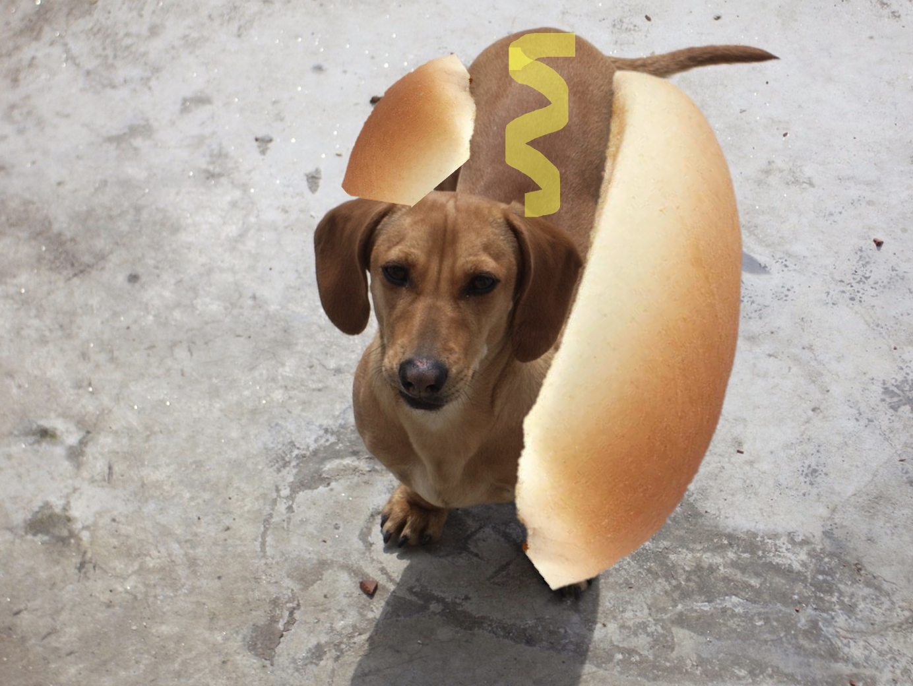
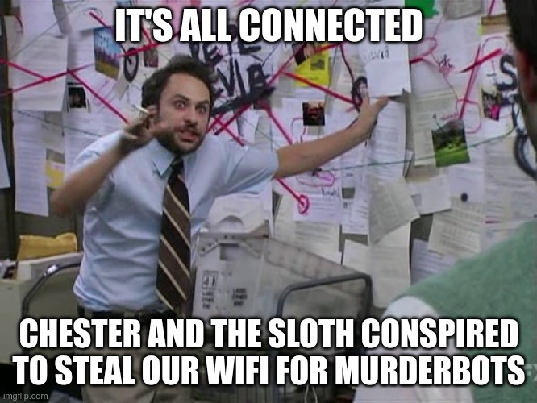

# AI Village Capture the Flag（DEF CON 30）

> 主题：sim-agent（ML 安全夺旗）｜ 子类：agent-game ｜ 领域：AI 安全 ｜ 类别：Research
> 截止：2022-09-12 ｜ 队伍数：668 ｜ 机制：标准赛 ｜ 指标：Nvidia Defcon（flag 加权分）
> 数据来源：`intel/ai-village-ctf/`（80 条主题索引 + 6 篇正文 + 2 张图；深读升级 2026-10，Tier A #59）；同系列 2023 届（DEF CON 31）另有归档

## 1. 任务与数据

- **形式**：AI/ML 主题夺旗赛（DEF CON 30 期间，2022-08-11 ~ 09-12），22 道针对机器学习系统的攻击/逆向题（hotdog、math、WAF、token、sloth、crop…），拿 flag 换分。
- **关键结构**：分数会**饱和**——最高分 **0.894（21/22）被 34 位选手同时达到**；名次由"谁先提交"决定，而不是解题质量。
- **节奏**：强沉浸马拉松（7th 一周没睡好；社区 48 小时梗图）；赛期禁止分享答案（取消评奖资格），赛后集中释放 writeup。
- **与 2023 届关系**：2022（668 队/22 题）→ 2023 DEF CON 31（1344 队/25 flags），同一系列、竞争拓扑延续。

## 2. 策略与方案

| 环节 | 常见做法 |
| --- | --- |
| 总体策略 | **暴力优先、腾出时间做下一题**（1st 明牌）；系统化工具链（Vasilis）；完整 notebook 复盘（Chris Deotte） |
| 黑箱 oracle 探测 | math 从 100 递增；WAF 固定 4 字符块逐位反推；inference 手写字符查表 + top-5 暴力；crop1 试探任意分辨率 |
| 对抗攻击 | 白盒用 ART 梯度攻击（theft/salt）；黑盒用代理模型集合+噪声（hotterdog）；弱检查器直接绕过（画图/压缩图/换视频轨/负值输入） |
| 数据/工件泄漏 | model.summary()（forensics）、LSTM 用户名→密码（leakage）、tokenizer 特殊词失同步（token）、embedding 路径（wifi） |
| 暴力搜索 | math 递增、baseball 正态网格、sloth 词典、murderbot 逻辑回归、crop1 Optuna/GA |
| 元层 | 反向 `genChallengeFlag()` 的固定字符集变位词（HOTDOGFORDAYSS/TURNED/IWasNotMurdebotted/D3FCON…）校验解法 |

## 3. 方案谱系

| 方案 | 名次（票数） | 关键点 |
| --- | --- | --- |
| 暴力优先策略 | 1st（24） | 逐题清单：贴热狗图、math 从 100 暴力、画 A+压缩规避篡改、LLE 找 wifi 路径、负 demerit、top-5 暴力 inference、LSTM 还原密码、Excel 找 token、换视频轨、逻辑回归挑人、代理模型+噪声破 hotterdog、3×3 平铺破 crop1、WAF 逐字符反推、词典破 sloth；Crop_2 ✗；proto-flag 元谜题表 |
| 21 解完整 notebook | 7th（33） | Chris Deotte；与 1st 同为 0.894；"一周后才睡好"；赛后公开全部解法 |
| 21 解方法摘要 | Vasilis（11） | DBSCAN/PCA（math）、ART（theft/salt）、FOM（deepfake）、Optuna+GA（crop1）、exploit 库（WAF）；Crop_2 失败；sloth 最大痛点 |
| 社区梗图与讨论 | 52/39 票 | HOTTERDOG"为什么这都不行"、48 小时阴谋论（Chester+sloth 偷 WiFi 喂 murderbots）；评论区藏真实方法论（证伪假设） |
| 分享规则 | 官方（13） | 赛期分享=取消资格；赛后欢迎分享（Chris/1st/Vasilis 均在赛后公开） |

## 4. 关键技巧

- **先判断排名结构**：分数饱和 → 按预期耗时排序题目、暴力优先、快速提交；不饱和 → 优化深度。
- **oracle 探测三模式**：增量暴力 / 边界二分（逐字符构造）/ 查表+小空间穷举。
- **攻击最弱环**：白盒梯度、黑盒代理迁移、弱管线直接绕过（篡改检测/分辨率/输入域）。
- **实现缝隙清单**：分辨率假设、特殊 token、负数极值、文件尾注释、`model.summary()`。
- **暴力经济学**：调用成本低的题一律暴力；调用昂贵的题先花少量调用学结构。
- **元层反向工程**：flag 生成器的固定字符集是可利用的提示层。
- **时间/心理管理**：长赛程的睡眠与题目排序；"下一题"是默认状态。

## 5. 深读结论（2026-10 补）

**一句话**：这是一场"oracle 探测 + 暴力搜索 + 对抗迁移 + 时间管理"的马拉松——正规方法的价值只在它比暴力更快时存在。

- 0.894（21/22）被 34 人达到：上限由 Crop_2 锁死，名次由速度决定；1st 与 7th 同分。
- 三队独立采用黑箱探测/暴力套路；检查器薄弱处用非 ML 手段直接击穿。
- 对抗迁移：白盒梯度最便宜；黑盒（hotterdog）需要代理模型+噪声，稳定性差。
- 元谜题（proto-flags）显示题目工厂本身可被逆向，是 CTF 的隐藏层。
- 分享文化：赛期禁令 + 赛后集中 writeup，是 CTF 与 Kaggle 生态的显著差异。

**数字账精选**：668 队/22 题；0.894×34 人；HOTTERDOG 有人 ~5 小时；math 从 100 暴力；bad-to-good 极值 −100；crop1 任意分辨率 3×3；系列 2022→2023 从 668 队到 1344 队。

**失败学**：Crop_2（1st/Vasilis 均败，模型反转/投毒失败）；Bad-to-Good 无好自动解；hotterdog 纯贴图/纯迁移失败；sloth 让多人"不想谈"；math_3 描述 bug。

**悬案**：Crop_2 解法；"Solve sloth with abs()"（351806）未收录；0.894 的逐题权重公式；22 题规格与代码未归档；组队/无奖牌的规则执行情况。

## 6. 图表证据

> 路径相对本文件（`notes/sim-agent/`）：`../../intel/ai-village-ctf/bodies/<topic>_img/NN.ext`

**图 1：HOTTERDOG 求助帖配图**（topic 344336，52 票）——狗夹进热狗面包+芥末酱的"更热狗"图，配"为什么这都不行 :)"; 评论区给出真实方法论（从简单实验开始、证伪假设）。

**图 2：Rob Mulla 的 48 小时梗图**（topic 344396，39 票）——"Chester 和 sloth 合谋偷走 WiFi 去喂 murderbots"，把四道题串成阴谋论；赛程强度与社区文化的证据。

## 7. 可迁移性评估

- **可直接迁移**：
  - 赛制排名结构判断（质量型 vs 速度型）决定投入策略；
  - 黑箱 oracle 探测（增量/边界二分/查表）与小空间暴力；
  - 安全判定的最弱环攻击（白盒梯度/黑盒迁移/管线绕过）；
  - 实现缝隙清单与元层逆向（flag 生成器/检查器代码）；
  - 长赛程时间与心理管理、赛期分享纪律。
- **需要前提**：可编程探测的评分接口；足够便宜的调用成本；题目允许提交（非纯离线）。
- **不建议照搬**：把 CTF 的"暴力优先"套到深度优化赛（如 HGBC 类）；依赖特定漏洞的解法（Crop1 分辨率）；在赛期分享答案。

## 8. 对新手的关键启示

1. **解题节奏管理**在限时解谜类比赛中比深度优化更重要——先易后难、快速迭代。
2. **评分接口是题目的一部分**：设计探测实验（花少量调用学结构）往往比想算法更快。
3. **攻击最弱环**：ML 安全检查的鲁棒性取决于整条管线；绕过检测常常比骗过模型便宜。
4. **AI 安全竞赛的双年脉络**（2022→2023）是了解 ML 攻击面的入门素材；赛后 writeup 集中释放，是最好的学习窗口。
5. **注意社区规则**：赛期分享答案会取消资格；CTF 传统（团队/Discord/梗图文化）与 Kaggle 规则需要区分。

## 9. 出处

- 讨论区索引：`intel/ai-village-ctf/topics.md`（80 条）
- 已收录正文（6 篇）：
  - HOTTERDOG 梗图（52 票）：https://www.kaggle.com/competitions/ai-village-ctf/discussion/344336
  - 48 小时梗图（39 票）：https://www.kaggle.com/competitions/ai-village-ctf/discussion/344396
  - 7th：21 solutions（33 票）：https://www.kaggle.com/competitions/ai-village-ctf/discussion/351800
  - 1st（24 票）：https://www.kaggle.com/competitions/ai-village-ctf/discussion/353536
  - 21 解法摘要（11 票）：https://www.kaggle.com/competitions/ai-village-ctf/discussion/351804
  - 分享禁令（13 票）：https://www.kaggle.com/competitions/ai-village-ctf/discussion/344845
- 深读全本：`analysis/deep/ai-village-ctf.md`（11 组件 + 机制推演 M1–M7 + 2 图证）
- 同系列对照：`digests/ai-village-capture-the-flag-defcon31.md`（2023，1344 队、25 flags）
- 缺口登记（未收录正文）：351806、351801、343582、347149、346451、343964、352068、343947、343654、352466
