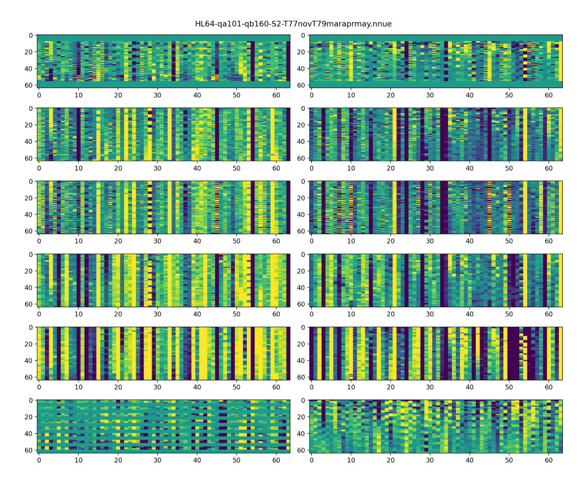
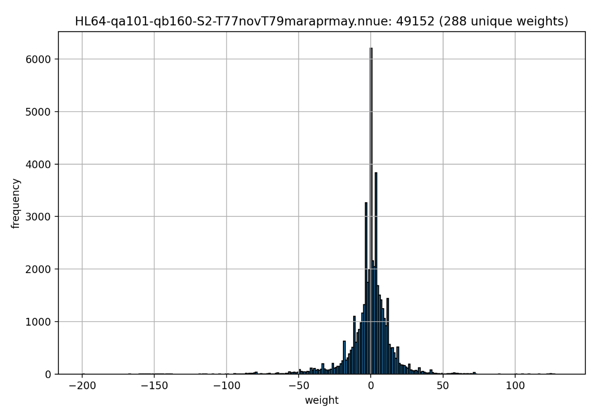

# FIDE & Google Efficient Chess AI Challenge

> 主题：sim-agent ｜ 子类：— ｜ 领域：棋类 AI / 模型压缩 ｜ 类别：Featured
> 截止：2025-XX-XX ｜ 队伍数：1000+ ｜ 机制：标准赛 ｜ 指标：对局 Elo（受二进制体积上限约束）
> 数据来源：`intel/fide-google-efficiency-chess-ai-challenge/`（80 条主题索引 + 6 篇 write-up 正文）

## 1. 任务与数据

- 任务形式：构建国际象棋引擎，**在极小的二进制体积上限（64KB 量级）内**尽可能强。
- 评价方式：平台配对对局产生 Elo；体积约束是核心变量（不是算力）。
- 构造陷阱：**模型大小 = 硬约束**，任何"堆参数"的路线不可行；必须做极致压缩。

## 2. 方案谱系

| 方案 | 名次 | 关键点 |
| --- | --- | --- |
| Cfish（Stockfish 衍生）+ **NNUE** + 数据 | 1st | 作者原以为手写评估（HCE）在 64KB 约束下更优，看到对手成绩后才转向 NNUE；**大部分时间投入 NNUE 研究**，引擎代码反而更基础 |
| Stockfish 16 + 小型神经网络（非 NNUE） | 4th | 在 HCE 上叠加小网络，Elo +30 |
| 其他 | 见讨论区 | 有官方汇总的 top solutions 仓库链接 |

## 3. 关键技巧

- **NNUE（高效可更新神经网络）**：为 CPU 增量更新设计的网络结构，是体积受限场景的关键技术。
- **小网络 + 传统评估的混合**：在 HCE 上加小网络即可显著提 Elo（+30）。
- **量化与裁剪**：把网络压进几十 KB 必须做权重压缩。
- **数据与训练策略**：NNUE 的收益依赖训练数据质量。

## 4. 可迁移性评估

- **可直接迁移**：
  - **体积/延迟受限场景下，"小网络 + 传统方法"的混合架构**；
  - NNUE 类增量更新网络的思想（适合棋类与实时决策）；
  - 量化/裁剪是部署端的一等约束。
- 需要前提：棋类引擎与搜索的知识（Stockfish 体系）。
- 不建议照搬：直接移植大型评估网络。

## 5. 对新手的关键启示

1. **约束（体积/延迟）会重新定义最优方案**——本场冠军一开始判断错了方向（以为 HCE 更优）。
2. **观察到对手做法的有效性后要及时转向**（别人的榜单表现是信息）。
3. 与 Santa 系列对照：都是"目标函数/约束明确"的优化型比赛，方法却完全不同。

## 7. 轻读结论（2026-10 补）

**一句话**：64 KiB 二进制 + 5 MiB 内存 + 单核的"嵌入式式"象棋引擎赛：**数据与压缩工程 > 搜索花活**——1st 把 NNUE 压到 ~20kb（lc0 T77/T79 数据、两阶段训练、piece-count 平坦化等过滤、16-bit 权重用 8-bit 码表映射）夺冠；4th 用 Stockfish 16 HCE + 2,489 参数 MLP 拿第 4；9th 纯 HCE + SPSA 也进前十。

- 1st（571023）：768 输入双视角 NNUE；两阶段训练（100 亿 Stockfish 局面 → 120 亿 lc0 局面）；压缩：QA=101/QB=160、按棋子分组后 8-bit 码表映射、权重转置、7z+运行时解压+zopfli；~20kb 网络强于 HCE；RAM 是渐变墙（用 896kb 哈希冒险）。
- 4th（563173）：HCE + 小 MLP（99→14→32→1，2,489 参数）；内存拆分（pawn hash 640KiB、cont hist 512KiB、TT 1MiB）；去 libstdc++；"加半个 NN 输出"+30 Elo；提交 HCE 与 NN 两份。
- 9th（567106）：Cfish HCE 压到 ~4MB、`-O3` + strip + upx --lzma；移植 Stockfish16 搜索参数 +30 Elo；自写 SPSA +30 Elo；两份相同提交对冲榜噪。
- Niboshi（563866）：CNN 特征变换器 NNUE，自述计算代价是最大失误。
- 社区：前 8 全部开源（562764）；Tiny Chess Bot（46 票）；ELO/时间规则争议；环境变更质疑（25 票）。

**裁决**：先复现社区引擎骨架；NNUE 上限最高但 HCE 路线可拿牌；数据过滤与压缩工程是硬门槛；约束型赛要为环境变化留安全边际。

**悬案**：2nd/3rd/5th–8th 细节未收录；ELO 争议处理未跟进。

## 8. 图表证据

**图 1**（topic 571023）：按棋子类型/视角分组的权重与国王镜像零条纹。

**图 2**（topic 571023）：49,152 个权重仅 288 个唯一值 → 8-bit 码表映射。

## 9. 出处

- 讨论区索引：`intel/fide-google-efficiency-chess-ai-challenge/topics.md`（80 条）
- 已收录 write-up（6 篇）：
  - 1st（22 票）：https://www.kaggle.com/competitions/fide-google-efficiency-chess-ai-challenge/discussion/571023
  - 4th（39 票）：https://www.kaggle.com/competitions/fide-google-efficiency-chess-ai-challenge/discussion/563173
  - top solutions 汇总（24 票）：https://www.kaggle.com/competitions/fide-google-efficiency-chess-ai-challenge/discussion/562764
  - 9th（18 票）：https://www.kaggle.com/competitions/fide-google-efficiency-chess-ai-challenge/discussion/567106
  - Niboshi（21 票）：https://www.kaggle.com/competitions/fide-google-efficiency-chess-ai-challenge/discussion/563866
  - Tiny Chess Bot（46 票）：https://www.kaggle.com/competitions/fide-google-efficiency-chess-ai-challenge/discussion/548062
