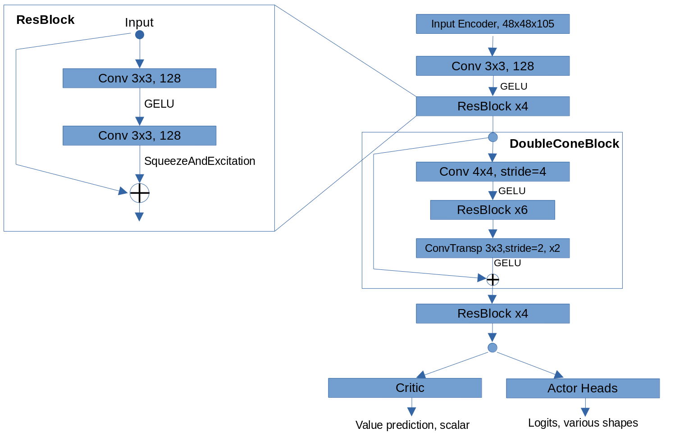
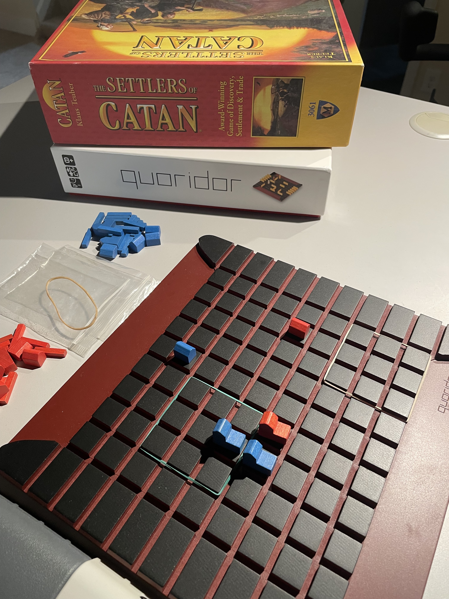

# Lux AI Season 2

> 主题：sim-agent ｜ 子类：— ｜ 领域：游戏 ｜ 类别：Featured
> 截止：2023-05-08 ｜ 队伍数：646 ｜ 机制：标准赛（提交 agent）｜ 指标：对战胜率（lux_ai_s2）
> 数据来源：`intel/lux-ai-season-2/`（80 条主题索引 + 6 篇 write-up 正文）

## 1. 任务与数据

- 对局形式：两人零和对抗，各自指挥机器人蜂群在 48×48 火星地图上竞赛"地球化"（比赛分三个阶段：同时出价的拍卖阶段 → 顺序放置 2–5 个工厂 → 同时行动的主阶段）。
- 目标：收集金属造机器人、取水培养地衣（lichen）、清理碎石；最终以地衣覆盖等条件判定胜负。
- 构造陷阱：
  - **规则会在赛季间变动**（本场相对 Beta 版的最大改动是"地衣产生电力"），策略需要重写；
  - 阶段混合（同时决策 + 顺序决策）；
  - 计算预算受限（每回合时间上限）。

## 2. 方案谱系

| 方案 | 名次 | 关键点 |
| --- | --- | --- |
| 集中地衣扩张的战略调整 | 1st | 因规则改动（地衣产电）而**放弃 Beta 版大部分策略代码**，改为"尽早且持续扩张地衣" |
| 深度强化学习（聚焦特定子问题） | FLG（高票） | 把 RL 用在有限的决策子问题上，而非端到端 |
| 纯逻辑/规则方案 | 社区帖 | 大量手工规则同样有竞争力（该帖详述经验） |
| RL 方案 | 10th | 见讨论区 |

## 3. 关键技巧

- **规则变更后重写策略**：不要沿用旧赛季的策略代码（1st 的明确做法）。
- **RL 用于子问题**：在可控的决策环节上用 RL，其余用规则/规划（工程可行性高）。
- **识别胜利条件的变化**：地衣产电这一改动直接改变了最优策略。
- **纯规则方案仍有一席之地**（与 Orbit Wars/Pokemon 的结论一致）。

## 4. 可迁移性评估

- **可直接迁移**：
  - **规则/版本变更时，先重估最优策略再改代码**；
  - "规则骨架 + RL 处理局部决策"的混合架构；
  - 混合决策阶段（同时 + 顺序）需要分别设计。
- 需要前提：对游戏机制与规则的细致理解；每回合计算预算管理。
- 不建议照搬：沿用旧赛季策略（规则已变）。

## 5. 对新手的关键启示

1. **先读当前赛季的规则差异**，再决定技术路线。
2. **RL 不必端到端**：用在关键子决策上收益更稳、工程更可控。
3. 与 Orbit Wars/Pokemon 对照：agent 类比赛的三条路线（启发式 / 检索统计 / RL）都有人拿名次。

## 6. 轻读结论（2026-10 补）

**一句话**：Lux S2 是"逻辑 bot + 前向模拟"战胜深度 RL 的一届——电力效率（动作队列）与开局选址（冰/矿/冰封锁）决定上限，策略多样性形成石头剪刀布。

- 1st（43 票）：前向模拟 2.9s/次（5–50+ 步）、~10 种 role/goal 状态机、优先级动作锁定；**冰冲突+双轻单位封锁运水**，一度把对手分数推到 36k+ 破坏匹配算法；自认 conga 线（Tigga/Siesta）更优。
- 4th FLG（51 票）：以 CPU 性能为第一约束；7 类 actor 简化动作空间；模仿+小地图 RL 选架构；电力算术：队列 20 dig = 1210 vs 逐回合 1400（省 ~15%）。
- 5th（11 票）：选址评分/优先级规则；尝试全太阳能失败；"ryandy>deimos>我>ryandy"。
- 10th Deimos（15 票）：PPO/RLlib + JAX 环境；忽略动作队列做实时控制（允许重复省电）。
- 模仿帖（31 票）：模仿 Deimos 的 ~3000 胜局；忽略队列使动作空间简化；但 bid=0/朴素选址 + 初始条件分布不一致=隐患。
- 事件：匹配/计分故障；跨赛社交工程诈骗警示（381975）。

**裁决**：队列省电但放大动作空间；开局即战争；无单一统治策略；CPU 推理预算是隐藏约束。

**悬案**：2nd/3rd（conga 线路线）方案未收录；故障官方说明缺失。

## 7. 图表证据

**图 1**（topic 406702）：输入 48×48×105 → ResBlock/ DoubleConeBlock（stride-4 锥形）→ Critic + Actor Heads。

**图 2**（topic 407982，玩笑）：实体棋盘照片——社区文化注脚。

## 8. 出处

- 讨论区索引：`intel/lux-ai-season-2/topics.md`（80 条）
- 已收录 write-up（6 篇）：
  - 1st（43 票）：https://www.kaggle.com/competitions/lux-ai-season-2/discussion/407982
  - FLG 的 RL 方案（51 票）：https://www.kaggle.com/competitions/lux-ai-season-2/discussion/406702
  - 纯逻辑方案笔记（16 票）：https://www.kaggle.com/competitions/lux-ai-season-2/discussion/405245
  - 10th RL 方案（15 票）：https://www.kaggle.com/competitions/lux-ai-season-2/discussion/411725
- 轻读全本：`analysis/deep/lux-ai-season-2.md`（Tier B 轻读；本场按"≤3 篇定点补采"原则改用本地已归档 12 篇 bodies + 2 图证）
