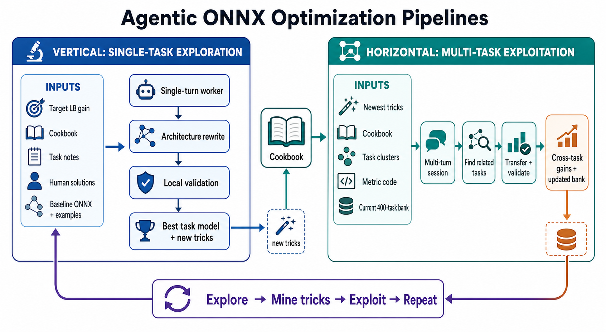

# NeuroGolf 2026（用 LLM agent 打"模型高尔夫"）

> 主题：sim-agent（优化）｜ 子类：— ｜ 领域：模型压缩/ARC ｜ 类别：Featured
> 截止：2026-07-15 ｜ 队伍数：2963 ｜ 机制：标准赛 ｜ 指标：`score = max(1, 25 − ln(cost))`，`cost = memory + parameters`（5/6 改版后）
> 数据来源：`intel/neurogolf-2026/`（80 条主题索引 + 6 篇 write-up 正文）

## 1. 任务与数据

- 任务形式：用 **ONNX 模型**解 400 道 ARC-AGI 任务，同时**最小化模型代价**（参数/体积/计算量）——"神经网络版 code golf"。
- 数据形态：ARC 任务的输入输出网格；提交物是可执行的 ONNX 模型。
- 构造陷阱：
  - 既要"解对"又要"够小"，是**双目标优化**；
  - 手写 ONNX 极其繁琐 → **LLM agent 成为主要生产工具**；
  - 解码/验证需要严格的等价性检查。

## 2. 方案谱系

| 方案 | 名次 | 关键点 |
| --- | --- | --- |
| **"Kaggle Agent" 自进化提示词流水线** | 1st | 用 LLM agent 生成与优化 ONNX 模型；专门花数天优化**token 效率**（发现"agent 自动解题"起初既费 token 又停滞） |
| 并行采样 + 规则化提示生成（借鉴 Code Golf 2025 第 4 名） | 9th | 核心是**系统设计**而非单次生成：并行跑多个 Codex 尝试 → 验证候选 → 选最优有效解 → 用结构化提示驱动下一轮；**迭代精修与从头采样混用**以跳出局部最优 |
| 既有 agent 方案的诚实审计 | 社区 | 有帖子对当时最优提交做"诚实审计"——社区对 agent 产出的审查意识 |

## 3. 关键技巧

- **把 LLM agent 当作"生产车间"而非"一次性求解器"**：并行采样 + 验证 + 选择 + 反馈循环。
- **token 效率工程**：agent 方案的可持续性取决于每轮成本（1st 明确指出不优化 token 会停滞）。
- **混合策略防局部最优**：迭代精修 + 从零重采样。
- **可验证性**：每个候选都要跑等价性检查，只有有效解才进入候选池。

## 4. 可迁移性评估

- **可直接迁移**：
  - **"并行采样 + 验证 + 选择 + 结构化反馈"**是当前 agent 化生产的主流范式（在代码、模型、提示词生成中通用）；
  - token 效率是 agent 工作流的硬约束；
  - 迭代 + 重采样混合，避免陷入局部最优。
- 需要前提：可靠的自动化验证器（没有验证就无法筛选）。
- 不建议照搬：让 agent 无约束地反复试（成本爆炸且停滞）。

## 5. 对新手的关键启示

1. **agent 化比赛的核心是"验证器 + 选择策略"**，不是提示词本身。
2. **token 成本要当一等指标管理**（1st 的经验）。
3. 与 Konwinski Prize、Rogii、BirdCLEF 的自建 agent 对照：**LLM agent 已从"辅助工具"变成"参赛主体"**，同时带来规则与审计问题。

## 6. 轻读结论（2026-10 补）

**一句话**：这是一场"LLM agent 工厂"比赛——**架构重写（+0.5/题）碾压局部优化（+0.05/题）**，而吞吐、验证、回滚与技巧沉淀决定最终名次。

- 1st（Kaggle Agent）：纵向单题深挖 + 横向多题迁移双流水线；硬目标（+1.5/题）逼出架构重写；token 效率靠预烘焙 task notes/cookbook/工具库；"自进化提示"（4h 迷你赛→导师→晋升经理）。
- 9th（66 票）：Codex 调度器 + 三文件任务单元 + **backup→experiment→validate→promote/restore** 事务门；差分提交二分定位在线回归；**五天无人值守 +59.77（271 题改动、256 降本、0 回归）**。
- 9th 六招：直接写图输出（T001 单 Einsum cost 98）/重算代替搬运（T017 60→10）/一 basis 多角色（T096）/代数替换查找表（T061 606→70）/原生算子运输（T082 cost 21）/收缩顺序是模型状态（runtime −13%、−16%）。

**裁决**：独立小任务 × 机械验证的赛制里，agent 流水线的"吞吐 + 验证 + 沉淀"是一级变量，提示词与单题技巧是二级变量；对数计分下必须优先找新架构而不是修剪旧图。

**悬案**：2nd–8th 方案缺失；1st 完整写-up 当时未完稿；改版前 loophole 时代方案价值未整理；骗局/作弊无官方结论。

## 7. 图表证据

**图 1**（topic 726799）：纵向单题探索 ↔ 横向多题利用的双流水线，底部闭环 Explore → Mine tricks → Exploit → Repeat。

## 8. 出处

- 讨论区索引：`intel/neurogolf-2026/topics.md`（80 条）
- 已收录 write-up（6 篇）：
  - 1st 总述（115 票）：https://www.kaggle.com/competitions/neurogolf-2026/discussion/726654
  - 1st 自进化提示（38 票）：https://www.kaggle.com/competitions/neurogolf-2026/discussion/726883
  - 9th（66 票）：https://www.kaggle.com/competitions/neurogolf-2026/discussion/726653
  - 竞赛报告（38 票）：https://www.kaggle.com/competitions/neurogolf-2026/discussion/717854
  - agent 方案的诚实审计（36 票）：https://www.kaggle.com/competitions/neurogolf-2026/discussion/694772
  - 1st 管线（34 票）：https://www.kaggle.com/competitions/neurogolf-2026/discussion/726799
- 轻读全本：`analysis/deep/neurogolf-2026.md`（Tier B 轻读：对照矩阵/裁决/证据分级/悬案 + 2 图证）
