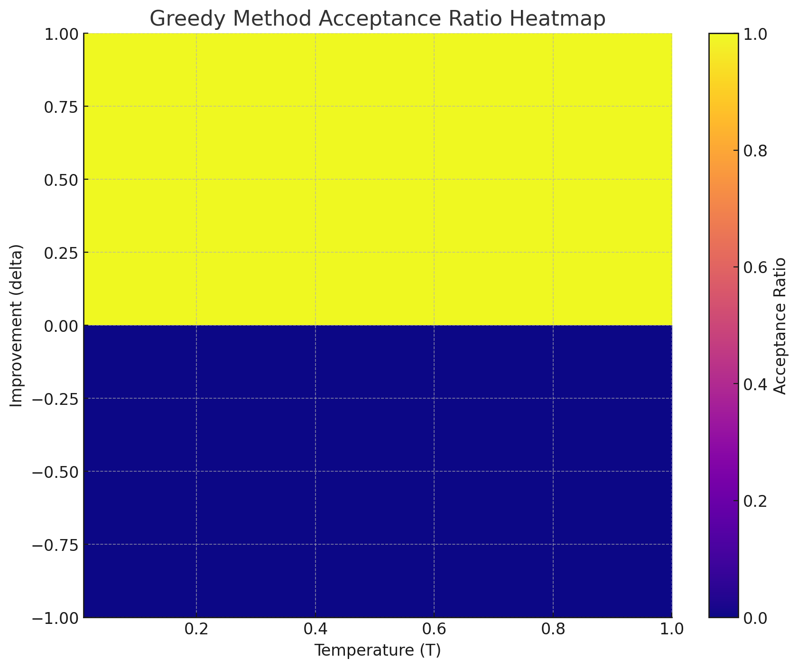
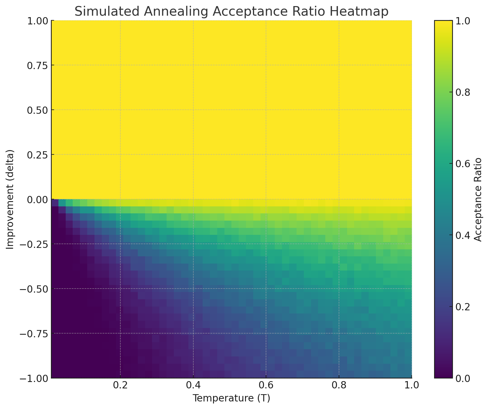
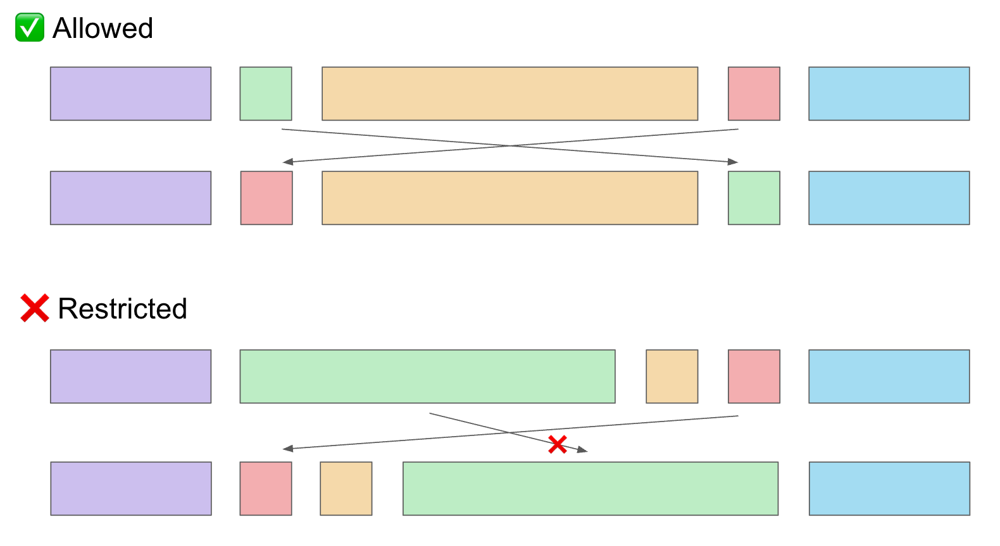
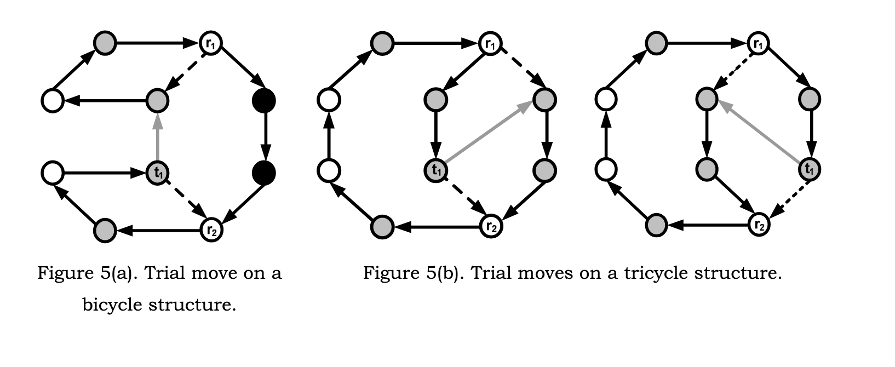
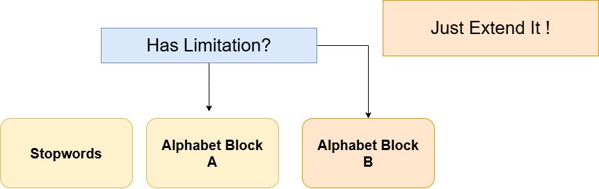
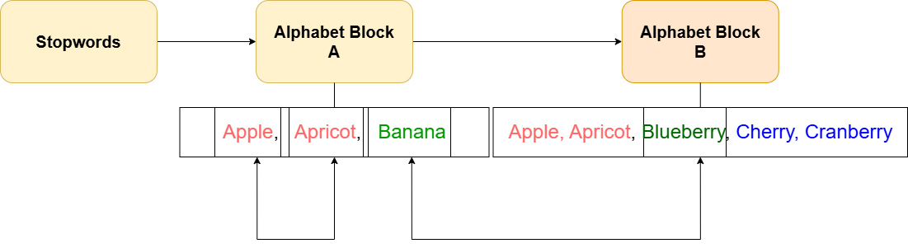

# Santa 2024（LLM 困惑度置换）

> 主题：sim-agent（黑箱组合优化）｜ 子类：— ｜ 领域：优化 / LLM 评测 ｜ 类别：Featured
> 截止：2025-01-31 ｜ 队伍数：1514 ｜ 机制：标准赛（无运行时间限制）｜ 指标：官方 metric.py 的困惑度（越低越好）
> 数据来源：`intel/santa-2024/`（80 条主题索引 + 6 篇正文 + 6 张图；深读升级 2026-10，Tier A #57）

## 1. 任务与数据

- **任务形式**：把每个样例（sample）的词序重排，使一个小型语言模型对整段文本的**困惑度最低**（Santa 年度赛，官方提供 `metric.py`）。
- **数据形态**：多个独立子问题（sample 0–6+），样例含大量词（如 sample 5 有 100 个词，解空间 100!）；本地评分昂贵，可批量 GPU 推理。
- **构造陷阱**：
  - 评分函数必须**逐位复现**：batch_size>1 时要 `padding_side="right"` + 屏蔽 pad token + 按有效 token 平均（否则分数失真）；
  - 批量与逐行评分存在 cuBLAS 级微小差异（搜索噪声）；
  - 目标**非局部**：移动一个词改变其后所有上下文，无法像 TSP 增量算分；
  - 指标经历过 "Metric Revision and Rescore"，早期还有 LB hack（已修复）。

## 2. 验证与优化方案

| 方案 | 使用者 | 说明 |
| --- | --- | --- |
| 本地精确复现 metric + 批量化 | 社区共识 | batch=64 在 2×T4 上暴力搜 sample#0；batch 既是加速也是正确性风险 |
| ILS + 受限 k-opt + 自定义 kick | 2nd @zaburo | 禁翻转；移动子序列长度受限；P5 全移动一轮 ~18 分钟（4090） |
| SA 变体 + multi-point 并行 | 5th CPMP | 全局上界接受；A100 上 104 条轨迹并行；98% GPU 利用率；分数缓存 |
| 标准 SA + 接受率分析 | 社区总论 | greedy vs SA 接受面（图 1/2）；日本 AtCoder Heuristic 文化 |
| 块 sharding + SA | sample 5 团队 | 字母块压缩 100! 空间；字母序 44.0 起点；赛期发布引发争议 |
| 逐 sample 独立优化 + 多起点 | 多队 | 各子问题最优先验不同（P3 固定末词、P5 结构分解） |

## 3. 方案谱系

| 方案 | 名次（票数） | 关键点与数字 |
| --- | --- | --- |
| ILS + 受限 k-opt + kick | 2nd（43） | (k=3,max_move=5)/(k=4,max_move=1)；P5 **28.5**、P3 **191.x**；四段结构突破 32.xx 壁垒；多起点；不用 SA/GA |
| SA 变体 + multi-point + ATSP 移动 | 5th（43） | 上界接受；batch 104；k-opt（分段洗牌）+ remove-insert + double root-and-stem；位置折扣困惑度；失败：Sinkhorn/ATSP-from-logits/MCTS |
| SA 总论 | 社区（59） | Metropolis 接受机制与热力图；SA 适合 TSP 类问题 |
| sample 5 块 sharding | 团队（41） | 字母序 44.0；100! → 块内排列 + 块间搬词；自称未验证测试代码 |
| 批量困惑度正确实现 | Chris Deotte（92） | padding_side=right、pad 屏蔽、有效长度平均；batch=64 starter |
| 1st | 1st（85） | **正文缺失**：仅 repo 链接（github.com/Lgeu/santa2024）——登记缺口 |

## 4. 关键技巧

- **评分器工程**：逐位复现官方 metric；批量化的 padding/掩码/精度；固定可复算（避免 cuBLAS 噪声误导搜索）。
- **非局部目标的邻域剪枝**：禁翻转、限制移动子序列长度、允许长段静止、整体重评 + 文本分数缓存。
- **逃逸算子**：随机相邻子序列洗牌 kick（2nd）；结构专用转移/交换 kick（块间搬词）；double root-and-stem（ATSP 文献）。
- **接受准则**：Metropolis `exp(−Δ/T)` vs 全局上界（定期下调，省指数运算与调参）（5th）。
- **位置归一**：前缀限制或"折扣困惑度"（按位置平均 logit 归一），消除搜索偏尾。
- **结构压缩**：停用词/字母块先验；但打破块结构的算子才给上限（32.xx → 28.5）。
- **GPU 预算**：batch=轨迹数（104）、multi-start、98% 利用率；分数缓存去重。

## 5. 深读结论（2026-10 补）

**一句话**：这是一场"评分函数工程 + 邻域设计 + GPU 预算管理"的比赛——算法家族是公共知识，胜负在候选移动的取舍与结构先验。

- TSP/ATSP 技巧可迁移但必须改造：禁翻转、限移动长度、批量化重评（非局部目标）。
- 两种极端都赢：少候选×精确评分（2nd ILS）与全候选×批量近似（5th 并行 SA）；共同点是剪枝 + 批量化 + 缓存。
- 结构先验价值巨大（sample 5 从 44→28.5 量级），但会锁死上限；kick 必须能打破结构。
- 位置偏差是隐藏坑：不归一化会让搜索系统偏尾（5th 的前缀限制/折扣分数）。
- 赛期公开顶级解改变竞争性质（sample 5 争议 + "Publishing top solution is dangerous"）。

**数字账精选**：batch 64/104；2nd 18 分钟一轮、28.5/191.x；sample 5 字母序 44.0、32.xx 壁垒；sample 6 排序 53.46→48.69；榜单参照 248.5/255.9/256.6。

**失败学**：2nd 的 beam search、SA/GA 弃用；5th 的 Sinkhorn+KL、logits→ATSP、EMA+Sinkhorn、MCTS/RL。

**悬案**：1st 方案缺失（仅 repo）；Metric Revision and Rescore（547676）细节；最优分是否已被证明（556784）；LB hack 修复（547505）；3rd/4th/10th/11th/13th 方案未收录。

## 6. 图表证据

> 路径相对本文件（`notes/sim-agent/`）：`../../intel/santa-2024/bodies/<topic>_img/NN.ext`

**图 1：Greedy 接受面**（topic 548476）——Δ>0 全接受、Δ<0 全拒绝，无逃逸。

**图 2：SA 接受面**（topic 548476）——Δ<0 时接受率随温度/|Δ| 变化（Metropolis 机制）。

**图 3：k-opt 移动剪枝**（topic 560533）——Allowed=小段交换/长段保持；Restricted=长移动段被禁；(k=3,max_move=5)/(k=4,max_move=1)。

**图 4：double root-and-stem 结构**（topic 560597）——bicycle/tricycle 图上的试探移动（r1/r2 root、t1 stem）。

**图 5：sample 5 结构分解**（topic 559339）——Stopwords / Alphabet Block A / Alphabet Block B + "Just Extend It!"。

**图 6：块内有序示例**（topic 559339）——Block A（Apple/Apricot/Banana）→ Block B（Blueberry/Cherry…）。

## 7. 可迁移性评估

- **可直接迁移**：
  - **"本地精确复现打分函数"是黑箱优化任务的第一前提**（含 padding 方向、掩码、精度这类陷阱）；
  - 经典组合优化技术（k-opt、ILS、SA、double-bridge、ATSP 图移动）跨领域迁移，但必须按目标函数假设改造；
  - 非局部目标的邻域剪枝（限移动长度/禁翻转/缓存重评）；
  - 位置归一化（前缀限制/折扣分数）；
  - GPU 并行的多轨迹搜索（batch=轨迹数）+ multi-start；
  - 结构先验压缩 + 打破结构的 kick。
- **需要前提**：可本地推理/批量的评分函数；解空间有可利用的语言学或图结构；长周期算力可支配（间断运行适合 ILS）。
- **不建议照搬**：任何"看起来对但没对齐官方 metric"的本地评测；忽视批量/逐行差异的高精度爬山；赛期公开顶级解。

## 8. 对新手的关键启示

1. **先对齐评测函数，再谈优化**——padding 方向/掩码/精度细节就能让分数失真。
2. **优化类比赛拼的是搜索效率与实现细节**，不是模型规模；剪枝 + 批量 + 缓存是三个放大器。
3. **结构先验给你起点、打破结构的 kick 给你上限**；两者缺一不可。
4. **公开讨论里"哪些做法无效"往往比成功经验更省时间**（5th 的失败清单、2nd 的 beam search）。
5. **分享时机是策略问题**：单一答案 + 同分并列的比赛，赛期公开顶级解会把金牌变成复现速度竞赛。

## 9. 出处

- 讨论区索引：`intel/santa-2024/topics.md`（80 条）
- 已收录 write-up（6 篇）：
  - 批量困惑度（92 票）：https://www.kaggle.com/competitions/santa-2024/discussion/548249
  - 1st（85 票，正文仅 repo 链接）：https://www.kaggle.com/competitions/santa-2024/discussion/560560
  - SA 总论 255.9（59 票）：https://www.kaggle.com/competitions/santa-2024/discussion/548476
  - 2nd @zaburo（43 票）：https://www.kaggle.com/competitions/santa-2024/discussion/560533
  - 5th CPMP（43 票）：https://www.kaggle.com/competitions/santa-2024/discussion/560597
  - sample 5 团队解（41 票）：https://www.kaggle.com/competitions/santa-2024/discussion/559339
- 深读全本：`analysis/deep/santa-2024.md`（11 组件 + 机制推演 M1–M7 + 6 图证）
- 缺口登记（未收录正文/正文缺失）：560560（1st 正文仅 repo）、560540、560565、560620、560536、560531、560542、551818、556784、551902、555881、547676、547505、557817、555545、550287、550429
