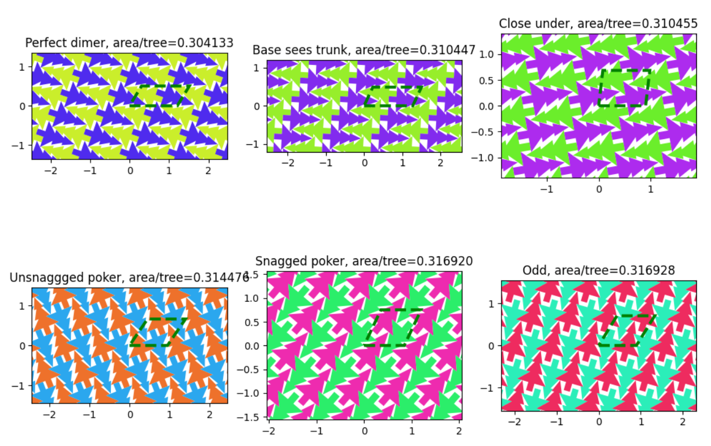
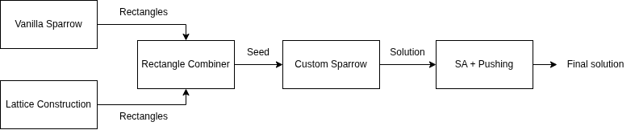
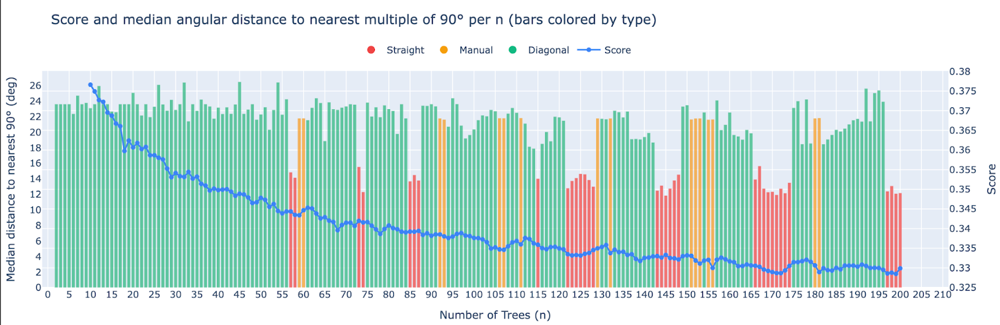
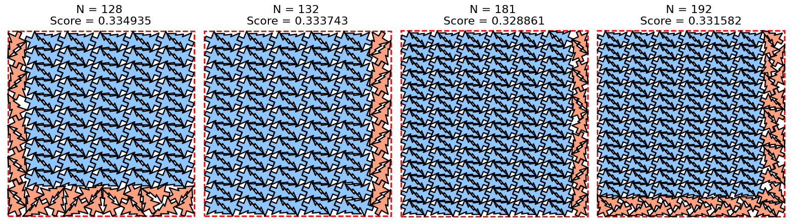
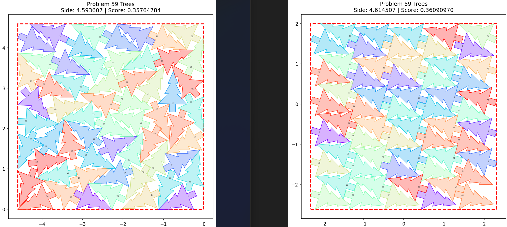
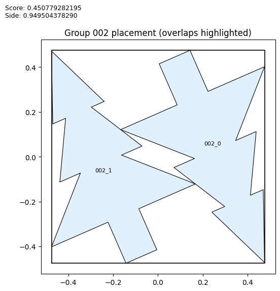

# Santa 2025

> 主题：sim-agent（优化类）｜ 子类：— ｜ 领域：几何优化 ｜ 类别：Featured
> 截止：2026-01-30 ｜ 队伍数：3357 ｜ 机制：标准赛 ｜ 指标：Santa 2025 Metric（最小化方形包装尺寸）
> 数据来源：`intel/santa-2025/`（120 条主题索引 + 8 节正文：1st/3rd/12th + SA 技巧 + 对称/不对称 + 预览 + 10 树可视化；2nd/4th–11th 等约 29 条未收录）

## 1. 任务与数据

- **任务形式**：把 N 棵树（可旋转）尽量紧凑地放进一个正方形，最小化正方形边长。属于**连续 + 组合的几何包装优化**。
- **数据特性**：问题定义清晰、无噪声、无隐藏测试分布——**分数完全由优化质量决定**，是"纯优化"型比赛。
- **排行榜特点**：名次差距极小（小数点后多位），需要持续压榨；社区共享氛围强（有专门的 "Santa Etiquette" 规则帖）。
- **总分口径**：按 N=1..200 各正方形边长求和（每 N ~0.33、总分 ~66–70），所以"每一个 N 都值得单独压榨"。

## 2. 验证与评估方案

- 无训练/验证集划分问题；评估就是**在本地精确计算目标函数**。
- 真正的"验证"是：**能否稳定复现并持续改进**——多位选手用更小 N 的解热启动更大 N 的解。
- 社区自建交互式编辑器（Interactive Editor）与可视化工具，用于人工检查布局。
- **假设需实验裁决**：对称性之争由 24 核 × 10 天对照实验（N<60 不对称更优）给出方向。

## 3. 方案谱系

| 方案 | 名次 | 关键点 |
| --- | --- | --- |
| 16 岛环 GA + CUDA LBFGS 松弛 + 晶体种子 | 1st | 3750→1500→111 的选择；Minkowski 查表 30k 松弛/秒；Perfect dimer（0.3041/树）；$250/1000h |
| 矩形组合库 + 定制 Sparrow（Rust）+ C++ SA/push | 3rd | 矩形组合 ~70.0 → SA/push ~69.50；方向偏置；100 提交/天工作流 |
| 凹包技巧 + 宽高比扰动 + N±1 迁移 | 12th | 晶格块→凹包→Spyrrow 放自由树；每 N 0.329–0.335 |
| SA 通用技巧 | 高票帖 | 增量碰撞 ~100×、几何冷却、留最优、多种子 |
| 不对称性实验 | 高票帖 | 24 核×10 天：N<60 不对称 > 对称（N=59：0.35765 vs 0.36091） |

## 4. 关键技巧

- **双层搜索**：全局（GA/Sparrow/memetic）+ 局部（LBFGS/SA/push）交替——局部精修速度=搜索宽度。
- **自由度降解**：随机（≤40）→ 180° 对称（≈70）→ 晶体/矩形库/凹包种子（到 200）；只优化边缘。
- **精确几何查表化**：Minkowski 分离距离 → (Δx,Δy,θ) 三维表 + 三线性插值，供 GPU LBFGS 求梯度。
- **热启动/N±1/宽高比扰动**：相邻 N 解高度相似；0.9–1.1 宽高比往返可逃出正方形窄盆地。
- **工程性能**：CUDA 松弛 30k 次/秒；C++ SA 10.56M iters/s；增量碰撞 O(N²)→O(N)。
- **对称=脚手架**：用于早期收敛；终态允许不对称（实验裁决）。
- **多样性管理**：岛环拓扑 + 转换集合距离（Hungarian）+ 卡住重置。

## 5. 深读结论（2026-10 补）

- **这是一场"搜索工程学"比赛**：算法思想（GA/SA/Sparrow）是公共品；名次由"局部精修的实现速度 + 大 N 初始解结构"决定。
- **三类结构化种子各有成功案例**：晶体（1st）、矩形组合库（3rd）、凹包+边缘带（12th）——共同本质是"把 O(N) 维搜索降解为填边缘"。
- **对称性的裁决**：作为脚手架降低自由度有效（1st 到 N≈70/偶数；3rd 用于种子），但 24 核实验中终态不对称更优（N=59：0.35765 vs 0.36091）——约束要服务于搜索，不能当信仰。
- **性能数字即分数**：30k 松弛/秒、10.56M iters/s、增量碰撞 ~100×——纯优化赛里，工程层的每一刀都换算成名次。
- **1st 的两个自我反思**：没集成 Sparrow（发布 CSV 后立即被改进）；没做移动类型/超参的统计研究——社区方法学与自动化调优仍有空间。

## 6. 图表证据

**图 1：16 岛环 GA 种群**（1st，topic 672465）——`../../intel/santa-2025/bodies/672465_img/01.png`

*读图*：16 岛环、每岛 111 个体共享方框尺寸；循环=先可行（零重叠/不出界）→ 缩方框 → 重复。

**图 2：六种晶体单元胞 area/tree**（1st）——`../../intel/santa-2025/bodies/672465_img/04.png`

*读图*：Perfect dimer 0.304133 最密；其余 0.3104–0.3169。胜出因素=直边 + 可变形（能贴合边界被挤压）。

**图 3：3rd 四段管线**（topic 671181）——`../../intel/santa-2025/bodies/671181_img/01.png`

*读图*：Sparrow+晶格 → 矩形组合 → 定制 Sparrow → SA+push。

**图 4：每 N 分数与角度分布**（3rd）——`../../intel/santa-2025/bodies/671181_img/09.png`

*读图*：分数 0.377（N=10）→ ~0.327（N≈130）平台；角度双簇（0–6° 与 18–26°）对应"22–24°/202–204° 晶格"。

**图 5：12th 的密铺+自由带**（topic 671060）——`../../intel/santa-2025/bodies/671060_img/01.png`

*读图*：N=128/132/181/192：蓝=晶格核、橙=自由边缘带；分数 0.3349/0.3337/0.3289/0.3316。

**图 6：N=59 不对称 vs 对称**（A HS，topic 666880）——`../../intel/santa-2025/bodies/666880_img/01.png`

*读图*：不对称（左）0.35764784 < 对称（右）0.36090970。

**图 7：小 N 对称解示例（N=2）**（saharan，topic 664824）——`../../intel/santa-2025/bodies/664824_img/01.png`

*读图*：180° 对称 N=2 解（0.45078/0.94950）；与 A HS 的统计结论形成"具体 N 取决于实例"的张力。

## 7. 可迁移性评估

- **可直接迁移**：
  - **"全局搜索 + 局部精修"的双层结构**是所有组合优化问题的通用骨架。
  - 增量热启动（用小规模解初始化大规模问题）。
  - 用可视化工具人工诊断优化结果。
  - 性能工程（语言/GPU 重写）直接换算成分数。
- **需要前提**：
  - 目标函数必须能快速精确评估（本场成立）。
  - 需要较多本地算力（大量并行评估）。
- **不建议照搬**：
  - 具体的邻域/退火参数（与问题几何强耦合）。
  - 先验假设"最优解一定对称"——本场被实验否定。

## 8. 对新手的关键启示

1. 这是**最适合新手练手的比赛类型**：无需数据清洗、无过拟合风险，反馈即时。
2. **优化质量的差距来自搜索效率**——算法结构 + 工程性能，而不是模型选择。
3. **先做小而快的实验验证假设**（如对称性），再投入大规模计算。
4. **社区共享密集**：这类比赛的公开讨论是高质量的学习材料。

## 9. 出处

- 讨论区索引：`intel/santa-2025/topics.md`（120 条）
- 已收录正文（8 节）：
  - SA 技巧（terry_u16，114 票）：https://www.kaggle.com/competitions/santa-2025/discussion/640894
  - 1st（Jeroen Cottaar，111 票）：https://www.kaggle.com/competitions/santa-2025/discussion/672465
  - 1st 预览（84 票）：https://www.kaggle.com/competitions/santa-2025/discussion/671058
  - 10 树可视化（c-number，65 票）：https://www.kaggle.com/competitions/santa-2025/discussion/629896
  - 3rd（Gilles Vandewiele 队，64 票）：https://www.kaggle.com/competitions/santa-2025/discussion/671181
  - 12th（Egor Trushin 队，55 票）：https://www.kaggle.com/competitions/santa-2025/discussion/671060
  - 对称解（saharan，46 票）：https://www.kaggle.com/competitions/santa-2025/discussion/664824
  - 不对称实验（A HS，41 票）：https://www.kaggle.com/competitions/santa-2025/discussion/666880
- 未收录缺口（登记备查）：2nd/4th–11th 等约 29 条 write-up（密铺策略 642347 亦为索引级）
- 深读全文：`analysis/deep/santa-2025.md`
