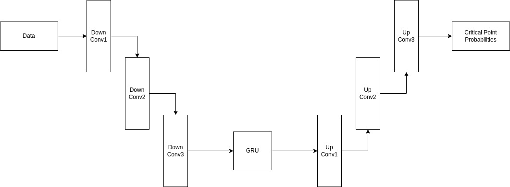
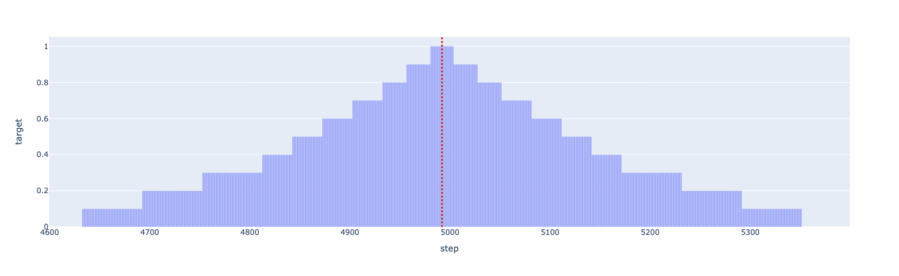
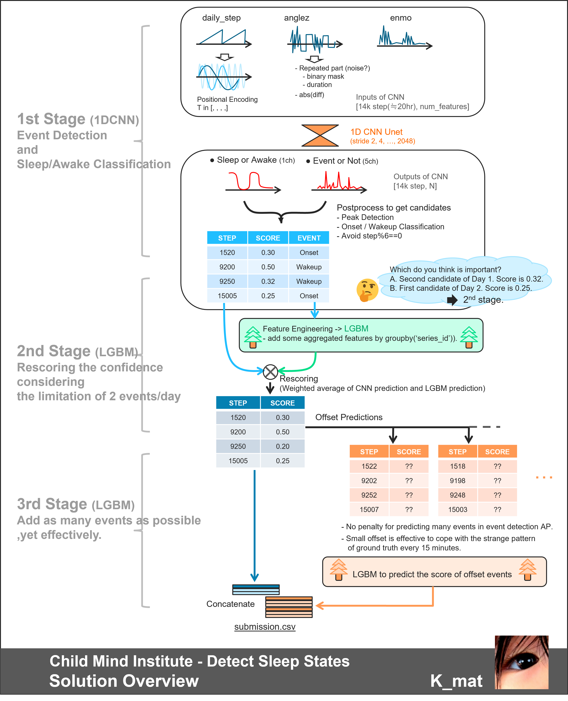
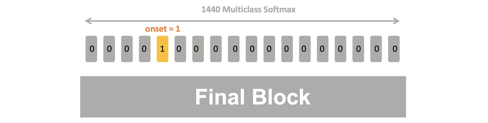
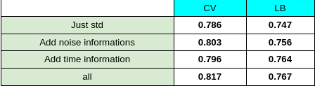

# Child Mind Institute - Detect Sleep States

> 主题：tabular（传感器时序）｜ 子类：— ｜ 领域：医疗 ｜ 类别：Featured
> 截止：2023-11-21 ｜ 队伍数：1868 ｜ 机制：代码赛 ｜ 指标：事件级 F1（onset / wakeup）
> 数据来源：`intel/child-mind-institute-detect-sleep-states/`（120 条主题索引 + 8 节正文：1st/2nd/3rd/4th×2/7th/11th + UNet2D 社区帖；38 条 write-up 标记中其余未收录）

## 1. 任务与数据

- **预测目标**：由腕表传感器（加速度/心率）时序检测**入睡与醒来事件**（事件级 F1，非逐点分类）。
- **数据形态**：多夜长序列（单夜约 17280 步 = 12 步/分钟 × 1440 分钟）；事件标注稀疏。
- **构造陷阱**：
  - **事件级指标**：逐点准确率高不等于事件检出的分数高，需要命中窗口容差。
  - 序列极长，需要下采样/分层建模。
  - 同受试者多夜 → 必须按受试者分组验证。
- **指标几何**：多档容差（12/36/60/… 步，每步 5 秒）；提交秒数在 30 秒内不影响分数；AP/F1 奖励"追加低分预测"。
- **公开榜噪声大**：3rd/7th/4th 一致报告公开排序不可信、CV→私榜更相关。

## 2. 验证方案

| 方案 | 使用者 | 说明 |
| --- | --- | --- |
| 按 Series Id 的 GroupKFold | 4th | 避免同一受试者的多夜跨折 |
| CV-LB 对齐 | 1st | CV 0.8206 / 公开 0.768 / 私榜 0.829（相当于第 9 名） |
| 事件级后处理单独验证 | 4th | 用加权框融合做事件合并 |
| 消融的 CV/公开双列 | 3rd | 特征消融显示 CV 与公开排序不一致（公开噪声的微观证据） |
| 团队融合稳定选择 | 4th | 公开/私榜反转时用融合版本兜底 |

## 3. 方案谱系

| 方案 | 名次 | 关键点 |
| --- | --- | --- |
| CNN↓→残差 GRU→CNN↑ + **逐 epoch 衰减目标** + 周期过滤 + 两级后处理 | 1st | CV 0.7510→0.8206 的 9 步账；后处理公开 0.768→0.790/私榜 0.829→0.852 |
| 1D-CNN UNet + **三阶段**（LGBM 重打分 ≤2 事件/天 + 偏移预测打分） | 2nd | 消融 0.826→0.832→0.842→0.844 |
| 7 特征 GRU/UNET + 噪声检测 + 反转增强 + LGB | 3rd | CV 0.840/私榜 0.848；消融表；"被公开榜搞晕" |
| UNet+Transformer+GRU/LSTM；patch 降长 | 4th Nikhil | WBF 公开 +0.003、私榜 −0.001 的诚实记录；团队融合私榜 0.845 |
| 19200 步 patch 12 + 8× 滑窗平均 + GBDT/tubo | 4th penguin | GGIR 缺失识别特征；reduce_rate 后处理；CV 0.825 |
| Wavenet（3 天分钟级）+ near-miss/-OHEM + stacking | 7th | 18 秒/epoch；AUC 提升但指标 +0.001 |
| **QA 头（1440 类 softmax）+ 追加预测 + rerank + NMS/WBF** | 11th | 追加预测 CV +0.050；rerank +0.020；融合 +0.010 |

## 4. 关键技巧

- **目标整形**：衰减/Gaussian 核 + 逐 epoch 退火（1st +19pt；penguin var=36；3rd ±1 扩张；7th near-miss）。
- **两级流水线**：序列模型候选 + 全局重排（1st 容差得分贪心选择；2nd LGBM 按 ≤2 事件/天；7th stacking；11th rerank）。
- **追加预测套利**：AP 指标下低分追加不伤分（11th +0.050；2nd 第三阶段 +0.010）。
- **数据管线人造痕迹**：设备缺失周期过滤（1st +17pt）；同值重复=噪声（3rd）；GGIR 缺失识别（penguin）。
- **长序列工程**：下采样 30s、patch 12 步、滑窗 8× 平均、块边缘裁 30 分钟（+4pt）。
- **公开榜不可信**：以 CV 为准；融合版本兜底。

## 5. 深读结论（2026-10 补）

- **本场是"指标驱动的系统设计"**：模型结构（CNN↓-GRU-CNN↑/UNet/Wavenet/QA）差异有限；分差来自目标整形（+19pt）、周期过滤（+17pt）、后处理两极化（+0.02 公开/私榜）与追加预测（+0.05）。
- **读指标=白拿分**：多档容差决定 target 形状；30 秒容差+AP 追加规则直接给 +0.05；1st 的容差得分贪心选择把后处理变成"对指标的直接优化"。
- **两级化是事件检测的通用形态**：候选生成 → 全局重排（显式建模 ≤2 事件/天）；纯逐点后处理到不了前排。
- **公开榜方差吞掉模型差异**：3rd/4th/7th 的一致结论；4th 的 WBF 公开/私榜符号反转是最佳微观证据。
- **数据采集管线是特征来源**：设备缺失的 24h 周期、GGIR 均值填充、同值重复噪声——生物医学时序赛的"元知识"。

## 6. 图表证据

**图 1：1st 的模型结构**（topic 459715）——`../../intel/child-mind-institute-detect-sleep-states/bodies/459715_img/01.jpeg`

*读图*：DownConv1/2/3 → GRU → UpConv1/2/3 → Critical Point Probabilities（下采样→序列→上采样）。

**图 2：衰减容差目标**（1st）——`../../intel/child-mind-institute-detect-sleep-states/bodies/459715_img/02.png`

*读图*：以事件为中心的三角衰减核（step≈4970），目标形状与容差几何同构；逐 epoch 继续衰减使峰变窄。

**图 3：2nd 的三阶段流水线**（topic 459627）——`../../intel/child-mind-institute-detect-sleep-states/bodies/459627_img/01.png`

*读图*：1st stage 双头 UNet → 候选表 → 2nd stage LGBM 重打分（≤2 事件/天）→ 3rd stage 偏移预测与打分 → submission。

**图 4：11th 的 QA 头（1440 类 softmax）**（topic 459596）——`../../intel/child-mind-institute-detect-sleep-states/bodies/459596_img/03.png`

*读图*：1440 个分钟类中 onset=1——QA 范式替代 NER 的直接示意。

**图 5：3rd 的特征消融（CV 与公开排序不一致）**（topic 459599）——`../../intel/child-mind-institute-detect-sleep-states/bodies/459599_img/04.png`

*读图*：Just std 0.786/0.747 → +noise 0.803/0.756 → +time 0.796/0.764 → all 0.817/0.767；CV 与公开排序错位。

## 7. 可迁移性评估

- **可直接迁移**：
  - "**下采样 → 时序模型 → 上采样**"的定位范式。
  - **事件级指标必须做事件合并/容差后处理**（框融合或峰值合并）。
  - 按实体（患者/受试者）分组验证。
- **需要前提**：
  - 长序列训练需要显存与高效数据管线。
- **不建议照搬**：
  - 用逐点指标优化事件级任务（需要专门的容差与后处理）。

## 8. 对新手的关键启示

1. **先搞清指标是"逐点"还是"事件级"**——两者的优化方式完全不同。
2. **后处理在事件检测里是刚需**（合并、容差、去重）。
3. **长序列先做结构设计**（降采样/分块），再谈模型。
4. 与 CMI 传感器（行为识别）对照：同一赛事系列，任务从分类变成事件检测，方法差异明显。

## 9. 出处

- 讨论区索引：`intel/child-mind-institute-detect-sleep-states/topics.md`（120 条）
- 已收录正文（8 节）：
  - UNet2D 社区帖（213tubo，206 票）：https://www.kaggle.com/competitions/child-mind-institute-detect-sleep-states/discussion/452940
  - 11th（Chris Deotte，186 票）：https://www.kaggle.com/competitions/child-mind-institute-detect-sleep-states/discussion/459596
  - 2nd（K_mat，177 票）：https://www.kaggle.com/competitions/child-mind-institute-detect-sleep-states/discussion/459627
  - 1st（sakami，168 票）：https://www.kaggle.com/competitions/child-mind-institute-detect-sleep-states/discussion/459715
  - 3rd（Fnoa，77 票）：https://www.kaggle.com/competitions/child-mind-institute-detect-sleep-states/discussion/459599
  - 7th（Ahmet Erdem，70 票）：https://www.kaggle.com/competitions/child-mind-institute-detect-sleep-states/discussion/459598
  - 4th Nikhil（68 票）：https://www.kaggle.com/competitions/child-mind-institute-detect-sleep-states/discussion/459637
  - 4th penguin46（64 票）：https://www.kaggle.com/competitions/child-mind-institute-detect-sleep-states/discussion/459597
- 未收录缺口（登记备查）：38 条 write-up 标记中的其余条目（5th/6th/8th/9th 等）
- 深读全文：`analysis/deep/child-mind-institute-detect-sleep-states.md`
