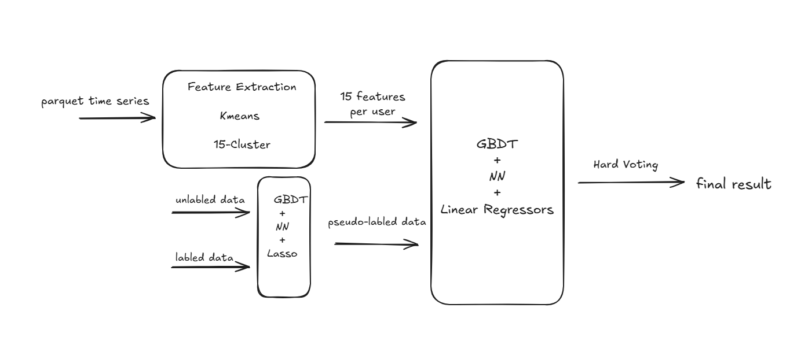
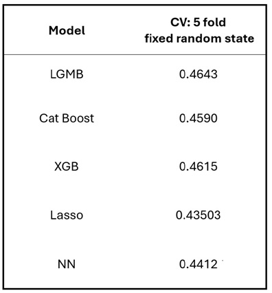

# Child Mind Institute - Problematic Internet Use

> 主题：tabular（含时序信号）｜ 子类：— ｜ 领域：医疗 ｜ 类别：Featured
> 截止：2024-12-19 ｜ 队伍数：3559 ｜ 机制：代码赛 ｜ 指标：Cohen's Quadratic Weighted Kappa
> 数据来源：`intel/child-mind-institute-problematic-internet-use/`（120 条主题索引 + 8 节正文：1st/2nd/5th/7th/14th/16th/19th + QWK 目标验证；17 条 write-up 标记中其余未收录）

## 1. 任务与数据

- **预测目标**：由儿童的身体活动数据（手表加速度时序）+ 健康问卷，预测"问题性网络使用"的严重程度等级，指标是 QWK。
- **数据形态**：小样本（数千人）+ 高噪声时序信号 + 大量缺失；标签本身由问卷分数离散化得到。
- **构造陷阱**：数据噪声极大、样本量小 → **排行榜方差很高**，名次受随机性影响显著（冠军标题即"我如何中了彩票"）。
- **标签结构**：官方 `sii`（0–3）由 `PCIAT-PCIAT_Total` 总分按阈值切出 → 可用连续总分做目标再切档（1st/5th）。
- **双主战场**：缺失值插补（16th 消融：不做插补私榜 0.470→0.412）与阈值选择（QWK 对切点极敏感）。

## 2. 验证方案

| 方案 | 使用者 | 说明 |
| --- | --- | --- |
| 分层 K 折（按目标等级） | 多数 | QWK 需要等级分布稳定 |
| 稳健性优先 | 1st | 复出后把重点放在"提高稳健性"而非刷分 |
| 多提交选择 | 1st | 承认"选对了提交"是运气的一部分 |
| 多种子/多重复 | 1st/7th/14th/16th | Repeated CV 10–20 次、5×10 种子投票、10×10 嵌套 CV、种子扫掠 |
| 折内/嵌套阈值 | 7th/16th | per-fold+百分位；嵌套 CV 后只优化一次 |

## 3. 方案谱系

| 方案 | 名次 | 关键点 |
| --- | --- | --- |
| 5 模型投票 + PCIAT 连续目标 + Lasso 插补 + PCA | 1st | "中彩票"自白；39 特征；Repeated CV 调参；忽略公开榜 |
| 按列语义插补 + 20 折 CatBoost | 2nd | 数值=均值/整数类别=max+1/字符串="Null"；CV 升公开降、私榜惊喜 |
| KMeans 15 簇时序 + 伪标签 + 硬投票 | 5th | 固定阈值 [31,50,80]；加弱模型公开升、私榜降 |
| Tweedie + 伪标签 + per-fold 百分位阈值 + 5×10 种子 | 7th | 种子方差 0.4922 vs 0.4839 |
| 分类 DNN（ICR 血统）+ train/test 联合插补 | 14th | 全量训练；类别权重；10 seed 平均 |
| 自定义 QWK 目标 LGBM + 10×10 嵌套 CV | 16th | 种子扫掠 0.464–0.472；插补消融；自定义目标只助 CV |
| 基线 NN+IterativeImputer + 2 GBDT 投票 | 19th | 洗牌跳 2000+ 名（60→19） |

## 4. 关键技巧

- **序数目标回归化**：PCIAT 连续分数 + 折内/百分位/固定阈值（三种安全姿势）；拒绝按公开榜反复搜阈值。
- **插补是第一杠杆**：IterativeImputer/Lasso/按列语义策略；消融显示其权重高于模型选择。
- **稳健性协议**：Repeated CV、嵌套 CV、多种子投票、种子扫掠报告。
- **QWK 自定义目标警戒**：CV 受益远大于 LB（0.2643→0.45187 vs 0.265→0.401；16th 同向）。
- **伪标签 + 时序压缩**：unlabeled 大比例 → 集成伪标签；parquet → KMeans/PCA/统计/时段聚合。
- **期望值策略**：多处稳健提交 > 追单次峰值；承认运气（冠军"lottery"、19th +2000 名）。

## 5. 深读结论（2026-10 补）

- **高方差场次的第一原则**：分数是分布不是点；稳健协议（多重复/多种子/嵌套 CV）是本场最大的可复用资产；冠军的"lottery"与 19th 的 +2000 名是同一现象的两面。
- **插补 > 模型**：16th 的 −0.058 私榜消融是直接证据；医学问卷缺失携带信息，迭代/有监督插补必须上。
- **阈值优化的三种安全姿势**：折内+百分位（7th）、嵌套 CV 后只做一次（16th）、固定临床阈值（5th）；全局最大搜索（19th 基线）是高风险高收益。
- **QWK 自定义目标**：把 CV 拉近指标但放大 CV-私榜错位；宜作集成成员而非唯一模型。
- **伪标签 + 时序压缩**是本案两条可迁移的特征工程线（5th 的 15 簇均值、14th 的周末/时段聚合）。

## 6. 图表证据

**图 1：5th 的完整管线**（topic 552656）——`../../intel/child-mind-institute-problematic-internet-use/bodies/552656_img/01.png`

*读图*：parquet → KMeans 15 簇 → 15 维/用户；unlabeled+labeled → GBDT+NN+Lasso 伪标签 → 训练 → 硬投票。

**图 2：5th 的单模 CV 表**（5th）——`../../intel/child-mind-institute-problematic-internet-use/bodies/552656_img/02.jpg`

*读图*：LGBM 0.4643 / XGB 0.4615 / CatBoost 0.4590 / NN 0.4412 / Lasso 0.43503（固定 5 折）——树模型主导 + 线性/深度互补。

## 7. 可迁移性评估

- **可直接迁移**：
  - **用更细粒度的原始标签做目标再离散化**（序数指标的通用技巧）。
  - 时序聚类特征（把长序列压成可解释模式）。
  - 高方差比赛中以稳健性为第一优先。
- **需要前提**：
  - 需要原始连续标签可得（很多比赛只给离散标签）。
- **不建议照搬**：
  - 把高方差比赛的结果当作能力指标（19th 的自省值得一读）。

## 8. 对新手的关键启示

1. **小样本 + 高噪声 = 高方差**：这类比赛的名次波动大，别把它当能力标尺。
2. **标签工程能做就做**：细粒度目标往往直接带来提升。
3. **时序特征聚类**是成本低、可解释性好的降维手段。
4. **稳健的提交策略**本身就是技术。

## 9. 出处

- 讨论区索引：`intel/child-mind-institute-problematic-internet-use/topics.md`（120 条）
- 已收录正文（8 节）：
  - 1st（Lennart Haupts，94 票）：https://www.kaggle.com/competitions/child-mind-institute-problematic-internet-use/discussion/552638
  - QWK 目标验证（chumajin，89 票）：https://www.kaggle.com/competitions/child-mind-institute-problematic-internet-use/discussion/535052
  - 16th（Jack，42 票）：https://www.kaggle.com/competitions/child-mind-institute-problematic-internet-use/discussion/552569
  - 2nd（Aradhye，32 票）：https://www.kaggle.com/competitions/child-mind-institute-problematic-internet-use/discussion/552712
  - 7th（31 票）：https://www.kaggle.com/competitions/child-mind-institute-problematic-internet-use/discussion/552625
  - 19th（Vladimir Demidov，25 票）：https://www.kaggle.com/competitions/child-mind-institute-problematic-internet-use/discussion/552513
  - 14th（Laura Romar，20 票）：https://www.kaggle.com/competitions/child-mind-institute-problematic-internet-use/discussion/552517
  - 5th（peyman，14 票）：https://www.kaggle.com/competitions/child-mind-institute-problematic-internet-use/discussion/552656
- 未收录缺口（登记备查）：17 条 write-up 标记中的其余条目；旧笔记提及的 EDA 帖（535354/538235）亦未收录
- 深读全文：`analysis/deep/child-mind-institute-problematic-internet-use.md`
