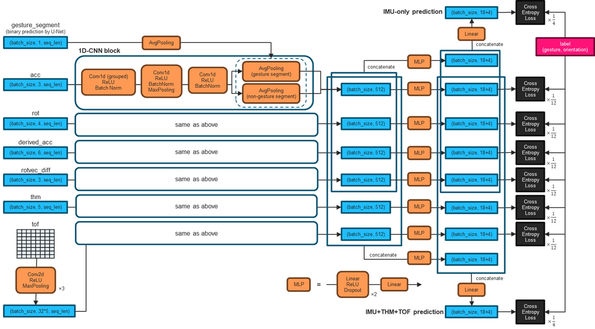
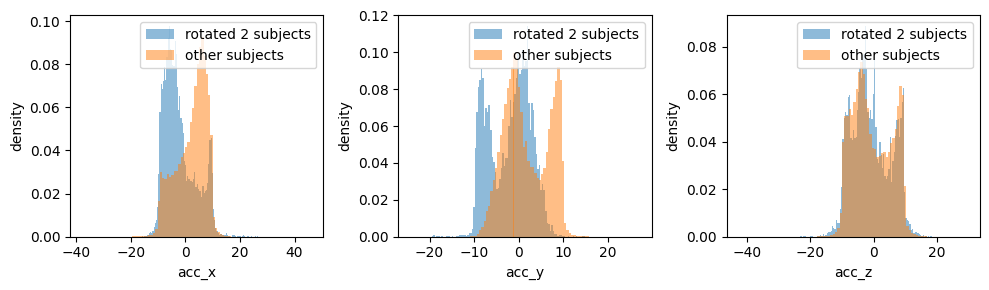
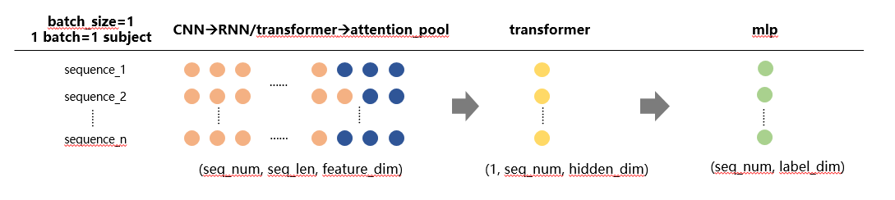

# CMI - Detect Behavior with Sensor Data

> 主题：tabular（传感器时序）｜ 子类：— ｜ 领域：医疗/行为识别 ｜ 类别：Featured
> 截止：2025-09-02 ｜ 队伍数：2657 ｜ 机制：代码赛 ｜ 指标：CMI_2025（多分类）
> 数据来源：`intel/cmi-detect-behavior-with-sensor-data/`（120 条主题索引 + 8 节正文：1st/2nd/4th/5th/6th/12th + 赛前思考 + agent 实验；31 条 write-up 标记中其余未收录）

## 1. 任务与数据

- **预测目标**：用可穿戴设备的多模态传感器数据（IMU 惯性、THM 温度、TOF 飞行时间）识别儿童的 18 类行为/手势。
- **数据形态**：短时序序列（约 75 帧），按受试者与试次组织；传感器组合可变（部分设备缺失某些传感器）。
- **构造陷阱（本场核心）**：
  - **设备佩戴错误**：存在受试者把设备戴反（绕 z 轴旋转 180°）的样本，属于数据质量陷阱。
  - **左右手差异**：左手佩戴的数据需要镜像/对齐到右手。
  - **缺失传感器**：不同样本的可用传感器不同，需要分开建模或做缺失感知。
  - **每个受试者、每个类别、每种朝向的样本数有限**，这直接决定了后处理空间。
- **数据规模**：训练 ~5100 条序列、测试 ~3500 条（1.2GB 数据但有效行数小，Ravi 提示"本质是小数据赛"）。
- **采集结构（金矿）**：4 朝向 × 18 手势 = 72 对里实际只录了 **51** 对；每受试者 51×2=**102 条**，每个组合标签（行为×朝向×手势）至多出现一次 → 后处理可解"无重复指派问题"。

## 2. 验证方案

| 方案 | 使用者 | 说明 |
| --- | --- | --- |
| 按受试者分组 CV | 多队 | 避免同一受试者同时出现在训练与验证中 |
| 剔除佩戴错误的受试者 | 1st | 从训练与验证中同时移除，避免噪声污染 |
| 按缺失模式分层验证 | 2nd | 不同传感器组合分别评估 |
| 受试者分组 10 折 | 6th | StratifiedGroupKFold |
| 重提交评估方差 | 4th/5th | 同一方案重提交私榜 0.868–0.880（流式 API 乱序导致） |

## 3. 方案谱系

| 方案 | 名次 | 关键点 |
| --- | --- | --- |
| 大集成（IMU-only/全特征加权 logits）+ 受试者结构后处理 + 朝向模型 | 1st | 剔除戴反受试者；无 scaler 最好；35 IMU 特征（x² 重要）；94 分位裁剪 ~120 |
| **组合标签（102 类）+ Hungarian 无重复后处理 + 相位对齐 mixup + 在线伪标签** | 2nd | 0.865→**0.900** 公开（后处理 +0.026）；阶段感知注意力 |
| 144 组合标签 + 无重复 max-llh 后处理 + 双架构 bagging | 4th | 重提交 0.868–0.880 的方差实录；选 0.876 |
| **受试者维度 Transformer**（subject-based）+ 历史量加权融合 | 5th | subject +0.02、融合 +0.01；最后 15 次提交反复评估选 2 |
| 分组 1D-CNN 多模态 + 手势段 U-Net + 100 网络平均 + **反置检测模型** | 6th | 无后处理；反置模型私榜 +0.013；完整左右手/反置修正配方 |
| group conv 分箱 + TOF 3D ResBlock + GRU+MHA(ROPE) + class-rank 集成 | 12th | 特征工程最全；拒调集成权重（防过拟合） |

## 4. 关键技巧

- **设备取证优先**：反置设备（180° z）直方图诊断 + 完整修正配方；左手镜像（acc_x/rot y,z/传感器交换/TOF 翻转）；rot 符号恢复；TOF -1 语义（→255/500）。
- **缺失模式分流**：2nd 的 4 变体；6th/1st/5th 的 TOF 缺失 >50% 切 IMU-only。
- **组合标签 + 无重复后处理**：102 类/受试者、每标签唯一 → Hungarian/max-llh 联合最大化（+0.02~0.03）。
- **事件结构注入网络**：阶段感知注意力（2nd）、手势段 U-Net 双池化（6th）、Transition/Gesture 段丢弃与相位 mixup（4th/2nd）。
- **受试者级上下文**：subject-dim Transformer（5th，+0.02）；乱序 API 带来方差（4th 实录）。
- **强 bagging**：2 网络 × 50 seeds（6th）、多架构 bagging（1st/4th）、class-rank voting（12th）。

## 5. 深读结论（2026-10 补）

- **本场是三件事的比赛**：设备取证（数据修正）、组合标签的无重复结构后处理（+0.02~0.03）、以及受试者级上下文（+0.02 但带方差）；网络架构是公共件。
- **采集结构就是答案**：51 对 × 2 = 102 条/受试者的结构让"逐条 argmax"升级为"受试者级指派问题"；2nd 的对照表（0.865→0.900）是本场最干净的单变量证据。
- **缺失是离散状态而非插补问题**：rot/THM/TOF 的缺失模式决定模型选择与推理路径。
- **流式乱序 API = 结构性方差**：4th 的 0.868–0.880 重提交实录与 5th 的"15 次提交反复评估"说明选择策略本身是分数（L22 的又一案例）。
- **agent 化的边界**：单模型 0.70 → 多模型规划 0.82（583863）——agent 的价值在编排而非单点。

## 6. 图表证据

**图 1：6th 的多模态分组网络**（topic 603592）——`../../intel/cmi-detect-behavior-with-sensor-data/bodies/603592_img/01.png`

*读图*：7 输入块（手势段/acc/rot/derived_acc/rotvec_diff/thm/tof）→ 分组 1D-CNN → 手势/非手势段双池化 → 三组预测头（块 1/12、IMU 1/4、全特征 1/4）。

**图 2：反置设备的分布证据**（6th）——`../../intel/cmi-detect-behavior-with-sensor-data/bodies/603592_img/05.png`

*读图*：两名反置受试者（蓝）的 acc_x/acc_y 与其余人（橙）镜像互换、acc_z 一致——180° 佩戴指纹。

**图 3：5th 的受试者级 Transformer**（topic 603542）——`../../intel/cmi-detect-behavior-with-sensor-data/bodies/603542_img/01.png`

*读图*：序列编码 → (seq_num, hidden) → 沿受试者维度 Transformer → MLP 输出每序列标签。

## 7. 可迁移性评估

- **可直接迁移**：
  - 传感器类任务先做**设备/方向/左右手一致性校正**，这是通用第一步。
  - 分模态分支 + 融合的架构范式。
  - "按缺失模式分模型"的思路（任何有异构缺失的数据都适用）。
  - 在评估约束已知时设计后处理。
- **需要前提**：
  - 需要理解传感器的物理含义（朝向、坐标系）。
  - 后处理技巧依赖评估集的具体构造。
- **不建议照搬**：
  - 只针对公开榜调优的后处理（2nd 的方案在私榜的表现需谨慎看待）。

## 8. 对新手的关键启示

1. **传感器类比赛的第一个动作是数据体检**（方向、左右手、缺失模式），不是搭模型。
2. **约束即信息**：知道"每个受试者每类样本数有限"就能设计有效后处理。
3. **多模态要用多分支**，不要把所有传感器糊成一个输入。
4. **重复训练同一模型**（不同种子）是最简单可靠的集成手段。

## 9. 出处

- 讨论区索引：`intel/cmi-detect-behavior-with-sensor-data/topics.md`（120 条）
- 已收录正文（8 节）：
  - agent 实验（phalanx，151 票）：https://www.kaggle.com/competitions/cmi-detect-behavior-with-sensor-data/discussion/583863
  - 赛前思考（Ravi Ramakrishnan，137 票）：https://www.kaggle.com/competitions/cmi-detect-behavior-with-sensor-data/discussion/582388
  - 6th（Jack/rsakata，115 票）：https://www.kaggle.com/competitions/cmi-detect-behavior-with-sensor-data/discussion/603592
  - 2nd（daiwakun，113 票）：https://www.kaggle.com/competitions/cmi-detect-behavior-with-sensor-data/discussion/603594
  - 1st（Ogurtsov 队，81 票）：https://www.kaggle.com/competitions/cmi-detect-behavior-with-sensor-data/discussion/603611
  - 5th（Ethan，79 票）：https://www.kaggle.com/competitions/cmi-detect-behavior-with-sensor-data/discussion/603542
  - 4th（dott，59 票）：https://www.kaggle.com/competitions/cmi-detect-behavior-with-sensor-data/discussion/603601
  - 12th（Ruby，53 票）：https://www.kaggle.com/competitions/cmi-detect-behavior-with-sensor-data/discussion/603564
- 未收录缺口（登记备查）：31 条 write-up 标记中的其余条目（3rd/7th–11th 等）
- 深读全文：`analysis/deep/cmi-detect-behavior-with-sensor-data.md`
