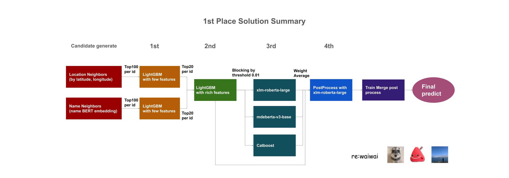
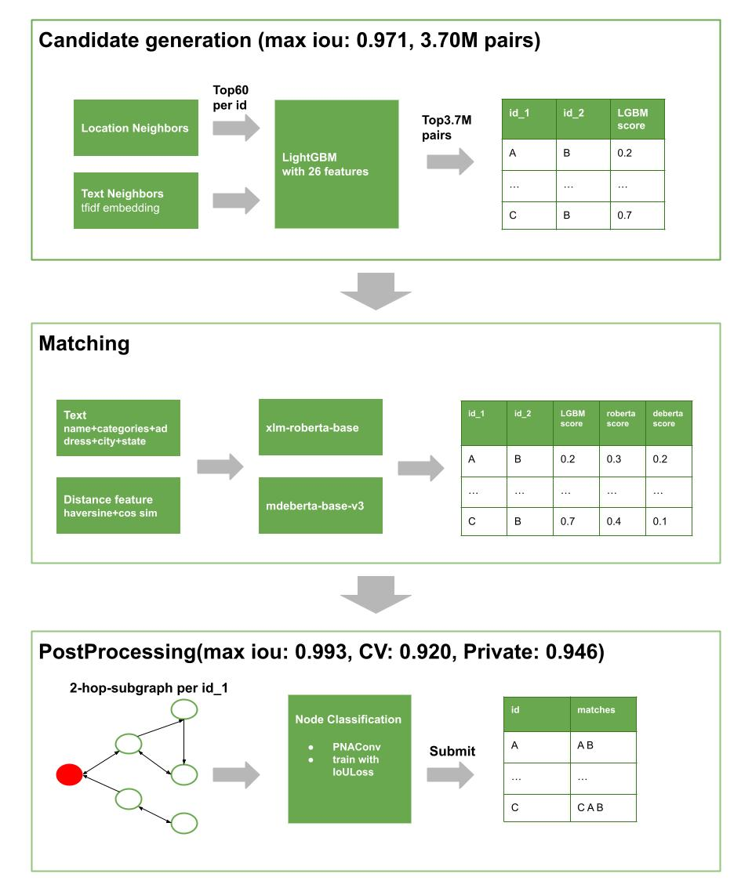
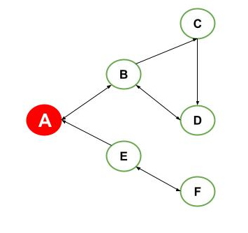
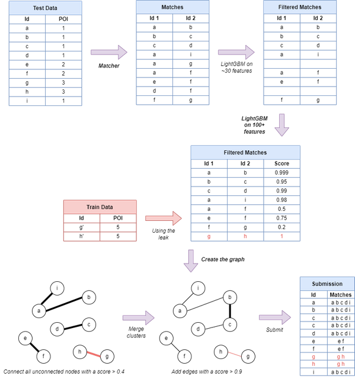
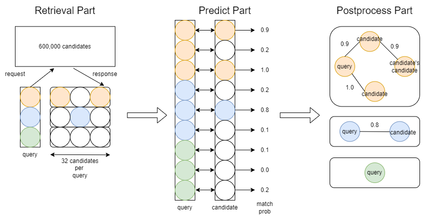

# Foursquare - Location Matching

> 主题：tabular（实体匹配）｜ 子类：— ｜ 领域：地理/POI ｜ 类别：Featured
> 截止：2022-XX-XX ｜ 队伍数：1079 ｜ 机制：标准赛 ｜ 指标：Jaccard（簇级匹配）
> 数据来源：`intel/foursquare-location-matching/`（80 条主题索引 + 6 篇 write-up 正文；深读升级 2026-10，Tier A #54）

## 1. 任务与数据

- 预测目标：把来自不同来源/语言的 POI（兴趣点）记录匹配为同一实体，按簇计算 Jaccard（实体匹配 / record linkage）。
- 数据形态：名称、地址、坐标、类别等字段；**多语言**（日/中/泰等需按语言分别预处理）；测试集约 60 万条记录，训练集约 2 倍。
- 构造陷阱（本场最突出）：
  - **比赛存在大规模数据泄漏**：社区帖指出约 **67% 的测试行**可通过公开数据泄漏获得；13th 明确指出"因为泄漏，已经无法区分好方案与过拟合方案"，这是比赛设计层面的重大缺陷；
  - 多语言字段需要分语言规范化；
  - 配对任务的正负样本极度不平衡；评测按簇而非按对计分。

## 2. 方案谱系

| 方案 | 名次（票数） | 关键点与数字 |
| --- | --- | --- |
| 四阶段 + 泄漏三步 | 1st（92） | 候选 100 地理+100 名称→20+20；LGBM（阈值 0.01）→xlm-roberta-large/mdeberta-v3/Catboost（CV 0.911）→后处理 0.9166；**泄漏三步 0.900→0.943→0.971**；双提交对冲；私 0.977 |
| 四阶段 + GNN 后处理 | 13th（102） | 60 候选/id→LGBM 26 特征（3.7M 对，max IoU 0.971）→xlm-roberta-base+mdeberta-v3→**PNAConv 2-hop 子图 + IoU loss（+0.02）**；私 0.946 |
| 多语言预处理 + Word Tour | 7th（66） | 语言专属分词（Sudachi/zh_segmentation/PyThaiNLP）+ 三种无监督预训练 + **Word Tour（TSP 一维化）**；LGBM 全量 2000 迭代 → **0.933→0.951**；Union-Find 后处理 |
| ArcFace 度量学习 + 双塔 | 3rd（61） | xlm-roberta-large ArcFace（列 SEP 拼接、经纬度 3 位切分）→双塔 bi-encoder→混合；后期弃 CV 改全量训练，被泄漏反噬 |
| 两段 LGBM + 组大小阈值 | 4th（59） | unidecode+类别分组+距离分位；1.1M 行离线训练；30 特征过滤<0.007→200+ 特征 20 折；**组大小自适应阈值**；最后一天用泄漏自动匹配 |
| Unidecode 工具帖 | 社区（128） | Café→Cafe 等字符归一化示例；本场预处理的基础件 |

## 3. 关键技巧

- **四段式流水线**：候选生成（地理+文本双路，召回优先）→ 过滤/分类（GBDT，高精度）→ 精细匹配（交叉编码器/双塔）→ **图后处理成簇**（Union-Find、GNN、组大小自适应阈值）。
- **多语言处理**：unidecode/罗马化 + 语言专属分词；4th 实证"翻译不如罗马化"（pykakasi 除外）。
- **图一致性**：成对分数不满足传递性，简单阈值会连锁误合并；13th 2-hop 子图 GNN 提升约 +0.02；7th 用最短距离≤2；4th 用组大小自适应阈值。
- **Word Tour**：高维 embedding → 聚类 → TSP 路径一维化 → GBDT 可用（7th 的通用部件）。
- **按实体分组验证**：`GroupKFold(group='point_')`（13th）；3rd 留出 60 万唯一 POI 验证。
- **泄漏审计与利用**：识别信号 = CV-LB gap 异常 / 过拟合模型 LB 更高 / CV 与 LB 相关消失；1st 三步利用（加 train-train TP → 删 train-train FP → 删 train-test FP）并保留对照提交。

## 4. 可迁移性评估

- 可直接迁移：实体匹配四段式；多语言字符归一化与语言专属分词；GNN/Union-Find 一致性后处理；组大小自适应阈值；按实体分组 CV；泄漏三信号审计。
- 需要前提：多语言模型（XLM-R 等）；图模型工具链；可用的外部/公共数据源（用于泄漏检测与利用）。
- 不建议照搬：在存在泄漏的比赛里过分相信榜单驱动的技术结论；跳过字符对齐直接用语义模型。

## 5. 深读结论（2026-10 补）

**一句话**：这是一场"实体匹配流水线 + 泄漏利用"的比赛——流水线决定能否进前排，泄漏处理决定前排里的位置。

- 四段式是全员骨架（1st/13th/7th/4th；3rd 用 ArcFace 替代前两段）。
- 多语言归一化先于语义模型；Word Tour 解决 embedding 的 GBDT 化。
- 图后处理是第二大增益：GNN +0.02、Union-Find、组大小自适应阈值、新对重预测（+0.0056）。
- 泄漏主导后半程：67% 测试行重叠；CV 失效三信号；1st 三步 0.900→0.943→0.971。
- 泄漏策略需报告+量化+对冲（1st 双提交；4th 最后一天才用）。

**数字账精选**：泄漏规模 ~67% 行；1st 0.900→0.943→0.971、CV 0.875→0.911→0.9166、终 0.977；13th 0.907→0.924→0.946（GNN +0.02）；7th 0.933→0.951；4th 1.1M 行 / 30→200+ 特征。

**失败学**：4th 的 tfidf（<3% 收益+FP）、翻译、反向地理编码、stacking；3rd 的 CV 被泄漏误导；13th 无（归因外部）。

**悬案**：67% 泄漏帖（335799）/调查帖（336518）未收录正文；抄袭帖（319620）与 Shopee 技巧帖（329472）未收录；官方是否调整榜单无记录。

## 6. 图表证据

> 路径相对本文件（`notes/tabular/`）：`../../intel/foursquare-location-matching/bodies/<topic>_img/NN.ext`

**图 1：1st 的四阶段流水线**（topic 336055）——候选生成→小特征 LGBM 过滤→富特征 LGBM→xlm/mdeberta/Catboost 集成→后处理→Train Merge（泄漏步骤）。

**图 2：13th 的四阶段与 GNN 后处理**（topic 336124）——60 候选/id、3.7M 对 → 交叉编码器 → 2-hop 子图 PNAConv 节点分类（IoU loss）；私 0.946。

**图 3：2-hop 子图示意**（topic 336124）——以 A 为中心，1 跳 B/E、2 跳 C/D/F，GNN 预测每个节点是否与 A 同 POI；用二阶一致性替代简单阈值。

**图 4：4th 的两段 LGBM + 泄漏合并 + 建图**（topic 335810）——~30 特征过滤 → 100+ 特征打分 → 连接 train 泄漏簇 → 建图（>0.9 加边、>0.4 合并孤立点）。

**图 5：7th 的检索-预测-后处理总览**（topic 335800）——60 万候选池、32 候选/query → 匹配概率 → 图后处理（边阈值+簇合并+孤立点保留）。

## 7. 对新手的关键启示

1. **配对/匹配类任务先想"召回-精判"**，别一上来就做全量二分类。
2. **先对齐字符空间，再对齐语义空间**：罗马化/去符号/分语言分词是跨语言匹配的基础。
3. **成对分类必须配图一致化**：成对分数 → 传递性约束 → 簇；留意组大小效应。
4. **泄漏会摧毁比赛的比较价值**：用三信号识别（CV-LB gap、过拟合 LB 更高、相关消失），报告并量化，保留无泄漏对照提交。
5. 多语言场景下，**预处理要分语言做**。

## 8. 出处

- 讨论区索引：`intel/foursquare-location-matching/topics.md`（80 条）
- 已收录 write-up（6 篇）：
  - Unidecode（128 票）：https://www.kaggle.com/competitions/foursquare-location-matching/discussion/320938
  - 13th GNN（102 票）：https://www.kaggle.com/competitions/foursquare-location-matching/discussion/336124
  - 1st（92 票）：https://www.kaggle.com/competitions/foursquare-location-matching/discussion/336055
  - 7th（66 票）：https://www.kaggle.com/competitions/foursquare-location-matching/discussion/335800
  - 3rd（61 票）：https://www.kaggle.com/competitions/foursquare-location-matching/discussion/338112
  - 4th（59 票）：https://www.kaggle.com/competitions/foursquare-location-matching/discussion/335810
- 深读全本：`analysis/deep/foursquare-location-matching.md`（11 组件 + 5 图证）
- 缺口登记：324653（基线，70）、321992（XGBoost 笔记，61）、319620（抄袭举报，59）、335799（67% 泄漏，59）、336518（泄漏调查，54）、329472（Shopee 技巧，54）未收录正文
