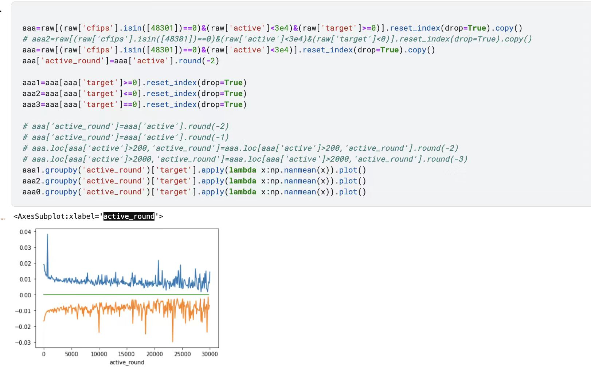
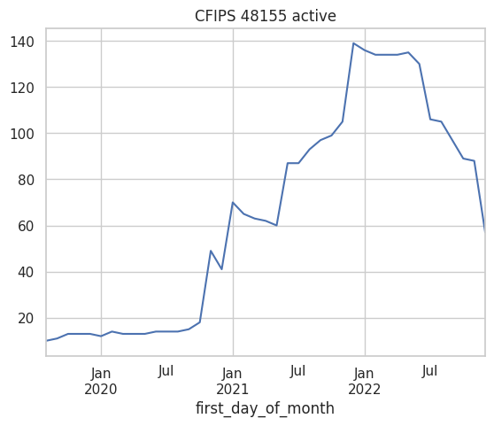
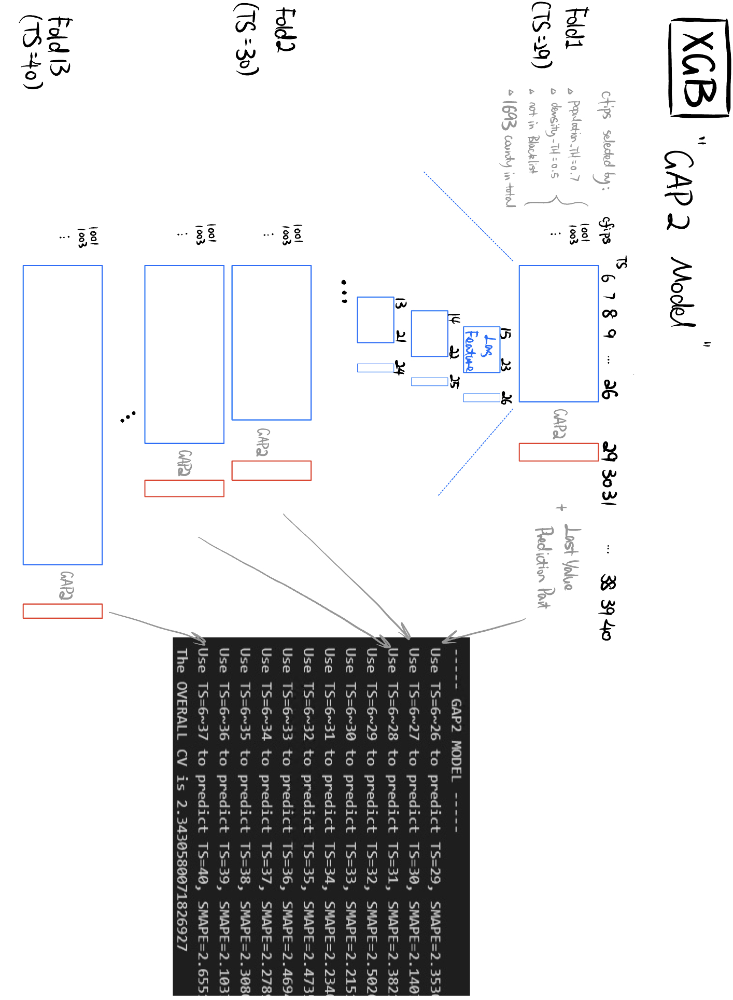

# GoDaddy - Microbusiness Density Forecasting

> 主题：tabular ｜ 子类：tabular-ts ｜ 领域：经济 ｜ 类别：Featured
> 截止：2023-06-16 ｜ 队伍数：3547 ｜ 机制：标准赛 ｜ 指标：SMAPE
> 数据来源：`intel/godaddy-microbusiness-density-forecasting/`（120 条主题索引 + 8 节正文：1st/2nd/3rd/6th + Hugo 复盘 + 基线帖 + 基线修正 + SVR；17 条 write-up 标记中其余未收录）

## 1. 任务与数据

- **预测目标**：预测美国 3135 个县未来 3/4/5 个月的"小微企业密度"（近似为 GoDaddy 域名数 / 人口）。
- **数据形态**：小规模面板数据（县 × 月），大量缺失与不一致；预测目标含有**疫情后结构性变化**。
- **构造陷阱**：
  - **数据质量是主要矛盾**：缺失值、异常值、跨县统计口径不一致（2nd place 把题目直接称为"数据清洗挑战"）。
  - **SMAPE 是相对误差**：小县的绝对变化会主导分数，因此模型需要在小规模序列上表现好——2nd place 专门质疑了这个指标的商业合理性。
  - 隐藏数据探针（probing）的边界模糊，2nd place 明确指出这是本场最大的不确定性。
- **口径陷阱（最大单项）**：2023 年所有县的分母切换到新 census 文件 → Last-Value 基线未修正 3.2776、修正后 **1.4631**（Chris 的修正帖）。
- **数据错误期**：Dec22/Jan23 约 60% 数据错误（1st 以 SMAPE 度量）→ 探针策略严重受损（LB 领先 0.2→0.08）。
- **预测结构**：3135 县 × 8 月 = 25080 个预测；私榜为 Mar/Apr/May（train 至 Dec，2 个月 gap 给跳变回撤留时间）。

## 2. 验证方案

| 方案 | 使用者 | 说明 |
| --- | --- | --- |
| 留出最后若干月做验证 | 1st | 与预测跨度（3–5 月）对齐 |
| 公开榜对照 + 基线校准 | 社区 | 出现"基线纠正"帖（Last-Value 基线从 3.28 修正到 1.46），说明**基线本身就有很大的误用空间** |
| 按县规模分层分析误差 | 2nd | 因 SMAPE 的相对性，需要分规模检查误差来源 |
| 逐折 SMAPE + 总 CV | Hugo | GAP2/3/4 三模型各 12 折（2.34/2.79/3.18） |
| 改善月数（替代均值） | 6th | 异常月份主导均值；按"改善月数"判断方案 |

## 3. 方案谱系

| 方案 | 名次 | 关键点 |
| --- | --- | --- |
| 线性回归（4–5 特征）+ LB 探针 | 1st | 试遍一切后选 LR；最后窗口 CV + 早期停止贪心；不折腾清洗 |
| 数据清洗优先（continuous contract 平滑 + 逐县探针 + 回撤） | 2nd | SMAPE 贡献公式；无前视特征；探针边界质疑 |
| **倍率 + GRU**（41 月→18 序列/县→Top 90%） | 3rd | 探针乘子 1.0045 后处理：12th→3rd |
| 目标展平 + n_cross 增强框架 + 黑名单 | 6th | `coef=1/(0.007*(active/10+105))+1`；×1.001 后处理 |
| XGB 三 GAP（相对目标）+ GRU（cdeotte CV） | Hugo 复盘 | 发现"模型只学全局线性趋势，last×1.01x 类似" |
| 全局线性乘子 + RAPIDS SVR | Giba | 增益表 0.0171→0.4750；RAPIDS 34× |

## 4. 关键技巧

- **倍率/比值/年化率目标**：3rd/Hugo/Giba/6th 殊途同归；连乘还原。
- **口径修正优先**：训练统一 2021 census；2023 预测调整新分母（3.28→1.46）。
- **跳变处理**：大跳变常回撤（CFIPS 48155 图）→ continuous contract 平滑/黑名单/回撤假设；2 个月 gap 是回撤窗口。
- **小县分流**：Last Value + 整数取整；线性模型只用于人口 >25k（Chris）/切点 ~5000（2nd）。
- **SMAPE 偏好**：相对误差放大基数小县；归零→非零单县月贡献 ~0.0638。
- **探针与纪律**：公式化灵敏度（4 位小数可辨 <1% 单县变化）；但数据错误期探针失效；边界争议（2nd）。
- **简单模型**：LR/XGB/SVR/GRU 都在 0.01 量级内；特征 4–5 个足够。

## 5. 深读结论（2026-10 补）

- **本场是"倍率建模 × 数据质量 × 探针"的三重奏**：模型差异 ≤ 数据修正与探针的量级；冠军用 4–5 特征的线性回归。
- **口径修正是最大单项**：census 换分母让 Last-Value 基线 3.28→1.46；不做修正的模型在 2023 私榜系统性错位。
- **跳变回撤是数据质量的核心模式**：方法学变更/欺诈/误分类造成的跳变会回归；平滑与 2 个月 gap 是对策。
- **探针价值与数据质量绑定**：Dec/Jan 数据错误让 1st 的探针优势缩水（0.2→0.08）；探针结论必须在口径对齐后采信。
- **小县分流的必要性有解析依据**：SMAPE 相对性 + 25% 县最小变化大于模型典型预测幅度。

## 6. 图表证据

**图 1：目标展平（6th）**（topic 417821）——`../../intel/godaddy-microbusiness-density-forecasting/bodies/417821_img/02.jpeg`

*读图*：按 active 分箱后正/负目标组的均值分层——active 越小目标绝对幅度越大；据此构造 flatten 变换。

**图 2：大跳变回撤（2nd）**（topic 395264）——`../../intel/godaddy-microbusiness-density-forecasting/bodies/395264_img/01.png`

*读图*：CFIPS 48155 active 从 ~10 急升 ~140 后回落 ~60——跳变回撤的直接证据。

**图 3：Hugo 的 XGB 逐折 CV**（topic 394822）——`../../intel/godaddy-microbusiness-density-forecasting/bodies/394822_img/01.jpg`

*读图*：GAP-2 模型 12 折（TS=26..38→29..40）逐折 SMAPE 2.14–2.655、总 2.343；选择口径 1693 县 + Last Value 拼接。

## 7. 可迁移性评估

- **可直接迁移**：
  - **相对指标 → 预测相对变化**（倍率建模）是时间序列的通用技巧。
  - 先做数据质量审计，再建模。
  - 自己复算公开基线，确认其正确性。
  - 指标偏好分析：理解指标对哪些样本更敏感，再决定损失与加权。
- **需要前提**：
  - 面板数据的缺失处理需要领域知识（哪些 0 是真 0，哪些是缺失）。
  - 倍率模型要求基期水平可得。
- **不建议照搬**：
  - 依赖隐藏数据探针的策略（边界不明，风险高）。
  - 直接套用公开 notebook 的基线数值。

## 8. 对新手的关键启示

1. **简单模型能赢**：冠军是线性回归——先问"这个问题的难点在模型还是在数据"。
2. **指标要先读懂**：SMAPE 的相对性决定了整个建模方向。
3. **公开基线的数字要自己验证**，本场出现了近一倍的误差。
4. **时间序列的通用套路**：预测变化量/倍率 + 基期回乘。

## 9. 出处

- 讨论区索引：`intel/godaddy-microbusiness-density-forecasting/topics.md`（120 条）
- 已收录正文（8 节）：
  - 线性回归基线（Chris Deotte，196 票）：https://www.kaggle.com/competitions/godaddy-microbusiness-density-forecasting/discussion/373099
  - 基线修正（Chris Deotte，141 票）：https://www.kaggle.com/competitions/godaddy-microbusiness-density-forecasting/discussion/389215
  - 3rd 倍率 GRU（84 票）：https://www.kaggle.com/competitions/godaddy-microbusiness-density-forecasting/discussion/418287
  - 1st（@kaggleqrdl，48 票）：https://www.kaggle.com/competitions/godaddy-microbusiness-density-forecasting/discussion/395131
  - Giba RAPIDS SVR（36 票）：https://www.kaggle.com/competitions/godaddy-microbusiness-density-forecasting/discussion/395011
  - 6th 目标展平（24 票）：https://www.kaggle.com/competitions/godaddy-microbusiness-density-forecasting/discussion/417821
  - Hugo 复盘（24 票）：https://www.kaggle.com/competitions/godaddy-microbusiness-density-forecasting/discussion/394822
  - 2nd 数据清洗（Daniel Phalen，19 票）：https://www.kaggle.com/competitions/godaddy-microbusiness-density-forecasting/discussion/395264
- 未收录缺口（登记备查）：17 条 write-up 标记中的其余条目（含 SMAPE 用法帖 373274）
- 深读全文：`analysis/deep/godaddy-microbusiness-density-forecasting.md`
