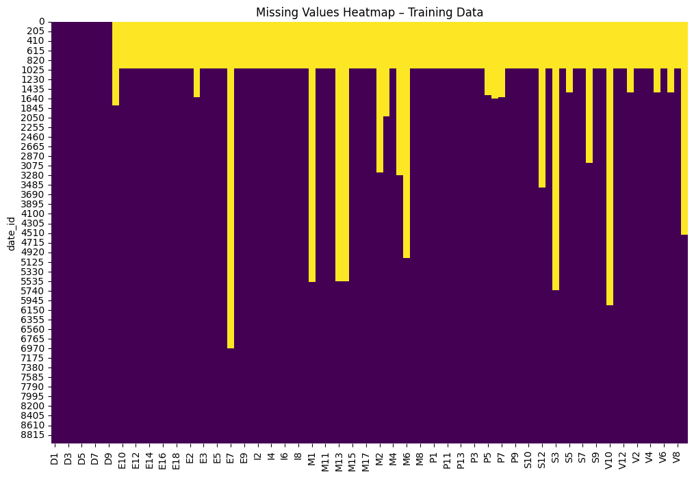

# Hull Tactical - Market Prediction

> 主题：tabular ｜ 子类：— ｜ 领域：金融 ｜ 类别：Featured
> 截止：2026-06-25 ｜ 队伍数：3677 ｜ 机制：代码赛 ｜ 指标：Sharpe（风险调整后收益）
> 数据来源：`intel/hull-tactical-market-prediction/`（120 条主题索引 + 8 篇 write-up 正文）

## 1. 任务与数据

- 预测目标：预测标普 500 的前瞻超额收益（`market_forward_excess_returns`，经 MAD 缩尾处理），并据此决定仓位规模。
- 指标特性（决定性）：评分是 Sharpe 比率——不只是预测准不准，更取决于仓位管理与风险控制。
- 数据形态：宏观/市场特征族 + 收益率目标；数据量小，信噪比极低。

## 2. 验证方案

| 方案 | 使用者 | 说明 |
| --- | --- | --- |
| Walk-forward（滚动前向）验证 | 4th | 与金融实盘一致，避免任何前视偏差 |
| Sharpe / 波动率双指标评估 | EDA 帖 | 不只看收益，还看风险 |
| 分位与极值分析 | 2.6 public | 检查策略在极端市场下的行为 |

## 3. 方案谱系

| 方案 | 名次 | 关键点 |
| --- | --- | --- |
| 纯规则 alpha + 精细的组合构建框架（无机器学习模型） | 4th | 作者明确表示成功"一半来自组合构建与风险管理，而非预测本身"；几乎不做超参优化，只用 walk-forward |
| 特征与标普走势的 EDA 驱动分析 | 2.6 public | 把特征与 log SP500 叠加可视化，标注美联储降息周期 |
| 单体模型 + 简单决策 | 61st 银牌 | 简单方案也能进入奖牌区 |
| 结构化 EDA + 线性/规则基线 | 社区 | 提供特征族统计、相关性与基线 Sharpe |

## 4. 关键技巧

- 组合构建与预测同等重要：在 Sharpe 指标下，仓位缩放、波动目标、回撤控制直接决定名次。
- 走前向验证：金融赛必须避免任何形式的未来信息泄漏。
- 规则型 alpha 依然有效：4th place 的 alpha 在赛前就存在，赢在工程实现。
- 宏观语境分析：把特征与市场大事件（降息周期）叠加解读，是理解低信噪比数据的有效方式。
- 不要过度优化：4th 几乎不做超参搜索，因为低信噪比下容易过拟合。

## 5. 可迁移性评估

- 可直接迁移：指标为风险调整收益时，先搭组合构建框架，再谈预测模型；低信噪比数据下少调参多验证；walk-forward 是金融时序的默认验证方式。
- 需要前提：需要理解金融概念（超额收益、Sharpe、缩尾）。
- 不建议照搬：用常规 ML 流程（堆特征 + 调参 + 集成）去追 Sharpe，而忽视仓位管理。

## 6. 对新手的关键启示

1. 先看指标到底是什么——Sharpe 与 MSE 是完全不同的问题，"预测准"不等于"赚钱"。
2. 低信噪比场景下，简洁 + 稳健优于复杂。
3. 组合构建是独立的一门手艺，值得单独学习。
4. 无模型的规则策略也能进前列，别把 Kaggle 等同于机器学习。

## 7. 轻读结论（2026-10 补）

**一句话**：Sharpe 指标 + 单资产 + 逐月真实数据 → **组合构建与风险管理 >> 预测精度**：**第 4 名完全不用 ML**，靠"赛前已有的短期反转 alpha + 逆波动率加权 + 波动率目标控制"拿到名次，并自评"vol overlay 的贡献大于任何 alpha 改动"。

- 4th（718664）：`Portfolio = Alpha + Risk Management`；逆波动率加权（`w ∝ 1/σ`，回避协方差估计误差，稀疏 alpha 未必拿最大权重）；波动率目标 `L=σ_target/σ̂`、`clip(L·w, 0, 2)`、长窗口+定期更新；特征只留极少数且目的是**降噪**（"特征不必预测收益"）。
- 2.6 公榜（663043）：6800→130 个相对化特征；目标工程把仓位映射回收益（负→0、正→2，尾部 10% 放大到 4/-2 后裁剪），0/2 分界用无风险利率 ≈3.25%；9 种目标实验（含 Kaplan-Meier）。
- 61st（715547）：14 特征 + 滞后/滚动统计 = 224 特征；**单 LightGBM**（集成一致更差，奥卡姆剃刀）；理念=不预测精确值，只判相对正负并保守决策。
- 社区：do-nothing 基线 0.469、随机提交可能夺冠、赛后"顶级方案在哪"（1177：无顶级 write-up）。

**裁决**：风险预算（波动率目标/杠杆裁剪）优先于再挖 alpha；稳健的逆波动率优于均值方差优化；金融特征默认相对化+滚动化；赛后金融赛方法论文献稀缺，引用以可复现的组合构建为准。

**悬案**：1st–3rd/5th–10th 方案未公开；4th 的 alpha 细节保密；vol overlay 参数未给具体值。

## 8. 图表证据

**图 1**（topic 610981）：训练缺失结构——最前约 1000 行全列缺失、若干列成段缺失，决定特征可用区间，也是本场 EDA 帖成为最高票技术帖的原因。

## 9. 出处

- 讨论区索引：`intel/hull-tactical-market-prediction/topics.md`（120 条）
- 已收录 write-up（8 篇）：
  - 4th（39 票）：https://www.kaggle.com/competitions/hull-tactical-market-prediction/discussion/718664
  - EDA（47 票）：https://www.kaggle.com/competitions/hull-tactical-market-prediction/discussion/610981
  - 榜单 EDA（11 票）：https://www.kaggle.com/competitions/hull-tactical-market-prediction/discussion/663201
  - 2.6 public 方案（16 票）：https://www.kaggle.com/competitions/hull-tactical-market-prediction/discussion/663043
  - 61st 银牌（11 票）：https://www.kaggle.com/competitions/hull-tactical-market-prediction/discussion/715547
  - 163rd（Sharpe 2.16）：https://www.kaggle.com/competitions/hull-tactical-market-prediction/discussion/714278
  - 随机提交讨论（44 票）：https://www.kaggle.com/competitions/hull-tactical-market-prediction/discussion/608135
  - "顶级方案在哪"（1177）：https://www.kaggle.com/competitions/hull-tactical-market-prediction/discussion/717746
- 轻读全本：`analysis/deep/hull-tactical-market-prediction.md`（Tier B 轻读：对照矩阵/裁决/证据分级/悬案 + 1 图证）
