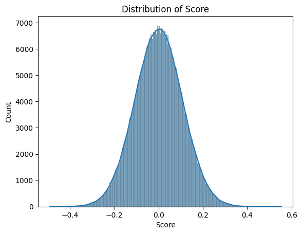

# MITSUI&CO. Commodity Prediction Challenge

> 主题：tabular ｜ 子类：tabular-ts ｜ 领域：大宗商品/金融 ｜ 类别：Featured
> 截止：2026-01-16 ｜ 队伍数：1700+ ｜ 机制：代码赛 ｜ 指标：加权相关系数类
> 数据来源：`intel/mitsui-commodity-prediction-challenge/`（80 条主题索引 + 6 篇 write-up 正文）

## 1. 任务与数据

- 预测目标：预测大宗商品相关标的的未来收益（多资产时序回归）。
- 数据形态：行情 + 宏观/基本面特征；非平稳、信噪比低。
- 构造陷阱：
  - 市场结构随时间为变化 → 静态模型会失效。
  - 训练/测试的时间划分必须严格（避免未来信息）。

## 2. 验证方案

| 方案 | 使用者 | 说明 |
| --- | --- | --- |
| **CombinatorialPurgedGroupKFold** | 15th | 金融时序的标准做法（分组 + 清洗 + 组合式划分） |
| 多阶段滚动评估 | 多队 | 观察模型在数据更新中的稳定性 |

## 3. 方案谱系

| 方案 | 名次 | 关键点 |
| --- | --- | --- |
| **推理期在线训练**（每 7 天用新标注数据重训）+ 特征工程 + 集成 | 15th | 核心是"动态更新"而非静态模型 |
| 个人方案（学生参赛者） | 5th | 见讨论区；同属时间序列建模路线 |
| 其他方案 | 26th / 89th / 97th | 见讨论区 |

## 4. 关键技巧

- **在线训练（inference-time retraining）**：每 7 天用新数据重训模型以适配市场变化——这已是金融时序赛的**共识级做法**（Optiver、Enefit、Jane Street 均如此）。
- **CombinatorialPurgedGroupKFold**：金融时序的验证标准（组合式划分 + 清洗窗口 + 分组）。
- **集成**：多模型平均提升稳定性。
- **特征工程**：宏观与微观特征结合。

## 5. 可迁移性评估

- **可直接迁移**：
  - **能在线更新就更新**——金融/实时赛制的第一优先。
  - CombinatorialPurgedGroupKFold 作为金融时序验证模板。
  - 低信噪比场景下以集成换稳定性。
- 需要前提：推理期可获取新标签（代码赛机制）；

  需要可快速重训的轻量流水线。
- 不建议照搬：静态训练后不再更新。

## 6. 对新手的关键启示

1. **"模型要不要更新"是金融时序赛的第一个决策**（本场 15th 的核心创新就是这个）。
2. **验证方法要能处理时间清洗**（purge/embargo）。
3. 与 Enefit、Optiver、Jane Street 对照可确认：**在线学习是跨年度的稳定规律**。

## 8. 轻读结论（2026-10 补）

**一句话**：本场最反直觉的结论是"**越简单越强**"——5th 只用 4 天窗 RNN + 单日 MLP 平均（私 0.532）；10th 用正则化 naive（标准化排名 + 正则化协方差）拿 0.479 进奖区；89th 直接提交训练标签的排名均值也到 0.387；而 50 万次随机提交模拟显示 std≈0.107，(-0.302, 0.302) 内分数与运气无法区分。

- 5th（670526）：4 天窗 RNN + 单日 MLP 简单平均；原始特征 + 缺失填 -1 + LayerNorm；T4 上 3–4 分钟/模型；单 RNN 0.509。
- 15th（668673）：推理期每 7 个新标签重训一组模型；CombinatorialPurgedGroupKFold；attention/residual/autoencoder 集成；2658→800（互信息）；损失 0.2×MSE+0.8×(1−Spearman)；0.134→0.110→0.445（轮次分数，归因需谨慎）。
- 10th（668589）：正则化 naive 终榜 0.479；判断"~3 个月测试窗 + 收益型价差结构 → ML 难有统计优势"。
- 89th（668781）：常量排名均值预测 −0.273 → 0.171 → 0.387（抗故障保险提交）。
- 规则/基础设施：54 票澄清帖（1 分钟推理、状态缓存、warm-up、批处理）、数据集中途更新、4 个 target 对含退市股票、最后一轮大量提交失败。

**裁决**：低信噪比 + 短测试窗 + 高噪声指标 → 稳健简单解常常最优；推理期"能跑完"优先于"跑得好"；在线重训练的增益在本场无法与噪声分离（15th 的分数跳变不能单独作为证据）。

**悬案**：1st–4th 方案未收录；官方指标与负分机制未整理；图证仅 1 张。

## 9. 图表证据

**图 1**（topic 599772）：50 万次随机提交分数直方图（均值≈0、std≈0.107）——幸运区间与真实技能区间重叠。

## 10. 出处

- 讨论区索引：`intel/mitsui-commodity-prediction-challenge/topics.md`（80 条）
- 已收录 write-up（6 篇）：
  - 15th 在线训练（16 票）：https://www.kaggle.com/competitions/mitsui-commodity-prediction-challenge/discussion/668673
  - 5th ZLF（8 票）：https://www.kaggle.com/competitions/mitsui-commodity-prediction-challenge/discussion/670526
  - 10th regularized-naive（17 票）：https://www.kaggle.com/competitions/mitsui-commodity-prediction-challenge/discussion/668589
  - 运气模拟（33 票）：https://www.kaggle.com/competitions/mitsui-commodity-prediction-challenge/discussion/599772
  - 26th：https://www.kaggle.com/competitions/mitsui-commodity-prediction-challenge/discussion/669234
  - 89th：https://www.kaggle.com/competitions/mitsui-commodity-prediction-challenge/discussion/668781
  - 97th：https://www.kaggle.com/competitions/mitsui-commodity-prediction-challenge/discussion/668698
