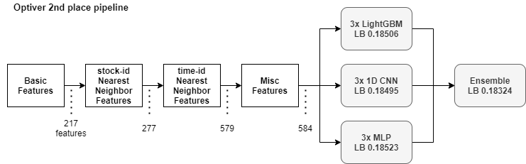
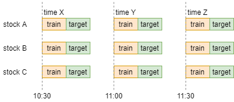
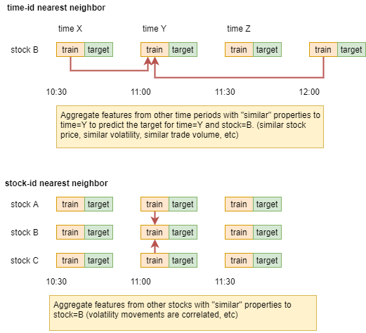

# Optiver Realized Volatility Prediction

> 主题：tabular ｜ 子类：tabular-ts ｜ 领域：金融 ｜ 类别：Featured
> 截止：2022-01-10 ｜ 队伍数：3852 ｜ 机制：代码赛 ｜ 指标：RMSPE
> 数据来源：`intel/optiver-realized-volatility-prediction/`（120 条主题索引 + 8 篇 write-up 正文）

## 1. 任务与数据

- **预测目标**：由订单簿快照数据预测股票的已实现波动率（按 10 分钟窗口聚合）。
- **数据形态**：高频订单簿（book/trade 两类表），需要大量聚合特征工程。
- **构造陷阱**：数据做了归一化，但**时间顺序可被逆向还原**（1st 的核心贡献之一），不还原就无法做正确的时间序列验证。

## 2. 验证方案

| 方案 | 使用者 | 说明 |
| --- | --- | --- |
| 逆向还原 time-id 顺序 + 时间序列 CV | 1st | tick-size 还原价格 → t-SNE 排序 time_id（用 AMZN 真实行情校验方向）；4 折时间序列 CV、每折 10% 验证 |
| PurgedGroupTimeSeriesSplit | 社区 | 按股票分组 + 时间隔离 |
| 与后续赛事（Jane Street）方法互通 | 社区 | 跨赛事复用 notebook 与验证方案 |

## 3. 方案谱系

| 方案 | 名次 | 关键点 |
| --- | --- | --- |
| **7 种最近邻聚合特征**（轴：time_id / stock_id；度量：真实价格 / 波动率 / 成交额；距离：Canberra / Mahalanobis / Manhattan） | 1st | 特征把分数从 0.21 提到 0.19；单用 time-id 近邻仅 #197、单用 stock-id #5、**两者叠加 #2** |
| GNN 方案 | 金 | 以 time_id 距离构图；GraphSAGE+5 近邻 0.187；TransformerConv+2/3 近邻 + 多种子集成到 **0.18345**（公开） |
| WAP 家族 → 流动性 → **TVPL** | 15th | log(TVPL₂) 与 log(vol) 相关 ~0.88；成交量用整段、流动性用尾段 |

**冠军自己的消融实验（很有价值）**：

| 配置 | 私有 RMSPE | 说明 |
| --- | --- | --- |
| 单个 LGBM | 0.19699 | **单模型就足以夺冠** |
| 5×LGBM 集成 | 0.19675 | 集成收益 ≈ 0.0002 |
| 3×1D-CNN | 0.19644 | 单类型中最佳 |
| 3×MLP | 0.19772 | |
| 混合集成（5 LGBM + 3 CNN + 3 MLP） | 最佳 | 收益同样很小 |
| **去泄漏版**（波动率+成交额近邻，GroupKFold） | 0.20367（#9） | **不用 tick-size 泄漏也在金区**；泄漏值 ~0.006–0.007 |

结论：**在本场，集成的边际收益远小于特征工程的收益**。

## 4. 关键技巧

- **最近邻聚合**：对相似窗口/相邻时间点做近邻聚合，是本场最大的单点提升。
- **逆向数据的时间结构**：归一化数据不代表时间信息不可恢复。
- **单模型优先**：先确认单模型强度，再决定是否投入集成（冠军消融证明了这点）。
- **跨赛事迁移**：与 Jane Street 等金融赛共享验证方案与特征思路。
- **时间序的三种用途**（比"当特征"更稳）：时间序列 CV、对抗验证找漂移特征、剔除特殊事件期。
- **金融特征推导**（15th）：官方 WAP 是 `-Σ size·log(距离)` 的极小点；换 log→幂得到 wap_k 家族，其目标函数值天然满足"流动性"公理；**TVPL = 成交额/流动性** 与波动率强相关。
- **稳健性路线**（3rd）：预测"目标/0–600s 波动率"的比值（非平稳→比值平稳）；300s 半切（用 0–300s 特征预测 300–600s，train+test 拼接）把测试信息蒸馏进特征；宏观均值特征。
- **负结果**：秩归一化对私榜几乎无影响（0.19699 vs 0.19708）；替代 WAP 家族无直接收益。

## 5. 深读结论（2026-10 补）

- 本场的分数结构：**近邻特征 −0.02 级 >> 时间序 CV −0.006 >> 集成 −0.0015**；单 LGBM 已是 #1——"先消融、后投入"的最佳教材。
- "泄漏必需吗？"的定量答案：去泄漏仍 #9（金区），泄漏值 ~0.006–0.007；不可替代的是**多维度近邻的组合**（正交轴/度量叠加）。
- 在头部密集的 RMSPE 榜上，集成改变的是分数而不是名次——评估集成价值必须结合名次密度。

## 6. 图表证据

**图 1：冠军管线（特征演进 + 三分支集成）** —— `intel/optiver-realized-volatility-prediction/bodies/274970_img/01.png`

**图 2：时间轴结构** —— `.../274970_img/04.png`

**图 3：两类近邻特征（time-id / stock-id）** —— `.../274970_img/05.png`

> 1st 帖另有两张 `.bmp` 图（t-SNE 结果、CV-LB 曲线）：BMP 不能内联渲染于 GitHub，保留在 `.../274970_img/02.bmp、03.bmp`。

## 7. 可迁移性评估

- **可直接迁移**：
  - **先验证"单模型能到哪"再决定集成投入**——这是最容易被忽视的工程纪律。
  - 近邻聚合特征（同实体/相邻时间的统计）在各种时序任务通用。
  - 尝试逆向数据的隐含结构（顺序、分组、泄漏）。
- **需要前提**：
  - 高频数据的特征工程成本较高。
- **不建议照搬**：
  - 盲目堆集成（本场集成收益接近 0.0002，却要 3–5 倍算力）。

## 8. 对新手的关键启示

1. **特征工程 > 集成**：本场单 LGBM 就能夺冠，集成只值 0.0002。
2. **先做消融**：冠军自己动手消融，量化了每个组件值多少分——这是最好的学习习惯。
3. **数据的隐含结构值得挖掘**（时间顺序、tick-size 泄漏等）。

## 9. 出处

- 讨论区索引：`intel/optiver-realized-volatility-prediction/topics.md`（120 条）
- 已收录 write-up（8 篇）：
  - 1st（501 票）：https://www.kaggle.com/competitions/optiver-realized-volatility-prediction/discussion/274970
  - 往届获奖方案汇总（150 票）：https://www.kaggle.com/competitions/optiver-realized-volatility-prediction/discussion/249523
  - 特征汇总（134 票）：https://www.kaggle.com/competitions/optiver-realized-volatility-prediction/discussion/256080
  - GNN 方案（85 票）：https://www.kaggle.com/competitions/optiver-realized-volatility-prediction/discussion/275185
  - 15th（61 票）：https://www.kaggle.com/competitions/optiver-realized-volatility-prediction/discussion/276137
