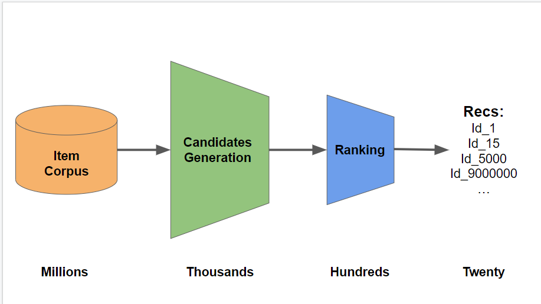
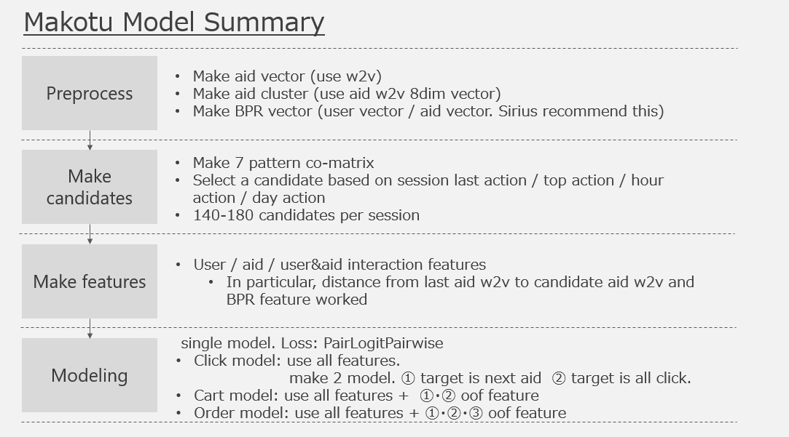
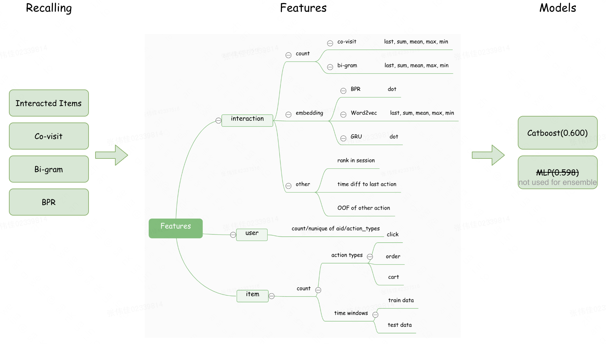
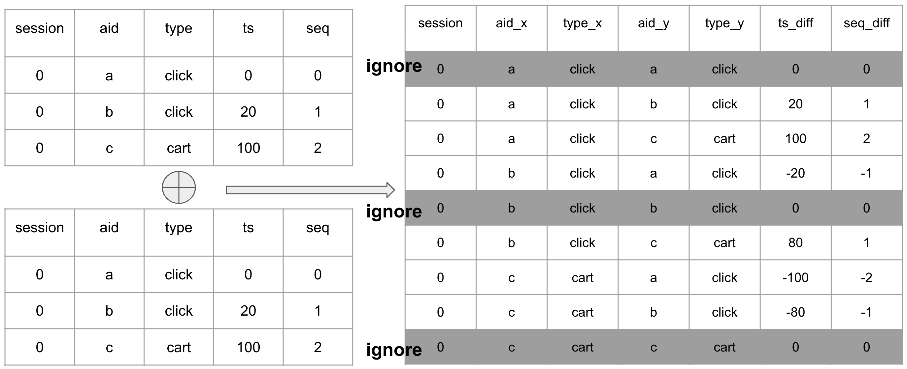
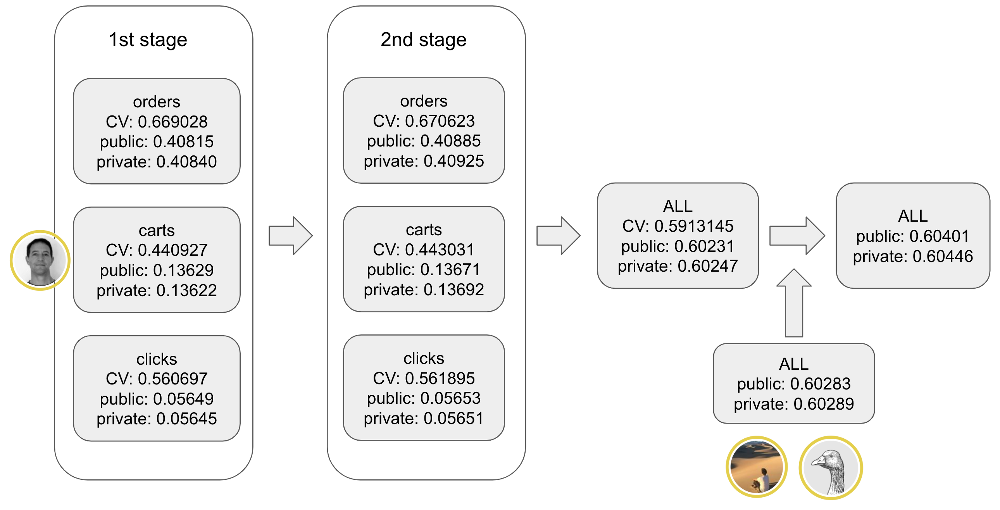
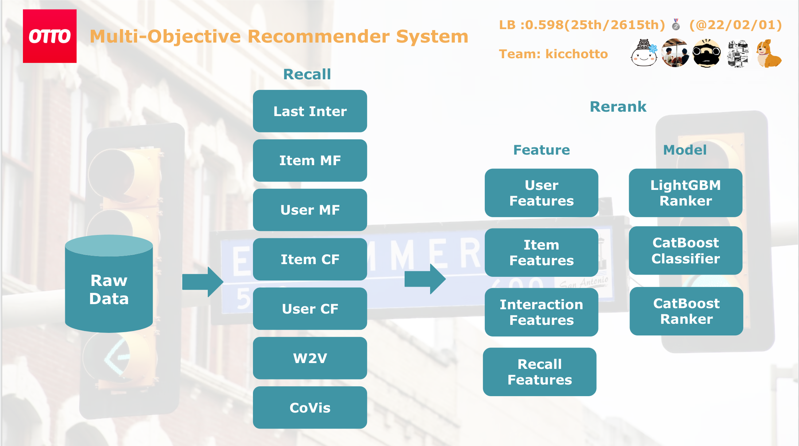

# OTTO - Multi-Objective Recommender System

> 主题：tabular ｜ 子类：recsys ｜ 领域：电商推荐 ｜ 类别：Featured
> 截止：2023-01-31 ｜ 队伍数：2574 ｜ 机制：标准赛 ｜ 指标：Weighted Recall@20
> 数据来源：`intel/otto-recommender-system/`（120 条主题索引 + 7 节正文；**1st（384022）等 19 条 write-up 未收录**——本笔记不含冠军方法的一手材料）

## 1. 任务与数据

- **预测目标**：给定用户会话（session）行为序列，预测接下来可能交互的商品（点击 / 加购 / 下单三类目标），指标为加权召回率。
- **指标权重**：clicks 0.10 / carts 0.30 / orders 0.60（官方 WeightedRecall@20）。
- **数据形态**：12.9M 会话、185 万商品、2.16 亿事件（194.7M 点击/16.9M 加购/5.1M 下单），候选空间是全库，因此**必须先生成候选**。
- **核心结构**：与 H&M 类似——**召回（candidate generation）+ 排序（ranking）两阶段**，且"规则型召回"就能拿到很高分数。

## 2. 验证方案

| 方案 | 使用者 | 说明 |
| --- | --- | --- |
| 时间切分（用最后一段会话做验证） | 多队 | 与会话预测窗口对齐 |
| 分目标（点击/加购/下单）分别评估 | 多队 | 三类目标的行为模式差异大 |
| 1/20 会话随机采样做 CV | 20th | 实验时间压到 10–30 分钟，且与完整 CV/LB 排序保持同步 |
| GroupKFold（按 session）+ train 前 3 周/valid 第 4 周切 A/B | 教程/多队 | 标准协议（Valid A≈测试、Valid B≈私榜） |
| 公开 notebook 对照 | 社区 | 有完整的 "How To Build a GBT Ranker Model" 教程帖作为公共基线 |

## 3. 方案谱系

| 方案 | 名次 | 关键点 |
| --- | --- | --- |
| 候选生成 + XGB 重排（20 个共现矩阵） | 规则第 3（Chris 队） | 规则 0.590 → +reranker 0.011 = 单模 0.601；20 矩阵清单完整 |
| 近单模型：80–120 候选 + 单 LGBM 三目标 | 5th | 公开 0.604 / 私榜 0.603；rank gain 标签 6/3/1 |
| 四人独立方案 + 秩融合 + 堆叠 | 3rd（imaginary） | 0.598–0.600 → 秩融合 0.603 → 堆叠 0.604；跨目标 OOF 链 |
| item2item 特征工程 + 秩融合 | 2nd（ONODERA 部分） | 93→~5k→400-500 特征；团队融合 0.60446 私榜 |
| 七路召回全家桶 + 三模型集成 | 20th | LastInter/ItemMF/UserMF/ItemCF/UserCF/W2V/CoVis；分数路线 0.5799→0.5985 |
| GBT Ranker 教程 | 社区高票（335 票） | 候选 rerank 的标准流程与内存/GPU 工程 |

## 4. 关键技巧

- **共现矩阵的变体空间就是主战场**：动作对（any/click→cart/cart→order/order→order）、方向性（forward-only）、时间衰减 `(1/2)^(Δt/h)`、邻距（±1/2/3/6）、最近 2-3 周、冷启动（首行为）、时段（14 点前后）、历史长度分桶。
- **候选召回率优先**：规则 0.590 vs 加 reranker 0.601——排序只值 ~0.011；5th 的候选自排序已达 0.585。
- **跨目标 OOF 链**：carts 预测作为 orders 特征（最佳）；cart+order 合并 + 正样本权重 5/10（+0.002）；clicks→orders 无效。
- **按秩融合**：`1/r_a + 1/r_b + 1/r_c`（fill 1/50）；在 (score, rank) 上堆叠可再 +0.001。
- **K×负采样联合调参**：K≈100–200 为甜区，5–20% 负采样；200 候选无增益。
- **训练数据自造**：时间窗（前 3 周训练/第 4 周 A/B 验证）、GroupKFold、50–200 候选/会话。
- **规模工程**：cuDF 造矩阵（<1 min）、numba/polars 特征、int32 降位、分块 groupby、treelite 推理、1/20 会话采样。

## 5. 深读结论（2026-10 补）

- **候选工程决定 95% 的分数**：Chris 的干净阶梯 0.575→0.590（17 个新矩阵）→0.601（reranker）；召回上限 0.663–0.677 锁死全部增益。
- **共现矩阵变体枚举 + 最大召回筛选**是提高候选的唯一主路径（"计算数百个，用 CV 挑 20 个"）；扩大候选数量在甜区之外反而伤害验证（Alvor/5th/Shimacos 三方一致）。
- **跨目标只有直接前驱有增量**（cart→order 最佳；click→order 失败）——意图链的马尔可夫性。
- **GBDT + 计数型特征统治本场**：NN 家族（MLP/GRU/Transformer/VAE/ALS）全员失败或未入选。
- **融合公式极简**：秩融合 0.003 + 堆叠 0.001，不需要复杂权重搜索。
- **规模工程的对照价值**：1/20 采样 CV 与全量 CV/LB 排序同步——大规模比赛也可用"小样本 CV + 大吞吐实验"迭代。

## 6. 图表证据

**图 1：候选生成漏斗**（Ravi Shah，topic 364721）——`../../intel/otto-recommender-system/bodies/364721_img/01.PNG`

*读图*：Millions（商品库）→ Thousands（候选）→ Hundreds（排序）→ Twenty（提交）——预算是"千级"这一步的质量竞赛。

**图 2：Makotu 四段管线**（3rd imaginary，topic 382879）——`../../intel/otto-recommender-system/bodies/382879_img/01.png`

*读图*：w2v/聚类/BPR 预处理 → 7 模式共现矩阵（140–180 候选）→ last-aid 距离 + BPR 特征 → PairLogitPairwise 单模型 + 跨目标 OOF 链。

**图 3：Sirius 召回→特征→模型全景**（3rd imaginary）——`../../intel/otto-recommender-system/bodies/382879_img/03.png`

*读图*：四路召回；特征三层（co-visit/bi-gram 的统计、BPR·w2v·GRU 距离、时间差/OOF）；CatBoost 0.600、MLP 0.598 未入融合。

**图 4：item2item 特征构造（2nd）**（topic 382790）——`../../intel/otto-recommender-system/bodies/382790_img/01.png`

*读图*：事件表自连接成 (aid_x, aid_y, type_x, type_y, ts_diff, seq_diff) 对，忽略自配对——93 个基础特征的来源。

**图 5：2nd 两阶段分数管线**（topic 382790）——`../../intel/otto-recommender-system/bodies/382790_img/05.png`

*读图*：ALL CV 0.59131 → 与队友融合后公开 0.60401 / 私榜 0.60446（单目标 public/private 列口径不同，勿直接加权）。

**图 6：kiccho 的七路召回与排序层**（20th，topic 382771）——`../../intel/otto-recommender-system/bodies/382771_img/01.png`

*读图*：Last Inter/Item MF/User MF/Item CF/User CF/W2V/CoVis → 四类特征 → LGBM Ranker + CatBoost Classifier + CatBoost Ranker。

## 7. 可迁移性评估

- **可直接迁移**：
  - **两阶段推荐框架**（召回 → 排序），以及"先做规则基线"的方法论。
  - 共现矩阵作为通用候选生成器。
  - 按秩集成而非直接平均概率。
  - 分目标（多行为类型）建模。
- **需要前提**：
  - 大规模数据的工程能力（数十亿事件）——本题很大程度是工程比赛。
  - 训练数据自造需要正确的时间切分与负采样策略。
- **不建议照搬**：
  - 直接上复杂深度模型而跳过规则基线。

## 8. 对新手的关键启示

1. **先做规则基线**：本场纯规则能进前三，说明"简单但正确"的候选生成价值极高。
2. **推荐比赛的胜负在召回阶段**，排序模型是精修。
3. **集成可以很简单**：按排名融合即可，不需要复杂权重搜索。
4. **注意赛事诚信**：本场有一支队伍因成员作弊被取消成绩（"imaginary 3rd place" 帖），提示组队时需谨慎。

## 9. 出处

- 讨论区索引：`intel/otto-recommender-system/topics.md`（120 条）
- 已收录正文（7 节）：
  - GBT Ranker 教程（Chris Deotte，335 票）：https://www.kaggle.com/competitions/otto-recommender-system/discussion/370210
  - 大数据推荐概念（Ravi Shah，275 票）：https://www.kaggle.com/competitions/otto-recommender-system/discussion/364721
  - 规则第 3（Chris Deotte 队，151 票）：https://www.kaggle.com/competitions/otto-recommender-system/discussion/383013
  - 5th（NikhilMishra，103 票）：https://www.kaggle.com/competitions/otto-recommender-system/discussion/382802
  - 3rd imaginary（Makotu 队，98 票）：https://www.kaggle.com/competitions/otto-recommender-system/discussion/382879
  - 2nd ONODERA 部分（90 票）：https://www.kaggle.com/competitions/otto-recommender-system/discussion/382790
  - 20th（kiccho，90 票）：https://www.kaggle.com/competitions/otto-recommender-system/discussion/382771
- 未收录缺口（登记备查）：**384022（1st）**、383769（7th）、382839（2nd senkin13）、382975（3rd Theo）、384120（6th）、383792/383130（9th）、383382（16th）、372976（H&M 汇总）等
- 深读全文：`analysis/deep/otto-recommender-system.md`
