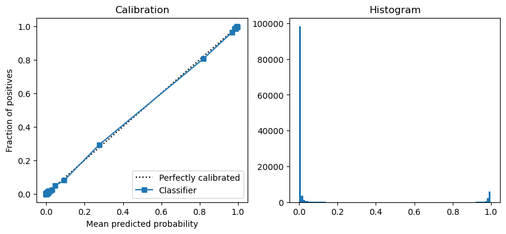

# Playground Series S3E10（Log Loss，GAM 与"用对诊断图"）

> 主题：tabular ｜ 子类：— ｜ 领域：天文（合成数据） ｜ 类别：Playground
> 截止：2023-03-20 ｜ 队伍数：807 ｜ 机制：标准赛 ｜ 指标：Log Loss
> 数据来源：`intel/playground-series-s3e10/`（61 条主题索引 + 6 篇 write-up 正文）

## 1. 任务与数据

- 天体分类（多分类 Log Loss）；变量少且已是"高层特征"——**特征工程空间几乎为零，重点是找对关系形态**。
- 领域阅读帖（pulsar/中子星/类星体等）帮助理解变量语义。

## 2. 验证方案

- 多分类 Log Loss 的诊断方式（本场金句帖）：**不要用混淆矩阵/ROC 曲线**，要看**校准图**与预测直方图（`CalibrationDisplay.from_predictions`，100 分位分箱）；错用套件模板会误导调试方向。

## 3. 模型家族

| 方案 | 使用者层次 | 关键点 | 出处 |
| --- | --- | --- | --- |
| GAM + XGB/LASSO 派生特征 | 1st | 连续关系 + 内置正则 | topic 396345 |
| 特征组合/排列爆炸 | 19th | 两套差异化模型再集成 | topic 396259 |
| 校准诊断模板 | 社区 | LogLoss 的正确体检 | topic 393073 |

## 4. 关键技巧

- **GAM 的适用场景**（1st 的论证）：变量少、关系连续、需要可解释的平滑项时，GAM 有机会胜过树模型——"树只做阶梯近似，真实关系是连续的"；GAM 的平滑项自带正则与内部 CV，加入交互很方便。
- 派生特征喂给 GAM：用 XGB/LASSO 的输出当特征（弱使用时收益小，但方向可取）。
- **诊断工具匹配指标**：LogLoss → 校准图/直方图；AUC → ROC；类别 → 混淆矩阵。用错图表＝调试噪声。
- 19th 的差异点：训练集取整但测试集不取整；不做原数据拼接；特征组合（乘法/加法/大小布尔）+ 排列枚举。

## 5. 可迁移性评估

- **可直接迁移**：LogLoss 任务的校准诊断流程；GAM 作为"连续关系"备选；用其它模型输出当 GAM 特征；两套差异化模型再集成。
- **需要前提**：pyGAM 类工具链；特征数量不大（GAM 可扩展性有限）。
- **不建议照搬**：特征多/交互深的任务强上 GAM；LogLoss 任务看 ROC/混淆矩阵做决策。

## 6. 对新手的关键启示

- **诊断图必须匹配指标**：本场用校准图能直接看出概率质量问题，用 ROC 则完全无感。
- 树模型不是唯一解：连续的、低维的、物理意义强的数据，GAM 可能更合适。
- "特征工程不可行"时，竞争转向关系形态与概率质量。

## 8. 轻读结论（2026-10 补）

**一句话**：加性模型胜过 GBDT——1st 用 **GAM**（+两个 XGB/LASSO 派生特征，非必需）夺冠；3rd/7th 的集成里也都有 GAM；跨十届复盘把"Episode 10 的关键 = GAM"写进结论。logloss 赛要看校准曲线而非混淆矩阵（49 票帖），且本届产出了系列最有价值的社区元分析（十届冠军汇编 + 结构化复盘）。

- 1st（396345）：变量少且已是高层特征 → FE 几乎不可能；GAM 自带正则/内部 CV；树只逼近连续关系。
- 19th（396259）：8 特征全组合/全排列 + ExtraTrees 重要性筛选；k-means 分组提升 CV 但未提交（自述本可最佳）。
- 校准（393073，49 票）：`CalibrationDisplay` + 预测直方图；概率校准专帖（28 票）。
- 十届汇编（394981）/结构化复盘（395484）：原数据三种用法与"必须排除出验证折"、对抗验证、SMOTE 普遍无效、信 CV、集成四维多样性、单模反例。
- 其他：天体物理科普（35 票）、异常值处理（22 票）、双周赛制（32 票）。

**裁决**：连续/低维/统计量型特征优先 GAM 类加性模型；logloss 用校准诊断；本场的元分析应成为系列赛起手读物。

**悬案**：2nd/4th–6th 等未收录；偏度峰度争议未定论。

## 9. 图表证据

**图 1**（topic 393073）：校准曲线 + 预测直方图（预测集中在 0 附近）。

## 10. 出处

- 1st：GAM + 派生特征：https://www.kaggle.com/competitions/playground-series-s3e10/discussion/396345
- 19th：特征组合与两模型集成：https://www.kaggle.com/competitions/playground-series-s3e10/discussion/396259
- 别用错诊断模板（校准图）：https://www.kaggle.com/competitions/playground-series-s3e10/discussion/393073
- 十届冠军汇编（32 票）：https://www.kaggle.com/competitions/playground-series-s3e10/discussion/394981
- 十届结构化复盘（23 票）：https://www.kaggle.com/competitions/playground-series-s3e10/discussion/395484
- 概率校准（28 票）：https://www.kaggle.com/competitions/playground-series-s3e10/discussion/393861
