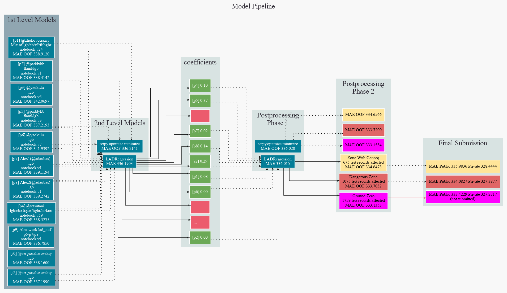
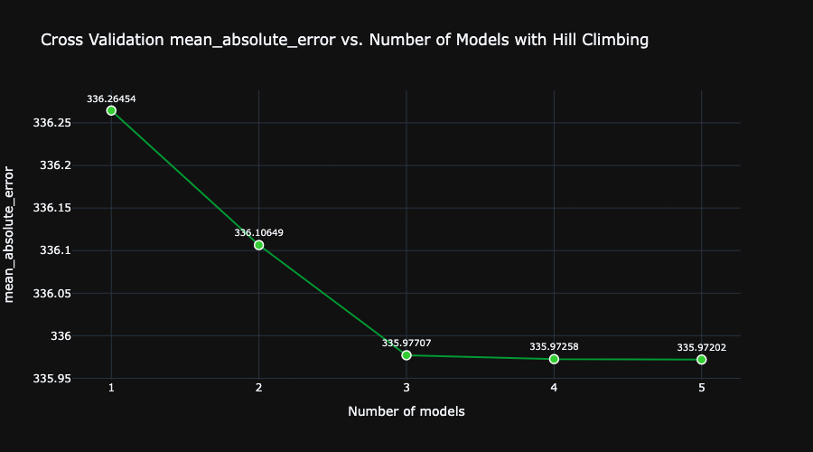

# Playground Series S3E14 - 野生蓝莓产量预测（MAE，目标值回收）

> 主题：tabular ｜ 子类：— ｜ 领域：农业（合成数据） ｜ 类别：Playground
> 截止：2023-05-15 ｜ 队伍数：1875 ｜ 机制：标准赛 ｜ 指标：MAE
> 数据来源：`intel/playground-series-s3e14/`（71 条主题索引 + 6 篇 write-up 正文）

## 1. 任务与数据

- 预测目标：蓝莓产量（MAE）；合成数据 + 原数据。
- **离散目标结构**：15289 行训练数据只有 **776 个唯一目标值**；目标由 (fruitset, fruitmass) 等组合近乎确定性地决定——合成过程保留了原数据的映射关系，测试集中有 2073 个样本可与原数据/训练数据对上。

## 2. 验证方案

- 常规 CV + "修正后 OOF" 观察（1st 用 OOF 验证每一步 post-processing 的增益，再谨慎上榜）。
- 1st 的风险分级策略：把不同激进的修正方案整理成"瀑布"，按风险分层提交（慢即是快）。

## 3. 模型家族

| 方案 | 使用者层次 | 关键点 | 出处 |
| --- | --- | --- | --- |
| 模型 + 目标值回收（脚本自动化） | 1st | 按 (fruitset, fruitmass) 匹配回填原数据目标值 | topic 410627 |
| 预测值吸附到 776 个唯一目标 | 社区技巧 | 阈值内四舍五入到最近合法值 | topic 407327 |
| LAD 回归堆叠 + 特征精简 | 3rd | fruit_seed、TE by fruitset | topic 410787 |

## 4. 关键技巧

- **目标值回收（本场最强后处理）**：遍历 (fruitset, fruitmass) 组合，在 origin/train/test 间匹配；对匹配成功且原数据存在的样本直接赋原值（"nuke bomb"级提升）；匹配条件要保守（train ≥2、test ≥1、origin 存在）。
- **预测吸附**：当模型 R² 可信（≈0.83）且目标离散（776 唯一值）时，把预测四舍五入到最近合法目标值——低成本涨分。
- 3rd 的常规项：fruitset×seeds 组合特征、按 fruitset 的折内 TE、删冗余列（RainingDays 等）、LAD 堆叠（对 MAE 更匹配的损失）。

## 5. 可迁移性评估

- **可直接迁移**：离散目标的"吸附"后处理；合成数据的目标值回收工作流（匹配 → 保守回填 → OOF 验证 → 风险分层提交）；LAD 堆叠。
- **需要前提**：目标离散且唯一值有限；原数据可获取；匹配存在歧义时的保守策略。
- **不建议照搬**：对连续目标做吸附；激进回收（匹配条件放宽）导致私榜崩盘。

## 6. 对新手的关键启示

- 先数"唯一目标值"：如果不是连续回归，很多后处理空间会出现。
- 1st 的自述值得背诵：**5 个月的管线打磨 + "方案扎实就不需要一天五次提交"**——选择纪律比提交频率重要。
- 合成数据里"原数据 ↔ 竞赛数据"的对应关系是金矿，但要保守匹配、逐层验证。

## 8. 轻读结论（2026-10 补）

**一句话**：目标是 776 个唯一值的离散回归——**吸附到最近唯一值（+0.3 MAE）**成为全场标配；`fruitset/fruitmass/seeds` 的线性结构与原始数据确定映射让 1st 做出"定点修正 + 风险分级提交"并夺冠（Ground Zero 私榜 327.2715 未提交）；LAD 回归是最常用的融合器。

- 1st（410627）：自动遍历共同 (fruitset, fruitmass) 并用原数据 yield 覆盖（覆盖 2073 条测试）；风险瀑布 Serious Incident → Zone → Dangerous → Ground Zero；8 个一级 OOF + LAD；故意选最高风险两份提交。
- 后处理（407327，80 票）：776 个唯一值吸附，CV/LB 各 +0.3。
- 4th（410639）：公开 notebook 全量 + 自研 hillclimbers（负权重、可配指标），MAE 336.26→335.97。
- 13th（410652）：2 CatBoost + 7 LGBM + 2 RF（OOB 当 OOF）；LAD 无截距融合；只提交 4 次。
- 3rd（410787）：fruit_seed + 折内 TE + OptunaWeights + LAD。
- 189th（410700）：1-PCA 线性残差 + 正/负残差分开建模 + LAD。

**裁决**：离散目标先吸附；MAE 用 LAD 融合；线性结构用 PLS/PCA；查表修正要配提交风险分级；公开 notebook 生态下差异化在融合与后处理。

**悬案**：#2/#5–#12 未收录；定点修正的风险量化缺失。

## 9. 图表证据

**图 1**（topic 410627）：一级 OOF → LAD → 后处理 → 风险分档 → 提交。

**图 2**（topic 410639）：爬山融合的 MAE 曲线。

## 10. 出处

- 1st：目标值回收与风险瀑布：https://www.kaggle.com/competitions/playground-series-s3e14/discussion/410627
- 后处理技巧：吸附到唯一目标值：https://www.kaggle.com/competitions/playground-series-s3e14/discussion/407327
- 3rd：LAD 堆叠与特征精简：https://www.kaggle.com/competitions/playground-series-s3e14/discussion/410787
- 4th：hillclimbers：https://www.kaggle.com/competitions/playground-series-s3e14/discussion/410639
- 13th：OOB 当 OOF：https://www.kaggle.com/competitions/playground-series-s3e14/discussion/410652
- 189th：残差分解：https://www.kaggle.com/competitions/playground-series-s3e14/discussion/410700
