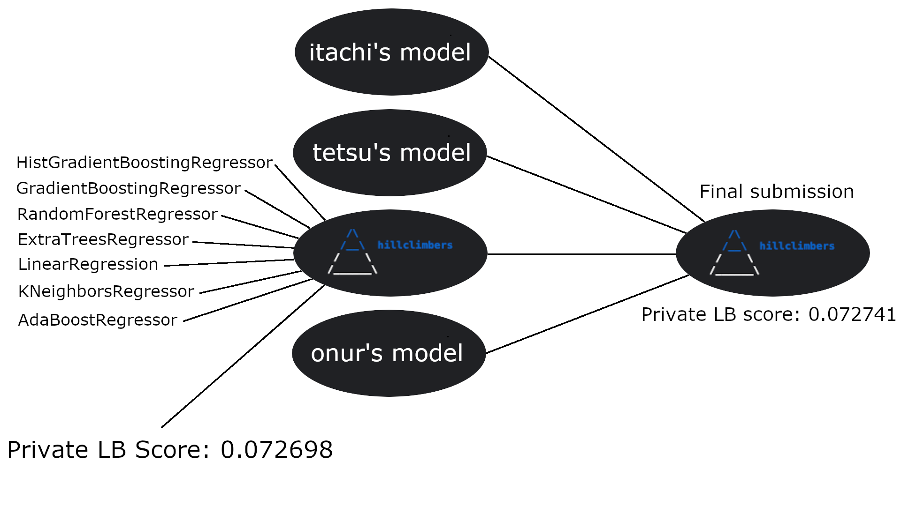
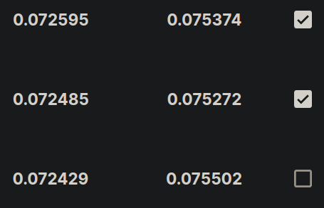

# Playground Series S3E15（热通量插补，RMSE，结构还原式插补）

> 主题：tabular ｜ 子类：— ｜ 领域：科学/传热 ｜ 类别：Playground
> 截止：2023-05-29 ｜ 队伍数：693 ｜ 机制：标准赛 ｜ 指标：RMSE
> 数据来源：`intel/playground-series-s3e15/`（59 条主题索引 + 6 篇 write-up 正文）

## 1. 任务与数据

- 目标：预测临界热通量（CHF，RMSE）；**大量缺失值** + 原数据集可用。
- 原数据的隐藏结构（5th 用 groupby 逆向）：每个 author 只有唯一 geometry；部分 author 只有一个 pressure；D_h↔D_e、geometry、length 之间存在确定性对应——**缺失值可以用这些关系"查表"恢复**。

## 2. 验证方案

- 10 折 CV；1st 的纪律："原数据只用于训练不用于验证"；"有私榜更高的提交但因 CV 更差而弃选"。

## 3. 模型家族

| 方案 | 使用者层次 | 关键点 | 出处 |
| --- | --- | --- | --- |
| 多样集成（树 + NN + 线性 + KNN） | 1st | 单模 CV 0.0730 → 集成 0.0726 | topic 414048 |
| 无插补器的插补（原数据关系查表） | 5th | 结构还原 | topic 413742 |
| 原数据的力量 | 2nd | 数据增量 | topic 413826 |

## 4. 关键技巧

- **结构还原式插补**（5th，教科书级）：把原数据中"author→geometry""D_h→D_e""chf_exp+length→geometry"等确定性映射全部挖出；对竞赛数据的缺失值用**最近邻查表**填充（合成噪声导致不完全匹配时取最近值）——"Imputation Without Any Imputers"。
- **领域知识插补与范围裁剪**（1st）：先正确插补 author 列，再据此裁剪其它特征的合理范围以降噪（arunklenin 的迭代树插补 + shalfey 的 author 特性）。
- 迭代插补（IterativeImputer/trees）配合 Optuna 调参效果好。
- 多样性配方：即使单模更差，NN/线性/KNN 加入集成仍带来增益（0.0730 → 0.0726）。

## 5. 可迁移性评估

- **可直接迁移**：原数据确定性关系挖掘（groupby 找"一列唯一决定另一列"）；最近邻查表插补；按实体列（author）做范围裁剪；原数据只训不验的协议。
- **需要前提**：原数据可得且关系稳定；缺失模式与实体列相关。
- **不建议照搬**：无关系验证就用最近邻（噪声放大）；用原数据计算验证分数。

## 6. 对新手的关键启示

- **插补的最高境界是"不需要插补器"**：先问"这个缺失值在数据生成逻辑里能否被其它列唯一决定"。
- groupby 一个循环即可发现大量确定性映射——本场 5th 的核心发现工具就是它。
- 领域知识（author 的物理实验惯例）能同时解决插补与降噪两件事。

## 8. 轻读结论（2026-10 补）

**一句话**：临界热通量回归的胜负手是**插补**——原始数据里作者↔几何、D_h↔D_e 等确定性映射让"纯规则查表 + 最近邻回退"（5th）胜过通用插补器；1st 用领域裁剪 + 迭代树插补 + 异质集成拿 CV 0.07265；2nd 的未选版本本可夺冠，"提交选择失血"是本场共性。

- 1st（414048）：树+NN+线性+KNN 集成；author 范围裁剪降噪；10 折 CV 0.07265±0.00202；有私榜更好但 CV 更差的提交未选。
- 2nd（413826）：GBDT + 原数据唯一对/三元组查找插补 + MICE 兜底；把插补值取整到原数据唯一值反而更差；未选的过采样版可第 1。
- 5th（413742）：自写规则插补（作者/几何/直径/长度映射）；圆柱几何 FE；Ridge 负权重融合。
- 14th（413749）：hillclimbers 负权重；自模型私 0.072698 优于最终 0.072741（未选）。
- 社区：插补技术（47 票）、CHF 关联式（29 票 / 29 评论）、Peculiar Findings（21 票）。

**裁决**：先解插补（查表优先），原数据仅训练；用异质集成提升稳定性；提交选择保留"CV 最优 + 稳健异质"两种。

**悬案**：3rd/4th、6th–13th 未收录；洗牌幅度未量化。

## 9. 图表证据

**图 1**（topic 413749）：私榜更好的自模型（0.072698）被弃选。

**图 2**（topic 414048）：被选/未选提交的分数对照。

## 10. 出处

- 1st：多样集成与领域插补：https://www.kaggle.com/competitions/playground-series-s3e15/discussion/414048
- 5th：没有插补器的插补：https://www.kaggle.com/competitions/playground-series-s3e15/discussion/413742
- 2nd：原数据的力量：https://www.kaggle.com/competitions/playground-series-s3e15/discussion/413826
- 14th：hillclimbers：https://www.kaggle.com/competitions/playground-series-s3e15/discussion/413749
- 插补技术与代码（47 票）：https://www.kaggle.com/competitions/playground-series-s3e15/discussion/410645
