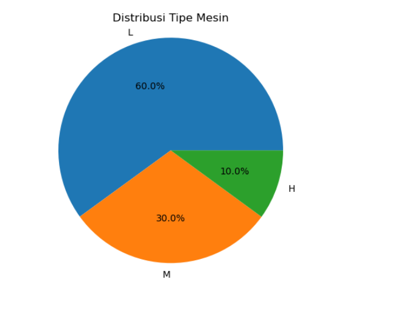
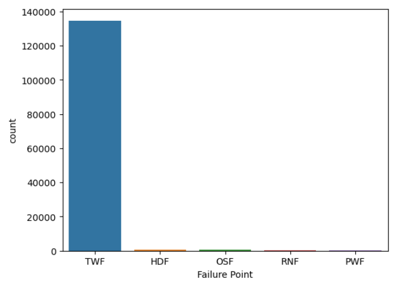

# Playground Series S3E17 - 机器故障预测（AUC，行级目标编码）

> 主题：tabular ｜ 子类：— ｜ 领域：工业维护（合成数据） ｜ 类别：Playground
> 截止：2023-06-26 ｜ 队伍数：1502 ｜ 机制：标准赛 ｜ 指标：ROC AUC
> 数据来源：`intel/playground-series-s3e17/`（80 条主题索引 + 6 篇 write-up 正文）

## 1. 任务与数据

- 预测目标：设备是否故障（AUC）；13.6 万行、类别失衡、含 UDI/产品 ID 等标识列。
- 数据特性：**存在特征完全相同的重复行**（训练内、训练测试间都有），且同特征行的标签并不总一致——这是本场"行级目标编码"的来源。

## 2. 验证方案

- 主流 5 折；17th 复用公开基线的重复交叉验证思路；4th 的基线直接是"公开 notebook 的排序融合"（自认 cheeky）。

## 3. 模型家族

| 方案 | 使用者层次 | 关键点 | 出处 |
| --- | --- | --- | --- |
| 单 CatBoost + 原数据 + 3 交互特征 | 17th | 极简流程进前 20 | topic 419648 |
| 公开基线融合 + 行级 TE/计数特征 | 4th | 重复行结构挖掘 | topic 419698 |
| 多 AutoML 混合 | 3rd | 90% 来自 AutoML 方案 | topic 419730 |
| 领域知识整理 | 社区 | 预测性维护语境与字段表 | topic 416765 |

## 4. 关键技巧

- **行级目标编码 + 出现次数**（4th）：对"完全相同特征的行"计算 OOF 目标编码与其在训练集的出现次数作为新特征——把"重复行的标签噪声/共识"转化为信号；实现上必须折外计算（示例表结构：id / features / target / target_encoding / count）。
- 17th 的极简清单：**只用原数据拼接（+0.002）**；只删 id/UDI 两列；合并后去重；三个物理交互（`proc_temp/air_temp`、`torque×rspeed`、`torque×tool_wear`）；不做重采样与缩放（树模型自理）。
- 公开基线排序融合可快速进前 30（4th 起点），但要用去重/多样性避免同族模型堆叠。

## 5. 可迁移性评估

- **可直接迁移**：行级 TE + 计数特征（任何有重复特征行的数据）；物理量比值/乘积交互；"标识列最小删除"原则；公开基线的排序融合起步法。
- **需要前提**：数据存在足够多的重复行；折外计算纪律。
- **不建议照搬**：把重复行当成可复制的标签（标签不一致时是噪声来源）；对树模型做不必要的缩放/重采样。

## 6. 对新手的关键启示

- 先查"有没有完全相同的行"：如果有，行级统计（OOF TE + count）是低成本高收益的特征。
- 原数据拼接在本场是稳定正收益（+0.002），但每场都要验证。
- 极简流程（1 个 CatBoost + 3 个交互）也能进前 20——别在调参上过早烧时间。

## 8. 轻读结论（2026-10 补）

**一句话**：物理仿真数据上的故障二分类：**Product ID 正确接入类别接口（17th +0.013）与重复行的 out-of-sample 目标编码（4th）**是最大亮点；模型侧单 CatBoost（私 0.98426）与 5 个 AutoML 的元模型（私 0.98541）几乎打平。

- 17th（419648）：单 CatBoost；train+原数据（+0.002）；pid 作 `cat_features`（+0.013）；CPU 确定性优于 GPU；lr 0.025；3 个比值特征公榜 +0.004/私榜约 0。
- 11th（419643）：MultilabelStratifiedKFold 10 折（保 5 类故障比例）；编码/原数据全放 pipeline 内防泄漏；6 模型 + LR 权重；CV 0.98006。
- 4th（419698）：公开 notebook 排名混合 + **重复行 TE + 计数**（仅用于测试集中有训练同行的样本，out-of-sample）。
- 3rd（419730）：90% 权重的多 AutoML（LightAutoML/ISoft/H2O 贡献最大）+ 10% 公开提交；私 0.98541。
- 社区：故障计数 TWF 13.5 万 vs 其余数百（图 2）；45 票帖请求赛制多样化。

**裁决**：类别接口与折内编码优先；原数据入训练有稳定小增益；重复行统计是可挖捷径但必须 out-of-sample；AutoML 是省力选项而非胜负手。

**悬案**：1st/2nd/5th–10th 未收录；重复行 TE 增益未量化。

## 9. 图表证据

**图 1**（topic 416765）：L/M/H = 60/30/10%。

**图 2**（topic 416765）：TWF 独占绝大多数故障，其余四类仅数百。

## 10. 出处

- 领域知识与字段表：https://www.kaggle.com/competitions/playground-series-s3e17/discussion/416765
- 17th：Only 1 Catboost：https://www.kaggle.com/competitions/playground-series-s3e17/discussion/419648
- 4th：target encoding rows：https://www.kaggle.com/competitions/playground-series-s3e17/discussion/419698
- 3rd：90% AutoML 方案：https://www.kaggle.com/competitions/playground-series-s3e17/discussion/419730
- 11th：多标签分层 CV：https://www.kaggle.com/competitions/playground-series-s3e17/discussion/419643
- 赛制多样性请求（45 票）：https://www.kaggle.com/competitions/playground-series-s3e17/discussion/417785
