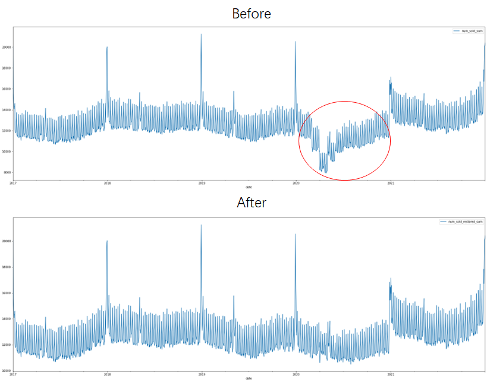

# Playground Series S3E19 - 销量预测（SMAPE，EDA 修正趋势）

> 主题：tabular ｜ 子类：— ｜ 领域：零售（合成数据） ｜ 类别：Playground
> 截止：2023-07-31 ｜ 队伍数：1172 ｜ 机制：标准赛 ｜ 指标：SMAPE
> 数据来源：`intel/playground-series-s3e19/`（80 条主题索引 + 6 篇 write-up 正文）

## 1. 任务与数据

- 预测目标：多国/多店/多商品日销量（SMAPE），销售预测家族（Jan 2022、Sep 2022 同族）。
- 结构（3rd 的 EDA 结论）：基线可分解为 **B = B_year × F_product × F_country × F_store**（各因子按年分解）；国家份额随时间波动且与人均 GDP 相关；**2022 年所有国家份额同为 0.2**（疑似数据构造缺陷——识别后直接采用）。

## 2. 验证方案

- 3rd 的核心处理：**修正 2020 疫情趋势**——按类别算日度份额；对总销量序列做 STL 分解提取趋势；把 2020-02-15 至 2020-11-15 的趋势替换为其它年份同期的平均；再还原总序列与各类别序列。
- 该流程等价于"用结构分解先净化数据，再交给模型"。

## 3. 模型家族

| 方案 | 使用者层次 | 关键点 | 出处 |
| --- | --- | --- | --- |
| STL 趋势修正 + 基线因子分解 | 3rd | 首赛即季军 | topic 428682 |
| 2nd 方案 | 2nd | 同族配方 | topic 428385 |
| 入门资源汇编 | 社区 | 快速起步 | topic 423643 |

## 4. 关键技巧

- **STL 分解做事件净化**：识别异常年份段落 → 用其它年份同段趋势替换 → 还原。比"给疫情加哑变量"更彻底（不假设模型能自动分离）。
- **乘性基线分解**（B_y × F_p × F_c × F_s）：把"预测整条序列"降解为"预测各因子在目标年的取值"，与 Jan-2022 的线性/残差路线同宗。
- 数据构造缺陷（2022 份额全 0.2）要当作已知事实使用，而不是当作噪声建模。

## 5. 可迁移性评估

- **可直接迁移**：STL 趋势替换法处理异常事件段；乘性结构因子分解与目标年因子外推；识别并利用数据构造缺陷。
- **需要前提**：时间序列有足够历史年作对照；结构近似乘性。
- **不建议照搬**：对结构未知的序列强行分解；忽视 GDP 类外生因子。

## 6. 对新手的关键启示

- 销售预测的第一动作是"看总量、找异常段"（本场 2020 肉眼可见），第二动作是分解结构（年 × 品 × 国 × 店）。
- **数据缺陷也是信息**：2022 份额全 0.2 这种事实直接拿来用，比"修它"更聪明。
- EDA 帖自述"EDA 是最重要的部分"——本场前三名的共识。

## 7. 轻读结论（2026-10 补）

**一句话**："EDA is the key"——3rd 的纯结构方案拿下第 3：**先用 STL 修掉 2020 的异常趋势（2020-02-15→11-15 换成其他年份平均），再用乘性分解 `B=B_y×F_p×F_c×F_s` 估 2022 的各级因子**；同时发现 **2022 年国家份额全为 0.2（疑似数据构造错误）**。

- 3rd（428682）：日份额 × STL 趋势替换 → 还原；国家份额随时间波动且与**人均 GDP** 相关；两份提交覆盖不同假设。
- 2nd（428385）：仅改公开 GAMMY（GAM）——**去掉 CCI** + 加强假日处理；两份提交带/不带 CCI。
- 社区：数据构造错误？（37 票）、当心数据漂移（公榜跑 2022 年 1–3 月，19 票）、国家份额与人均 GDP（19 票）、3 周短赛（18 票）。

**裁决**：跨年预测先做逐年趋势审计与异常年份处理；多层级销量用乘性分解；对"被人为设成常数"的因子（0.2）用常数假设而非外推；短赛把时间花在结构理解上。

**悬案**：1st/4th/6th–8th 方案缺失；3rd 的因子估计细节未展开；构造错误帖无官方结论。

## 8. 图表证据

**图 1**（topic 428682）：上=原始日总销量（红圈=2020 异常下滑），下=替换趋势后的序列。

## 9. 出处

- 3rd：EDA is the key（STL 修正与因子分解）：https://www.kaggle.com/competitions/playground-series-s3e19/discussion/428682
- 2nd 方案：https://www.kaggle.com/competitions/playground-series-s3e19/discussion/428385
- 入门资源：https://www.kaggle.com/competitions/playground-series-s3e19/discussion/423643
