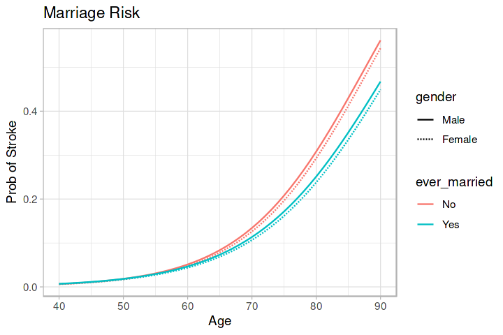

# Playground Series S3E2（中风预测，AUC，原数据"只进折不计分"）

> 主题：tabular ｜ 子类：— ｜ 领域：医疗（合成数据） ｜ 类别：Playground
> 截止：2023-01-16 ｜ 队伍数：770 ｜ 机制：标准赛 ｜ 指标：ROC AUC
> 数据来源：`intel/playground-series-s3e2/`（67 条主题索引 + 6 篇 write-up 正文）

## 1. 任务与数据

- 目标：中风风险二分类（AUC）；类别不平衡；原数据与合成数据存在**特征分布与相关结构的差异**。

## 2. 验证方案（本场最巧的一手）

- **原数据只进折、不计分**（1st）：把原数据样本加入每个 CV 折的训练部分，但 **CV 分数只用合成样本计算**——"避免对原数据分布过训练，同时利用它的信息"。
- 10 折 StratifiedKFold；XGB 超参用 500 次随机搜索 × 10 折。

## 3. 模型家族

| 方案 | 使用者层次 | 关键点 | 出处 |
| --- | --- | --- | --- |
| 单 XGB + 稀疏 one-hot + KNN 插补 BMI + 风险因子 | 1st | 原数据限量使用 | topic 378795 |
| 5th / 8th / 6th 集成路线 | 前列 | 常规多样性 | topic 378780 |
| 88th：CatBoost+XGB+LGBM+Lasso 混合 | 中游 | 线性成员补位 | topic 378879 |

## 4. 关键技巧

- **原数据的使用协议**：加入训练增强分布覆盖，但评估口径仍对齐竞赛分布；这与 S5E3 的"拼行 vs 拼列"、S6E2 的"NN 只注入统计量"构成同一主题的不同解法。
- 稀疏/去掉一类（k−1）的 one-hot：减少特征数并避免完全共线。
- 领域特征：临床风险因子汇总（相对逻辑回归基线 +0.0008，不大但方向正确）。
- KNN 回归插补 BMI（原数据缺失）。

## 5. 可迁移性评估

- **可直接迁移**："原数据只进折不计分"的评估协议；k−1 稀疏编码；KNN 插补；领域风险因子。
- **需要前提**：原数据与竞赛数据分布不同（先验证）；能区分两种样本来源。
- **不建议照搬**：直接把原数据并入 CV 计算（会把评估拉向原分布）；无差异分析就混用。

## 6. 对新手的关键启示

- 外部数据的正确姿势不止"用/不用"两态：**训练用其增强、评估只用目标分布**是第三条路。
- 不平衡医疗数据的 AUC 任务：先清洗、再编码、最后模型；1st 是单 XGB，不是大集成。

## 8. 轻读结论（2026-10 补）

**一句话**：不平衡医疗 AUC 赛，方法朴素但教训锋利：**原数据并入训练、CV 只算合成数据**是全场共识；**线性模型与 GBDT 差距极小**（Lasso 帖 39 票；1st 的 LR 私 0.89209）；1st 的夺冠模型是"500 次调参的单 XGB + 5 模型简单平均"；"已婚更危险"的 EDA 结论被年龄混杂推翻。

- 1st（378795）：KNN 插补 BMI、风险因子计数（+0.0008）、one-hot 稀疏/k−1、500 次随机搜索×10 折、5 模型 50 份预测平均；全类型混合 200 份也能进前 10。
- 5th（378780）：Unknown→never smoked、Other→Male；梯度下降+排名融合；RFE；Mean/WoE/频率编码器未超 one-hot。
- 88th（378879）：四类模型 ×5、等权最好；smoking 序数化略优；风险因子无增益。
- 因果帖（377253，49 票 / 62 评论）：年龄混杂导致婚姻结论反转（图 1）。
- 社区：Lasso（39 票）、风险因子（28 票）、分组（27 票）、洗牌（24/19）、"新工具不一定更好"（22/18）。

**裁决**：先跑线性基线；原数据入训练不入 CV；语义化填充 + 简单编码；EDA 差异先控制混杂；不平衡下用简单稳健融合。

**悬案**：2nd–4th/7th/9th–10th 未收录；洗牌幅度未量化。

## 9. 图表证据

**图 1**（topic 377253）：控制年龄后婚姻状态与中风风险的关系反转。

## 10. 出处

- 1st：原数据限量使用与单 XGB：https://www.kaggle.com/competitions/playground-series-s3e2/discussion/378795
- 5th：集成路线：https://www.kaggle.com/competitions/playground-series-s3e2/discussion/378780
- 88th：四模型混合：https://www.kaggle.com/competitions/playground-series-s3e2/discussion/378879
- Lasso 效果很好（39 票）：https://www.kaggle.com/competitions/playground-series-s3e2/discussion/377377
- 风险因子特征（28 票）：https://www.kaggle.com/competitions/playground-series-s3e2/discussion/377370
