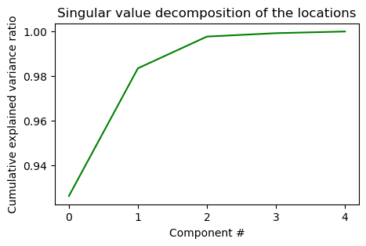
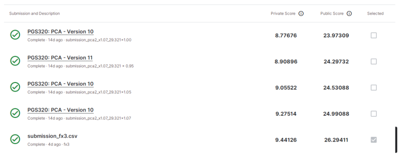

# Playground Series S3E20 - CO2 排放预测（RMSE，为什么常规方法失效）

> 主题：tabular ｜ 子类：— ｜ 领域：气候（卫星数据合成） ｜ 类别：Playground
> 截止：2023-08-21 ｜ 队伍数：1440 ｜ 机制：标准赛 ｜ 指标：RMSE
> 数据来源：`intel/playground-series-s3e20/`（80 条主题索引 + 6 篇 write-up 正文）

## 1. 任务与数据

- 预测目标：卢旺达各地区逐周 CO2 排放（RMSE）；特征几乎全是卫星测量（NO2/CO/SO2 等）。
- **三问三答**（本场最有价值的分析帖）：
  1. **卫星测量几乎无用**：单时点、受云/温度/火山影响、与周级排放无稳定映射 → 丢弃后只剩纬度、经度、年、周四个特征。
  2. **坐标形态错误**：机器学习假设邻近位置相似，但城市/村庄/森林不是连续区域 → 改用 SVD/NMF 五维表示、按排放模式聚类、或把位置当类别/逐位置独立建模。
  3. **封城是单一事件**：2020 年 3–8 月的异常下降不可被"季节模式"框架吸收 → 训练时必须**删除或校正**封城周；用三年最大值作基线、或把数据缩放到 2019/2021 水平。

## 2. 验证方案

- 禁止用含 2020 的验证集做常规 CV（封城使验证失真）——先做事件分析再设计验证。
- 3rd 的路线：把 2020 week8–32 的排放"转换"后再建模；4th 用 PCA 降维得到"最不洗牌"的方案。

## 3. 模型家族

| 方案 | 使用者层次 | 关键点 | 出处 |
| --- | --- | --- | --- |
| 位置 SVD/NMF/聚类 + 周季节 + 封城校正 | 社区共识 | 先做数据工程而不是调模型 | topic 432294 |
| 4th：PCA 降维 | 4th | 低维位置表示，抗洗牌 | topic 433567 |
| 3rd：封城周排放转换 | 3rd | 显式事件校正 | topic 433822 |

## 4. 关键技巧

- **位置表示的三种正解**：SVD/NMF 低维嵌入（"5 维就够"）、按排放模式聚类、位置作为类别或独立建模。
- **事件校正**：封城周 = 异常值 → 剔除或按 2019/2021 水平缩放；"让模型学周季节（如 week53→week0 的三倍跃迁），但不要学 week10 骤降"。
- 卫星特征使用前先做"单点测量 vs 周级汇总"的相关性检验——本场判死。
- 4th 的经验：在事件驱动的数据上，简单降维方案反而最不洗牌。

## 5. 可迁移性评估

- **可直接迁移**：特征语义审计（测量单位/时点 vs 目标粒度）；地理坐标的替代表示；异常事件（疫情/政策/灾害）的显式校正；"用最大值基线"的稳健预测。
- **需要前提**：能识别单一事件（外部知识）；位置数量可控。
- **不建议照搬**：把卫星列当作普通数值特征直接喂树模型；用含事件的年份做普通 CV。

## 6. 对新手的关键启示

- **常规方法失效时，先修数据语义再修模型**：本场丢特征+换坐标表示+事件校正三件事决定名次。
- 外部事件（封城）是数据里的"外来物种"：模型分不清季节与事件，人必须先剪掉。
- 地理数据别用原始经纬度直接建模——嵌入/聚类/类别化三选一。

## 8. 轻读结论（2026-10 补）

**一句话**：领域先验打败通用 ML——卫星特征无用、位置必须降维/聚类/类别化、**2020 封城周必须当异常处理**；3rd 用周比率把 2020 W8–32 折算回正常水平后拿第 3；4th 用 PCA6+XGB 建模，却在 5 个后处理乘子里**选了最差的一份提交**（9.44126），不加乘子的版本私榜 8.77676 本可第 1。

- 432294（64 票）：为什么常规方法失效的三条解释 + 三种疫情处理法 + 用 2021 下半年自建验证。
- 3rd（433822）：月度 YoY 定位 2020 W8–32；周均值比率折算；特征只用 lat/lon/week_no；×1.07；修 longitude bug。
- 4th（433567）：PCA1/PCA2/PCA_SARIMA 三流水线；PCA2+XGB 最优；乘子选择失误。
- 429278（78 票）：位置 SVD 2 维 >98%、5 维近满。
- 社区：外推 vs 丢弃（50 票）、NMF 生成机制（34 票）、Holt-Winters（25 票）。

**裁决**：奇异事件显式建模为异常；位置用嵌入/聚类/类别；后处理乘子需独立验证并保留无乘子提交；公榜不足信。

**悬案**：1st/2nd/5th–6th 未收录；疫情折算细节有差异。

## 9. 图表证据

**图 1**（topic 429278）：2 维 >98%、5 维近 100%。

**图 2**（topic 433567）：×1.00 的 8.77676 未被选，勾选的是 9.44126。

## 10. 出处

- 为什么常规方法失效（三问三答）：https://www.kaggle.com/competitions/playground-series-s3e20/discussion/432294
- 4th：PCA 降维：https://www.kaggle.com/competitions/playground-series-s3e20/discussion/433567
- 3rd：封城周排放转换：https://www.kaggle.com/competitions/playground-series-s3e20/discussion/433822
- 降维：5 维足够（78 票）：https://www.kaggle.com/competitions/playground-series-s3e20/discussion/429278
- 外推还是丢 Covid（50 票）：https://www.kaggle.com/competitions/playground-series-s3e20/discussion/428791
