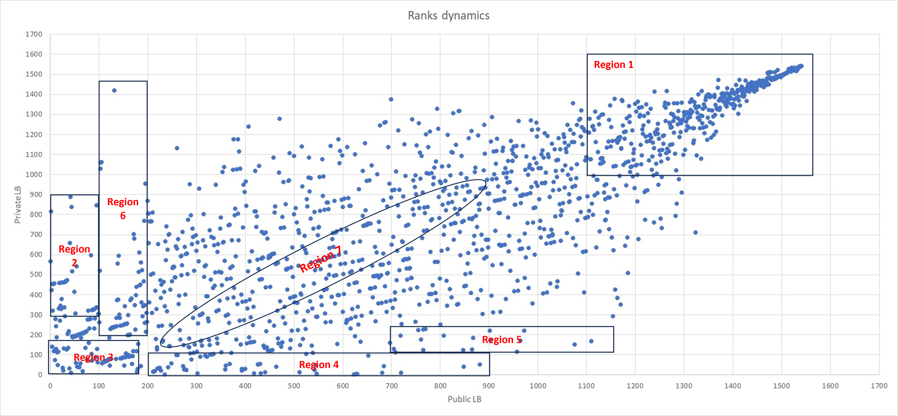

# Playground Series S3E22 - 马疝痛存活预测（F1，领域文献与数据怪癖）

> 主题：tabular ｜ 子类：— ｜ 领域：兽医（合成数据） ｜ 类别：Playground
> 截止：2023-10-02 ｜ 队伍数：1541 ｜ 机制：标准赛 ｜ 指标：F1
> 数据来源：`intel/playground-series-s3e22/`（80 条主题索引 + 6 篇 write-up 正文）

## 1. 任务与数据

- 预测目标：马匹疝痛手术后的存活结局（F1）；合成数据。
- **数据怪癖**：`hospital_number` 会重复出现——"有些马死了不止一次"（合成过程的产物），提示按医院编号分组的验证与特征可能有用（假想个体可复现）。
- 领域基础：社区整理了兽医文献——AI 预测存活/手术需求的原始论文（准确率 76%/85%）与经典 Cox 术后生存模型（关键变量：epiploic foramen entrapment、PCV、切除长度、手术时长）。

## 2. 验证方案

- F1 指标需显式阈值选择；洗牌分析（公开-私榜散点分 7 区）显示本场中段拥挤、洗牌显著（region 4/5 是"CV 可信者"的胜利区）。
- 分组维度：hospital_number 的重复结构考虑进折划分以防同院样本跨折。

## 3. 模型家族

| 方案 | 使用者层次 | 关键点 | 出处 |
| --- | --- | --- | --- |
| 文献对照建模 | 社区 | 经典 Cox 变量 → 特征候选 | topic 438620 |
| 洗牌区域分析 | 社区观察 | 名次迁移的七种类型 | topic 444654 |
| 数据怪癖挖掘 | 社区 | hospital_number 复用 | topic 441284 |

## 4. 关键技巧

- **文献→特征**：把 Cox 模型的四个关键变量（PCV、切除长度、手术时长、肠套叠类型）与 AI 论文的输入清单对照到合成字段，是合成医疗赛的稳妥起手式。
- **异常结构检查**：重复 ID/结局矛盾（"死两次"）说明合成数据可能有实体级复用——既可能是泄漏源，也可能是分组键；先用 pivot 表看清结构再建模。
- F1 类指标：阈值优化与类别处理（社区常规）是得分的关键动作。

## 5. 可迁移性评估

- **可直接迁移**：领域文献的变量清单→特征对照法；实体 ID 复用的结构侦查（分组/泄漏双面性）；洗牌区域分析作为复盘模板。
- **需要前提**：能找到领域论文（医疗/兽医尤其多）；有 ID 类字段可查。
- **不建议照搬**：把"重复 ID"直接当泄漏捷径（需先验证与目标的关系）；忽略阈值优化交 F1。

## 6. 对新手的关键启示

- 医疗类合成赛先读文献：字段往往就是论文变量表的重排。
- 看到 ID 重复、结局矛盾时不要跳过——那可能是数据结构的入口（分组验证 or 泄漏评估）。
- 洗牌后复盘自己的"区域"（1–7 类），比只看名次更有信息量。

## 7. 轻读结论（2026-10 补）

- **本场只信 CV**：public–private 名次散点被划成 7 个区域，region 2/6（公榜高私榜崩）与 region 3/4/5（CV 可信者反弹）同框；29 票专帖 "Beware of the public LB!"；top 11 中有 7 队只提交 1–2 次（444654 / 438637 / 444630）。
- **14th 的教训**：选中版本私榜 0.76818，未选用的版本 29 私榜 0.77121——在 20/80 划分的小数据上，提交选择本身就是噪声；作者"只信 CV + 控过拟合"（444642）。
- **实体复用**：同一 hospital_number 的马会"死多次"，说明实体键被复用（可能 >1 次就诊）；它既是泄漏源也是分组键（441284 / 438825）。
- **领域文献可当特征地图**：AI 预测需手术 76% / 存活 85%；Cox 术后存活 10 天 0.87 → 100 天 0.82 → 600 天 0.75；epiploic foramen entrapment RR=2.1；术后 colic 29%（438620）。
- **数据审计**：test 端 lesion_3 单值、`none` vs `None`、train/test 类别取值不一致、原始数据差异——逐列 diff 后再建模（438615 / 441977 / 441019）。

## 8. 图表证据

**图**（topic 444654）：public 对 private LB 名次散点与 7 区域划分——"公榜高、私榜崩"（region 2/6）与"CV 可信者私榜反弹"（region 3/4/5）的直接证据。

## 9. 出处

- 领域文献整理（AI 预测与 Cox 模型）：https://www.kaggle.com/competitions/playground-series-s3e22/discussion/438620
- 洗牌区域分析：https://www.kaggle.com/competitions/playground-series-s3e22/discussion/444654
- 有些马死了不止一次（数据结构怪癖）：https://www.kaggle.com/competitions/playground-series-s3e22/discussion/441284
- 入门材料与列字典（62 票）：https://www.kaggle.com/competitions/playground-series-s3e22/discussion/438603
- 14th 复盘：https://www.kaggle.com/competitions/playground-series-s3e22/discussion/444642
- Beware of the public LB!：https://www.kaggle.com/competitions/playground-series-s3e22/discussion/438637
