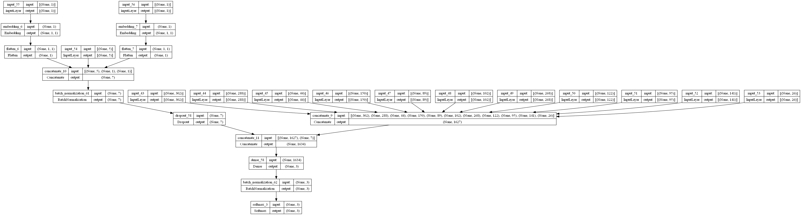
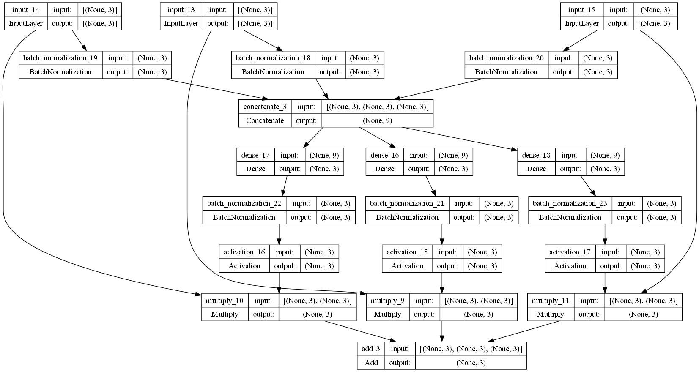

# Playground Series S3E26 - 肝硬化多分类（Log Loss，跨届复用与 NN 堆叠）

> 主题：tabular ｜ 子类：— ｜ 领域：医疗（合成数据） ｜ 类别：Playground
> 截止：2024-01-01 ｜ 队伍数：1661 ｜ 机制：标准赛 ｜ 指标：Log Loss
> 数据来源：`intel/playground-series-s3e26/`（80 条主题索引 + 6 篇 write-up 正文）

## 1. 任务与数据

- 预测目标：肝硬化患者状态多分类（C / CL / D），Log Loss；合成数据 + 原数据。
- 本场是 S3 赛季收官战，前几名的方案明显带着"系列赛积累"的烙印。

## 2. 验证方案

- 统一 OOF 管理：4th 直接收集"多份顶级方案的 OOF"当特征（承认别人方案的价值）。
- 4th 的反过拟合原则：**不过度调优每个子方案**，把预测当特征交给强大元模型。

## 3. 模型家族

| 方案 | 使用者层次 | 关键点 | 出处 |
| --- | --- | --- | --- |
| 2021 年 TPS Jun 冠军方案 + 伪标签 | 1st | 跨届复用+一处升级即夺冠 | topic 464865 |
| XGB+LGBM（10 组 Optuna 平均）+ PLE 神经网络 + NN 堆叠器 | 2nd | PLE 编码 + 类概率专属权重 | topic 464887 |
| XGB 元模型堆叠（大量他方案 OOF + 原特征） | 4th | 少量 FE（Age 分箱/log/缩放） | topic 464863 |

## 4. 关键技巧

- **跨届复用登顶**（1st）：直接改造自己 2 年前在 TPS Jun 2021 的冠军方案，唯一新增是**伪标签**——"everyone can be a winner" 的幽默标题下是系列赛资产复利的实证。
- **PLE（分段线性编码）**（2nd）：对连续特征的 PLE 编码显著提升 NN 表现（单模进前 10%）；结合 embedding（edema/stage）与二值特征直连。
- **NN 堆叠器细节**（2nd）：① 每个类概率有独立权重，而不是每个预测一个权重；② 权重由全部 3 个预测共同计算，而不是只用自身。
- 4th 的元模型选择：XGB 当 stacker，输入 = 多个 top 方案 OOF + 原特征；对小改进保持克制。

## 5. 可迁移性评估

- **可直接迁移**：跨届方案复用清单化；PLE 编码（现代表格 DL 的标准件）；NN 堆叠器的权重设计细节；"不过度调优子模型"的元学习纪律。
- **需要前提**：系列赛历史资产（自己或社区的 OOF）；Python/NN 工具链。
- **不建议照搬**：无验证地用他方案 OOF（泄漏/口径风险）；把 PLE 当万能（要和其他编码对照）。

## 6. 对新手的关键启示

- 同一平台的老方案是你最便宜的起跑线——1st 用 2 年前的冠军 + 一个伪标签就再次登顶。
- 表格任务里的 NN 要"现代化"：PLE/embedding/自定义堆叠权重，而不是朴素 MLP。
- 堆叠是"信任 + 选择"的工程：别人的好 OOF 也是资产，但要有统一折口径。

## 8. 轻读结论（2026-10 补）

**一句话**：肝硬化结局三分类 = **堆叠 + 医学先验 + 现代表格 NN**：4th 用 XGB 元模型吃下 AutoGluon/LightAutoML/AutoXGB 的 OOF；2nd 用 **PLE 编码的 NN**（单模私榜 ~0.401）和"每类独立权重"的 NN 堆叠器（比简单平均 +0.004）；1st 直接把两年前的冠军方案换成伪标签版夺冠。

- 1st（464865）：2021 冠军方案 + 伪标签（唯一改动）。
- 2nd（464887）：XGB/LGBM 各 10 组超参平均；PLE + 嵌入 + 二元的 NN；堆叠 NN 权重每类独立、由全部输入计算。
- 4th（464863）：Age 分箱/Log/MinMax；AutoGluon 1.0.1b + LightAutoML + AutoXGB + 公开 notebook OOF → 20 折 XGB 元模型；别过度调基模型。
- 7th（465167）：LGBM+XGB 软投票 + Optuna 自定义 logloss。
- 医学先验：检验阈值（459392，44 票）、新类别特征（22 票）、Cox 生存分析（21 票）。

**裁决**：多分类 log loss 优先用元模型堆叠（含校准）；表格 NN 用 PLE/嵌入；医学阈值离散化有效；旧冠军方案 + 现代技巧是可行打法。

**悬案**：3rd/5th–6th 未收录；1st 改动细节与"quick trick"未细读。

## 9. 图表证据

**图 1**（topic 464887）：PLE 分支 + 嵌入 → 1634 维 → Softmax(3)。

**图 2**（topic 464887）：每类独立权重的 NN 堆叠器。

## 10. 出处

- 1st：跨届复用 + 伪标签：https://www.kaggle.com/competitions/playground-series-s3e26/discussion/464865
- 2nd：PLE 神经网络与 NN 堆叠器：https://www.kaggle.com/competitions/playground-series-s3e26/discussion/464887
- 4th：XGB 元模型堆叠：https://www.kaggle.com/competitions/playground-series-s3e26/discussion/464863
- 7th：软投票：https://www.kaggle.com/competitions/playground-series-s3e26/discussion/465167
- 医学风险因子（44 票）：https://www.kaggle.com/competitions/playground-series-s3e26/discussion/459392
- 资源合集（47 票）：https://www.kaggle.com/competitions/playground-series-s3e26/discussion/459389
