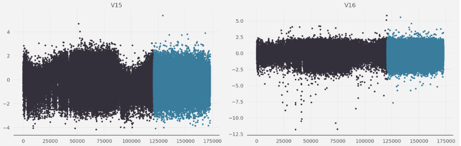
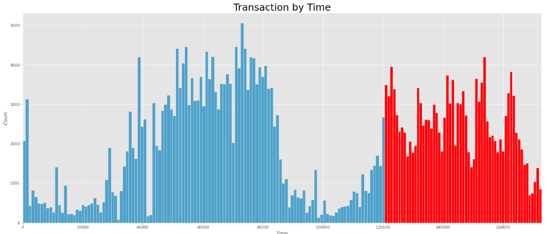

# Playground Series S3E4（信用卡欺诈，AUC，"相关性讲故事"）

> 主题：tabular ｜ 子类：— ｜ 领域：金融（合成数据） ｜ 类别：Playground
> 截止：2023-01-30 ｜ 队伍数：641 ｜ 机制：标准赛 ｜ 指标：ROC AUC
> 数据来源：`intel/playground-series-s3e4/`（67 条主题索引 + 6 篇 write-up 正文）

## 1. 任务与数据

- 信用卡欺诈二分类（AUC）；PCA 匿名特征（V1–V28）+ Amount。
- 社区从相关性切入还原语义：**V20/Amount、V23/Amount 比值在欺诈样本上呈"刷爆额度"形态**；V27 与 V28 逆相关——少数特征承载主要信号。

## 2. 验证方案

- 「时间管理」「别低估单模型」两帖强调：这类赛的评估与迭代节奏比模型复杂度重要（对齐 S3E5 的"单模路线"）。

## 3. 模型家族

| 方案 | 使用者层次 | 关键点 | 出处 |
| --- | --- | --- | --- |
| 比值特征（V20/Amount 等）+ 少量衍生 | 社区分析 | 只用关键特征即可 ~0.8 LB | topic 381087 |
| 单模型路线 | 54th | 别低估 solo | topic 382443 |
| 7th：Ensembling the Flow | 高位 | 流程化集成 | topic 382589 |

## 4. 关键技巧

- **相关性 → 语义假设 → 比值特征**：对 Amount 做分母构造 `V20/Amount`、`V23/Amount`；对逆相关对构造 `V27/V28`、及其比值——"欺诈者直接刷满额度"的领域直觉转成特征。
- 只保留少数强特征 + 衍生也能拿到高 LB（本场相关结构集中）——特征筛选比模型堆叠优先。
- 欺诈类任务的极端不平衡：AUC 下不必重采样，聚焦排序质量与特征。

## 5. 可迁移性评估

- **可直接迁移**：比值/逆相关对的特征构造法；"先画散点与相关矩阵再建模"的 EDA 纪律；少数特征承载主信号的判断。
- **需要前提**：存在可解释的金额/额度类变量；匿名特征的相关结构稳定。
- **不建议照搬**：把匿名特征的语义猜测当事实；忽视不平衡评估口径。

## 6. 对新手的关键启示

- **相关性图是特征工程的第一信息源**：本场分数几乎全部来自 4–5 个比值特征。
- 先从散点/相关看出"欺诈者行为模式"，再决定特征——比盲调 GBDT 高效得多。
- 单模型也能上榜；先优化特征与评估。

## 8. 轻读结论（2026-10 补）

**一句话**：时间切分（train 0–33.5h / test 33.5–48h）+ 极不平衡（0.2% 正类）+ 分布位移，构成本场三大陷阱：**必须用时间感知 CV、原始数据不能盲拼、V 特征比值是核心信号**。30th 自述不加原始数据可 0.8333 夺冠、加了只排 30；54th 只用 132 行"时段之外"的原始欺诈样本，单 CatBoost 零调参进前 6%。

- 30th（382447）：50 个 XGB 平均；V 特征减当日均值（私榜 +0.0015）；(V14,V21) 纯组 → 466 条测试样本直接判 0（+0.0004）；原始数据拖累名次。
- 时间帖（380771）：验证集前移 14.5h；Time 归一化/分桶；提示公榜可能只反映最前几小时。
- 54th（382443）：对抗验证发现三大数据集差异巨大；132 行原始欺诈（Time>120580）+ 单 CatBoost。
- 相关性帖（381087）：V20/V23/V27/V28 与 Amount 的比值 → 少数特征 LB ~0.8。
- 10th（382539）：Hour/Day + 除法特征 + CatBoost Focal Loss + 10 折；Optuna ~50 次。
- 社区：大量重复行、"完美 CV"争议、对抗验证。

**裁决**：时间序列赛先搭时间感知 CV、做对抗验证再决定外部数据；先造强比值特征再谈模型；极不平衡下简单模型也够用。

**悬案**：1st–6th/8th–9th 未收录；"完美 CV"方法未细读。

## 9. 图表证据

**图 1**（topic 380771）：33.5h 后特征分布位移。

**图 2**（topic 382443）：蓝色训练 / 红色测试，时间窗不重叠。

**图 3**（topic 381087）：欺诈样本的 V20/Amount≈0。

## 10. 出处

- 相关性讲故事（比值特征）：https://www.kaggle.com/competitions/playground-series-s3e4/discussion/381087
- 别低估单模型：https://www.kaggle.com/competitions/playground-series-s3e4/discussion/382443
- 7th：Ensembling the Flow：https://www.kaggle.com/competitions/playground-series-s3e4/discussion/382589
- 30th：https://www.kaggle.com/competitions/playground-series-s3e4/discussion/382447
- Use your Time wisely：https://www.kaggle.com/competitions/playground-series-s3e4/discussion/380771
- 10th：https://www.kaggle.com/competitions/playground-series-s3e4/discussion/382539
- 对抗验证：https://www.kaggle.com/competitions/playground-series-s3e4/discussion/381089
