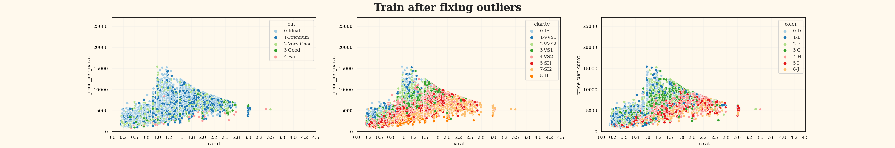
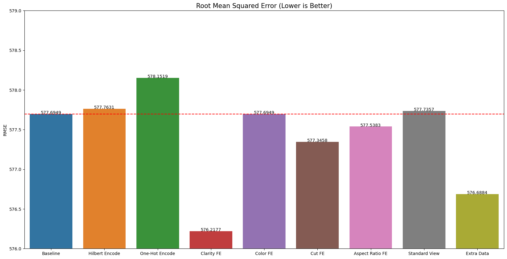

# Playground Series S3E8（宝石价格，RMSE，几何特征与阈值扫频选模）

> 主题：tabular ｜ 子类：— ｜ 领域：珠宝（合成数据） ｜ 类别：Playground
> 截止：2023-03-06 ｜ 队伍数：734 ｜ 机制：标准赛 ｜ 指标：RMSE
> 数据来源：`intel/playground-series-s3e8/`（49 条主题索引 + 6 篇 write-up 正文）

## 1. 任务与数据

- 宝石价格回归（RMSE）；特征含切工/净度/颜色与三维尺寸（x/y/z）。
- **几何派生特征是最大单点收益**（2nd 称 -1.5 CV）：来自社区与 ChatGPT 的公式清单（见下）。

## 2. 验证方案

- 2nd 的**阈值扫频选模**：先训 60 个一级模型（OOF RMSE ≤ 574 起），以 0.1 为步长**逐步降低入选阈值**，每个阈值都重建一层 Ridge 二级模型并记录 CV——最优截止 572.6。这是"模型池准入线"的量化搜索，非常可复刻。

## 3. 模型家族

| 方案 | 使用者层次 | 关键点 | 出处 |
| --- | --- | --- | --- |
| 60 模型 + Ridge 二级 + 阈值扫频 | 2nd | 准入线可量化 | topic 392828 |
| 重复数据泄漏尝试（失败案例） | 2nd 复盘 | 公榜涨私榜跌 | topic 392828 |
| ChatGPT 几何特征清单 | 社区 | 体积/密度/台面比等 | topic 389472 |
| 3 天速通（AutoGluon+AutoXGB） | 6th | 框架提速 | topic 392820 |

## 4. 关键技巧

- **几何特征公式清单**（可直接套用）：
  `volume = x*y*z`；`density = carat/volume`；`table_percentage = table/((x+y)/2)*100`；`depth_percentage = depth/((x+y)/2)*100`；`symmetry = (|x−z|+|y−z|)/(x+y+z)`；`surface_area = 2(xy+xz+yz)`；`depth_to_table_ratio = depth/table`。
- **阈值扫频**替代拍脑袋选池：把"哪些一级模型进二级"变成一维搜索问题。
- 反例：复用原数据中与测试重复的记录价格——公榜 +0.05、私榜 −0.1（**泄漏的红利不可靠**，与 S3E7 的可用泄漏形成对照）。
- 原数据作为额外训练样本有效（-1.6）——与"泄漏式使用"不同，是分布内的合法增益。

## 5. 可迁移性评估

- **可直接迁移**：几何/比率派生特征清单；模型池阈值扫频；泄漏"公私榜背离"风险意识；原数据增量训练。
- **需要前提**：产品尺寸类字段（珠宝/器件通用）；多级堆叠算力。
- **不建议照搬**：把公开榜增益当泄漏有效性证据；跳过形状/比率特征直接调参。

## 6. 对新手的关键启示

- **先把领域公式写出来**：几何体积/密度/比率往往比模型选择更值钱（本场 -1.5 vs 调参的零头）。
- 选模准入线可以量化搜索（0.1 步长扫 RMSE 阈值）。
- LLM 写公式清单（本场 ChatGPT 案例）是合理的加速器——但要自己验证 CV。

## 8. 轻读结论（2026-10 补）

**一句话**：宝石价格赛的两条主线——**几何衍生 + 有序类别数值化**（Clarity FE 576.22 vs One-Hot 578.15）与**"人工估价师"式分组合法性裁剪**（8th 按 carat 窗×cut×clarity×color 用 Q3±1.5·IQR 剪上界 +0.2、抬下界 +1.1，直接进前 10）；2nd 用 1816 模型两级栈拿第 2 并证明"重复行 exploit 公榜涨、私榜跌"。

- 8th（392860）：修数据不如修预测；分组裁剪 +1.3 LB。
- 2nd（392828）：L1 cutoff 从 574 逐 0.1 下探至 572.6；L2 Ridge；FE -1.5 CV、原数据 -1.6 CV；重复行 exploit 被放弃。
- 3rd（392824）：逐列剔除特征，同时优化 RMSE 与折间 std（4.5→3.8）；Optuna 拉长训练；10 seeds。
- ChatGPT（389472，57 票）/几何（389207，38 票）：体积/密度/表面积/比例公式与提示词模板。
- 6th（392820）：AutoGluon + AutoXGB，3 天 8 次提交。

**裁决**：有序类别保持数值序；几何量做衍生；目标有分组合理区间时对预测做分组裁剪；重复行 exploit 只信私榜逻辑；用 std 做稳定性目标。

**悬案**：1st 未收录；裁剪阈值灵敏度未分析。

## 9. 图表证据

**图 1**（topic 392860）：修离群后的 price_per_carat vs carat。

**图 2**（topic 392828）：Clarity FE 最优、One-Hot 最差。

## 10. 出处

- 2nd：阈值扫频与成败清单：https://www.kaggle.com/competitions/playground-series-s3e8/discussion/392828
- ChatGPT 几何特征清单：https://www.kaggle.com/competitions/playground-series-s3e8/discussion/389472
- 8th：Flying Over the 1st place again：https://www.kaggle.com/competitions/playground-series-s3e8/discussion/392860
- 6th：AutoGluon+AutoXGB 三天速通：https://www.kaggle.com/competitions/playground-series-s3e8/discussion/392820
- 3rd：多数据集多 seed + std 目标：https://www.kaggle.com/competitions/playground-series-s3e8/discussion/392824
- 几何特征（38 票）：https://www.kaggle.com/competitions/playground-series-s3e8/discussion/389207
