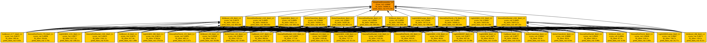

# Playground Series S4E1 - 银行客户流失预测（2024.01）

> 主题：tabular ｜ 子类：— ｜ 领域：金融（合成数据） ｜ 类别：Playground
> 截止：2024-01-31 ｜ 队伍数：3632 ｜ 机制：标准赛 ｜ 指标：ROC AUC
> 数据来源：`intel/playground-series-s4e1/`（80 条主题索引 + 6 篇 write-up 正文）

## 1. 任务与数据

- 预测目标：银行客户是否流失（二分类 AUC）；经典 Telco 风格合成数据 + 原始数据。
- 数据"名场面"：合成数据存在可被系统性挖掘的生成痕迹，公开 notebook 因此流行"feeling lucky"式技巧；本场获奖方案把这种挖掘工程化。

## 2. 验证方案

- 1st：**单模型 CatBoost × 20 折平均**即夺冠；调好 CatBoost 参数 + 类别编码即可进前三。
- 2nd：特征工程决定一切（见下），模型仅 LGBM + AutoGluon 两件再等权合并。
- 5th 的立场：**不用数据泄漏**，只用真实世界逻辑构造窗口特征（按 Surname/Age/CustomerId 分组做计数、均值比、Lead/Lag）。

## 3. 模型家族

| 方案 | 使用者层次 | 关键点 | 出处 |
| --- | --- | --- | --- |
| 单 CatBoost × 20 折平均 | 1st | 高基数类别（CustomerId/Surname）编码正确 | topic 472502 |
| 子集匹配特征（~1000 个）+ LGBM + AutoGluon | 2nd | "合成性"利用的工程化 | topic 472496 |
| CatBoost 编码大全 | 3rd | 多种类别编码组合 | topic 472413 |
| 单 XGBoost + 真实逻辑窗口特征 | 5th | 明确不用泄漏 | topic 472497 |

## 4. 关键技巧

- **子集匹配特征**（2nd 的核心创意）：自动枚举 10 个基特征的全部 1–10 元子集（~1000 个），逐行检查该子集组合是否**在原始数据中原样出现** → 0/1 特征；这些特征上的目标分布与全局 0.21 显著不同，信息量极大。
- **高基数类别编码**是胜负手（1st/3rd）：CustomerId、Surname 必须正确编码（CatBoost 原生处理或 TE）。
- 反方向案例（5th）：不用任何泄漏，纯真实逻辑窗口特征也能进前五——说明"业务理解"仍是有效路径。
- 采样方法讨论：SMOTE 类方法在本类不平衡合成数据上并非默认答案（社区讨论帖）。

## 5. 可迁移性评估

- **可直接迁移**：子集匹配/出现性特征（任何"合成数据来自原数据"的场景）；高基数类别编码清单；单模多折平均的极简夺冠路径；窗口/分组统计特征。
- **需要前提**：原始数据可得；子集枚举需控制组合爆炸（10 选 5 即 252 个）。
- **不建议照搬**：直接把"Feeling lucky"技巧当通用套路（高度依赖生成器行为与规则许可）。

## 6. 对新手的关键启示

- 本场是"特征工程 > 模型"的极端证明：冠军单 CatBoost、亚军两模型——别急着堆集成。
- 想挖掘合成痕迹时，设计可复用的检查器（如"子集是否在原数据出现"），而不是手工寻找个例。
- 同样一份数据存在"泄漏路线"与"业务路线"两条前五方案——选择路线时先确认比赛规则与自己的学习目标。

## 8. 轻读结论（2026-10 补）

**一句话**：本场是"**合成数据泄漏**"教科书——2nd 用 ~1000 个"某特征子集是否原样出现在原始数据"的特征 + AutoGluon 平均拿到私榜 0.90462；1st 用单 CatBoost 20 折 + CustomerId/Surname 高基数编码夺冠；3rd 靠"全列 CatBoost 编码 + 30 折"拿第三；5th 不用泄漏、单 XGB + 窗口特征也有 0.902。

- 1st（472502）：单 CatBoost ×20 折；高基数类别编码是分水岭。
- 2nd（472496）：枚举 10 特征的 1–10 元子集检查是否出现在原数据（+CustomerId+Surname）；LGBM 0.90203 / AutoGluon 0.90378 / 二者平均 0.90462；"feeling lucky" +0.01。
- 3rd（472413）：TF-IDF+SVD；除 Balance/HasCrCard 全部编码（Age×10、ES×100）；`has_time=True`、原数据在前；7 模型 Ridge 加权；5→30 折（约 12 小时）；原数据拼两次最佳。
- 5th（472497）：无泄漏单 XGB（LAG/LEAD 窗口特征），CV 0.9030 / 私 0.902。
- 17th（472636）：OpenFE 470→103 特征 + AutoGluon 三层栈 + CleanLab；私 0.90106。
- SMOTE/SMOTEENN/ADASYN 无正收益（12 票帖）；参与数创 Playground 纪录（3632 队）。

**裁决**：合成 Playground 先做痕迹分析；是否利用泄漏取决于规则与取向（不用也能进前 5）；CatBoost 编码与多折平均是稳定增益；不平衡重采样不做。

**悬案**：1st 参数/编码细节缺失；paddykb 后处理原理未归档；图证仅 1 张超宽栈图。

## 9. 图表证据

**图 1**（topic 472636）：AutoGluon "Frankenstein II" 三层堆叠（L1 基模型 → L2 集成 → L3 最终）。

## 10. 出处

- 1st：单 CatBoost 之路：https://www.kaggle.com/competitions/playground-series-s4e1/discussion/472502
- 2nd：子集匹配特征：https://www.kaggle.com/competitions/playground-series-s4e1/discussion/472496
- 3rd：CatBoost 编码大全：https://www.kaggle.com/competitions/playground-series-s4e1/discussion/472413
- 5th：不用泄漏的窗口特征方案：https://www.kaggle.com/competitions/playground-series-s4e1/discussion/472497
- 17th：AutoGluon + 特征选择：https://www.kaggle.com/competitions/playground-series-s4e1/discussion/472636
- Feeling lucky（32 票）：https://www.kaggle.com/competitions/playground-series-s4e1/discussion/469859
- SMOTE 类方法讨论：https://www.kaggle.com/competitions/playground-series-s4e1/discussion/467034
