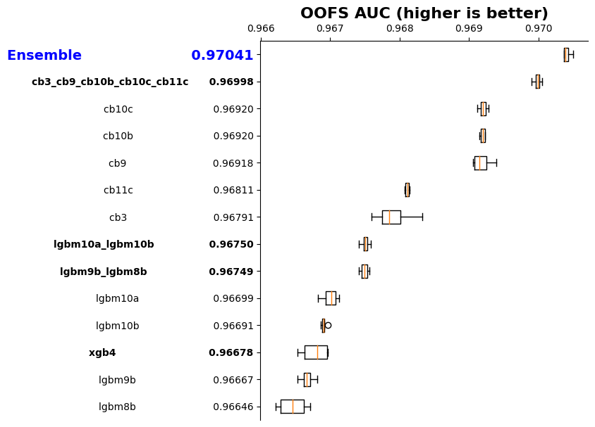
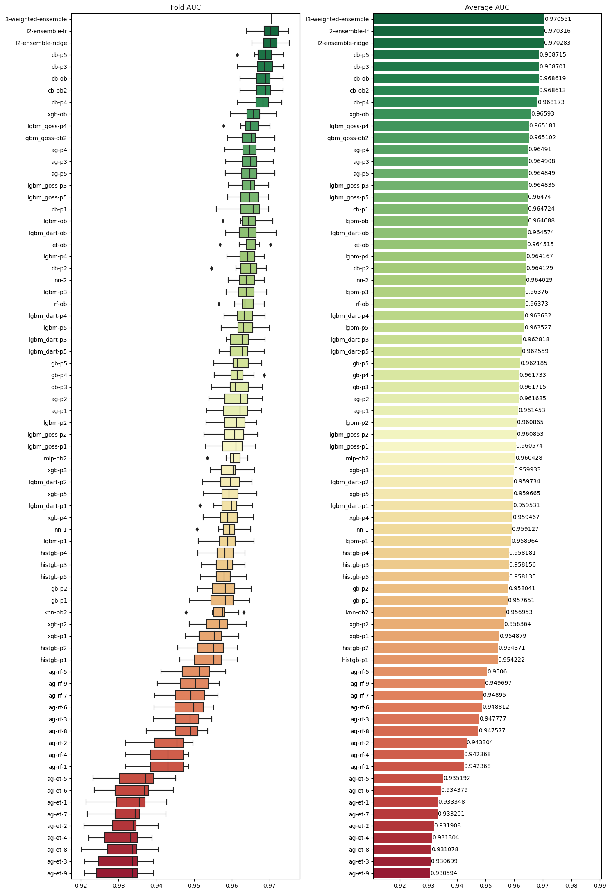

# Playground Series S4E10 - 贷款获批预测

> 主题：tabular ｜ 子类：— ｜ 领域：金融（合成数据） ｜ 类别：Playground
> 截止：2024-10-31 ｜ 队伍数：3858 ｜ 机制：标准赛 ｜ 指标：ROC AUC
> 数据来源：`intel/playground-series-s4e10/`（80 条主题索引 + 6 篇 write-up 正文）

## 1. 任务与数据

- 预测目标：贷款申请是否获批（二分类 AUC）；合成贷款数据。
- 数据特性：数值特征数量有限、类别化收益明显——"把每个数值特征同时保留数值副本与类别副本"是本场公开的强起点（多位获奖者引用 paddykb 的 all-categorical 思路）。

## 2. 验证方案

- 1st 的 CV 论证（值得背诵）：Playground 划分 train:test≈60:40，公开榜只占全量 **8%**——CV 在 60% 数据上评估，远比公开榜可靠；一切决策以 CV 为准。
- 2nd 用 5 折；10th 强调多随机种子重复（4 次）取稳健结果。
- 2nd 的提交选择教训：**没有交 LB 最高的那份**（0.97350），而是选了 CV/结构更稳的两份——结果证明更优。

## 3. 模型家族

| 方案 | 使用者层次 | 关键点 | 出处 |
| --- | --- | --- | --- |
| 三 GBDT × Optuna 10 组参数平均 + NN → CatBoost 基线式二级 → NN 堆叠 | 1st | CatBoost 对一切一级预测再学习都有提升 | topic 543725 |
| 21/24 模型集成 + 少量 FE 制造多样性 | 2nd | 简单而稳；原数据辅助 | topic 543766 |
| 4 个 GBM 元学习器 → LogisticRegression | 10th | "no blind blend"；多种子稳健性 | topic 543735 |
| LLM 全自动方案（ChatGPT 4-o1） | 实验 | 789 名（top 21%），零手动编码 | topic 543734 |

## 4. 关键技巧

- **数值×类别双副本**：不做复杂交互，只把数值特征再复制一份当类别（大 max_bin 也有帮助）。
- **CatBoost 基线式二级学习**（1st 的"secret sauce"）：把一级模型预测当 `baseline` 训练 CatBoost 学残差——LightGBM/XGB/NN 的预测都被它提升，连 CatBoost 自己的预测也再涨一截；最后用 NN 把 4 个二级预测栈起来。
- **多样性来源**：Optuna 多组参数平均；原数据的用法差异；少量 FE 只在部分模型使用（2nd）。
- **LLM 定位**（本场较早的实验）：全 LLM 方案可拿 top 21%，但想争顶仍需人类的方向控制；LLM 对长上下文调试与"疯狂架构"的实现能力被点名肯定。

## 5. 可迁移性评估

- **可直接迁移**：CV 与公开榜的数据占比论证；数值双副本；CatBoost baseline 二级栈；多组 Optuna 参数平均；多种子稳健性检查。
- **需要前提**：CatBoost 可用；GBDT 调参算力。
- **不建议照搬**：盲目追逐 LB 峰值（2nd 的反例）；无结构多样性的"盲 blend"（10th 点名）。

## 6. 对新手的关键启示

- 记住开头的算术：**公开榜往往只覆盖全量的几个百分点，CV 覆盖 60%**——除非有分布迁移证据，否则永远信 CV。
- 二级学习不一定复杂：把一级预测当 baseline 再学一次残差（CatBoost 一行参数）就能稳定涨分。
- 提交选择是独立技能：保留多份结构不同的候选，选"CV 稳 + 结构可解释"的而非分数最高的。

## 8. 轻读结论（2026-10 补）

**一句话**：贷款获批预测 = **CatBoost 一枝独秀 + 数值列全类别化**：1st 把每个模型的预测当 baseline 再训 CatBoost 残差提升器（连 CatBoost 自己也能被提升），最终 NN 堆叠 4 路预测拿私榜 0.96938；2nd/8th/10th 也都做"数值+类别双份"，而"盲混"被 GM 反复警告，LLM 全自动方案只到 top 21%。

- 1st（543725）：数值+类别双份、无 FE、加原数据；三库各 10 组 Optuna 平均 + NN；CatBoost-baseline 提升（LGBM .96811→.96856、CatBoost .96972→.96997…）；最终 CV 0.97059/公 0.97344/私 0.96938。
- 2nd（543766）：简单集成 + 谨慎提交（放弃 LB 最高版）；公开全类别 notebook 功不可没。
- 8th（543772）：5 流水线 + AutoGluon 融合 52 OOF（私 0.96900）；减少 OOF 数到 19 反而更好。
- 10th（543735）：4 个 GBM 栈 → LR；4 种子箱线图；不插补不 FE；原数据仅训练。
- 社区：max_bin 提分（34 票）、数据有分组（34 票）、线性 booster 集成（33 票）、原数据提升（25 票）、避免盲混（新手贴）。

**裁决**：先做"数值列类别化 + CatBoost"；用 init_score 式残差提升放大强模型；信 CV（公榜只覆盖约 8%）；权重由 OOF 决定、拒绝盲混。

**悬案**：3rd–7th/9th 未收录；分组与线性 booster 帖未细读。

## 9. 图表证据

**图 1**（topic 543735）：各基模型/集成的 OOF AUC 分布（4 种子）。

**图 2**（topic 543772）：5 条流水线的 fold/average AUC（CatBoost 系领先）。

## 10. 出处

- 1st：CatBoost All The Way Down：https://www.kaggle.com/competitions/playground-series-s4e10/discussion/543725
- 2nd：简单集成与提交选择：https://www.kaggle.com/competitions/playground-series-s4e10/discussion/543766
- LLM 全自动方案的落点：https://www.kaggle.com/competitions/playground-series-s4e10/discussion/543734
- 10th：no blind blend 的稳健栈：https://www.kaggle.com/competitions/playground-series-s4e10/discussion/543735
- 8th：多流水线 + AutoGluon：https://www.kaggle.com/competitions/playground-series-s4e10/discussion/543772
- 新手提示（55 票）：https://www.kaggle.com/competitions/playground-series-s4e10/discussion/539612
- XGBoost max_bin（34 票）：https://www.kaggle.com/competitions/playground-series-s4e10/discussion/539963
