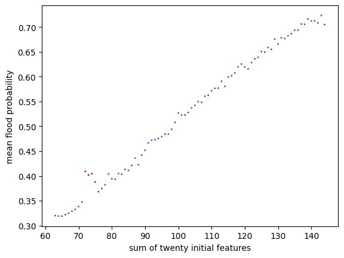

# Playground Series S4E5 - 洪水概率预测（R²，行和特征是胜负手）

> 主题：tabular ｜ 子类：— ｜ 领域：水文（合成数据） ｜ 类别：Playground
> 截止：2024-05-31 ｜ 队伍数：2788 ｜ 机制：标准赛 ｜ 指标：R²
> 数据来源：`intel/playground-series-s4e5/`（80 条主题索引 + 6 篇 write-up 正文）

## 1. 任务与数据

- 预测目标：洪水概率（R²）；数据由 **Poisson 分布求和**生成（1st 的关键洞察）。
- 结构真相：**行内特征求和（sum）承载主要信号**，且 sum 在 72–75 区间时洪水概率显著更高（"魔法特征"）；原数据与训练数据完全不同，原数据特征本身无用。

## 2. 验证方案

- 1st：3 次重复 K 折训练全部模型 → 用 CV 选集成特征；两周内只用默认参数（early stopping），之后才用 Optuna（单次最长 5400 秒）微调少量关键超参。
- 2nd（Team Peaky Blenders）：56 个模型 + AutoGluon，公开 notebook 超参再利用。

## 3. 模型家族

| 方案 | 使用者层次 | 关键点 | 出处 |
| --- | --- | --- | --- |
| 30+ GBM 变体 + Ridge（positive=False, fit_intercept=False） | 1st | 特征筛选驱动的集成 | topic 509043 |
| Blends of Blends（56 模型 + AutoGluon） | 2nd | 公开超参 + 多层混合 | topic 509410 |
| AutoML Grand Prix 系（H2O DriverlessAI 等） | 社区 | 另一条产品线 | topic 500549 |

## 4. 关键技巧

- **手工构造行和特征**（决定胜负）：树模型无法自己想到"20 个特征求和"；一个 `sum ∈ [72,76)` 的二值特征把未调参 CatBoost 从 0.84722 → **0.86840**（社区称"第一个真正有用的特征"）。
- 1st 的特征清单：行内 sum/std/max、排序后的原特征、阈值计数特征（值 >6/>7/>8 的数量）、`groupby("sum")["FloodProbability"].std()`（离散目标的组内标准差 TE）。
- 目标变换：`target − 0.1 × mean(原特征)`（分离强信号 sum 与噪声偏差）。
- 无用小抄：原始特征本身、偏度/峰度、冗余列（置换重要性 + 后向选择剔除）。
- 集成细节：Ridge `positive=False, fit_intercept=False` 略优于正权重版本；AutoGluon 输出当 OOF 供再混合。

## 5. 可迁移性评估

- **可直接迁移**：行级聚合（sum/std/排序/阈值计数）先于一切复杂 FE；离散目标的组内统计编码；目标变换分离信噪；置换重要性的特征淘汰。
- **需要前提**：行内特征同尺度可加（本场 Poisson 和成立）。
- **不建议照搬**：不加验证地把原数据特征拼入（本场原数据分布完全不同）；忽视"简单聚合"直接上深度模型。

## 6. 对新手的关键启示

- **先画"目标 vs 简单聚合"的图**：本场一张 sum–target 图就找出了全赛最强的单特征。
- 树模型不会做加法：行内 sum/max/排序这类"显式算子特征"必须人工给。
- 两周默认参数 + 后两周少量调参，这个时间分配比全程调参更高效。

## 7. 轻读结论（2026-10 补）

**一句话**：逆向合成过程是第一步——数据来自 **Poisson 生成**，**行内特征之和（sum）几乎解释全部信号**（图 1：均值概率随 sum 0.32→0.72 单调上升，71–76 区间特殊）；随后是"行级结构特征 + 多 GBM + 稳健 Ridge 集成"。

- 1st（106 票）：发现"17 个原始特征中 16 个的和仍是 Poisson"；特征 = 行 sum/std/max + **排序后的原始特征** + 计数（>6/7/8）+ 目标编码 + **groupby(sum).std() 魔特征**；删原始特征与 skew/kurt；30+ GBM；**Ridge(positive=False, fit_intercept=False) + 3 次重复 K 折 OOF** + AutoGluon OOF；末段只提交 2 次，公私榜双第 1。
- 2nd Peaky Blenders：56 模型 blends-of-blends；LR 融合 + 子集加权入池 + 前向特征选择；最佳单模仅 0.86933。
- AGP 1st（LightAutoML）：`fsum/fstd/fspecial1`（sum∈[71,76]）+ skew/kurt + 行内计数/分位 + 近默认 TabularAutoML。
- AGP 2nd：H2O DriverlessAI 全自动也进前二。

**裁决**：合成数据赛先做生成式逆向（逐列/行统计）；主信号常是"行级聚合量"；线性/Ridge 集成是稳定器；AutoML 输出应作为集成成员而非直接提交。

**悬案**：3rd–10th 方案缺失；"0.844 一行代码"未细读；AutoGluon OOF 的单独贡献未量化。

## 8. 图表证据

**图 1**（topic 499274）：均值概率 vs sum（0.32→0.72 单调），71–76 区间出现偏离（红点）——sum 主信号 + `fspecial1` 特征的依据。

## 9. 出处

- 1st：Poisson 洞察与行和特征集成：https://www.kaggle.com/competitions/playground-series-s4e5/discussion/509043
- 2nd：Blends of Blends：https://www.kaggle.com/competitions/playground-series-s4e5/discussion/509410
  - 第一个真正有用的特征（sum 72–75）：https://www.kaggle.com/competitions/playground-series-s4e5/discussion/499274
  - AutoML GP 1st：https://www.kaggle.com/competitions/playground-series-s4e5/discussion/500700
  - AutoML GP 2nd（H2O）：https://www.kaggle.com/competitions/playground-series-s4e5/discussion/500549
  - Poisson 讨论（31 票）：https://www.kaggle.com/competitions/playground-series-s4e5/discussion/499244
- 轻读全本：`analysis/deep/playground-series-s4e5.md`（Tier B 轻读：对照矩阵/裁决/证据分级/悬案 + 1 图证）
